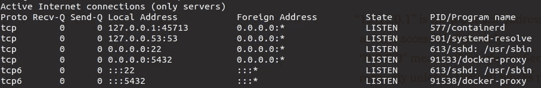
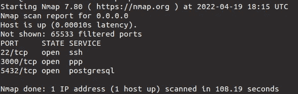
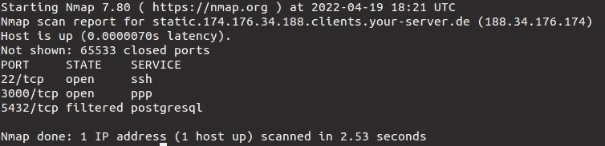

# 借助 Docker 和防火墙保持安全

> 原文：<https://itnext.io/stay-safe-with-docker-and-firewall-9190d2c0fde8?source=collection_archive---------0----------------------->


防火墙(取自 unsplash.com)

这篇文章只是对数百万其他问题中的一个问题的解决方案。我试图尽可能详细地描述每件事，并给出例子。

如果这对某人有用，我会很高兴。

**简介**

在公共服务器上设置 docker 的时候会怎么做？你如何设置防火墙？有用吗？这种情况并不常见，尤其是在方便的云接口时代。

我将提前回答以上问题:Docker 与 UFW 的合作不尽如人意。这意味着，如果您通过公开某个端口来部署某个服务，那么即使该端口被 UFW 关闭，它也是可用的。

**让我们开始吧**

为了清楚起见，让我们准备 PostgreSQL 容器。让我们下载图片:

```
docker pull postgres
```

然后，我们用经典命令启动容器:

```
docker run --name postgresql -e POSTGRES_USER=user -e POSTGRES_PASSWORD=strong_password -p 5432:5432 -v /data:/var/lib/postgresql/data -d postgres
```

其中:

*   **T5【PostgreSQL】是 Docker 容器的名称；**
*   ***-e POSTGRES_USER 是为 POSTGRES 数据库设置唯一用户名的选项；***
*   ***-e POSTGRES_PASSWORD 是设置 POSTGRES 数据库密码的选项；***
*   ***-p 5432:5432 是建立主机端口和 Docker 容器端口之间连接的参数。在这种情况下，两个端口都是 5432，表明发送到主机端口的请求将被自动转发到 Docker 容器端口。另外，5432 是 PostgreSQL 用来接受来自客户端的请求的同一个端口；***
*   ***-v 是一个将 Postgres 数据与本地文件夹同步的选项。这确保了 Postgres 数据安全地存在于主目录中，即使 Docker 容器是关闭的；***
*   ***-d 是离线启动 Docker 容器的选项，即在后台启动。如果不小心关闭或结束了命令提示符，Docker 容器仍然会在后台运行；***
*   ***postgres 是之前下载来运行 Docker 容器的 Docker 映像的名称。***

**检查端口**

在本节中，我们将使用 *netstat* 和 Nmap 来检查侦听 TCP 连接的本地进程，并执行端口扫描:

```
sudo netstat -tlpn
```



netstat 输出示例

从上面的结果中，我们可以看到有 4 个服务在侦听 TCP 连接。“本地地址”是指服务侦听的主机(IP 地址和端口号)。例如，对“127.0.0.1:45713”的请求将由该服务处理。

“127.0.0.1”是环回地址。无法远程访问绑定到环回地址的服务。
“0 . 0 . 0 . 0”指所有接口。绑定到此地址的服务可以远程访问，除非防火墙阻止这些请求。

让我们通过使用 Nmap 扫描开放端口来测试这一假设:

```
nmap -p 0-65535 0.0.0.0
```



nmap 输出示例

要回答这个问题，我们需要系统在本地网络上的 IP 地址。您可以使用 ifconfig:

```
ifconfig | grep -Po "inet 192.168.[^ ]+" | grep -Po "192.168.[^ ]+"
```

或者你可以只在界面上看你的 IP 地址(只需运行" *sudo ifconfig"* )，比如 eth0，粘贴到下面的命令中。

如果您的系统是运行在云中的 VPS，那么它在本地网络上的 IP 地址可以以“10”开头。而不是 192.168。。检查完整的 ifconfig 输出，查看系统上的所有网络接口。

现在，让我们使用本地网络上的 IP 地址重复扫描:

```
nmap -p 0-65535  XXX.XXX.XXX.XXX
```



nmap 输出示例

*从上面可以看到，系统为远程 TCP 流量开放了两个端口。第一个是端口 22，用于 SSH 访问。如果我们需要通过 SSH 远程访问机器，这个端口必须保持打开。*

*第二个是端口 3000，使用 Grafana 监控，也位于此服务器上，在本例中，我们对此不感兴趣。*

第三个端口 5432 是用于 PostgreSQL 的，可能不应该远程打开。在这个服务器示例中，我们在 docker 容器中运行 PostgreSQL。

为了解决这个问题——不要远程打开 docker 服务
我们最初像大多数 Docker 用户一样运行容器，但没有意识到他们在发布端口时远程公开了他们的服务。p 参数告诉 docker“发布”端口 3000，即创建一个侦听器，并将端口 3000 上的请求转发到新容器。但这并不安全，因为 docker 的默认主机必然是“0.0.0.0”！

**文章的主要部分**

在我们使用 Postgres 的情况下，使用以下命令启动 PostgreSQL 是正确的:

```
docker run --name postgresql -e POSTGRES_USER=myusername -e POSTGRES_PASSWORD=mypassword -p **127.0.0.1:5432:5432** -v /data:/var/lib/postgresql/data -d postgres
```

也就是说，我们简单地替换了**本地主机 IP** ，替换了默认主机。
上面的命令看起来太麻烦了，为了清楚起见，我们简化一下:

```
docker run -p **127.0.0.1:5432:5432** -d postgres
```

现在，该服务将无法远程使用。

您可以在官方的[文档](https://docs.docker.com/engine/reference/commandline/run/#publish-or-expose-port--p---expose)中找到更多关于使用-p，— publish 参数的信息。

**而不是结论**

继续使用 **ufw** 来保护您的系统。但是你不应该依靠单一的防线来保护你的服务。如果 ufw 是你的服务和公共互联网之间唯一的障碍，那么这可能是一个错误。

使用上面的网络工具检查系统上是否有打开的服务。

如果你使用的是云提供商，使用 AWS 中的 VPC 等工具来设置额外的保护通常会更好。

回头见。注意安全！