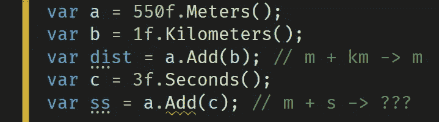
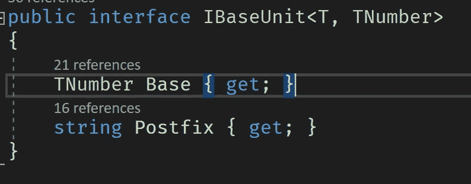
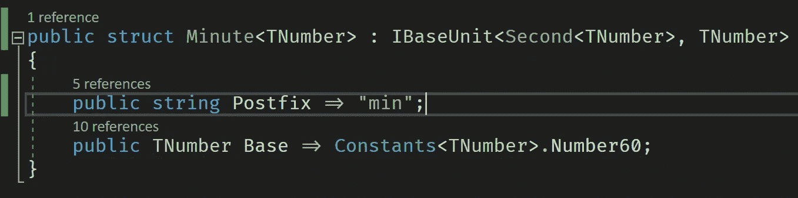
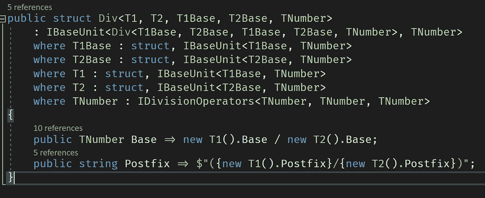
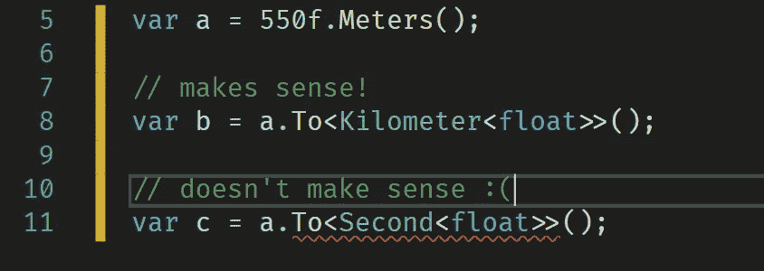
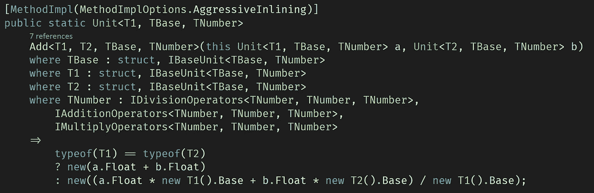
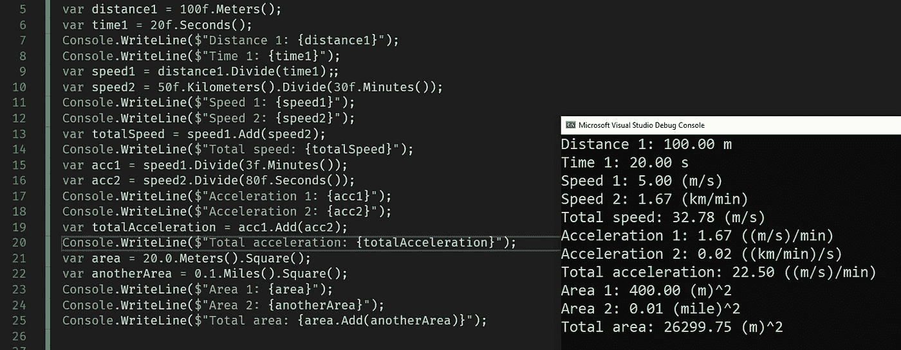
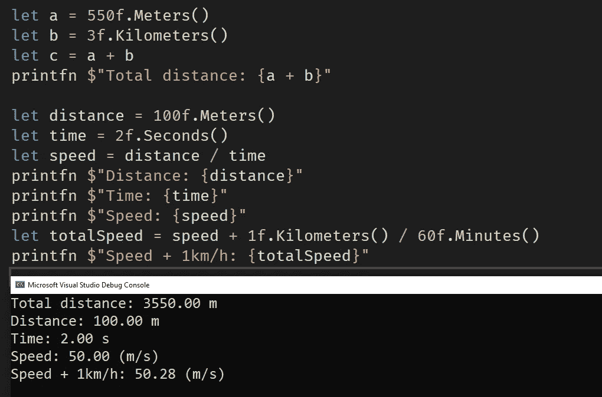
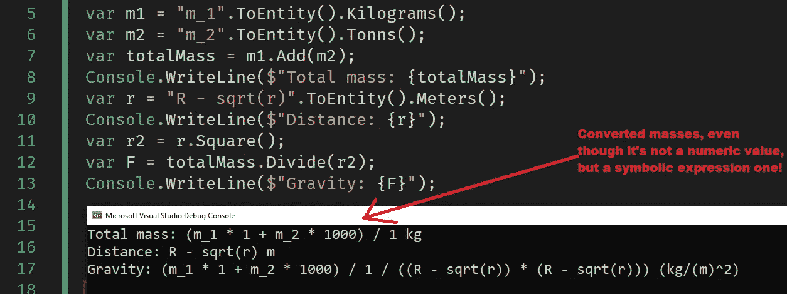

# 和你的部队保持安全！. NET 中的高级度量单位。

> 原文：<https://itnext.io/stay-safe-with-your-units-advanced-units-of-measure-in-net-f7d8b02af87e?source=collection_archive---------1----------------------->

这篇小文章展示了高级度量单位的概念，完全类型安全，自动单位转换，没有运行时调度，由泛型数学驱动！(给不耐烦的人: [github](https://github.com/WhiteBlackGoose/UnitsOfMeasure) )

工作示例

可能是最受欢迎的图书馆之一。NET 是 [UnitsNet](https://github.com/angularsen/UnitsNet) 。它为很多很多情况提供了很多 API，可能很棒(我自己还没试过)。还有 [F#的测量单位](https://docs.microsoft.com/en-us/dotnet/fsharp/language-reference/units-of-measure)。它不提供额外的 API 或类型转换，但是它提供了编译时安全性(对于 F#消费者)并且没有开销。

那么，为什么不尝试开发我们自己的可互操作的(同样适用于 F#和 C#开发人员)度量单位系统呢？这样任何人都可以添加他们自己的单位！一个没有太多运行时间开销的。同时完全编译时安全！也可以使用任意类型(而不是双精度/浮点)。最后是类型转换。

# 创造现实

这里的想法是，我们并不真正关心“尺寸”，不管是长度、质量还是其他什么。我们只是忘记了那些存在。然而，我们要记住的是每个单位都有自己的基本单位。

什么是基本单位？理论上它可以是任何单位。为了简单起见，我将 SI 的单位作为基础。例如，千米的基本单位是米(1 千米等于 1000 米)。英里的基本单位也是米(大约 1600 米)。最后，米的基本单位是它自己(1 米中有 1 米)。

我们的基本单元接口

基本属性提供您的单位中的基本单位的数量。例如，下面是基本类型为秒的分钟的样子:

分钟实现 IBaseUnit 接口

TNumber 在那里是因为我们在做一般的数学运算，所以它可以是任何实体(对应于一些约束)。Number60 有点难看，但是你不能从一个泛型类型中得到 60。

那么，算术运算呢？例如，对于[部门](https://github.com/WhiteBlackGoose/UnitsOfMeasure/blob/296c8e3846de47dd5b695df120ca76da9e73942f/Sources/UnitsOfMeasure/PredefinedUnits.Arithmetics.cs#L14)，我们也创建一个单元。记得我说过每个单位都有它的基本单位吗？组织也是。

Div 单元的实现

它看起来有点冗长，因为有一大堆泛型类型约束。但这里的关键是它也有基本单位。它是分子和分母基数的除法。例如，km/min 将有一个基本单位 m/s。这意味着我们可以很容易地转换我们的类型，我们所需要的就是检查它们是否有相同的基本类型。让我们来看看我们可以进行的转换:

实施单位转换

因为都是通用约束，所以不可能转换不兼容的单元，但是转换兼容的单元非常容易:

将米转换为秒会产生编译错误

类似地，我们实现编译时安全的 [Add](https://github.com/WhiteBlackGoose/UnitsOfMeasure/blob/296c8e3846de47dd5b695df120ca76da9e73942f/Sources/UnitsOfMeasure/Operations.cs#L19) 。注意，我们没有泛型操作符，所以在我们的例子中不可能实现+。

Add 方法的实现

它看起来有点大。但这里的关键是，我们有不同的单位，但相同的基本单位。例如，您可以添加秒和分钟(20 秒+1 分钟= 80 秒)。可以加上公里和英里(1 公里+ 1 英里= 2.6 公里)。但是不能添加秒和米。因此添加的单元必须共享同一个基本单元。

最后，让我演示几个结果。

# 作品展示

工作演示

F#有泛型运算符。我无法以我想要的方式获得它们，但为了验证概念，我们还有一些东西:

F#在我的计量单位上的视点

记住，这是[通用数学](https://devblogs.microsoft.com/dotnet/preview-features-in-net-6-generic-math/)。这意味着我们实际上可以做任何实现一些接口的类型。例如，我们可以尝试使用[安哥拉数学。实验包](https://www.nuget.org/packages/AngouriMath.Experimental)，它是 [AngouriMath](https://github.com/asc-community/AngouriMath) 的一个版本，实现了通用的数学接口。

用作单位值的符号代数示例

# 效率

效率呢？这还不算太坏，因为你不需要在运行时调度任何东西。因此，如果单位相同，这只是一个浮点加法，但如果单位不相同，就要多做几次运算。[更多信息](https://github.com/WhiteBlackGoose/UnitsOfMeasure#efficiency)。

# 结论

最后，它可能比你已经在使用的单位(如果有的话)更好或更差。参见比较表(🥇意味着最好，🥉意味着最坏的情况，🥈是中间的某个位置):

比较不同的度量单位

*分机。就是可扩展性(能够扩展内置的东西)。单位的可扩展性意味着你可以添加更多的单位。尺寸的可扩展性意味着您可以添加“尺寸”(例如长度、质量等。).

由于表格可能会更改，请参见此处的相关值[。](https://github.com/WhiteBlackGoose/UnitsOfMeasure/blob/main/README.md#other-solutions)

[概念回购的 Github](https://github.com/WhiteBlackGoose/UnitsOfMeasure) 。我的 [github](https://github.com/WhiteBlackGoose) ， [twitter](https://twitter.com/WhiteBlackGoose) 。

感谢您的关注！