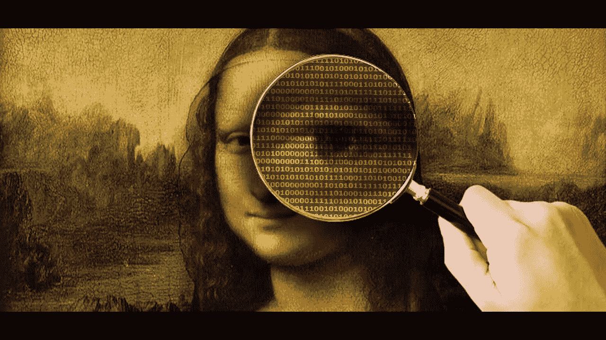
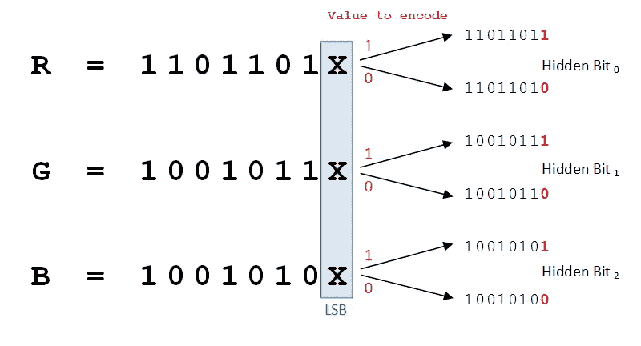

# 隐写术

> 原文：<https://itnext.io/steganografie-c91b50e546d?source=collection_archive---------0----------------------->

## 穿羊衣服的狼

> [点击这里共享这篇文章就链接了](https://www.linkedin.com/cws/share?url=https%3A%2F%2Fitnext.io%2Fsteganografie-c91b50e546d)

公元前 484 年希腊历史学家希律王描述了一个被纹在奴隶头皮上的秘密军事消息。他的头发长回来后，奴隶被送去了希腊。当他到达时，他的头发被收件人剪掉了以便阅读信息。一种很早的形式，我们现在称之为隐写术，也就是将信息隐藏在另一种媒介中。

您可以对图像(JPEG、BMP、GIF)、声音(WAF、MP3)和文本文件(纯文本、PDF)应用速记。该消息以二进制代码形式隐藏，利用了各种文件格式的缺点。PDF 中的数千页可以隐藏，但用户无法在外部查看，并且保持其原始文件大小。隐写术可以通过很多免费软件应用，如“T2”、[图像](http://imagesteganography.codeplex.com/)或[开放的](https://sourceforge.net/projects/openstego/files/)。

# 这是一种趋势

[卡巴斯基](https://www.kaspersky.com/about/press-releases/2017_steganography-multiple-hacking-groups-are-increasingly-using-the-technique-to-hide-stolen-information-inside-images)t14[McAfee](https://securingtomorrow.mcafee.com/mcafee-labs/mcafee-labs-threats-report-explores-malware-evasion-techniques-digital-steganography-password-stealer-fareit/)最近的威胁报告显示了网络罪犯使用隐写术的趋势。通常用于隐藏信息或传输恶意软件。问题是，无法或几乎无法通过防火墙、防病毒扫描仪和[DLP](https://en.wikipedia.org/wiki/Data_loss_prevention_software)软件等解决方案识别隐写。

# 风险

在 LinkedIn 中最常用的功能是消息传递。允许文档(例如。全球 5 亿用户共享简历或照片。社交媒体已经是网络罪犯的一个有趣平台，但是这个新兴市场(包括 Instagram)使得对隐写技术的投资更具吸引力。因此，黑客开发了 tweets，其中将[命令和控制服务器](https://www.trendmicro.com/vinfo/us/security/definition/command-and-control-(c-c)-server)的网址(C & C)隐藏在相应的位置。然后通过 C & C 服务器将恶意软件(例如，[转发器](https://www.linkit.nl/knowledge-base/239/Dossier_Ransomware_Deel_I_Een_introductie)安装在受害者的压缩系统上。

另一个威胁是窃取(竞争)敏感信息。毕竟，它可能被隐藏在合法的公司档案中，被组织外部的内部人员走私出去。

# 采取的措施

俗话说，隐写术很难阻止或发出信号，但仍有供应商提供具体产品，如卡巴斯基的“T4”【深安全的反隐写网关】和“T6”【反目标攻击”【T7(kata)”。此类软件的注意事项包括缓慢性(使用复杂的算法)和确定性(实际上，在这种情况下，使用隐写技术的程度也是正确的)。

隐写术又一次证明了(网络)罪犯总是在寻找技术来保持在安全队列之下。因此，建议至少实施良好的基本措施，以减轻风险，如创建意识、应用[数据分类](https://www.linkit.nl/knowledge-base/289/Dataclassificatie_als_katalysator_voor_security_awareness_en_GDPR_compliance)和 t10 分割 t11 网络。