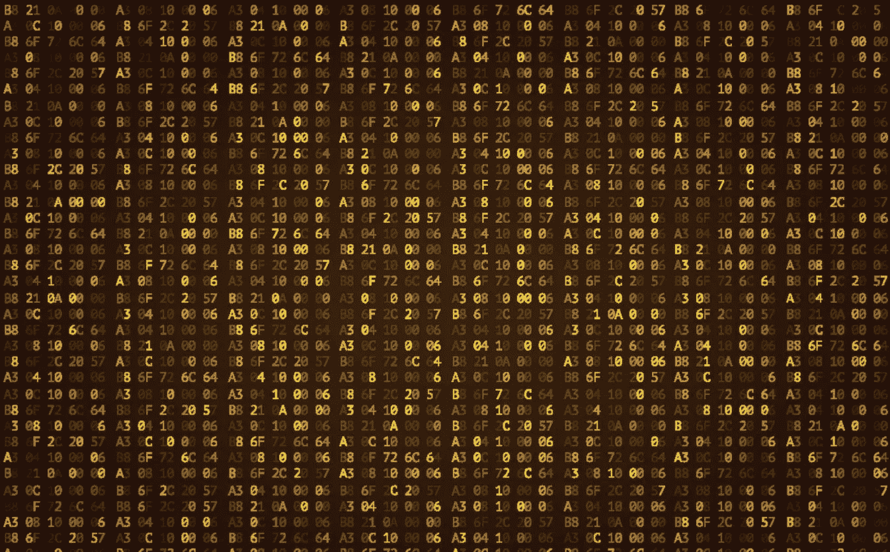
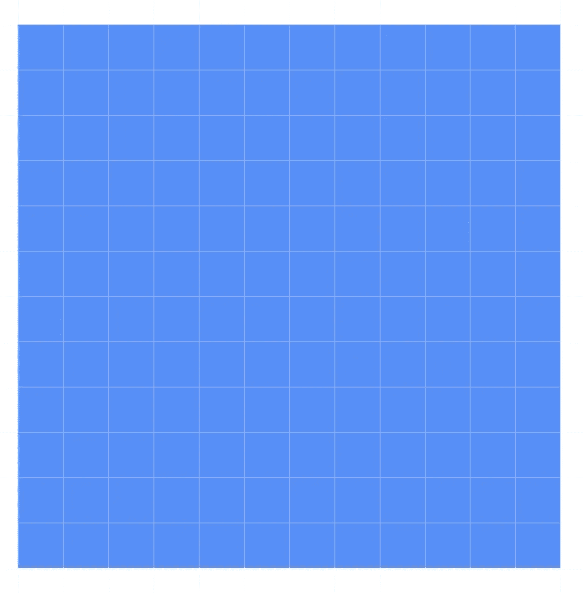
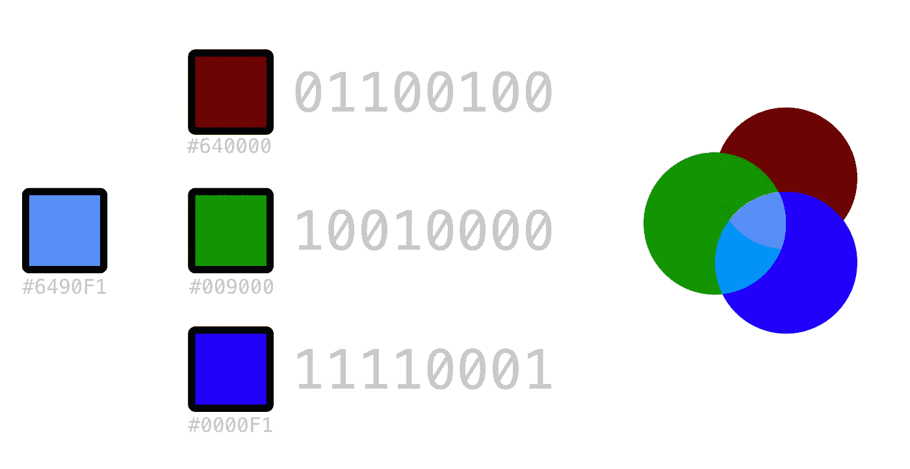
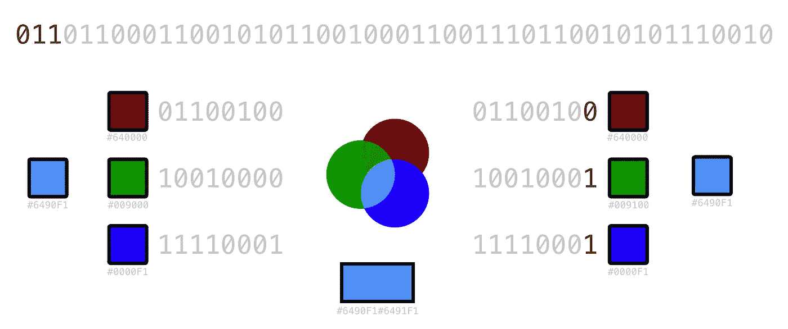
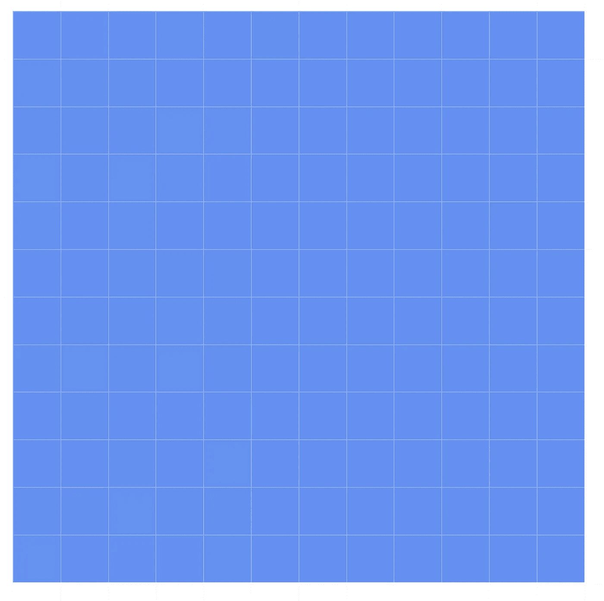

# 隐写术 Python 的 LSB 介绍—第 1 部分

> 原文：<https://itnext.io/steganography-101-lsb-introduction-with-python-4c4803e08041?source=collection_archive---------2----------------------->

在 PNG 图像文件像素的 RGB 通道中隐藏纯文本消息



几周前，我的一位朋友向我介绍了 [hackthebox.eu](https://www.hackthebox.eu) ，从那以后，尽管这不是挑战的主要类别，但我已经对隐写术的世界着迷了。一个看似无害的容器把秘密数据藏在里面的整个概念让我大吃一惊，当我还是个孩子的时候，我第一次发现我可以用柠檬汁写秘密信息。

> [](https://en.wikipedia.org/wiki/Steganography)**(/ˌstɛɡəˈnɒɡrəfi/(steg-ə-nog-rə-fee)是将一个文件、消息、图像或视频隐藏在另一个文件、消息、图像或视频中的做法。“隐写术”一词由希腊语“隐写术”(στεγᾰνός)和“书写术”(γραφή)结合而成，前者意为“覆盖或隐藏”。**

**就好像你突然拥有了这种超能力，即使你永远都不需要使用它。你把自己想象成一名间谍，携带着即使最聪明的人也无法发现的隐藏数据。**

**当然，现实并不完全是这样，有无数的工具可以帮助好奇的头脑找到数据。正是这些工具的盲目使用使我试图理解这个过程，并且在我这样做的同时，编写一些工具来帮助我们隐藏和检索其他文件中的数据。**

**让我强调一下 **find** 这个词，因为尽管它通常与加密结合使用，但最基本形式的隐写术只会将一些数据隐藏在容器内。**

**我今天想重点讨论图像固定器内部的 LSB 隐写术。LSB 代表最低有效位，它指的是用构成我们想要隐藏的数据的位替换创建容器文件的字节的最低有效位的过程。**

**最初的目标是将字符串“ledger”隐藏在一个 12x12 的图像中。在我们做了这些之后，我会在另一篇文章中跟进如何将一个图像隐藏在另一个图像中，并改进我们今天写的代码，以提供一些故障保险。**

****

**一个简单的纯色图像作为源**

**如果我们用类似于`PIL`的东西从这个图像中读取像素，我们将得到一个包含 RGB(如果有的话+alpha)通道的值(0–255)的元组。这意味着对于每个像素，我们有 3-4 位来处理。字符串“ *ledger* ”的二进制表示是`011011000110010101100100011001110110010101110010`，它有 48 位长，这意味着我们至少需要 16 个像素，因为我们假设没有 alpha 通道。**

# **视觉上，这是如何工作的？**

**E 图像的每个像素包含三个通道，分别代表该像素颜色的红色、绿色和蓝色值。该值可以用一个字节表示，合并它们(你可以在你的图像编辑器中使用*变亮*混合模式)当然会返回源颜色。**

****

**在这种情况下，替换最低有效位意味着将代表紫檀木颜色的`01100100`转换为`01100101`，但是由于我们数据的前三位是`011`，我们只需要用`10010001`替换绿色的`10010000`。这意味着在大多数情况下，我们甚至不需要修改所有的频道**

****

**相信我，底部的矩形是两种不同的颜色**

**虽然数字不会说谎，但`#6490F1`和`#6491F1`之间的视觉差异可以忽略不计。此外，我们需要记住，当在现实世界中这样做时，它将被托管在一个具有更多不同颜色的图像上，这使得肉眼几乎不可能看出任何差异。**

**我能想到的将任意二进制数据写入 png 图像而无需任何数据长度检查、提示或帮助的最简单代码如下。代码应该非常简单，唯一的例外可能是位操作。`pixel[n] & ~1`将从通道中清除 LSB，然后我们只需在数据显示时更改为`1`，运行`| 1`将 LSB 变为 1，而`| 0`将保持原样。**

```
i=*0* data = "011011000110010101100100011001110110010101110010" #ledger
with Image.open("source.png") as img:
    width, height = img.size
    for x in range(*0*, width):
        for y in range(*0*, height):pixel = list(img.getpixel((x, y)))
            for n in range(*0*,*3*):
                if(i < len(data)):pixel[n] = pixel[n] & ~*1* | int(data[i])
                    i+=*1* img.putpixel((x,y), tuple(pixel))
    img.save("source_secret.png", "PNG")
```

**我相信还有其他方法可以做到这一点，正如我上面提到的，我在写这篇文章的时候也在学习，所以如果我做错了，请随时提供一些意见:)**

## **怎么把数据拿回来？**

**要提取的代码实际上与要编写的代码是一样的，但是我们只是读取它，而不是修改 LSB。为了读取 python 中一个字节的 LSB，我们做了一个按位 AND 运算`&1`**

```
extracted_bin = []
with Image.open("source_secret.png") as img:
    width, height = img.size
    byte = []
    for x in range(*0*, width):
        for y in range(*0*, height):
            pixel = list(img.getpixel((x, y)))
            for n in range(*0*,*3*):
                extracted_bin.append(pixel[n]&*1*)

data = "".join([str(x) for x in extracted_bin])
```

**因为我们忽略了隐藏数据的长度，所以输出将在开头，后面是图像其余部分的文本表示，类似于在文本编辑器上打开图像时会发生的情况。**

## **能这样存储的数据极限是多少？**

**假设我们替换图像的每个像素的 LSB，理论上我们可以存储`W*H*3/8`字节的数据，考虑到我们正在使用的固定器图像是 12×12 像素，将在 LSB 中给我们 54 字节的存储。**

****

**这张图片包含一个秘密信息，但 medium 可能会处理它们，所以这里有一个到原始[https://raw . githubusercontent . com/Juan-cortes/steg/master/test _ secret . png](https://raw.githubusercontent.com/juan-cortes/steg/master/test_secret.png)的链接**

**我会告诉你更多的进展。**