# 一步一步:构建和发布 NPM 打字稿包。

> 原文：<https://itnext.io/step-by-step-building-and-publishing-an-npm-typescript-package-44fe7164964c?source=collection_archive---------0----------------------->

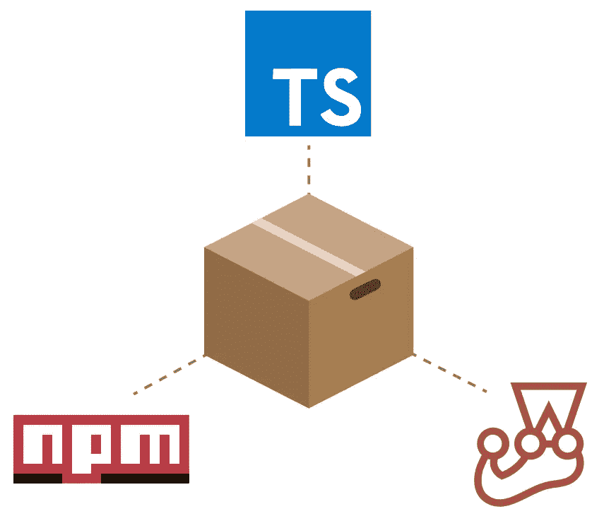

# 介绍

在本指南中，我们将在 Typescript 中构建一个可重用模块，并将其发布为一个 **Node.js** 包。我见过很多不同的方法，所以我想向你展示如何使用最佳实践和工具来创建你自己的包，一步一步地使用 **Typescript** 、 **Tslint** 、**prettle、**和 **Jest。**

这就是我们要打造的:
[https://www.npmjs.com/package/my-awesome-greeter](https://www.npmjs.com/package/my-awesome-greeter)
[https://github.com/cjkihl/my-awesome-greeter](https://github.com/cjkihl/my-awesome-greeter)

# 什么是 NPM？

Npm 是 Javascript 的包管理器，也是世界上最大的可重用软件代码库。它本身也是一个很好的构建工具，我将在后面展示。

# 为什么打字稿？

作为 Javascript 的超集，Typescript 提供可选的类型和深度智能感知。说到包开发，这是我个人的看法:

> **我认为所有的包都应该用 Typescript 构建**

你们中的一些人可能会觉得强输入会降低生产率，不值得花力气去使用。对于小规模的项目，我同意，但是对于包开发，Typescript 有一些重要的优势:

*   更健壮的代码，更易于维护。
*   这个包可以用于 Typescript 和 Javascript 用户！如果你的库变得流行，迟早会有对类型定义的需求，手动编写类型定义很耗时，容易出错，并且更难更新。
*   有了包中的类型定义，用户就不必从另一个包中下载类型。
*   强类型更加自文档化，使代码更容易理解。
*   即使使用你的包的人不使用 Typescript，一些编辑器，像 **Visual Studio Code** 仍然会使用类型定义来给用户更好的智能感知。

# 好吧。我们开始吧！

确保您拥有最新版本的节点和 npm。

```
node -v
v17.8.0npm -v
8.5.5
```

# 挑个好名字

这可能比听起来要难。包名必须是 pascal 大小写。既然有 700k+的软件包，在[https://www.npmjs.com/](https://www.npmjs.com/)上快速搜索一下，确保你那令人敬畏的名字没有被占用。出于本指南的考虑，我将选择名称 **my-awesome-greeter，**但是使用一个唯一的名称，以便您稍后可以将您的包发布到 NPM**😉。**

# 基本设置

用合适的名称创建您的包文件夹

```
mkdir **my-awesome-greeter** && cd **my-awesome-greeter**
```

# 创建 git 存储库

首先要做的事。您需要一个远程 git 存储库来存放您的包，以便可以下载。创建远程 git 存储库超出了本文的范围，但是一旦您完成了，您可以使用下面几行来初始化您的本地存储库并设置您的远程源。

```
git init
echo "**# My Awesome Greeter**" >> README.md
git add . && git commit -m "Initial commit"
```

将 **< Git 存储库 Url >** 替换为您的远程存储库的 Url。

```
git remote add origin **<Git Repository Url>**git push -u origin master
```

# 初始化你的包

让我们用所有默认值创建一个 **package.json** 文件。我们稍后会修改这个。

```
npm init -y
```

作为最后一步，我们要添加一个**。gitignore** 文件到根目录。还有很多**。gitignore** 模板在那里，但我喜欢保持简单，不要添加超过你需要的。目前，我们只需要忽略 **node_modules** 文件夹。

```
echo **"node_modules"** >> .gitignore
```

厉害！我们得到了基本的😃这是我在 Visual Studio 代码中打开项目时的样子。从现在开始我将继续从 vscode 添加文件，而不是使用控制台，但是选择一种适合你的风格😉

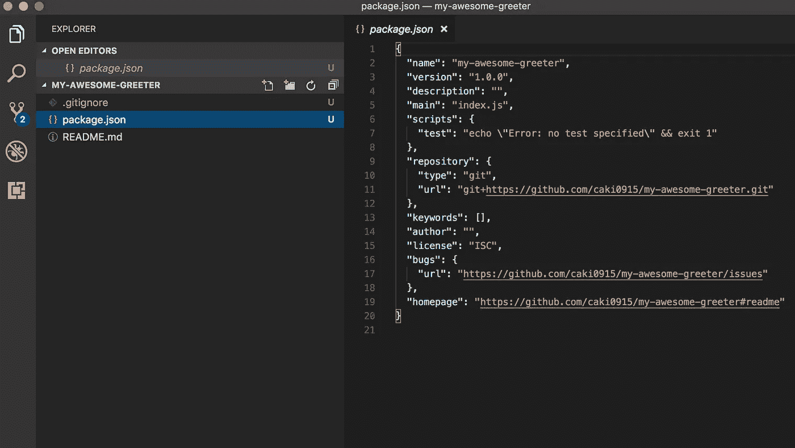

我在 vscode 的牛逼迎宾

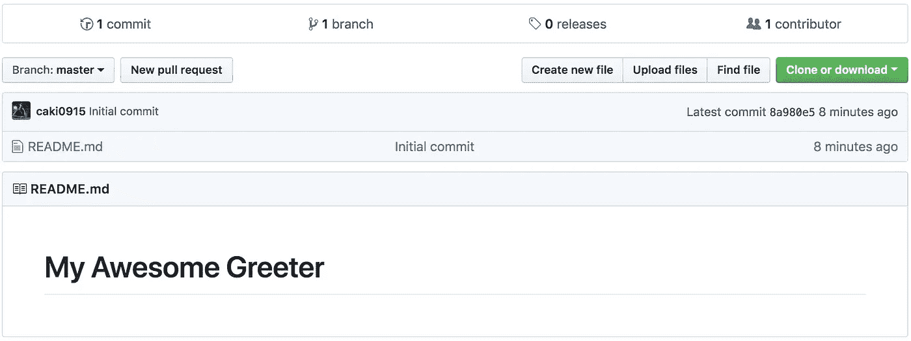

我在 Github 的仓库

# 将 Typescript 作为 DevDependency 添加

让我们从依赖 typescript 开始

```
npm install --save-dev typescript
```

标志`--save-dev`将告诉 NPM 安装 Typescript 作为 **devDependency** 。devDependency 和 Dependency 之间的区别在于，devDependencies 只会在您运行 **npm install** 时安装，而不会在最终用户安装软件包时安装。
例如，Typescript 只在开发包时需要，而在使用包时不需要。

很好！现在你会在你的根目录下看到一个 **node_modules** 文件夹和一个 **package-lock.json** 。

为了编译 Typescript，我们还需要一个 **tsconfig.json** 文件，所以让我们将它添加到项目根目录:

```
{
  "compilerOptions": {
    "target": "es5",
    "module": "commonjs",
    "declaration": true,
    "outDir": "./lib",
    "strict": true
  },
  "include": ["src"],
  "exclude": ["node_modules", "**/__tests__/*"]
}
```

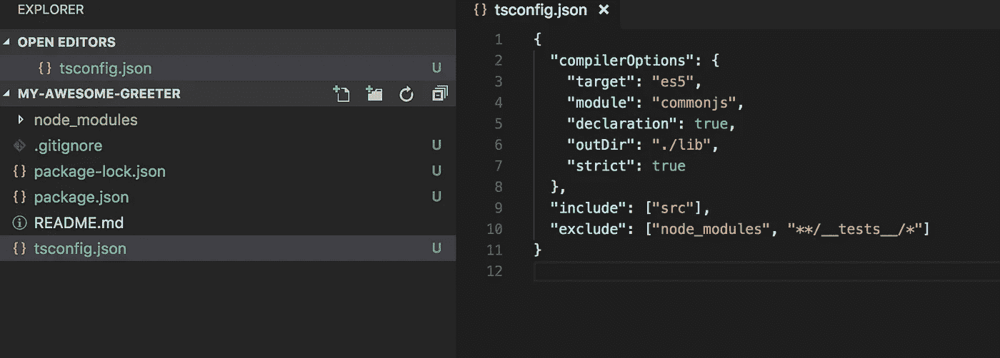

这里发生了很多事情，我们来解释一下我们的配置文件:
**target** :我们要编译到 **es5** 既然我们要构建一个兼容浏览器的包，
**模块**:兼容性使用 commonjs。
**声明**:当你构建包的时候，这应该是真的。然后，Typescript 还会将类型定义与编译后的 javascript 代码一起导出，这样包就可以同时用于 Typescript 和 Javascript。
**outDir**:JavaScript 将被编译到 lib 文件夹。
**include:**src 文件夹中的所有源文件
**exclude:** 我们不想传输 node_modules 或测试，因为它们只在开发期间使用。

# 你的第一个代码！

现在，当我们建立了编译，我们可以添加我们的第一行代码。
让我们在根目录下创建一个`src`文件夹，并添加一个 index.ts 文件:

```
export const Greeter = (name: string) => `Hello ${name}`; 
```

好吧，这是个好的开始。下一步是向 **package.json:** 添加一个构建脚本

```
"build" : "tsc"
```

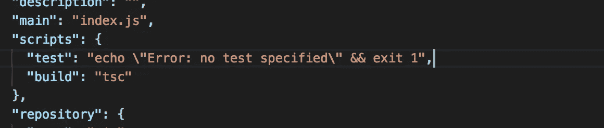

现在，您可以在控制台中运行 build 命令:

```
npm run build
```

还有维奥莱！

你会在根目录下看到一个新的 **lib** 文件夹，里面有你编译的代码和类型定义！

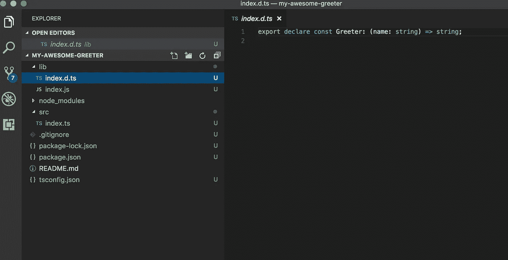

# 忽略 git 中编译的代码

除了 **package-lock.json** 之外，您通常不希望自动生成的文件处于源代码控制之下。每次自动生成时，它都会导致不必要的冲突。让我们将 lib 文件夹添加到。gitignore:

```
node_modules
/lib
```

lib 前的斜线表示“仅忽略根目录顶部的 lib 文件夹”，这就是我们在这种情况下想要的。

# 格式和林挺

一个优秀的软件包应该包含严格的林挺和格式规则。尤其是如果你以后想要更多的合作者。再加上**更漂亮的**和 **TsLint 吧！**

像 Typescript 一样，这些工具仅用于包的开发。它们应该被添加为 **devDependencies** :

```
npm install --save-dev prettier tslint tslint-config-prettier
```

tslint-config-appellister 是我们需要的预置，因为它防止了 ts lint 和 prettiers 格式规则之间的冲突。

在根目录下，添加一个 **tslint.json** :

```
{
   "extends": ["tslint:recommended", "tslint-config-prettier"]
}
```

还有一个**。prettierrc**

```
{
  "printWidth": 120,
  "trailingComma": "all",
  "singleQuote": true
}
```

最后，将 **lint-** 和**格式**脚本添加到 **package.json** 中

```
"format": "prettier --write \"src/**/*.ts\" \"src/**/*.js\"",
"lint": "tslint -p tsconfig.json"
```

您的 **package.json** 现在应该是这样的:


现在您可以在控制台中运行 **npm run lint** 和 **npm run format** :

```
npm run lint
npm run format
```

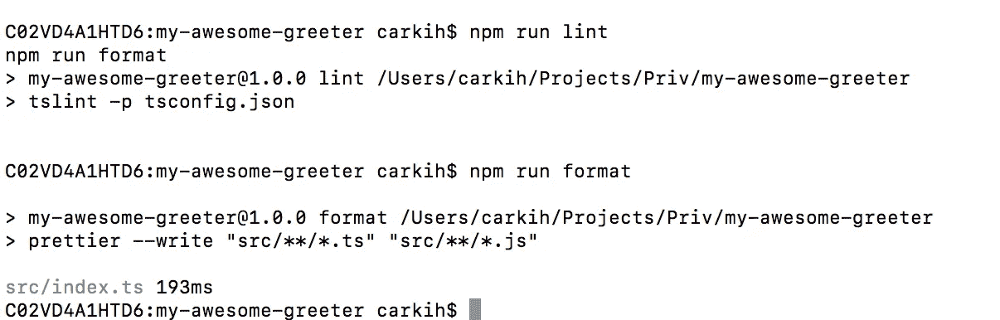

# 不要在你的包裹里放超过你需要的东西！

在我们的**里。gitignore** 文件，我们添加了`/lib`，因为我们不想让构建文件出现在我们的 git 存储库中。发布包的情况正好相反。我们不想要源代码，**只要**构建文件！

这可以通过两种方式解决。一种方法是在**中将文件/文件夹列入黑名单。npmignore** 文件。在我们的例子中应该是这样的:

```
src
tsconfig.json
tslint.json
.prettierrc
```

但是，将文件列入黑名单并不是一个好的做法。添加到根目录的每个新文件/文件夹都需要添加到**。npmignore** 文件也一样！相反，你应该**将你想要发布的文件/文件夹列入白名单**。这可以通过在 **package.json:** 中添加**文件**属性来实现

```
“files”: [“lib/**/*”]
```

就是这样！容易的😃发布的包中只包含 lib 文件夹！(默认添加 **README.md** 和 **package.json** )。

关于 NPM 软件包中白名单和黑名单的更多信息，请看来自 NPM 博客的这篇文章。(感谢 [Tibor Blénessy](https://medium.com/u/34500fc3e94?source=post_page-----44fe7164964c--------------------------------) 的参考)

# 用 Jest 设置测试

一个令人敬畏的包应该包括单元测试！再来补充一下 [**Jest**](https://facebook.github.io/jest/) :脸书的一个牛逼测试框架。


Jest:脸书的测试框架

由于我们将针对我们的 typescript 源文件编写测试，我们还需要添加`[ts-jest](https://github.com/kulshekhar/ts-jest)`和`@types/jest`。测试套件仅在开发期间使用，所以让我们将它们添加为 **devDependencies**

```
npm install --save-dev jest ts-jest @types/jest
```

酷！现在我们需要配置 Jest。你可以选择给 **package.json** 写一个`jest`部分，或者创建一个单独的配置文件。我们将把它添加到一个单独的文件中，所以当我们发布这个包时，它不会包含在内。

在根目录下创建一个新文件，命名为 **jestconfig.json:**

```
{
  "transform": {
    "^.+\\.(t|j)sx?$": "ts-jest"
  },
  "testRegex": "(/__tests__/.*|(\\.|/)(test|spec))\\.(jsx?|tsx?)$",
  "moduleFileExtensions": ["ts", "tsx", "js", "jsx", "json", "node"]
}
```

删除 **package.json** 中的旧测试脚本，将其改为:

```
"test": "jest --config jestconfig.json",
```

这个 **package.json** 应该是这样的:

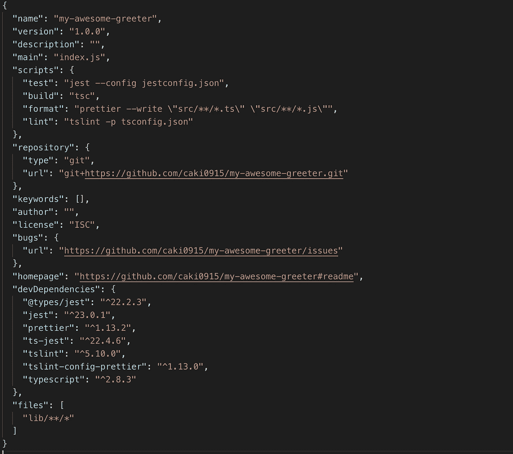

# 编写一个基本测试

是时候写我们的第一个测试了！😃

在`src`文件夹中，添加一个名为`__tests__`的新文件夹，并在里面添加一个新文件，文件名你喜欢，但必须以`test.ts`结尾，例如`Greeter.test.ts`

```
import { Greeter } from '../index';test('My Greeter', () => {
  expect(Greeter('Carl')).toBe('Hello Carl');
});
```

好了，我们在这里做的唯一一件事就是验证如果输入是`Carl`，我们的方法`Greeter`将返回`Hello Carl`。

现在，试着跑

```
npm test
```

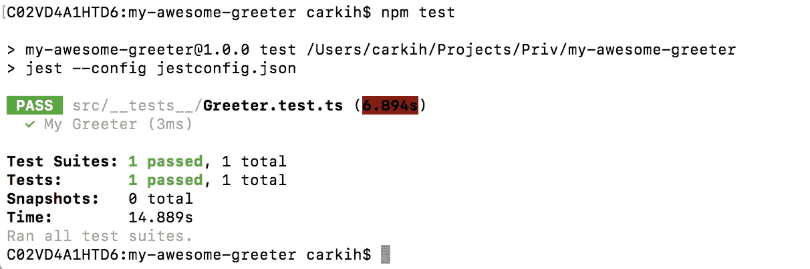

酷，它的工作！如你所见，我们通过了一项测试。

# 在 NPM 使用魔法脚本

对于一个令人敬畏的包，我们当然应该尽可能地自动化。我们将深入探讨 npm 中的一些脚本:**准备**，**仅预发布**，**前版本**，**版本**和**后版本**

**准备**将在包打包和发布之前运行，也在本地`npm install`运行。非常适合运行构建代码。将这个脚本添加到 **package.json**

```
"prepare" : "npm run build"
```

**仅**将在**准备**和之前运行，仅在`**npm publish**`运行。在这里，我们将运行我们的测试和 lint，以确保我们不会发布错误的代码:

```
"prepublishOnly" : "npm test && npm run lint"
```

**预版本**将在碰撞新的软件包版本之前运行。为了额外确保我们没有用糟糕的代码碰撞一个版本，为什么不在这里也运行 lint 呢？😃

```
"preversion" : "npm run lint"
```

**版本**将在新版本被碰撞后运行。如果你的包有一个 git 库，就像我们的例子一样，每次你升级一个新版本时，都会提交一个新的版本标签。该命令将在提交之前运行。一个想法是在这里运行格式化程序，这样就不会有难看的代码传入新版本:

```
"version" : "npm run format && git add -A src"
```

**提交后版本**将在提交后运行。这是提交和标记的绝佳位置。

```
"postversion" : "git push && git push --tags"
```

这是我在 **package.json** 中的脚本部分的样子:

```
"scripts": {
   "test": "jest --config jestconfig.json",
   "build": "tsc",
   "format": "prettier --write \"src/**/*.ts\" \"src/**/*.js\"",
   "lint": "tslint -p tsconfig.json",
   "prepare": "npm run build",
   "prepublishOnly": "npm test && npm run lint",
   "preversion": "npm run lint",
   "version": "npm run format && git add -A src",
   "postversion": "git push && git push --tags"
}
```

# 正在完成 package.json

终于到了完成我们令人敬畏的包裹的时候了！首先，我们需要再次对我们的 **package.json** 进行一些修改:

```
{
   "name": "my-awesome-greeter",
   "version": "1.0.0",
   **"description": "A nice greeter",**
  ** "main": "lib/index.js",
   "types": "lib/index.d.ts",**
   "scripts": {
      "test": "jest --config jestconfig.json",
      "build": "tsc",
      "format": "prettier --write \"src/**/*.ts\" \"src/**/*.js\"",
      "lint": "tslint -p tsconfig.json",
      "prepare": "npm run build",
      "prepublishOnly": "npm test && npm run lint",
      "preversion": "npm run lint",
      "version": "npm run format && git add -A src",
      "postversion": "git push && git push --tags"
   },
   "repository": {
     "type": "git",
     "url": "git+https://github.com/caki0915/my-awesome-greeter.git"
   },
  ** "keywords": ["Hello", "Greeter"],
   "author": "C-J",**
   ....
```

在这里，我们添加了一个很好的描述，一个作者，和一些相关的关键字。键 **main** 在这里很重要，因为它将告诉 **npm** 它可以从哪里导入模块。
键**类型**将告诉类型脚本和代码编辑器在哪里可以找到类型定义！

# 提交您的代码并将其推送到 git

是时候将所有工作推送到您的远程存储库了！如果你还没有提交你的最新代码，现在是时候了。😉

```
git add -A && git commit -m "Setup Package"
git push
```

# 将您的包发布到 NPM！

为了发布您的包，您需要创建一个 NPM 帐户。
如果你没有帐号，你可以在[https://www.npmjs.com/signup](https://www.npmjs.com/signup)或者运行命令:`npm adduser`来注册

如果您已经有帐户，运行`npm login`登录您的 NPM 帐户。

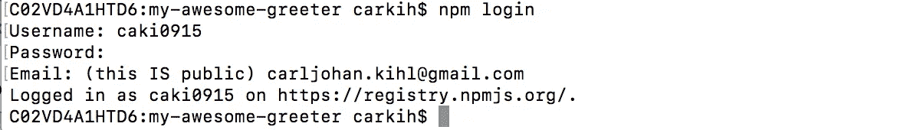

登录我现有的 NPM 帐户

好吧！现在运行发布。

```
npm publish
```

如您所见，在发布包之前，包将首先由**准备**脚本构建，然后**测试**和 **lint** 将由**预发布仅**脚本运行。

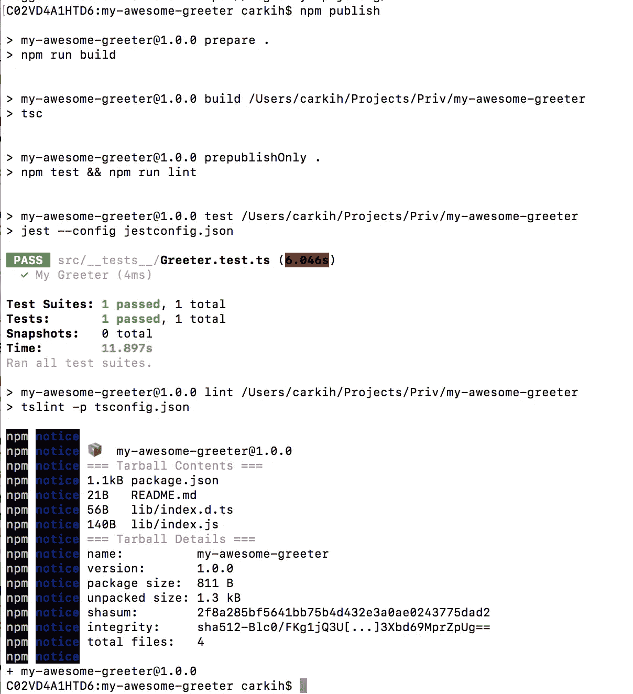

# 查看您的包裹

现在在 **npmjs 上浏览你的包。**URL 是**https://npmjs.com/package/**<your-package-name>**在我这里是[**https://npmjs.com/package/my-awesome-greeter**](https://npmjs.com/package/my-awesome-greeter)**

**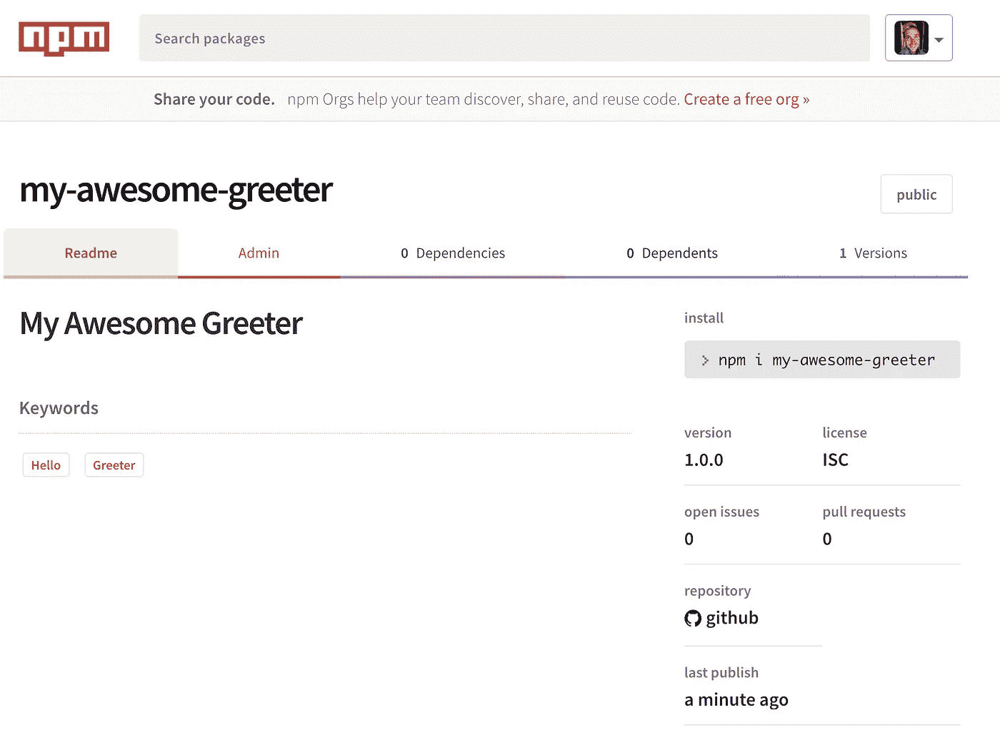**

**不错！我们收到一个包裹😎 📦目前看起来不错！**

# **碰撞新版本**

**让我们撞上一个新的补丁版本的软件包:**

```
npm version patch
```

**我们的**前版本**、**版本、**和**后版本**将运行，在 git 中创建一个新标签，并将其推送到我们的远程存储库。现在再次发布:**

```
npm publish
```

**现在你有了一个新版本**

**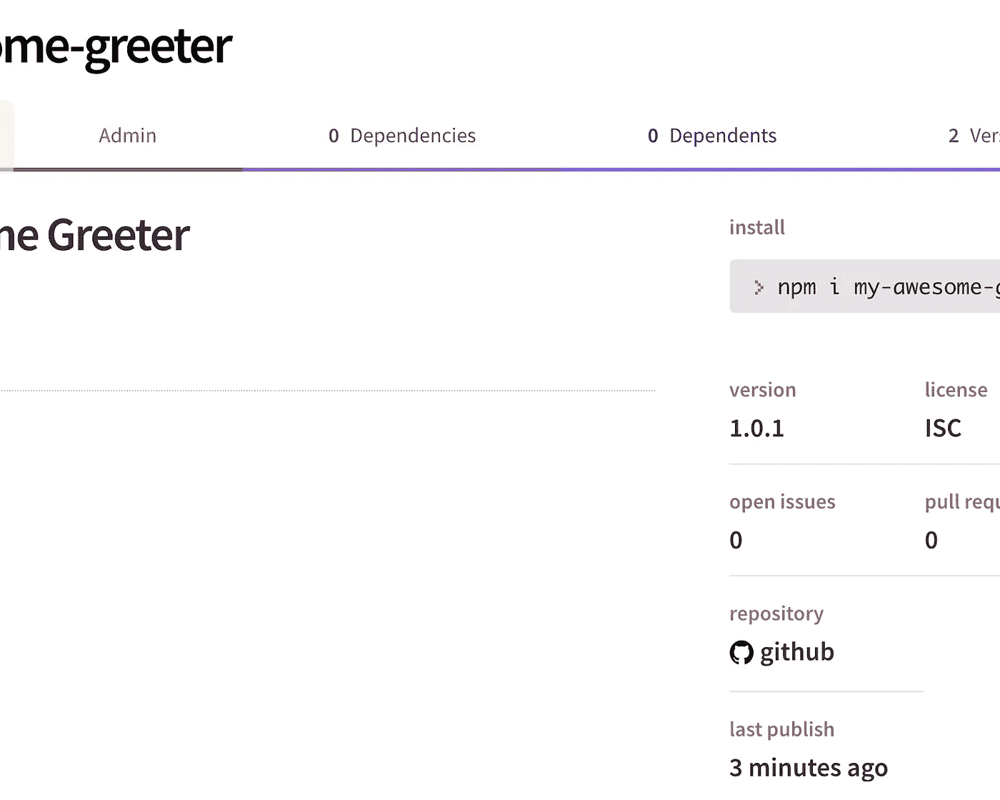**

**NPM 的新版本**

**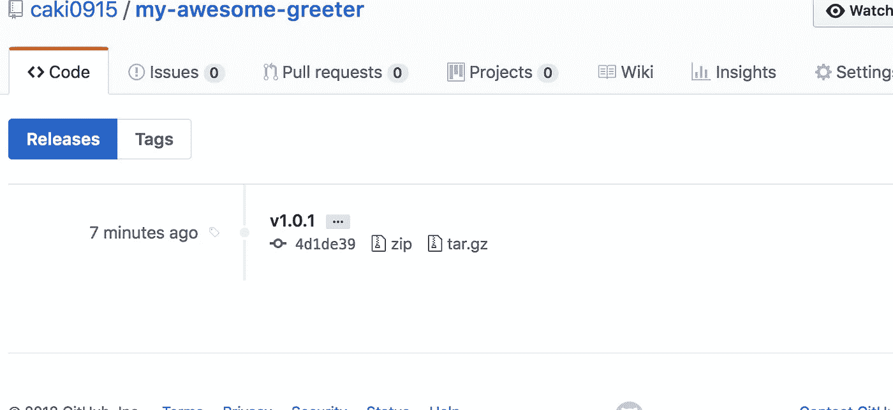**

**Github 的新版本**

# **下一步是什么？**

**就本教程的范围而言，我想暂时就此打住，我称之为*“NPM 软件包的最小设置”。然而，当你的包裹越来越大时，我建议你:***

*   **用 [Travis](https://travis-ci.org/) 设置自动构建**
*   **用 [Codecov](https://codecov.io/) 分析代码覆盖率**
*   **使用[盾牌](http://shields.io/)为您的自述文件添加徽章。每个人都喜欢徽章😎**

**但是让我们把它留给另一个教程。**

# **祝你好运建立你的可怕的包！😃**