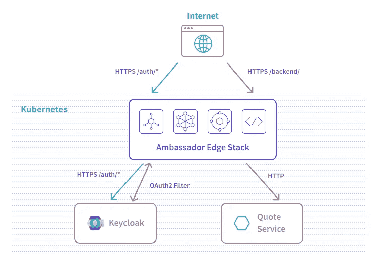

# 使用 Keycloak 和 Ambassador Edge 堆栈对 Kubernetes 进行分步集中认证

> 原文：<https://itnext.io/step-by-step-centralized-authentication-for-kubernetes-with-keycloak-and-the-ambassador-edge-stack-539dcf8ec699?source=collection_archive---------1----------------------->

## 当您构建 Kubernetes 应用程序时，很容易陷入“身份验证蔓延”,所有服务都有不同的身份验证机制。本教程介绍了如何使用 IdP 和 API 网关来集中您的身份验证机制。


[Keycloak](https://www.keycloak.org/) 是一个广泛采用的身份和访问管理([简称](https://www.getambassador.io/learn/kubernetes-glossary/iam/)IAM)开源解决方案。2014 年对于突破性技术来说是重要的一年，因为 Keycloak 和 Kubernetes 项目最初都是相隔几周发布的。不足为奇的是，许多 Kubernetes 最终用户将 Keycloak 作为管理对其平台的安全 API 和服务的访问的首选方式。

然而，仅仅在 Kubernetes 中运行 Keycloak 并不能保证平台的安全。许多问题留给了用户来配置和实现:从使用 TLS 和[入口控制器](https://kubernetes.io/docs/concepts/services-networking/ingress-controllers/)来公开 Keycloak API 端点，到在特定的业务端点上实施安全策略。在解决这些问题时，我们倾向于使用 API 网关解决方案来处理加密连接和集中 API 管理策略，而不是在您的微服务架构的每种语言和应用中重新实施身份验证策略。

我们今天的目标是将 Keycloak 安装为我们的 IAM 解决方案，并将其保护在 [Ambassador Edge Stack](https://www.getambassador.io) 之后，我们的 API 网关充当 Kubernetes 入口控制器。最后一步，我们将部署一个示例应用程序，并演示如何使用 Keycloak 作为身份提供者(简称为[IdP](https://www.getambassador.io/learn/kubernetes-glossary/idp/))来使用请求过滤器通过 OAuth2 限制对此应用程序的访问。

# 入门指南

在本教程中，我们将使用非生产就绪的 Keycloak 安装。为了简化我们的依赖图，我们将使用内存中的数据存储，它完全适合于演示，但不能保证生产环境中的高可用性。如果您正在寻找生产级的持久性， [Keycloak 提供了多种存储解决方案](https://www.keycloak.org/docs/latest/server_installation/index.html#_database)。

入口控制器是大多数 Kubernetes 产品中缺失的构建模块。尽管 Kubernetes 定义了一个入口资源，但它实际上并没有得到任何将资源转化为公共服务的实现的支持！入口解决方案的选择和安装由运营商决定。在这里，我们将使用 Ambassador Edge 堆栈的社区版本，因为它直接与 Keycloak 集成以进行身份验证，从而公开和保护来自互联网请求的公共流量，使其流向运行在我们的 Kubernetes 集群中的下游私有服务。

在本教程结束时，我们将启动并运行 Ambassador Edge 堆栈，在 Kubernetes 网络的边缘进行 TLS 端接，在`/auth/`下公开我们的 Keycloak 安装，并在`/backend/`下保护我们的报价应用。



## 用 K8s 初始化器搭建

库伯内特斯经常被取笑，因为它需要大量的 YAML。我们将使用 [K8s 初始化器](https://app.getambassador.io/)为我们生成所有的 Kubernetes 资源，而不是去寻宝游戏寻找 YAML 样本，并从陈旧的资源中将所有的拼图拼在一起。K8s 初始化器是一个项目生成器工具，类似于为应用程序开发人员提供的工具:想想 Spring Initializr 或 Yeoman。

K8s 初始化器的向导式界面将引导我们回答几个问题，以了解和配置不同云提供商的特定设置。这些实现细节通常是承诺被打破和可移植性不足的地方，使得难以配置入口控制器和向公共流量公开服务。希望我们可以通过使用像 K8s 初始化器这样的综合工具来消除这些小问题，它将为我们提供一个最佳的配置。

特别是对于本教程，我们选择了我们的目标 Kubernetes 集群:“Google Kubernetes 引擎”和“Google 外部负载平衡器(L4)”负载平衡器。我们还为我们的安装选择了一个公共主机名。使用公共主机名将需要额外的步骤来配置 DNS 条目以指向我们的安装，但是考虑到我们想要演示如何构建公共安全应用程序堆栈，额外的努力是值得的。至于 K8s 初始化器的 Auth 配置，我们毫无疑问选择了 Keycloak，带有临时密码。

一旦对我们的 K8s 初始化选项感到满意，我们点击“下载”按钮。我们会得到一套现成的 YAML 文件和说明。

试试看！【https://app.getambassador.io/ 

## 安装大使边缘堆栈

我们将从安装 Ambassador Edge 栈开始，因为它包含了一堆 [Kubernetes 自定义资源定义](https://kubernetes.io/docs/concepts/extend-kubernetes/api-extension/custom-resources/)依赖项。假设您可以访问您想要的 Kubernetes 集群，安装将非常简单，只需运行`kubectl apply`命令并配置一个 DNS 条目以指向所提供服务的外部 IP。

## 安装钥匙锁

从生成的 YAML 安装 Keycloak 也很简单:一个简单的`kubectl apply`命令。一只好奇的猫可能会偷看奇洛克·YAML 的档案，别担心，它不会杀了你的！实际上，您将能够体会到[大使映射](https://www.getambassador.io/docs/latest/topics/using/intro-mappings/)资源将如何指示到达公共`/auth/`前缀端点的流量转发到我们在 Kubernetes 集群中运行的私有 Keycloak pod。

给 Keycloak 几分钟的启动时间，然后我们将能够在[https://domain-name/auth/](https://domain-name/auth/)访问它的 UI。由于我们在 K8s 初始化器选项中选择了“ *Ambassador 使用 Let ' s Encrypt certificate”*终止 TLS，因此我们可以理解如何使用 Keycloak 安装的安全证书自动终止 TLS。

然后，我们可以使用默认的`admin`用户名和我们之前选择的临时密码登录到 Keycloak 的管理控制台 UI，根据我们的需要配置 Keycloak...并更改密码！

# 使用 Keycloak 保护您的 API

## 配置密钥锁领域、客户端和用户

为了保护我们的 API，我们将使用全新的 Keycloak 安装作为我们的 IdP。我们首先需要创建一个客户端来处理来自 Ambassador Edge 堆栈的身份验证请求。所有这些配置步骤都可以使用 Keycloak UI 来完成。

1.  我们首先从创建一个新的“领域”开始。将鼠标悬停在右侧导航栏中的“主”标签上，我们可以单击“添加领域”。我们选择了`ambassador`作为我们新领域的“名字”。稍后将需要配置授权过滤器中的`authorizationURL`字段。
2.  我们将通过导航到“Clients”并单击“create”来创建一个新客户端。我们选择了以下设置:
    - *客户端 ID* : `ambassador` -该值将用于授权过滤器的`clientID`字段。
    - *客户端协议* : `openid-connect`
    - *根 URL* :无，留空
3.  在下面的屏幕上，我们为客户端配置了:
    - *访问类型*:`confidential`-
    -*有效重定向 URIs* : `*`
4.  导航到我们的客户端中的“Mappers”选项卡，我们单击“Create”并使用以下设置:
    - *协议*:`openid-connect`-
    名称:`Ambassador Mapper`-
    -*映射器类型* : `Audience`
    - *包括的客户端受众*:从下拉列表中选择客户端的名称。记住，我们给客户取名为`ambassador`。
5.  回到我们的`ambassador`客户端，我们导航到“客户端范围”部分，并为`offline_access`配置我们的客户端。
6.  回到我们的`ambassador`客户端，然后我们导航到“凭证”部分。我们注意到了“Secret”值，因为稍后在配置我们的 auth Filter 时会用到它。

除了我们的客户端配置，让我们配置一个 Keycloak“用户”:

1.  导航到 Keycloak 管理控制台的“用户”部分，我们将单击“添加用户”。我们给用户一个简单的用户名:`my-keycloak-user`，然后点击“保存”。
2.  在接下来的屏幕上，我们切换到用户的“Credentials”选项卡来设置临时密码。

现在我们有了一个可以用来验证自己身份的用户，让我们来部署一个应用程序。

## 部署报价服务

在 Kubernetes 上部署定制应用程序是通过创建一些 Kubernetes 资源来实现的，这些资源被定义为…你猜对了，更多的 YAML！这一次，因为我们正在部署一个示例后端应用程序，所以这个示例有些轻量级。您可以将以下定义保存到一个“quote-service.yaml”文件中，并使用`kubectl apply -f quote-service.yaml`进行部署。

```
---
apiVersion: v1
kind: Service
metadata:
  name: quote
  namespace: default
spec:
  ports:
  - name: http
    port: 80
    targetPort: 8080
  selector:
    app: quote
---
apiVersion: apps/v1
kind: Deployment
metadata:
  name: quote
  namespace: default
spec:
  replicas: 1
  selector:
    matchLabels:
      app: quote
  strategy:
    type: RollingUpdate
  template:
    metadata:
      labels:
        app: quote
    spec:
      containers:
      - name: backend
        image: docker.io/datawire/quote:0.4.1
        ports:
        - name: http
          containerPort: 8080
---
apiVersion: getambassador.io/v2
kind: Mapping
metadata:
  name: quote-backend
  namespace: default
spec:
  prefix: /backend/
  service: quote
```

这将创建一个 Kubernetes `Deployment`、`Service`和`Mapping`来公开展示我们在`/backend/`路径下运行的报价应用程序。试试看，目前未保护:[https://domain-name/back end/](https://domain-name/backend/)。

## 保护访问

基于我们在前面的“配置 Keycloak 领域、客户端和用户”一节中应用于我们的 Keycloak 安装的配置，我们将在 Kubernetes 中创建 OAuth2 `Filter`和`FilterPolicy`资源。不要忘记用您安装的值替换这个 YAML 示例中的占位符！再次将下面的定义保存到一个“keycloak-filter.yaml”文件中，并使用`kubectl apply -f keycloak-filter.yaml`部署它。

```
---
apiVersion: getambassador.io/v2
kind: Filter
metadata:
  name: keycloak-filter
  namespace: ambassador
spec:
  OAuth2:
    authorizationURL: https://{domain-name}/auth/realms/ambassador
    audience: ambassador
    clientID: ambassador
    secret: {client_secret}
    protectedOrigins:
    - origin: https://{domain-name}
---
apiVersion: getambassador.io/v2
kind: FilterPolicy
metadata:
  name: quote-policy
  namespace: default
spec:
  rules:
    - host: "*"
      path: /backend/
      filters:
        - name: keycloak-filter
          namespace: ambassador
          arguments:
            scopes:
            - "offline_access"
```

由于`FilterPolicy`在`/backend/`路径上起作用，当导航到[https://domain-name/back end/](https://domain-name/backend/)下的报价服务时，我们现在被提示通过 Keycloak 进行身份验证！尝试使用我们之前创建的`my-keycloak-user`用户名登录！

我们距离扩展这一 FilterPolicy 配置以使用相同的身份验证策略保护多个路径、端点和服务仅一步之遥。谈论一种推广单点登录和集中您的身份验证机制的有效方法！[现在，只需按照这些说明使用 Keycloak](https://www.getambassador.io/docs/latest/howtos/sso/keycloak/) 配置过滤器和过滤器策略资源的细粒度设置。

# 了解更多信息

在本教程中，我们展示了如何通过将 Keycloak 部署为 IdP 并将 Ambassador Edge 堆栈部署为 Kubernetes-native API 网关，在 Kubernetes 中集中您的身份验证。在 K8s 初始化器的帮助下，您只需点击几下鼠标就可以启动并运行这些工具。

要了解有关这些工具和集中式身份验证策略的更多信息，请查看以下资源:

*   [钥匙锁](https://www.keycloak.org/)
*   [大使缘栈](https://www.getambassador.io/)
*   [K8s 初始化器](https://app.getambassador.io/)
*   [加入我们的行列](http://d6e.co/slack)

*原载于 2020 年 8 月 28 日*[*https://blog . getambassador . io*](https://blog.getambassador.io/centralized-authentication-with-keycloak-and-ambassador-edge-stack-d509ffbc7b6f)*。*