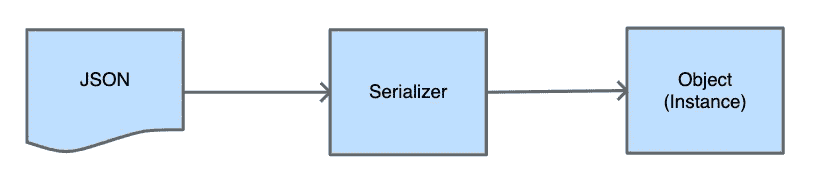
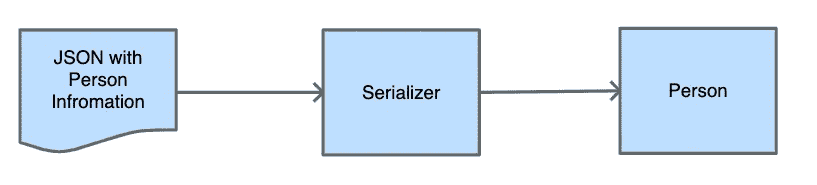
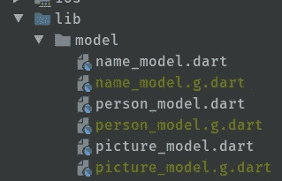

# Flutter JSON 序列化分步指南

> 原文：<https://itnext.io/step-by-step-guide-for-flutter-json-serialization-fd5acd5e7521?source=collection_archive---------2----------------------->


前一段时间，我发布了一个视频教程，讲述我们如何[创建一个基本的网络请求](https://www.youtube.com/watch?v=hz2LQ43muio&t=7s)。在这篇文章中，我们想看看如何用 Flutter JSON 序列化来改进这个解决方案。有了它，我们可以删除代码库中的许多字符串。

我还为这篇文章制作了一个视频，大家可以随意看看。

网络请求中的 JSON 序列化程序

# 通用序列化

序列化是计算机科学中将对象转换成可以保存在数据库中或通过网络请求发送的东西的过程。今天，我们希望转换从 API 接收的 JSON 字符串，并将其转换为对象的实例。



JSON 到实例



JSON 字符串到人

为了获得字符串形式的个人信息，我将在下面的例子中使用随机用户生成器。这可以生成随机的用户信息，并为我们提供一个 API 来接收 JSON 字符串。

# 基本网络请求—示例应用程序

在 [RandomUserAPI](https://randomuser.me/) 的帮助下，我创建了一个应用程序，只要我们打开它，它就会向我们显示用户列表。在视频中，我们一起为[的基本网络请求](https://www.youtube.com/watch?v=hz2LQ43muio)创建了这个应用程序。在视频中，我们使用手动方法进行 Flutter JSON 序列化，而在这篇博客文章中，我们将其改为更加自动化的过程。

如果你搜索这个项目和这篇文章的源代码，你会在这里找到一切。


Flutter 中的用户滚动列表

# 手动颤振 JSON 序列化

为了更好地理解为什么我们应该更喜欢自动颤振 JSON 序列化，我们必须后退一步。为此，我们首先来看看手动序列化是如何精确工作的。

在上面的代码片段中，我们创建了一个从 API 接收的新的 person 对象。正如您可能已经看到的，我们必须将所有的键字符串写入类中，并且用 API 信息污染我们的类。此外，我们陷入了一个陷阱，如果我们想要添加或删除一个属性，我们必须全部改变它。

这使得可维护性相当困难。尤其是当 API 发生变化，我们不得不从头开始创建时。这将导致大量的搜索和替换，我们将失去所有的 IDE 支持。

# 利益

*   解决方案周围没有样板文件
*   不需要设置，所以您可以直接访问参数

# 不足之处

*   你必须自己写每一行
*   打字错误可能会发生，并降低应用程序的稳定性
*   对于您想要添加、删除或修改的每个新字段，我们必须修改模型中的代码
*   较高的维护成本，尤其是对于较大的项目或不断变化的 API

# 生成的序列化

现在我们已经了解了自写序列化的问题，让我们看看生成的 Flutter JSON 序列化。目前在 Flutter 框架中还没有一个内置的解决方案，但是在 [pub.dev](https://pub.dev) 上有很多针对这个问题的完美包。在本文中，我们将仔细研究一下 [json_serializable](https://pub.dev/packages/json_serializable) 包。

该包与 build_runner 包一起工作，允许我们生成“fromJSON”和“toJSON”函数，而无需编写 JSON 的所有键。我们只需要正确地设置我们的模型，准确地注释它们，并在里面提供两个函数。但是话说够了，我们想看一些代码。

# 属国

在我们开始使用 json_serializable 包之前，我们必须首先在项目中添加一些依赖项。

json_annotation 是我们项目中唯一必须存在的依赖项。build_runner 和 json_serializable 只是开发依赖项，不会成为最终捆绑包的一部分。

# 修改模型

第 1 行:使用**部件‘person_model.g.dart’**我们给 PersonModel 类访问 person _ model . g . dart 文件内部方法的可能性。稍后将从 built _ runner 中生成该文件。

第 3 行: **@JsonSerializable()** 注释告诉 build_runner 这个类必须关注新文件的生成和序列化的创建。

第 5 + 8 行:对于 JSON 内部的对象，我们必须为 NameModel 和 PictureModel 创建它们的表示模型类。新模型也将使用 **@JsonSerializable()** 进行注释，并将从第 12 行和第 14 行获得两个新方法。

第 12 行:来自 Json 的新[工厂](https://dart.dev/guides/language/language-tour#factory-constructors)构造函数接近我们的旧方法。但是我们没有创建 PersonModel 的新实例，而是调用了一个方法**_ $ PersonModelFromJson(JSON)**。这个方法将在后面借助 built _ runner 生成。

第 14 行:toJson 方法按照预期返回一个 Json(在 Dart 中是 String 和 dynamic 之间的映射)。为了接收映射，我们调用生成的函数**_ $ PersonModelToJson(this)**，并在内部传递当前实例。

# 释放内置跑步者的力量

在我们成功地创建了带有必要注释和函数的模型之后，我们就可以开始使用 built _ runner 脚本了。我们在终端中打开项目，并执行以下命令之一。

```
// Inside of Flutter projects
// Generates the generate files once
flutter pub run build_runner build// Watches the model files and generates on each change
flutter pub run build_runner watch// Inside of Dart projects
// Generates the generate files once
pub run build_runner build// Watches the model files and generates on each change
pub run build_runner watch
```

对于您有一个常规 dart 项目的情况，我还添加了创建一致的 Dart 包的命令。此命令将为您创建附加的*.g.dart 文件。这些文件可以插入到。gitignore，因为团队中的每个人都可以执行这个命令。



让我们更深入地了解一下电子监管生成的文件。这里您可以看到我们在分部类的 fromJson 和 toJson 中调用的两个函数。

这里是我们必须事先在这些方法中创建的所有字符串。多亏了 built _ runner，他们现在为我们生成了。如果您看一下第 18 行，您可以看到甚至子模型都是正确生成的。如果我们现在改变了类中的一些东西，并再次执行构建运行器(或者让它监视)，那么我们将会看到它是如何被自动添加到列表中的。

# 利益

*   对该类的修改会立即反映出来
*   由于编写的代码更少，维护更少
*   类型通过属性直接设置
*   没有奇迹发生，生成的文件在项目中

# 不足之处

*   初始设置增加
*   这里涉及到一些样板文件
*   您必须确保团队中的每个人都知道 build_runner 函数(可能的解决方案是一个脚本或一个好的 readme.md 文件)
*   生成的文件可能会偏离真实的模型文件

# Flutter JSON 序列化的包

有几个其他的包可以用来生成 JSON 序列化。

## [建 _ 值](https://pub.dev/packages/built_value) / [建 _ 集](https://pub.dev/packages/built_collection)

built _ value 或 built _ collection 可以像我们在 json_serializable 中一样处理 JSON 序列化。但是增加了有益的功能，如不变性、可比性和其他生活质量功能。

## [dart_json](https://pub.dev/packages/dart_json)

dart_json 的好处是它绝对不依赖于任何东西。如果你寻找一个依赖尽可能少的解决方案，这个包是你最好的选择。

## [JSON Web 解析器](https://app.quicktype.io?share=Dxzba5UONSYqWKLpCbog)

有一些 JSON Web 解析器可以从 JSON 中为您创建一个有效的 dart 模型。您可以将一个 JSON 复制到左侧，将右侧的模型复制到您的应用程序中。

# 结论

JSON 序列化是一个至关重要的主题，主要是当您处理大量的外部请求和不同的 API 时，这些 API 会不时地改变它们的契约。这些应该会带来更高的生产力，这样我们就可以更容易地实现重要的功能。

我在 twitter 上做了一个投票，看看目前哪个框架使用得最多，但看起来两者非常接近。我的建议是看一看每个包/解决方案，然后使用最适合您需求的一个。

感谢阅读，保持好奇。