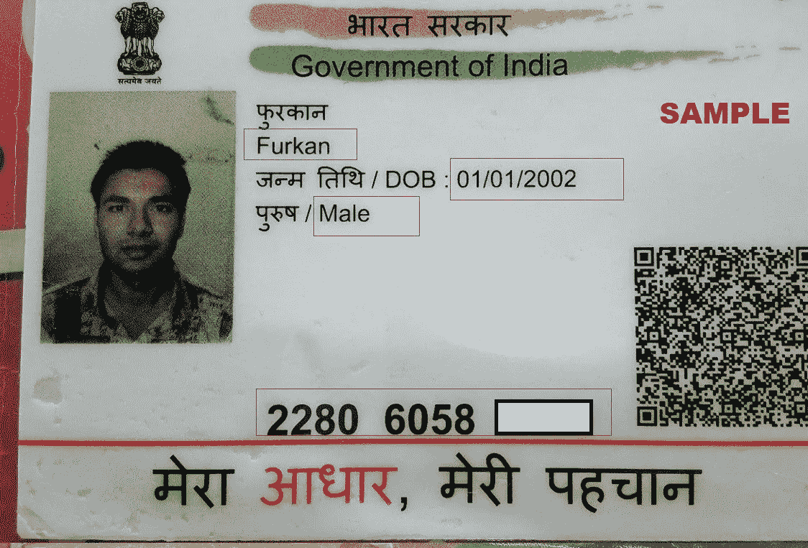
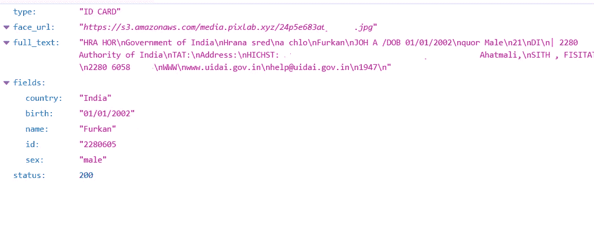
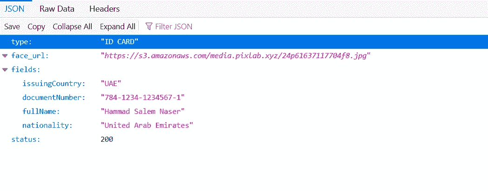
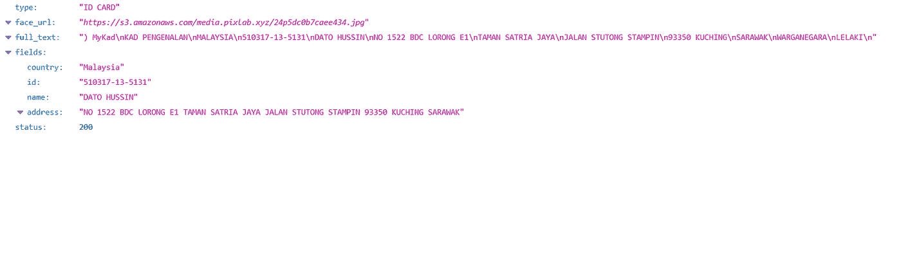

# 在你的应用中进行电子 KYC 的分步指南

> 原文：<https://itnext.io/step-by-step-guide-to-do-e-kyc-in-your-app-c3b4e240617?source=collection_archive---------2----------------------->

在这个数字时代，你可以利用许多触手可及的服务。你可以预订机票，在股市买些股票，或者直接从你的设备上订购一些食物。

但有时，这些服务需要通过一个叫做电子 KYC 的过程来验证你的真实性。为了利用一些法律和金融服务，这种验证是强制性的。相信我，这是为了你好。这种电子 KYC 验证可以从诈骗者手中拯救你。

假设你是一个开发商或者企业家。你想给你的客户提供一些法律、金融或其他敏感的服务。如果这些服务受到政府监管，那么你必须通过你的应用程序或网站进行 KYC。

在深入探讨这个话题之前，让我们先快速了解一下 KYC 是什么。

# 什么是电子 KYC

KYC 是“了解你的客户”的缩写。eKYC 是 KYC 的数字化版本。eKYC 是一个验证客户的过程。这是一个完全数字化的过程，没有任何物理文档。

在某些国家，顾客必须提供身份证的图像。您可以扫描这些 id 并从中提取信息。

但是在一些国家，比如印度，你必须得到 aadhar 权威机构的许可才能通过官方 API 处理你用户的 eKYC。

在这篇文章中，我们将讨论如何扫描护照，aadhar，阿联酋身份证，马来西亚的 mykad 文件和检索信息。

# 文件扫描服务

文档扫描过程由人工智能和机器学习过程驱动。你的应用必须区分相关信息和不相关的杂乱信息。

您可以使用 [OpenCV](https://opencv.org/) 或其他类似类型的机器学习库来设置您的文档扫描流程。但是训练和测试那些模型和库可能会阻碍你的速度并增加你的成本。你必须雇佣一个机器学习开发者来微调你的扫描服务，相信我，这个过程要花很多钱。

替代方案是什么？您可以使用外部服务进行扫描。市场上有很多服务平台。我最喜欢的是 P [ixLab](https://pixlab.io/) 。PixLab 是一个软件即服务提供商，给你很多机器学习 API 端点。您可以将这些服务无缝集成到您的应用中。

在这篇博客中，我将使用 PixLab 服务从上传的文档中扫描和提取数据。你可以在那里创建一个账户来跟进。

# 如何在你的应用程序中扫描政府签发的护照文件

如果你正在为国际客户服务，并且想要扫描他们的护照、旅行文件和其他身份证，那么你必须使用来自 PixLab 的 [Docscan](https://pixlab.io/cmd?id=docscan) API。它使用光学字符识别(OCR)来识别护照中的数据，您会收到 JSON 格式的响应，以便在您的应用程序中使用。

这个 facedetect API 还可以读取代表机器可读区域的 MRZ，而不管发行国家是什么。

对于演示，我们使用一个虚拟文档。您还可以将此图像用于测试目的。


在您的应用程序中，首先，您需要将文档作为用户输入的文件。如果你使用的是网络，那么在 HTML 标记中，只需添加这几行。

```
<input type=”file” id=”file-selector” />
```

现在，为了读取用户输入文件，我们必须使用 [FileReader](https://developer.mozilla.org/en-US/docs/Web/API/FileReader) web API。或者，您可以直接将图像上传到您的服务器，并在您的服务器中进行处理。

供参考，在前端网站中，可以这样使用 FileReader javascript API。

```
let reader = new FileReader();// This onload function invoke when reading is done
reader.onload = () => {
 console.log(reader.result);
};// If any error takes place
reader.onerror = reject;// You can set output data fomate here
reader.readAsArrayBuffer(file);
```

获得图像后，现在我们调用 P [ixLab API 端点](https://pixlab.io/cmdls)。在本文中，我们将讨论一个 python 代码示例。您可以很容易地将这段代码转换成您喜欢的语言。

在第一次导入时，必要的模块和请求“Docscan”端点。

```
import requests
import jsonreq = requests.get(‘[https://api.pixlab.io/docscan',params={](https://api.pixlab.io/docscan',params={)
 ‘img’:’[https://i.stack.imgur.com/oJY2K.png'](https://i.stack.imgur.com/oJY2K.png'), # Passport sample
 ‘type’:’passport’, # Type of document we are a going to scan
 ‘key’:’Pixlab_key’
})
```

PixLab 扫描您的请求和有效载荷，并提供您需要的所有相关信息。

如果您想检测和处理文档中的人脸，那么您可以使用 [Facedetect](https://pixlab.io/cmd?id=facedetect) API。这是一篇非常好的关于 facedetect API 的[文章](https://dev.to/hrishiksh/detect-and-blur-faces-in-flutter-using-pixlab-api-m5a)，供大家参考。

检测到面部后，您可以通过使用 [Crop](https://pixlab.io/cmd?id=crop) API 端点来裁剪面部，从而在您的应用程序中使用它。

如果您只需要光学字符识别(OCR)，那么您可以只使用 [OCR](https://pixlab.io/cmd?id=ocr) 端点来实现此目的。

为了处理来自上述请求的响应，我们使用 python 的 json 库。函数将响应转换成一个字典。现在，您可以像普通字典一样提取响应字段。

```
reply = req.json()
if reply[‘status’] != 200:
 print (reply[‘error’])
else:
 print (“User Cropped Face: “ + reply[‘face_url’])
 print (“MRZ Cropped Image: “ + reply[‘mrz_img_url’])
 print (“Raw MRZ Text: “ + reply[‘mrz_raw_text’])
 print (“MRZ Fields: “)
 # Display all parsed MRZ fields
 print (“\tIssuing Country: “ + reply[‘fields’][‘issuingCountry’])
 print (“\tFull Name: “ + reply[‘fields’][‘fullName’])
 print (“\tDocument Number: “ + reply[‘fields’][‘documentNumber’])
 print (“\tCheck Digit: “ + reply[‘fields’][‘checkDigit’])
 print (“\tNationality: “ + reply[‘fields’][‘nationality’])
 print (“\tDate Of Birth: “ + reply[‘fields’][‘dateOfBirth’])
 print (“\tSex: “ + reply[‘fields’][‘sex’])
 print (“\tDate Of Expiry: “ + reply[‘fields’][‘dateOfExpiry’])
 print (“\tPersonal Number: “ + reply[‘fields’][‘personalNumber’])
 print (“\tFinal Check Digit: “ + reply[‘fields’][‘finalcheckDigit’])
```

如果您的用户上传 pdf，那么您可以使用 [Pdftoimg](https://pixlab.io/cmd?id=pdftoimg) endpoint 首先将您的 pdf 转换为图像。然后就可以按照上面的描述做进一步的处理了。

# 扫描印度阿达尔

印度 aadhar 是一种生物识别关联的个人身份证。每个印度公民都有一张 aadhar 卡。如果你想在印度提供任何法律和金融服务，那么你必须使用 aadhar 验证你的客户。

aadhar 的验证过程可以通过两种方式完成。你可以扫描用户提供的 aadhar 卡并提取其数据，也可以使用官方的 aadhar API 在你的应用程序中验证你的用户。

如果想从 aadhar 卡中提取数据，可以使用 PixLab 的 [Docscan](https://pixlab.io/cmd?id=docscan) API 端点。此端点有助于您可以信赖的平稳数据提取。所有这些 API 都是生产级的，并且经过了实战测试。

/docscan API 提取您需要的所有细节，并以您的应用程序可以使用的良好的 JSON 有效负载作为响应。

要从用户那里获得文件输入，请将这些行添加到 HTML 标记中。

```
<input type=”file” id=”file-selector” />
```

这是一个演示 aadhar 卡，你可以用它来测试你的应用。



在这个例子中，我将编写一个 python 代码示例，但是由于代码非常简单，您可以很容易地将其转换成您喜欢的语言。如果你发现有什么困难，你可以随时联系我。

```
import requests
import jsonreq = requests.get(‘[https://api.pixlab.io/docscan',params={](https://api.pixlab.io/docscan',params={)
 ‘img’:’[https://s3.amazonaws.com/pics.pixlab.xyz/adhar-india-pixlab.jpg'](https://s3.amazonaws.com/pics.pixlab.xyz/adhar-india-pixlab.jpg'),
 ‘type’:’idcard’, # Type of document we are a going to scan
 ‘country’:’india’ # Indian aadhar card
 ‘key’:’Pixlab_key’
})
```

当您发送这个请求时，如果所有的字段都是正确的，并且一切正常，您将得到一个响应。响应是 JSON 格式的，可能如下所示。



您可以使用 JSON python 包来处理这个响应。代码示例如下所示。

```
reply = req.json()
if reply[‘status’] != 200:
 print (reply[‘error’])
else:
 print (“User Cropped Face: “ + reply[‘face_url’])# print (“Scanned Text: “ + reply[‘full_text’])
print (“Fields: “)# Display all scanned fields
if “country” in reply[‘fields’]:
 print (“\tIssuing Country: “ + reply[‘fields’][‘country’])if “id” in reply[‘fields’]:
 print (“\tID number: “ + reply[‘fields’][‘id’])if “name” in reply[‘fields’]:
 print (“\tName: “ + reply[‘fields’][‘name’])if “address” in reply[‘fields’]:
 print (“\tAddress: “ + reply[‘fields’][‘address’])if “sex” in reply[‘fields’]:
 print (“\tGender: “ + reply[‘fields’][‘sex’])if “birth” in reply[‘fields’]:
 print (“\tDate of birth: “ + reply[‘fields’][‘birth’])
```

这很简单，对吧。想象一下，如果你不得不独自做所有这些事情，你会有多痛苦。

如果想提取人脸，可以使用 PixLab 的 [Facedetect](https://pixlab.io/cmd?id=facedetect) API。它将检测你的脸，并标记一个围绕你的脸的正方形坐标。

要在你的应用程序中裁剪和使用这张脸，你可以使用[裁剪](https://pixlab.io/cmd?id=crop) API，它可以裁剪你检测到的脸，并给你最终的图像。

总结一下，如果你想从身份证中检测和提取人脸，你必须结合使用`/facedetect `和`/crop` API。

# 扫描阿联酋 ID

阿拉伯联合酋长国为每个公民提供一张身份证。如果您想提供任何政府、安全和金融服务，并想扫描您的阿联酋身份证，那么这是一个指南。

正如我之前在本文中提到的，您可以通过使用一些机器学习模型在您的服务器中完成这个过程，但是以正确的方式设置管道是非常关键的。对于生产就绪的服务，我不建议这样做。

PixLab 是一家领先的机器学习 API 提供商，可以简化您的工作流程，其久经考验的 API 可以帮助您尽可能顺利地集成所有这些功能。

现在，要从用户那里获得 ID 卡，请在 HTML 标记中添加以下文件输入字段。

```
<input type=”file” id=”file-selector” />
```

现在我们请求 PixLab API 服务器从给定的 ID 卡中提取所有数据。

如果用户给你提供一个*。pdf* 文档，然后你要把它转换成图片。使用[pdftimage](https://pixlab.io/cmd?id=pdftoimg)API 非常简单。你可以在这里获得 API 参考[。](https://pixlab.io/cmd?id=pdftoimg)

这是一个阿联酋身份证样本，你可以用于测试目的。


为了进行简单的演示，我们使用 python 请求库发出请求。你可以使用你最喜欢的语言堆栈来做同样的事情。

```
import requests
import jsonreq = requests.get(‘[https://api.pixlab.io/docscan',params={](https://api.pixlab.io/docscan',params={)
 ‘img’:’[https://pixlab.xyz/images/pixlab-uae-id.jpg'](https://pixlab.xyz/images/pixlab-uae-id.jpg'),
 ‘type’:’idcard’, # We are expecting an ID card
 ‘country’: ‘uae’, 
 ‘key’:’PIXLAB_API_KEY’
})
```

发送请求后，PixLab 将处理并返回一个响应，如下所示。



为了处理这个响应，我们使用 JSON python 包。JSON 包会将响应转换成一个字典。现在，我们可以轻松地读取给定响应的所有字段。

用于读取响应的 python 代码如下所示。

```
reply = req.json()
if reply[‘status’] != 200:
 print (reply[‘error’])
else:
 print (f”ID Card Holder’sif “issuingCountry” in reply[‘fields’]: 
 print (“Issuing Country: “ + reply[‘fields’][‘issuingCountry’]) 

if “documentNumber” in reply[‘fields’]: 
 print (“Document Number: “ + reply[‘fields’][‘documentNumber’]) 

if “fullName” in reply[‘fields’]: 
 print (“Holder Full Name: “ + reply[‘fields’][‘fullName’]) 

if “nationality” in reply[‘fields’]:
 print (“Holder’s Nationality: “ + reply[‘fields’][‘nationality’])
```

现在，您可以轻松地将阿联酋身份证扫描功能集成到您的应用程序中。

如果你想让我为你喜欢的语言制作更多的代码样本，你可以在 Twitter 上问我。

# 扫描马来西亚 Mykad

马来西亚身份证被称为 mykad。如果您想在 mykad 的帮助下验证您的用户，那么您必须扫描并提取用户上传的文档。

从图像中扫描和提取数据称为光学字符识别。这是一个机器学习的过程。如果你想自己做，那么你必须在你的堆栈中添加一个机器学习微服务。

是的，这听起来很复杂，会阻碍你的成长。如果有一种服务可以用于这个目的并且非常可靠，那该怎么办呢？是的，P [ixLab](https://pixlab.io) 是一家总部位于 SaaS 的公司，为您提供高性能和可靠的 API。你可以在这里找到更多关于他们的信息。

现在我们将使用这个图像作为参考。您还可以使用这个映像来测试您的 API。


现在我们将请求 PixLab API。在这个例子中，我使用的是 python，但是由于代码样本非常简单，您可以很容易地将其转换成您喜欢的语言。

我们将使用 [docscan](https://pixlab.io/cmd?id=docscan) API 端点来扫描文档。Docscan API 可以轻松地从上传的文档中提取数据，还可以读取机器可读的代码。

您可以使用 [facedetect](https://pixlab.io/cmd?id=facedetect) API 提取人脸，并使用 [crop](https://pixlab.io/cmd?id=crop) API 端点裁剪图像。

如您所见，它们为您能想象到的每一种用例都提供了 API 端点。你可以在这里看到更多符合你需求的 API 端点。

现在让我们回到我们的*文档扫描*请求。

```
import requests
import jsonreq = requests.get(‘[https://api.pixlab.io/docscan',params={](https://api.pixlab.io/docscan',params={)
 ‘img’:’[https://pixlab.xyz/images/pixlab-uae-id.jpg'](https://pixlab.xyz/images/pixlab-uae-id.jpg'),
 ‘type’:’idcard’, # We are expecting an ID card
 ‘country’:’malaysia’ 
 ‘key’:’PIXLAB_API_KEY’
})
```

对此请求的响应可能如下所示。您可以在浏览器中看到响应。



但是，由于您需要以一种对开发人员更友好、更易于使用的方式获得响应数据，我们使用 python 的 JSON 包来解析响应，并将其转换为 python 字典。

```
reply = req.json()
if reply[‘status’] != 200:
 print (reply[‘error’])
else:
 print (f”ID Card Holder’sif “issuingCountry” in reply[‘fields’]: 
 print (“Issuing Country: “ + reply[‘fields’][‘issuingCountry’]) 

if “documentNumber” in reply[‘fields’]: 
 print (“Document Number: “ + reply[‘fields’][‘documentNumber’]) 

if “fullName” in reply[‘fields’]: 
 print (“Holder Full Name: “ + reply[‘fields’][‘fullName’]) 

if “nationality” in reply[‘fields’]:
 print (“Holder’s Nationality: “ + reply[‘fields’][‘nationality’])
```

# 结论

如你所见，我们可以利用许多可能性来实现我们的愿景。由于机器学习工作流成本高昂，如果做得不好，你会损失很多钱。

所以为什么要冒这些风险。现在你知道你应该去哪里寻找适当的帮助。另外，你可以浏览 P [ixLab 的其他 API 文档](https://pixlab.io/cmdls)来找到你需要的东西。

让我看看你做了什么。告诉我这个教程对你的旅程有什么帮助。我在推特上的名字是[@ hrishkpathak](https://twitter.com/hrishikshpathak)。

如果你在这里，通读所有这些段落，我很高兴我能写出一篇人们阅读的文章。非常感谢。祝你今天过得愉快。