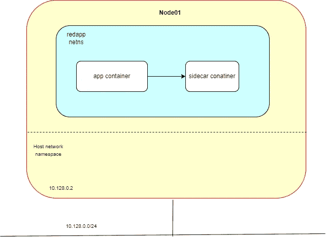
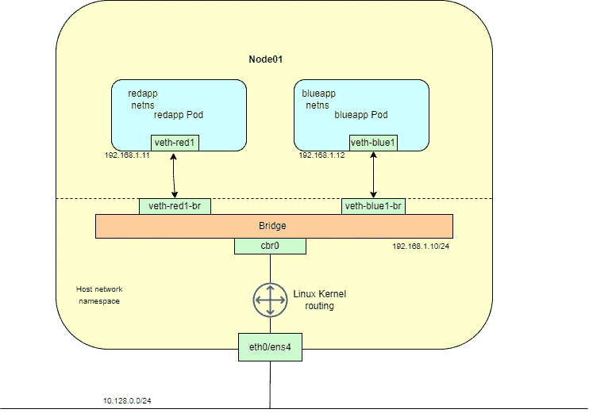
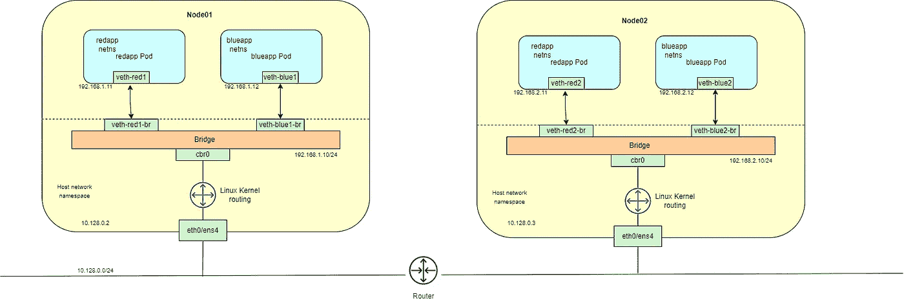
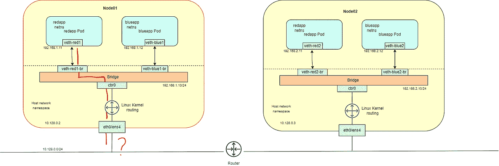
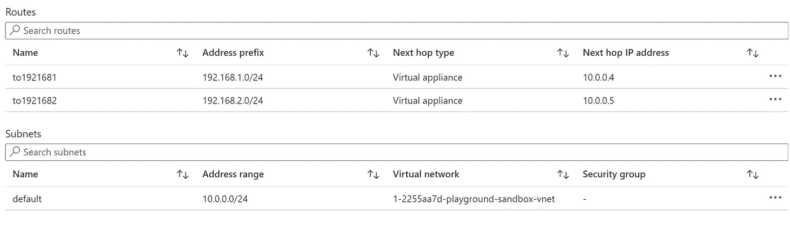
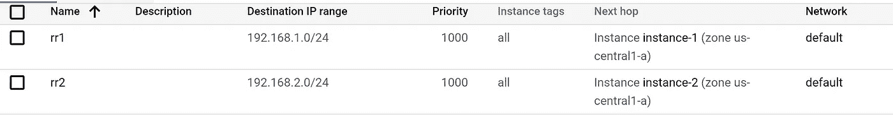
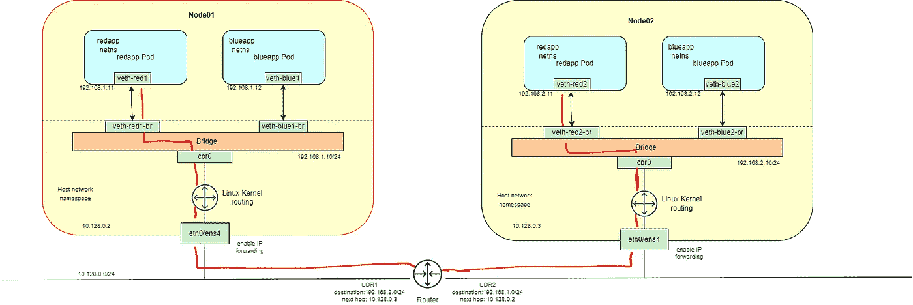
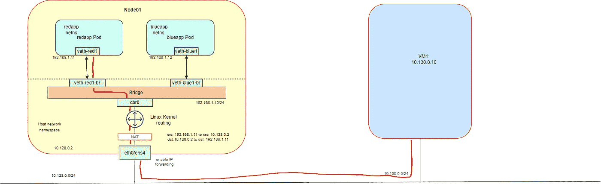
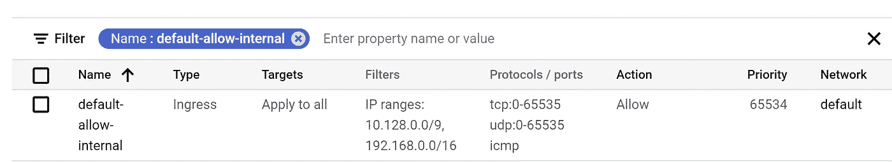

# 模拟 kubernetes Pod 网络的步骤

> 原文：<https://itnext.io/steps-to-emulate-pod-network-1c34209d0f53?source=collection_archive---------1----------------------->

网络是 Kubernetes 的支柱，但要准确理解它是如何工作的是一个挑战。有 4 个不同的网络问题需要解决:

> 高度耦合的容器到容器通信:这通过 [Pods](https://kubernetes.io/docs/concepts/workloads/pods/) 和 localhost/127.0.0.1 环回接口通信来解决。
> 
> 点对点通信:我们将模拟这种通信的一个实现。
> 
> 吊舱到服务的通信:这由[服务](https://kubernetes.io/docs/concepts/services-networking/service/)负责。
> 
> 外部到服务的通信:这由[服务](https://kubernetes.io/docs/concepts/services-networking/service/)负责。

Kubernetes 集群中有 3 个网络:

1.  连接 Kubernetes 集群节点池的所有主机/服务器/虚拟机/节点的主机网络。
2.  连接节点池中相同节点或不同节点上所有单元的单元网络。
3.  [服务网络](/inspecting-and-understanding-service-network-dfd8c16ff2c5)用于连接应用程序，而无需担心 pod 的 pod IPs 会迎合各自的应用程序。

## 这篇文章的目的

许多博主发表了许多很好的帖子，详细解释了 pod 网络。我想提几个，如果你感兴趣，你可能会喜欢[“Kubernetes 网络模型指南”](https://sookocheff.com/post/kubernetes/understanding-kubernetes-networking-model/#kubernetes-networking-model)和[“了解 Kubernetes 网络:pods”](https://medium.com/google-cloud/understanding-kubernetes-networking-pods-7117dd28727)。

我为什么写这篇文章？因为当我试图寻找一个展示如何模拟 pod 网络的帖子时，我没有找到一个全面的。

有多种方法可以满足 Kubernetes 对 pod 网络的要求。我们主要可以根据 pod 网络地址空间是节点池子网的一部分还是 Pod 网络地址空间是独立的并且不是节点池子网的一部分来区分它们。我们将努力仿效后者。

有多种方法可以实现地址空间独立且不属于节点池子网的 pod 网络。最常用的是“基本网络”,使用 Linux 桥和用户定义的路由以及 IP 转发。 [GKE 基于路由的](https://cloud.google.com/kubernetes-engine/docs/how-to/routes-based-cluster)集群(当网络策略被禁用时)和 Azure [AKS kubenet](https://docs.microsoft.com/en-us/azure/aks/configure-kubenet) 使用相同的技术来实现 pod 联网。

我们将使用 Linux 命令模拟没有 Kubernetes 的 pod 网络。基本上，当一个 pod 在一个集群节点上被调度时，我们将做一个" [b](https://www.cni.dev/docs/) ridge "类型的插件在这个节点上被 kubelet 要求做的事情。我将介绍在后台完成的每个步骤，并提到用于实现相同目的的命令。

# Pod 网络

基本要求:

1.  pod 中的容器应该能够相互通信。
2.  每个 Pod 都应该有一个 IP 地址。
3.  每个 pod 应该能够与同一节点上的所有其他 Pod 通信。
4.  每个 pod 应该能够与 Kubernetes 集群的节点池中的任何其他节点上的其他 pod 进行通信，而无需 NAT。

## 测试配置

1.  我们有两个节点 node01 (10.128.0.2)和 node02 (10.128.0.3)(虚拟机在 GCP 或 Azure 中调配)
2.  主机网络 CIDR 10.128.0.0/24
3.  Pod 网络 CIDR 192.168.0.0/16，即节点 01 的 CIDR 192.168.1.0/24 和节点 02 的 CIDR 192.168.2.0/24，依此类推(对于其他节点，如果添加到群集)

# Pod 网络仿真

[Linux 名称空间](https://www.redhat.com/sysadmin/7-linux-namespaces)(特别是[网络名称空间](https://linuxhint.com/use-linux-network-namespace/))使得实现这些需求变得容易。网络名称空间一被调度就被分配给一个 pod，这是由 Kubelet 完成的。这意味着每个 pod 有一个网络名称空间。

让我们从一个节点开始，即节点 01(10.128.0.2)。在一个网络名称空间内监听的任何两个进程都可以使用环回接口(localhost/127.0.0.1)相互连接，**这解决了第一个要求。**



```
*# create namespaces on node01*ip netns add redapp
ip netns add blueapp
ip netns
```

我们可以使用一个充当虚拟交换机的 Linux 桥来连接两个名称空间。它工作在 OSI 模型的第 2 层，这意味着它使用 ARP 协议来识别连接到它的设备(名称空间的接口)。对于主机虚拟机(节点)，网桥就像任何其他网络接口一样。我们给网桥分配一个 IP 地址。所以每个主机节点有一个网桥。

```
*# create virtual switch (bridge)*ip link add bridge-if1 type bridge
ip link set dev bridge-if1 up
ip link*# create peered veth for each namepsace*ip link add veth-blue1 type veth peer name veth-blue1-br1
ip link add veth-red1 type veth peer name veth-red1-br1*# attach pipe to namespace and bridge*ip link set veth-blue1-br1 master bridge-if1
ip link set veth-red1-br1 master bridge-if1
ip link set veth-red1 netns redapp
ip link set veth-blue1 netns blueapp
```

为了给网桥附加一个名称空间，我们创建一个带有 veth 对等体的虚拟以太网接口(veth ),然后将 veth 附加到名称空间，将 veth 对等体附加到网桥。然后，我们将 IP 地址分配给 veth(在 CIDR 范围内，与网桥 IP 相同)，它将成为使用该网络名称空间的 pod 的 IP。**这满足了拥有独特 IP 的第二个要求**。如何分配这些 IP 取决于我们使用的 pod 网络类型，尤其是 IPAM (IP 地址管理)插件。我们手动分配它们，就像主机本地 IPAM 插件一样。我们对每个节点中的每个 pod 的名称空间进行同样的操作。

```
*# assign IP addr to interfaces and bridge*ip addr add 192.168.1.10/24 dev bridge-if1
ip -n redapp addr add 192.168.1.11/24 dev veth-red1
ip -n blueapp addr add 192.168.1.12/24 dev veth-blue1*# start the interfaces*ip -n redapp link set veth-red1 up
ip -n blueapp link set veth-blue1 up
ip link set dev veth-blue1-br1 up
ip link set dev veth-red1-br1 up
```



在名称空间连接到桥之后，与名称空间相关的接口可以相互通信。这满足了同一节点上的**pod(在名称空间中)能够相互通信的第三个要求**。

Linux 内核路由设置为一个简单的路由器，将网桥连接到主机网络。去往 192.168.1.0/24 的任何数据包被路由到网桥，而去往任何其他目的地(包括其他节点上的 pod)的任何数据包被从 eth0/ens4 路由到主机网络。为了使名称空间能够连接到外部世界，我们需要将流量从 eth0/ens4 路由出去，为此，我们必须创建一个路由规则，并使网桥成为每个主机中名称空间的默认网关。

```
#add deafult gateway route for each namespaceip netns exec blueapp ip route add default via 192.168.1.10 dev veth-blue1
ip netns exec redapp ip route add default via 192.168.1.10 dev veth-red1
```

我们剩下最后一个要求，即**每个 pod 应该能够与 Kubernetes 集群的节点池中的任何其他节点上的其他 pod 通信。为此，让我们添加另一个节点 node02。请确保在具有不同 IP 地址和 Pod 网络 cidr 的 node02 上运行上述所有命令。**



这在我看来更有趣，因为**主机网络对 pod 网络一无所知。它只知道每个节点的接口 eth0/ens4 的 IP 地址以及与它们相关联的路由。**

因此，如果节点 01 上的 pod 尝试向节点 02 上的 pod 发送流量，它必须使用主机网络。例如，一个数据包从 redapp netns (192.168.1.11)开始，想要到达 node02 (192.168.2.11)上的 redapp netns。由于默认网关是网桥 IP (192.168.1.10 ),它会转到网桥，Linux 内核路由会将它转发到 eth0/ens4 接口，在那里它会找到主机的默认网关，并被路由到主机网络，但是主机网络没有针对该目的地址的路由，并且不知道如何处理该数据包。



我们必须做两件事(AKS Kubnet 和 GKE 基于路由的集群会自动处理此事)

1.  **在每台主机的 eth0/ens4 接口上启用 IP 转发**。要将虚拟机用作路由的下一跳，虚拟机需要接收目的地不是其自身的数据包。因为它转发这些数据包，它们的来源将不同于它们自己的内部 IP。为此，您必须为虚拟机启用 IP 转发。在 Azure 中，您可以在附加到节点的 NIC 的“配置”中启用它。对于 GCP 虚拟机，请遵循 l [墨水](https://cloud.google.com/vpc/docs/using-routes#canipforward)。在所有节点上，以 root 身份执行“*sysctl-w net . IP v4 . IP _ forward = 1*”。
2.  **需要将用户定义的路由添加到每个 pod cidr 的主机子网，以将流量导向相应的节点**。以下是路线的大概样子。*(下一跳的目的地地址可能与我们的情况不同，以下快照仅用于说明目的)*



蔚蓝航线



GCP 航线

完成后，流量可以在 node01 上的 pod 和 node02 上的 pod 之间自由流动，反之亦然，这**满足了第四个要求**。我们连接了两个 pod cidr 192 . 168 . 1 . 0/24(node 01)和 192.168.2.0/24 (node02)，如果需要，我们可以添加更多节点，每个 pod CIDR 都是 192.168.x.0/128(其中 x 必须不同于已经获得的值)。通过连接来自所有节点的 pod cidr，我们得到 cidr 为 198.16.0.0/16 的 pod 网络。



然而，用户定义的路由是特定于子网的，**更广泛的网络仍然不知道如何处理进出 pod IPs 的数据包**。这可以用 SNAT 来解决。配置 Linux 内核(使用 iptables ),以便从 pod 到集群网络外部的 IP 地址的任何连接都被源 NAT，以使用托管 pod 的节点的 IP 地址。由于更广泛的网络知道节点 IPs，因此它可以在更广泛的网络中正常地路由流量。任何与连接相关联的返回流量都被 Linux 内核自动映射回原始的 pod IP 地址，因此 pod 不知道发生了什么。

```
#on node01
iptables -t nat -A POSTROUTING -s 192.168.1.0/24 -d 10.130.0.10/32 -j MASQUERADE
```



## 测试连通性

我们将在 node01 的 redapp 网络名称空间中启动一个简单的 http 服务器，以模拟在 pod 中运行并在端口 8000 监听的容器

```
#setup for test on node01
apt-get update -y
apt-get install python3 -yip netns exec redapp python3 -m http.server 8000
```

案例 1:pod 中的容器应该能够相互通信。

```
ip netns exec redapp curl http://127.0.0.1:8000
```

情况 2:每个 pod 应该能够与同一节点上的所有其他 Pod 通信。

```
#on node01ip netns exec blueapp ping 192.168.1.11
ip netns exec blueapp curl http://192.168.1.11:8000
```

案例 3:每个 pod 应该能够与 Kubernetes 集群的节点池中的任何其他节点上的其他 pod 进行通信，而不需要 NAT。

```
#on node02ip netns exec blueapp ping 192.168.1.11
ip netns exec blueapp curl [http://192.168.1.11:8000](http://192.168.1.11:8000)
ip netns exec redapp ping 192.168.1.11
ip netns exec redapp curl [http://192.168.1.11:8000](http://192.168.1.11:8000)
```

确保 GCP 防火墙允许进入 192.168.1.0/24 的流量。Azure 中默认没有防火墙，所以在这种情况下不需要任何操作。



情况 4:所有集群节点都能够连接到 pod

```
#on node02ping 192.168.1.11
curl [http://192.168.1.11:8000](http://192.168.1.11:8000)#on node01ping 192.168.1.11
curl [http://192.168.1.11:8000](http://192.168.1.11:8000)
```

情况 5:如果来自更广泛网络的 VM1 (10.130.0.10)想要连接到运行在 redapp 命名空间中的 webapp 怎么办？更广泛的网络没有已知的 redapp 命名空间(pod IP 192.168.1.11)的路由。要么我们必须添加一条路由到更广阔的网络，要么我们可以使用 DNAT(目的地 NAT ),因为 10.130.0.10 能够连接到主机 IP (10.128.0.2)。

```
#on node01
iptables -t nat -A PREROUTING -j DNAT -p tcp --dport 30001 -d 10.128.0.2 --to-destination 192.168.1.11:8000
```

要在 Kubernetes 集群之外的虚拟机)上进行测试，请尝试以下操作

```
#on VM1ping 192.168.1.11
curl [http://10.128.0.2:30001](http://10.128.0.2:30001)
```

现在应该可以了。

这是 pod 网络的最简单实现。Kubernetes 的[官方文档](https://kubernetes.io/docs/concepts/cluster-administration/networking/)讨论了其他实现。

为了便于测试，我创建了一个脚本，您可以用它来创建桥、添加名称空间、删除名称空间和删除桥。所有你需要的是在 GCP 或 Azure 在同一个子网的 2 个微型虚拟机。

请阅读我的其他文章，并分享您的反馈。如果你喜欢分享的内容，请点赞、评论并订阅新文章。请阅读我的其他文章，并分享您的反馈。如果你喜欢分享的内容，请点赞、评论并订阅新文章。