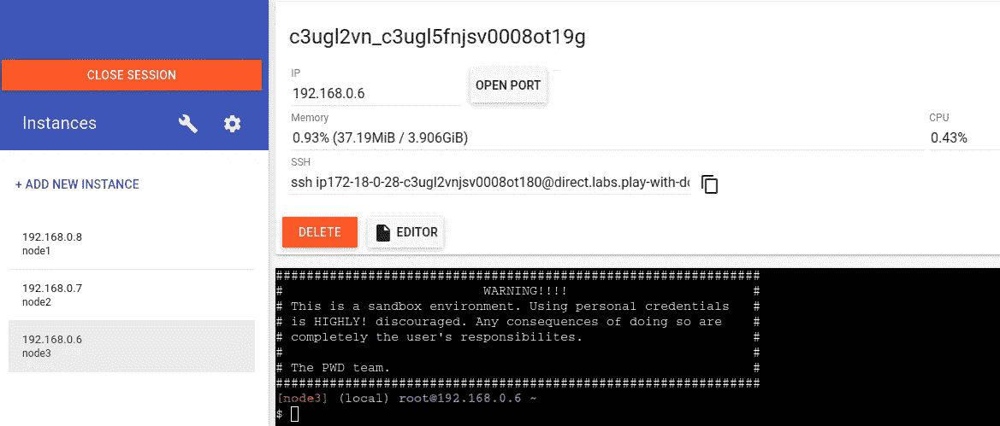
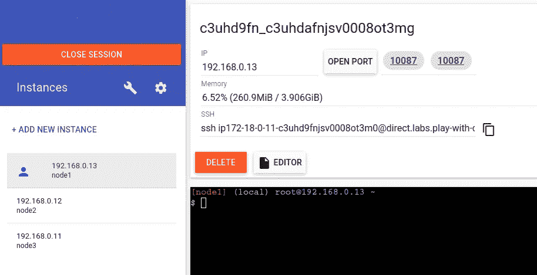
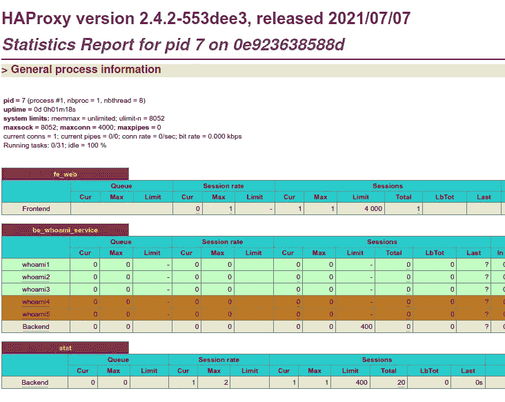
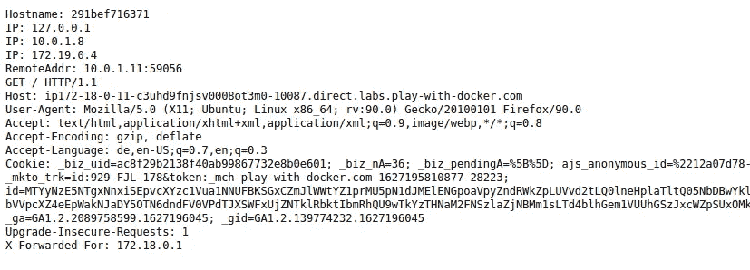

# Docker 群中使用公共 Play-with-Docker 操场的粘性负载均衡

> 原文：<https://itnext.io/sticky-load-balancing-in-docker-swarm-using-public-play-with-docker-playground-9899548365ed?source=collection_archive---------1----------------------->

## 使用 HAProxy 在 docker swarm 中设置定制负载平衡的实践演示


# 介绍

现代的**基于微服务的网络应用**通常被设计成**无状态**以便于**水平扩展**以适应流量负载。然而，许多 web 应用程序将状态信息存储在会话对象中，例如由唯一的 JSESSIONID 标识的 Java 会话。

当只有一个应用服务器实例，并且不涉及负载平衡器时，根本不存在任何问题，因为单个应用服务器知道所有用户的会话信息。相比之下，当使用几个横向扩展的应用服务器时，会发生用户向不知道其会话的服务器发送请求的情况。

通常这个问题是通过**中央会话存储**解决的，存储后端可能是一个数据库或**内存中的数据存储，如 Redis** 。然而，在现有的复杂系统中实现这样的解决方案，除了提供数据库或健壮的 redis 存储之外，需要在所有会话处理器中进行调整，以使用中央会话存储，这通常不是大问题。

如果没有时间或预算在架构中集成中央会话存储解决方案，该怎么办？那么，接下来就要找到一个基于粘性负载平衡的**替代 DevOps 解决方案**。

在本文中，我们将在基于 Docker Swarm 的容器平台中使用 HAProxy 检查**粘性负载平衡的解决方案。**

# **为什么是 HAProxy？**

正如我们所知，每个 [**docker 群**](https://docs.docker.com/engine/swarm/) **服务都使用 docker 的内部 DNS 组件作为其副本任务**的负载平衡器。可惜的是，**只有用 Docker Enterprise** 版才有官方的方式实现**粘性负载均衡**，否则**默认策略就是循环调度**。另一种可能性是使用 [**Traefik**](https://traefik.io/) ，它提供了配置粘性会话的功能，但我发现后端服务的**私有 IP 地址包含在 Traefik** 创建的 coockie 中，该地址可能会被修改和滥用，以向基础架构内的非预期后端服务发送请求。

# 让我们把手弄脏吧！

您可以在`[https://labs.play-with-docker.com/](https://labs.play-with-docker.com)`使用**公共可访问码头游乐场**来跟随示例。检查位于`[https://github.com/yandok/docker-swarm-sticky-load-balancing.git](https://github.com/yandok/docker-swarm-sticky-load-balancing)`的 **github-repository** ，它包含指令和 **docker 栈**——我们将用来部署我们的演示的文件。

## 1.初始化 Docker 集群

*   如果你还没有 **Docker-ID** ，在`[https://hub.docker.com/signup](https://hub.docker.com/singup)`注册，你将需要它才能使用免费的 Docker 游乐场。
*   登录 **docker playground** ，点击左侧面板上的“添加新实例”按钮，添加 3 个新实例，然后您应该会看到如下视图:



Docker 游乐场-添加 3 个新实例后的视图

*   选择左侧面板上的`node1`，使用`docker swarm init --advertise-addr $(hostname -i)`初始化群组主节点。这将生成一个输出，其中包含作为工作者节点加入群的命令。

```
docker swarm init --advertise-addr $(hostname -i)
Swarm initialized: current node (uwkrx412ir5z4tf2kvq6iecjk) is now a manager.To add a worker to this swarm, run the following command:**docker swarm join --token SWMTKN-1-0fic14zxca3jtvhe8smgkxj23j9liudtrrzcg3lnw0btt6jx32-40ua7piw3ydimqgkbwic0n2qp 192.168.0.8:2377**To add a manager to this swarm, run 'docker swarm join-token manager' and follow the instructions.
```

*   复制该命令，并在另外两个节点上执行。您现在应该有一个初始化的 docker-swarm 集群，由 1 个主节点和 2 个工作节点组成。通过在`node1`上输入`docker node ls`进行验证。

```
$ docker node ls
ID                            HOSTNAME   STATUS    AVAILABILITY   MANAGER STATUS   ENGINE VERSION
ymf3ja7z1j5kvksb362vgefms *   node1      Ready     Active         Leader           20.10.0
d9z62lmzc0x3n030hanspyuog     node2      Ready     Active                          20.10.0
owq20hfiyjy65um3dm05hmemb     node3      Ready     Active                          20.10.0
```

## 2.部署具有循环负载平衡的 HAProxy 反向代理

*   为了部署我们的 HAProxy 和后端容器，我们需要一个 **docker 覆盖网络**来连接容器。与**桥接网络**相反，桥接网络允许容器在同一主机上通信**(当使用 **docker-compose** 时的网络类型)——**覆盖网络**用于 docker 群集群中，以允许容器**在多个节点**上通信。通过在`node1`上发出`docker network create haproxy-network -d overlay --attachable`命令来完成。我们使用`-attachable`标志，让我们在创建后将独立的 docker-containers 连接到网络，例如，为了使用`[nicolaka/netshoot](https://hub.docker.com/r/nicolaka/netshoot)`-image 调试/排除网络连接故障。通过`docker network ls`验证网络已经创建。**

```
$ docker network ls
NETWORK ID     NAME              DRIVER    SCOPE
7273aed117f7   bridge            bridge    local
34c6ebc38466   docker_gwbridge   bridge    local
l2ubmbc3l6my   haproxy-network   overlay   swarm
66fec54a258d   host              host      local
wguoc8osl8q0   ingress           overlay   swarm
097ffdd6bf11   none              null      local
```

*   在`node1`上部署一个 haproxy-service，在端口`10087`的节点上公开 haproxy-listener-port。我们将使用 docker-stack 和 haproxy-configuration 定义的 git-repository 的`02-Load-Balancing/01-roundrobin`目录，其中包含以下文件:

```
02-Load-Balancing/01-roundrobin/
├── deploy-infra.yml
├── deploy-web.yml
└── haproxy.cfg
```

让我们快速浏览一下:

***deploy-infra . yml***

```
version: "3.6"

x-default-deploy: &default-deploy
  replicas: 1
  update_config:
    parallelism: 1
    delay: 10s
    order: stop-first

services:
  haproxy-service:
    image: haproxytech/haproxy-debian:latest
    deploy:
      <<: *default-deploy
      replicas: 1
 **placement:
        constraints: [node.hostname == node1]**
      resources:
        reservations:
          memory: 512m
        limits:
          memory: 512m
    logging:
      options:
        max-file: 3
        max-size: 10m
    dns: 127.0.0.11
 **networks:
      - haproxy-network
    ports:
      - target: 80
        published: 10087
        protocol: tcp
        mode: host**
    configs:
      - source: haproxy_config
        target: /etc/haproxy/haproxy.cfg
        mode: 0444

networks:
  haproxy-network:
    name:  haproxy-network
    external: true

configs:
  *# ROUNDROBIN* haproxy_config:
    file: ./haproxy.cfg
```

*   为了确保 haproxy-service 被安排在`node1`上，我们使用了一个位置约束——我们在主机(mode: host)的端口 10087 上发布 haproxy-listener-port 80，并将服务附加到`haproxy-network`。

***haproxy.cfg***

```
global
    log         fd@2 local2
    chroot      /var/lib/haproxy
    pidfile     /var/run/haproxy.pid
    maxconn     4000
    user        haproxy
    group       haproxy
    stats socket /var/lib/haproxy/stats expose-fd listeners
    master-worker

resolvers docker
    **nameserver dns1 127.0.0.11:53**
    resolve_retries 3
    timeout resolve 1s
    timeout retry   1s
    hold other      10s
    hold refused    10s
    hold nx         10s
    hold timeout    10s
    hold valid      10s
    hold obsolete   10s

defaults
    timeout connect 10s
    timeout client 30s
    timeout server 120s
    log global
    mode http
    option forwardfor

frontend  fe_web
    bind *:80

    acl host_main hdr(host) -i <host-node1>-10087.direct.labs.play-with-docker.com

    use_backend stat if { path -i /my-stats }

    use_backend be_whoami_service if host_main

**backend be_whoami_service
    balance roundrobin
    server-template whoami 5 tasks.whoami:80 check resolvers docker       init-addr none**

backend stat
    stats enable
    stats uri /my-stats
    stats refresh 5s
    stats show-legends
    stats show-node
```

*   haproxy 配置包含端口 80 上的监听器和后端服务的定义`be_whoami_service`。HAProxy 使用`server-template` —指令和 docker-internal DNS-server 127 . 0 . 0 . 11 动态解析 haproxy-service 的任务。
*   确保将`haproxy.cfg`的`host_main`的 acl 中的域名适配到您的 docker-playground-host 的自动生成的主机 url。

***deploy-web . yml***

```
version: "3.6"

services:
  whoami:
    image: "traefik/whoami"
    deploy:
      replicas: 1
 **endpoint_mode: dnsrr**
    networks:
      - haproxy-network

networks:
  haproxy-network:
    name:  haproxy-network
    external: true
```

*   后端服务由使用`traefik/whomai` -image 的任务组成，它通常显示关于主机的一些信息，如主机名和 IP 地址。
*   为了绕过 docker 群路由网格，我们定义了**端点 _ 模式 dnsrr** 。Docker 为服务设置了 DNS 条目，这样对服务名称的 DNS 查询会返回一个 IP 地址列表，客户端直接连接到其中一个地址。([https://docs . docker . com/engine/swarm/ingress/# without-the-routing-mesh](https://docs.docker.com/engine/swarm/ingress/#without-the-routing-mesh)

阐明演示设置的配置后，让我们部署它。

*   `docker stack deploy -c deploy-infra.yml infra`在`node1`部署 haproxy 服务。
*   您将会看到发布的端口会在 docker-playground UI 上弹出一个链接按钮



docker-playground-UI 上已发布端口的弹出链接按钮

*   点击 10087 链接按钮进入`<host-node1>-10087.direct.labs.play-with-docker.com/my-stats`的 haproxy-stats 页面。
*   在`docker stack deploy -c deploy-web.yml web`之前部署 whoami 服务。
*   将 whoami 服务扩展到 3 个副本:`docker service scale web_whoami=3`
*   在 haproxy-stats-page 上观察 haproxy 将如何动态解析服务任务并将它们添加到它的配置中。



将 web _ whoami 服务扩展到 3 个副本后的 HAProxy 统计页面

*   在`<host-node1>-10087.direct.labs.play-with-docker.com`访问 whoami 服务器并多次重新加载页面。



whoami 网络服务器的响应

*   我们看到我们的请求与循环策略是平衡的，因为我们每次都到达不同的 whoami 服务任务。

## 3.部署具有粘性负载平衡的 HAProxy 反向代理

*   现在，我们将看看如何配置 HAProxy 以使用粘性负载平衡——我们将使用 git-repository 的`02-Load-Balancing/02-` sticky -directory 中定义的 docker-stack 和 haproxy-configuration，它包含以下文件:

```
02-Load-Balancing/02-sticky/
├── deploy-infra-sticky.yml
├── deploy-web-sticky.yml
└── haproxy-sticky.cfg
```

*   与循环演示相反，haproxy-service 安排在`node2`上，haproxy-port 暴露在主机端口 10088 上。
*   为了给 haproxy 配置粘性负载平衡，请仔细查看 haproxy-sticky.cfg:

```
backend be_whoami_service
    balance roundrobin
 **dynamic-cookie-key njqWdVKWfG
    cookie SRVID insert dynamic
    server-template whoamisticky 5 tasks.whoamisticky:80 check resolvers docker init-addr none**
```

*   使用指令`dynamic-coockie-key`和`coockie SRVID insert dynamic`，HAProxy 将在用户代理发送的第一个响应中插入一个`SRVID` — cookie，并每次引导我们执行相同的后端 whoami 任务。
*   为了部署这个演示，**遵循上一节**中的过程——基本上是相同的——来自 git-repository 的 README.md 再次包含了如何做的详细说明。
*   安装一个 chrome-extension**" CoockieManger "**([https://chrome . Google . com/web store/detail/cookiemanager-cookie-edit/hdhngoamekjhmnpenphenpaiindoippo？hl=en](https://chrome.google.com/webstore/detail/cookiemanager-cookie-edit/hdhngoamekjhmnpenphenpaiindoinpo?hl=en) ，删除`SRVID` — cookie 并重新加载页面。您将看到另一个后端任务已经被选择，多次重新加载再次导致相同的后端任务，这验证了粘性负载平衡的工作。

我希望您喜欢使用公共的免费 play-with-docker playground 定制默认 docker 群负载平衡机制的实践演示。

敬请期待！

**资源**

[](https://github.com/yandok/docker-swarm-sticky-load-balancing) [## GitHub-yandok/docker-swarm-sticky-load-balancing:演示粘性负载平衡的示例…

### 在 docker swarm-GitHub-yandok/docker-swarm-sticky-load-balancing 上演示粘性负载平衡的示例…

github.com](https://github.com/yandok/docker-swarm-sticky-load-balancing) [](https://www.haproxy.com/de/blog/haproxy-on-docker-swarm-load-balancing-and-dns-service-discovery/) [## Docker Swarm 上的 HAProxy:负载平衡和 DNS 服务发现- HAProxy 技术

### Docker Swarm 让你扩展到在一台机器上托管 Docker 容器之外。它监管服务器集群，并…

www.haproxy.com](https://www.haproxy.com/de/blog/haproxy-on-docker-swarm-load-balancing-and-dns-service-discovery/) [](https://www.haproxy.com/blog/dns-service-discovery-haproxy/) [## 用于 HAProxy - HAProxy 技术中的服务发现的 DNS

### HAProxy 1.8 和更新版本允许您使用 DNS 服务发现来检测服务器更改，并自动将它们应用到…

www.haproxy.com](https://www.haproxy.com/blog/dns-service-discovery-haproxy/) [](https://labs.play-with-docker.com/) [## 和 Docker 一起玩

### 与 Docker (PWD)一起玩是一个由 Marcos Liljedhal 和 Jonathan Leibiusky 开发的项目，由 PWD Docker 公司赞助…

labs.play-with-docker.com](https://labs.play-with-docker.com/)