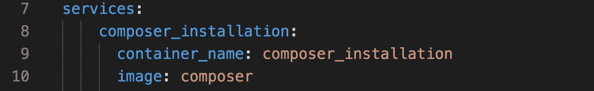
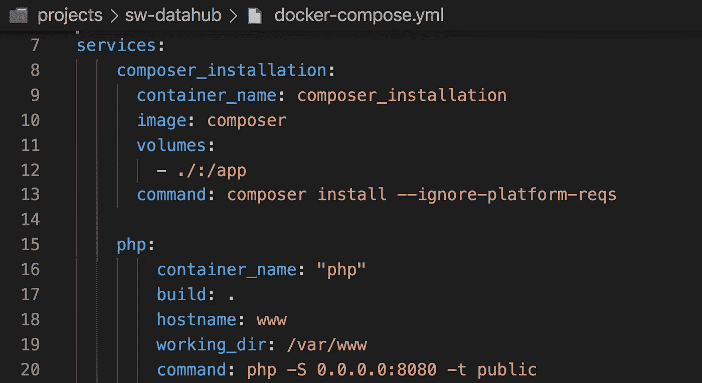

# 2021 年还在设置本地服务器？见见码头工人。

> 原文：<https://itnext.io/still-setting-up-local-servers-in-2021-meet-docker-c832d79c962?source=collection_archive---------1----------------------->

2021 年，你还在使用 XAMPP 或其他本地网络服务器吗？继续读下去，找出为什么你现在应该停止这样做。有一种更好的方法来设置您的环境。这是前进的方向。


在本文中，我们将介绍 Docker 并展示如何为 PHP 设置 Docker。虽然我们的示例展示了一个 PHP 服务器，但这种方法适用于大多数(如果不是所有)服务器，比如 NodeJS、Java、C#等。

# 我的本地 web 服务器有什么问题？

当然，XAMPP 或任何其他本地 web 服务器本身就是一个有用的工具箱，允许你在你的机器上轻松运行 PHP 服务器。虽然有多个问题，让我们看看下面。

*   需要在每台机器上安装一个本地 web 服务器

**没错，你必须**手动**在**每台**机器上安装你的本地网络服务器，而每台机器都应该有相同的配置。**

*   **本地 web 服务器**只支持一个 web 服务器**配置**

**如果你需要更多的配置，你必须安装和运行**多个本地 web 服务器配置和实例**。考虑到这是一个手动设置，这一点都不好玩。**

*   **本地服务器设置**没有保存在您的代码库中****

**没错，如果你丢失了你的配置，你将不得不从头再来。**

*   ****手动数据库设置****

**您是否正在将您的 PHP 应用程序安装到另一台服务器上？您还必须重新进行整个数据库的设置和准备。有更好的方法。**

*   ****手动升级****

**在本地 web 服务器上升级 PHP 版本是一项人工工作。这能不更快吗？**

*   **对于本地服务器，**新开发人员需要向**询问设置或阅读文档**

**难道不应该有一种只需点击一下就能在本地设置环境的方法，从而为每个人节省时间吗？**

**所有这些问题都有解决方案。那是码头集装箱。**

**如果您正在处理小型原型，并且这些问题似乎都不可识别，那么您在本地服务器设置上工作会更好。如果没有，请继续阅读，了解我们如何一起解决这些问题并继续前进。**

# **Docker 是什么？它是做什么的？**

**Docker 允许您以一致的方式运行您的应用程序。配置一次，随时随地运行。开发人员编写简单的配置文件，指导 Docker 如何启动应用程序。在幕后，Docker 旋转虚拟容器，这是可以在你的机器上独立运行的轻量级软件镜像。**

****

**典型的 Docker 配置文件**

**这些配置文件被提交到代码库中。新开发人员只需克隆存储库并运行 Docker。瞧，服务器会自动启动，并带有所有必需的依赖项。**

**您还记得必须运行 composer install、在本地设置数据库、填充表、设置配置文件等等吗？那都是过去的事了。**

**相反，我们可以在 Docker 中编写一个脚本，首先安装所需的 composer 依赖项，运行 MySQL 服务器，自动插入来自预先存在的 SQL 文件的数据库数据，最后运行 PHP 服务器。只需一次简单的点击，这一切就能完成。新开发人员甚至不需要知道它是如何运行的，它就是工作。我们将在本文的下一节讨论这个问题。**

**Docker 容器本身于 2013 年出现，但在实践中，有很多开发人员还不知道如何使用它们。让我们在 2021 年左右改变这种情况，并为正确的应用程序设置欢呼吧！虽然 Docker 配置会占用一些时间，但从长远来看，在许多情况下这是值得的。设置 Docker 配置也非常有趣。令人高兴的是，看到它们运行起来是多么容易，以及将来您将节省多少时间。在科技界，效率是王道。**

# **Docker 图像**

**首先，我们需要了解*图片*的概念。Docker 与软件的*映像*一起工作，这些映像与*虚拟机映像*类似，但不包含完整的操作系统(占用空间，使其与轻量级相反)，映像只包含软件。**

**[*Docker Hub*](https://hub.docker.com/) 包含了很多免费使用的镜像，比如 php 服务器等等。如果我们要搜索 [*php*](https://hub.docker.com/_/php) ，我们会发现很多不同的 php 图片可以使用，比如 *php-8-alpine* (是 PHP 8 的轻量级版本)等等。**

**所有这些图像都可以在您的配置中使用。设置一个 php-8 和 mysql 服务器？在您的配置中使用这两个映像。想用 php-7 测试你的应用程序吗？只需在配置文件中切换 php 版本，真的很简单。**

**既然你已经理解了我们为什么需要 Docker，它是做什么的，它是如何工作的，让我们直接进入代码吧！**

# **Docker 配置文件的类型**

**Docker 通常有三个配置文件。让我们回顾一下这些是如何工作的。**

*   **docker-compose.yml**
*   **Dockerfile 文件**
*   **。dockerignore**

## **docker-compose.yml**

**这个文件指示 Docker，哪些服务需要运行，以及如何运行。例如，如果我们需要一个 PHP 和 MySQL 服务器，我们需要定义一个名为 *php* 的服务和另一个名为 *mysql* 的服务。**

****

**docker-compose.yml 文件示例**

**然后，我们可以配置一些运行选项。如果服务关闭，是否应该重新启动？它应该在哪个端口上运行？PHP 服务器的根文件夹是什么？**

## **Dockerfile 文件**

**Docker 文件使您能够创建自己的 Docker 软件映像。例如，默认的 php-8-alpine 不包括 PDO、MySQL 或 ZipArchive 类。为了给 php 映像添加这个功能，我们需要创建自己的 docker 映像。**

## **。dockerignore**

**此文件允许您定义哪些本地文件不应该复制到您的 Docker 映像。它帮助你使构建更加轻量级和快速。**

**这三个文件: *docker-compose.yml* 、 *Dockerfile、*和*。dockerignore* 对你的 Docker 设置至关重要。确保在代码库中提交并安全地存储这些内容。**

**在下一节中，我们将看看如何使用 docker-compose.yml 配置文件来设置 Docker。在我们的下一篇文章中，我们将深入创建一个定制的 Docker 图像，以获得更多的定制选项。**

# **在 Docker 中设置一个简单的 php 服务器**

**在我们继续之前，请确保将 [*Docker 桌面*](https://www.docker.com/get-started) 下载并安装到您的机器上。**

**让我们在新文件夹中创建一个新项目。姑且称之，简单——PHP。让我们创建一个示例*index.php*文件。**

```
mkdir simple-php && cd simple-php
touch index.php
```

**添加以下*index.php*文件内容**

```
<?php echo "Hello Docker!";
```

**现在，我们想在 PHP 8 服务器上运行它。让我们在 [*Docker Hub*](https://hub.docker.com/) 上找到一个合适的图像。通过搜索 php，我们可以找到 *php* Docker 图片。这个图像有多个标签，比如 8-alpine，表示版本 8，还有轻量级 alpine 版本。这正是我们所需要的。标签可以用冒号加在图像名后面。**

```
php:8-alpine
```

**让我们建立一个 *docker-compose.yml* 文件，并使用 *php:8-alpine* 图像。**

```
# Create the docker-compose.yml file
touch docker-compose.yml# Let's enter the contents for the docker-compose file below:**# First, indicate the** [**version of Docker compose**](https://docs.docker.com/compose/compose-file/) **we want to use**
version: '3'**# Create a section for all the services/images we need**
services:
    **# Create a PHP service, call it however you'd like**
    php:
        **# Optionally, choose a container name**
        container_name: "php" **# Select the Docker image to use for this service**
        image: "php:8-alpine"

 **# Set up to automatically restart in case the container goes down**
        restart: always **# Map your local PC port** to the container's port, so you can get access to the container this way
 **# Format local:docker**
        ports:
            - 8080:8080 **# The command to be run**, this command sets up a local PHP development server on port 8080
        command: php -S 0.0.0.0:8080 **# Select which files** should be copied over to the PHP server
        volumes:
            - .:/var/www **# Set up hostname and file locations inside the image**
        hostname: "www"
        working_dir: "/var/www"
```

**现在，让我们通过让 Docker 发挥它的魔力来运行服务器！**

```
**$ docker-compose up**Creating network "app_default" with the default driver
Pulling php (php:8-alpine)...
8-alpine: Pulling from library/php
596ba82af5aa: Pull complete
af74f285bb27: Pull complete
2ab8440e5667: Pull complete
64889fa545ec: Pull complete
94168e648735: Pull complete
3898f14298ef: Pull complete
c3747e5f2167: Pull complete
7c3df0f80888: Pull complete
e1f6ddeaf0bd: Pull complete
Digest: sha256:0a4250b174dc6a1f1949f48b2ac56c9a5491a8329d0dc9b139668a968da0bdc7
Status: Downloaded newer image for php:8-alpine
Creating php ... done
Attaching to php
php    | PHP 8.0.1 Development Server ([http://0.0.0.0:8080](http://0.0.0.0:8080)) started
```

**如果您随后浏览到[*http://localhost:8080/*](http://localhost:8080/)您应该能够发现您的 Docker 服务正在运行。**

****

**非常好的是，PHP 服务器将像任何常规的 PHP 服务器一样工作。如果您更改了项目目录中的任何文件(如 docker-compose.yml 的 volumes 部分中所定义的)，这些更改将会自动反映出来。这是因为 Docker 使用一种符号链接指向卷中定义的文件夹。**

**通过添加 *-d* 参数，您还可以选择在后台运行 docker 服务。**

```
**$ docker-compose up *-d***
Creating network "app_default" with the default driver
Creating php ... done
```

**如果您希望关闭它，可以运行下面的命令。**

```
**$ docker-compose down**
Stopping php ... done
Removing php ... done
Removing network app_default
```

**现在，尝试将它安装到另一台机器上。只需克隆您的存储库，然后运行**

```
$ docker-compose up
```

**瞧，您的应用程序完全运行，完全可移植，不需要任何本地服务器。多棒啊。**

**注意，在这个例子中，我们通过使用 PHP 的本地 web 服务器功能(而不是必须配置 apache/nginx)使它变得简单。这对于开发服务器来说很好，并且节省了我们一些配置。但是，如果您希望使用相同的 docker 配置将容器部署到生产环境中，请确保使用 apache 或另一个 web 服务器进行设置。请随意尝试使用 apache 来设置它。我们将在下一篇文章中讨论这个问题。**

# **下一步是什么？**

**现在您已经了解了如何使用 Docker 设置一个简单的服务器，尝试为 MySQL 服务器添加第二个服务。转到 Docker Hub，找到合适的映像和配置，并进行设置。**

**在我们的下一篇文章中，我们将指导您完成将 MySQL 设置添加到当前配置的过程，以及自动将数据添加到 MySQL 服务器并自动运行 composer install。**

# **概述**

**我们已经看到码头集装箱有很多优点**

*   **便携式设置，环境备份在配置文件中**
*   **一个命令就可以启动并运行整个应用程序。)**
*   **不需要任何本地配置，除了安装 Docker**
*   **新开发人员可以立即开始工作，不必花费太多时间在本地设置环境**
*   **坚固的设置。对于本地服务器，它总是会由于配置或其他原因而中断。有了容器，你可以简单地重启 Docker。**

**还有更多优势，有些我们还没看到。举个例子，**

*   **可以部署本地运行的 docker 映像，保证部署的环境将与您的本地环境行为相同。**
*   **这同样适用于与您的开发伙伴共享软件映像的特定版本，他们应该能够重现相同的行为。**

**我们还看到了 Docker 如何使用三个重要的配置文件。**

*   **docker-compose.yml(我们曾经用它一起建立了一个 php 服务器)**
*   **Dockerfile(将在我们的下一篇文章中用于设置)**
*   **。dockerignore(也将在我们的下一篇文章中使用)**

**最后，我们一起搭建了一个本地 Docker 容器开发的 php 服务器。**

**不要忘记，尝试将 MySQL 设置为一个额外的服务，我们将在下一篇文章中再次见面，向您展示如何做到这一点，同时还有一些额外的功能，如自动填充 SQL 数据。**

# **下一步是什么？**

**虽然 Docker 自 2013 年就已经存在，但它是 2021 年配置环境的一个非常可靠的选择，无论是用于本地开发还是生产部署。**

**有些替代方案是存在的，比如 Kubernetes，我们将在 Docker 文章系列完成后讨论它。**

**请在评论中告诉我们，你对 Docker 有什么看法？设置简单吗？现在运行你的 php 服务器有多容易？我们很想知道，请给我们展示你的作品！**

**[订阅我的媒介](https://kevinvr.medium.com/membership)到**解锁** **所有** **文章**。通过使用我的链接订阅，你是支持我的工作，没有额外的费用。你会得到我永远的感激。**