# 使用 KubeSphere 拼接 Kubernetes、Jenkins、SonarQube 和 GitHub

> 原文：<https://itnext.io/stitching-kubernetes-jenkins-sonarqube-and-github-using-kubesphere-567ee413f8dd?source=collection_archive---------2----------------------->

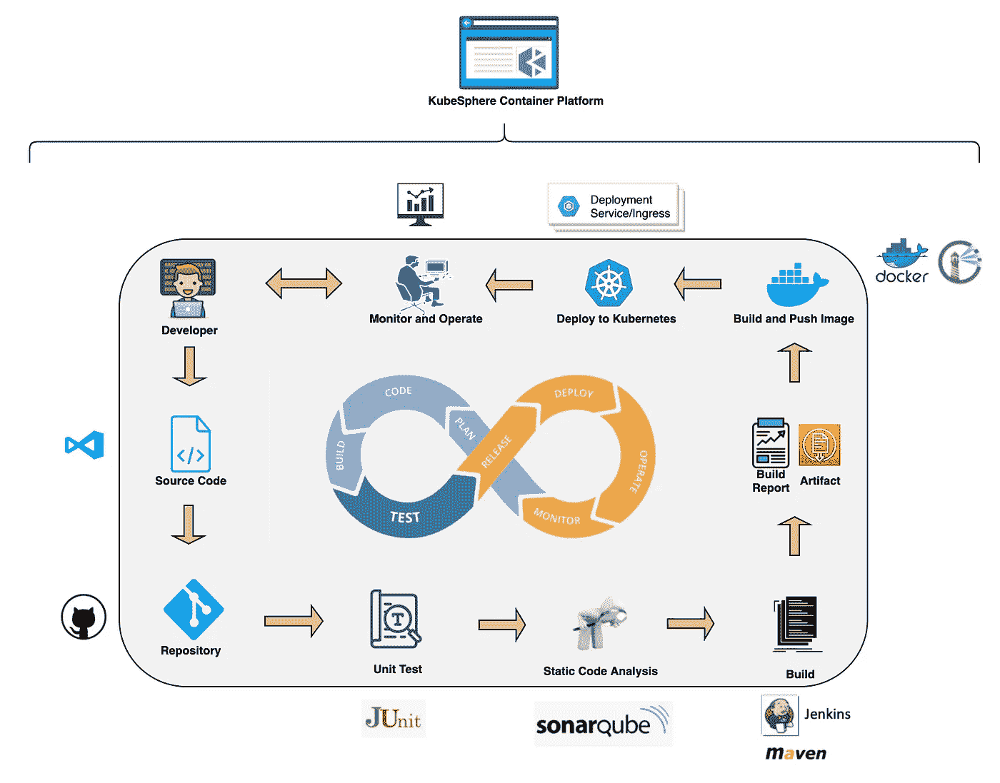

KubeSphere DevOps 工作流程

在本教程中，我们将向您展示如何从 GitHub 存储库中基于 Jenkinsfile 创建 CI/CD 管道。我们使用 [KubeSphere Contain 平台](https://github.com/kubesphere/kubesphere)来实现这个工作流。使用管道，我们将把 SpringBoot 应用程序分别部署到开发环境和生产环境中。

同时，我们将演示一个用于测试依赖缓存能力的分支。在这个演示中，第一次完成管道需要相对较长的时间。但是，从那以后它跑得非常快。它证明了缓存工作良好，因为这个分支最初从互联网拉了很多依赖。

> *注:*
> 
> *KubeSphere 支持两种管道，即本文介绍的 SCM 中的 Jenkinsfile 和 SCM 外的*[***Jenkins file***](https://kubesphere.io/docs/quick-start/jenkinsfile-out-of-scm)*。SCM 中的 Jenkinsfile 需要源代码管理(SCM)中的内部 Jenkinsfile。换句话说，Jenkfinsfile 是 SCM 的一部分。KubeSphere DevOps 系统将根据代码库现有的 Jenkinsfile 自动构建 CI/CD 管道。您可以定义工作流，如管道中的阶段、步骤和作业。*

# 先决条件

*   您需要 [**启用 KubeSphere DevOps 系统**](https://kubesphere.io/docs/installation/install-devops) 。
*   您需要有一个 DokcerHub 帐户和一个 GitHub 帐户。
*   您需要创建一个工作区、一个 DevOps 项目和一个项目常规用户帐户，并且需要邀请该帐户加入 DevOps 项目，请参见 [**多租户管理入门**](https://kubesphere.io/docs/quick-start/admin-quick-start) 。
*   为构建管道设置 CI 专用节点，请参见 [**为依赖缓存设置 CI 节点**](https://kubesphere.io/docs/devops/devops-ci-node) 。

# 管道概述

在将要演示的管道中有八个阶段，如下所示。

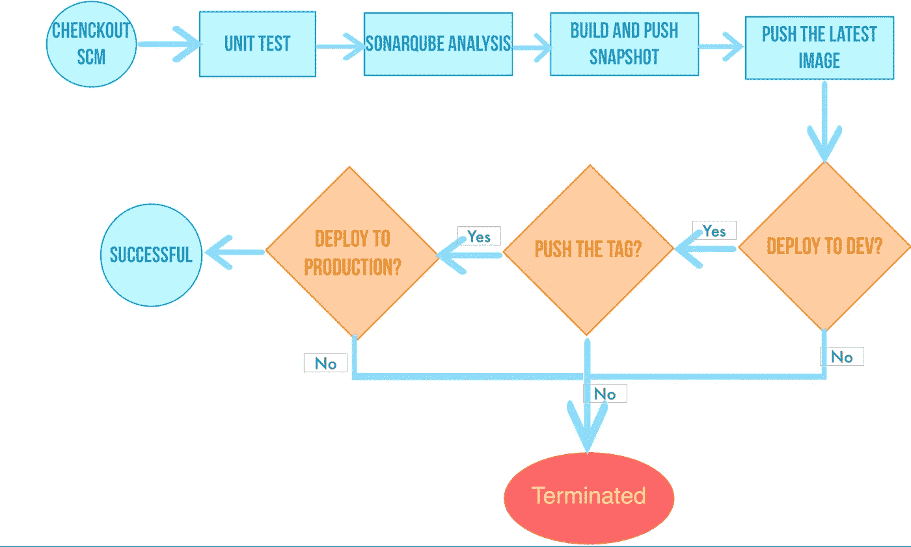

> *注:*

*   第一阶段。签出 SCM:从 GitHub 库签出源代码。
*   第二阶段。单元测试:单元测试通过后，继续执行下一阶段。
*   第三阶段。sonar cube 分析:处理 sonar cube 代码质量分析。
*   第四阶段。构建和推送快照映像:基于行为策略中选择的分支构建映像。将`SNAPSHOT-$BRANCH_NAME-$BUILD_NUMBER`标签推送到 DockerHub，其中`$BUILD_NUMBER`是流水线活动列表中的操作序列号。
*   第五阶段。推送最新图像:将主分支标记为最新，并将其推送到 DockerHub。
*   第六阶段。部署到开发环境:将主分支部署到开发环境。这个阶段需要验证。
*   第七阶段。带标签的推送:生成标签并发布到 GitHub。然后将标签推送到 DockerHub。
*   第八阶段。部署到生产环境:将发布的标签部署到生产环境中。

# 动手实验

# 步骤 1:创建凭据

> *注意:如果您的账户或密码中有特殊字符，请使用*[***【https://www.urlencoder.org/】***](https://www.urlencoder.org/)*进行编码，然后将编码结果粘贴到下面的凭证中。*

1.1.使用`project-regular`账号登录 KubeSphere，进入已创建的 DevOps 项目，在项目管理→凭证下创建以下三个凭证:

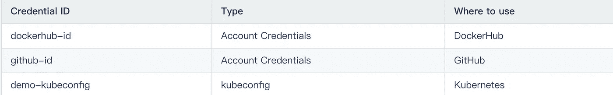

1.2.我们需要为 sonar cube 令牌创建一个额外的凭证`sonar-token`，它在上面提到的阶段 3(sonar cube 分析)中使用。参考 [**访问 SonarQube 控制台并创建令牌**](https://kubesphere.io/docs/installation/install-sonarqube) 复制令牌并粘贴到此处。然后按确定按钮。

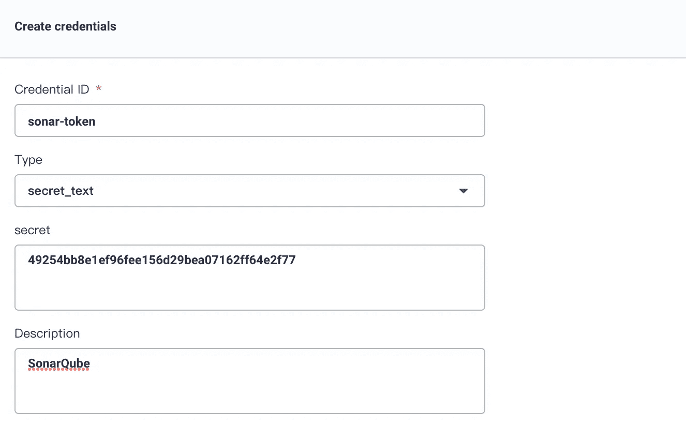

在这一步中，我们总共创建了四个凭证。

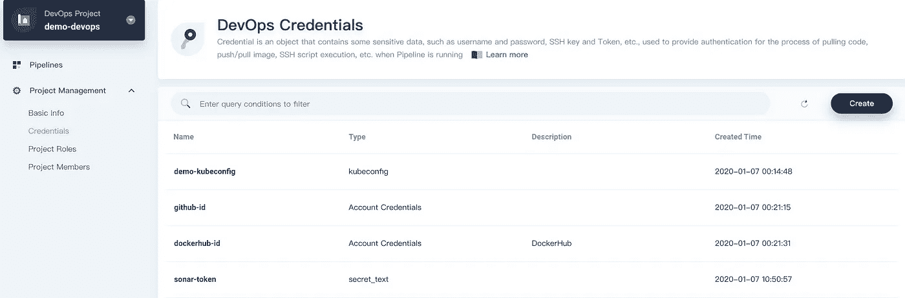

# 步骤 2:修改存储库中的 Jenkinsfile

## 分叉项目

登录 GitHub。将 GitHub 资源库中的[**devo PS-Java-sample**](https://github.com/kubesphere/devops-java-sample)分支到您自己的 GitHub 中。

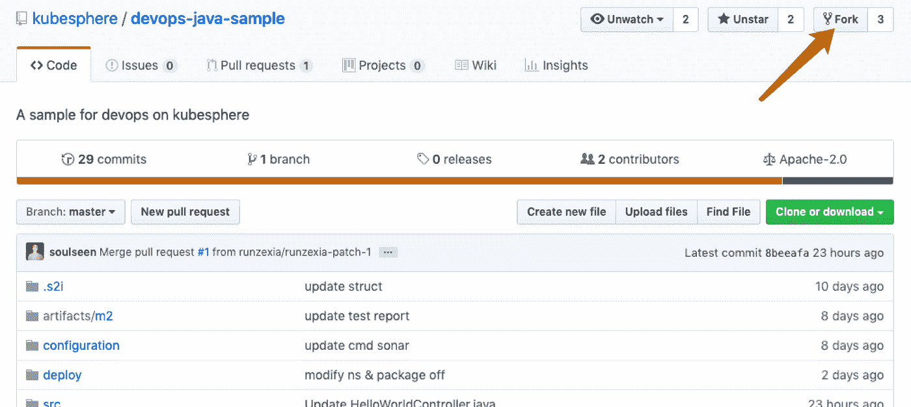

## 编辑 Jenkinsfile

2.1.将存储库分叉到您自己的 GitHub 之后，打开根目录下的文件 Jenkinsfile-online。

2.2.在 GitHub UI 中点击编辑图标，编辑环境变量的值。

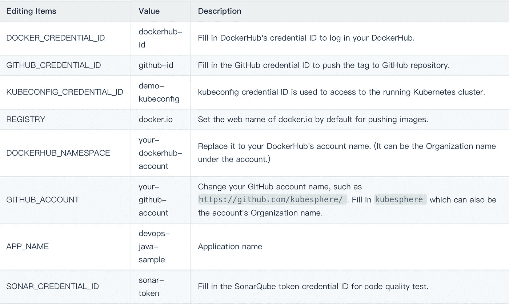

> 注意:Jenkinsfile 的`mvn`命令参数`-o`表示离线模式开启。本教程下载了相关的依赖项，以节省时间并适应特定环境下的网络干扰。默认情况下，脱机模式是打开的。

2.3.编辑完环境变量后，单击 GitHub 页面顶部的 Commit changes，然后将更新提交到主分支。

# 步骤 3:创建项目

在这一步中，我们将创建两个项目，即`kubesphere-sample-dev`和`kubesphere-sample-prod`，分别是开发环境和生产环境。

## 创建第一个项目

> *提示:账户* `*project-admin*` *应提前创建，因为它被用作 CI/CD 管道的审核人。*

3.1.使用账号`project-admin`登录 KubeSphere。单击“创建”按钮，然后选择“创建资源项目”。填写项目的基本信息。完成后单击下一步。

*   姓名:`kubesphere-sample-dev`。
*   别名:`development environment`。

3.2.保留高级设置的默认值。单击创建。

3.3.现在邀请`project-regular`用户加入`kubesphere-sample-dev`。选择项目设置→项目成员。点击邀请成员以邀请`project-regular`，并授予该帐户`operator`的角色。

## 创建第二个项目

类似地，按照上面的步骤创建一个名为`kubesphere-sample-prod`的项目。这个项目是生产环境。然后邀请`project-regular`加入`kubesphere-sample-prod`的项目，并授予其`operator`的角色。

> *注:CI/CD 管道成功时。您将看到演示应用程序的部署和服务已经分别部署到* `*kubesphere-sample-dev*` *和* `*kubesphere-sample-prod.*` *中。*

# 步骤 4:创建管道

## 填写基本信息

4.1.将登录用户切换到`project-regular`。进入 DevOps 项目`demo-devops`。按一下「建立」( Create)来建立新的管线。

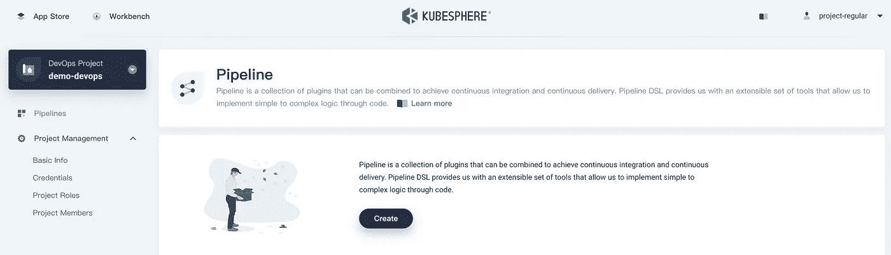

4.2.在弹出窗口中填写管道的基本信息，命名为`jenkinsfile-in-scm`，点击代码库。

## 添加存储库

4.3.如果您没有 GitHub 令牌，请单击“获取令牌”来生成新的 GitHub 令牌。然后将令牌粘贴到编辑框中。

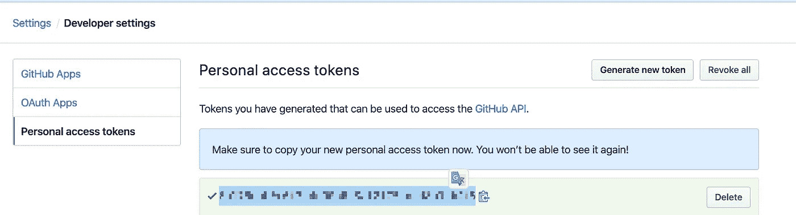

4.4.点击确认，选择你的账户。与该令牌相关的所有代码库将在右侧列出。选择 devops-java-sample 并单击选择此存储库，然后单击下一步。

## 高级设置

现在我们在高级设置页面。

4.5.在行为策略上，KubeSphere pipeline 默认设置了三种策略。由于本演示没有应用从 Forks 发现 PR 的策略，因此可以删除该策略。

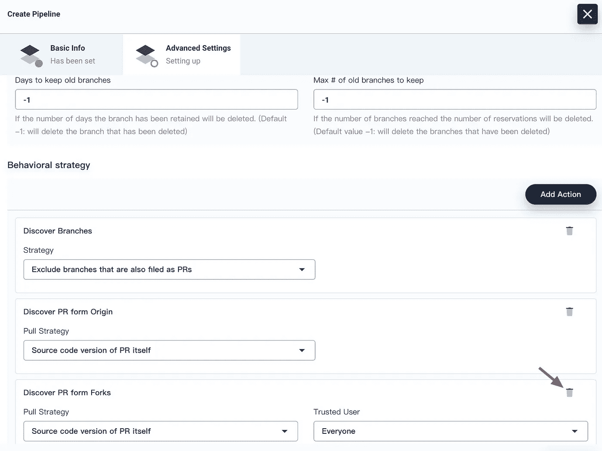

4.6.默认情况下，路径是 Jenkinsfile。请将其更改为`Jenkinsfile-online`，这是位于根目录的存储库中的 Jenkinsfile 的文件名。


> *注意:脚本路径是代码库中的 Jenkinsfile 路径。它表示存储库的根目录。如果文件位置改变，脚本路径也应该改变。*

4.7.可以根据团队的开发偏好定制扫描回购触发器。我们将其设置为`5 minutes`。完成高级设置后，单击创建。

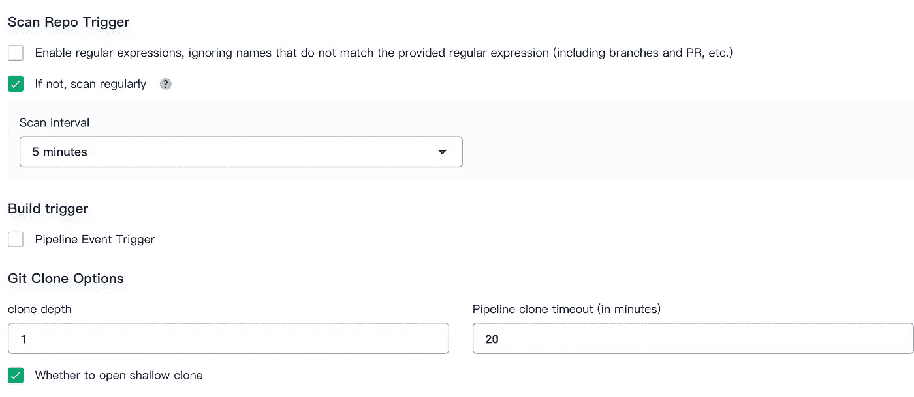

## 运行管道

手动刷新浏览器或者你可能需要点击`Scan Repository`，然后你可以找到两个被触发的活动。或者您可能希望按照以下说明手动触发它们。

4.8.单击右侧的运行。根据行为策略，它将加载具有 Jenkinsfile 的分支。只保留默认分支`master`。因为在 Jenkinsfile 文件中没有默认值，所以在 TAG_NAME 中放入一个标记号，比如`v0.0.1`。单击确定触发新的活动。

> *注意:TAG_NAME 用于在 GitHub 和 DockerHub 中生成带有 TAG 的 release 和 images。请注意* `*TAG_NAME*` *不要重复代码库中已有的* `*tag*` *名称。否则管道不能运行。*

此时，主分支的管道正在运行。

> *注:点击分支切换到分支列表，查看哪些分支正在运行。这里的分支是由行为策略决定的。*

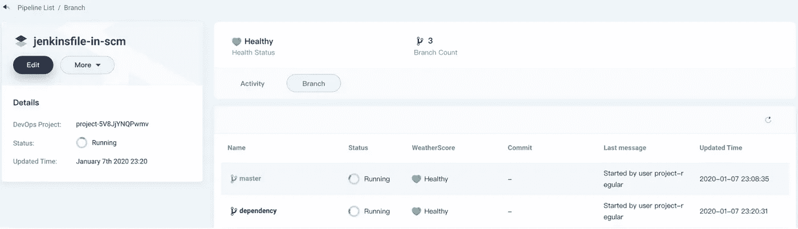

## 审核渠道

当流水线运行到`input`步时，它将暂停。您需要手动点按“继续”。请注意，在 Jenkinsfile-online 中定义了三个阶段。因此，在`deploy to dev, push with tag, deploy to production`的三个阶段中，将对管道进行三次审查。

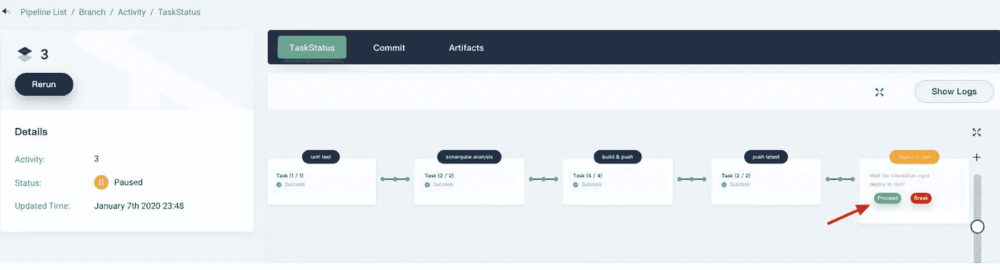

```
···
input(id: 'release-image-with-tag', message: 'release image with tag?', submitter: 'project-admin,project-admin1')
···
```

# 步骤 5:检查管道状态

5.1.点击进入活动→主→任务状态，可以看到流水线运行状态。请注意，当创建刚刚完成时，管道将持续初始化几分钟。样本管道中有八个阶段，它们已在[**Jenkins file-online**](https://github.com/kubesphere/devops-java-sample/blob/master/Jenkinsfile-online)中分别定义。

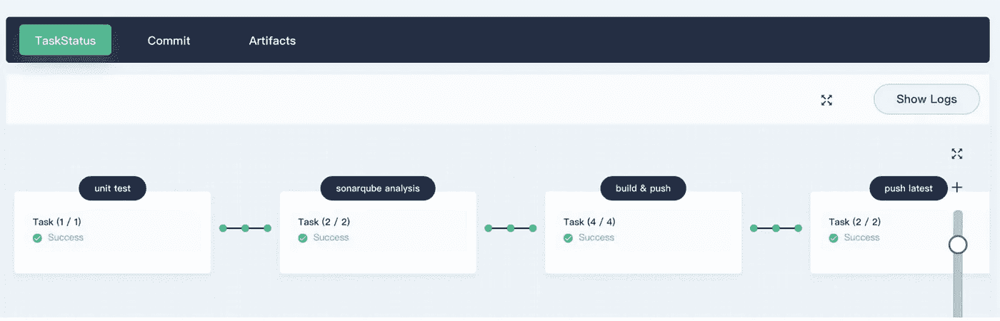

5.2.通过单击右上角的显示日志来检查管道运行日志。该页面显示动态日志输出、运行状态和时间等。

对于每个步骤，单击左侧的特定阶段以检查日志。可以将日志下载到本地以供进一步分析。

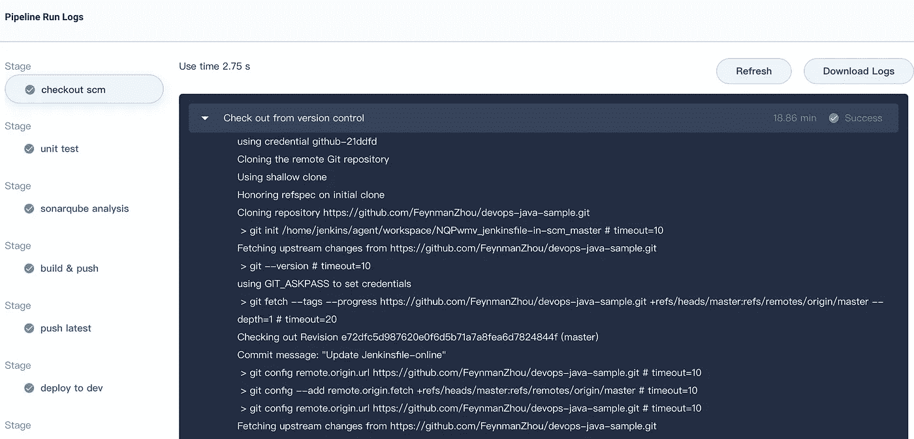

# 步骤 6:验证管道运行结果

6.1.成功执行管道后，点击`Code Quality`通过 SonarQube 检查结果如下(仅供参考)。

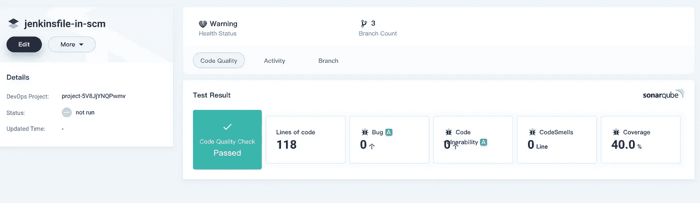

6.2.由于我们在 Jenkinsfile-online 中定义了`push to DockerHub` stage，管道构建的 Docker 映像已经成功推送到 DockerHub。在 DockerHub 中，您会发现我们在运行管道之前配置的标签为 v0.0.1 的图像，您还会发现标签为`SNAPSHOT-master-6`(快照-分支-序列号)和`latest`的图像已被推送到 DockerHub。

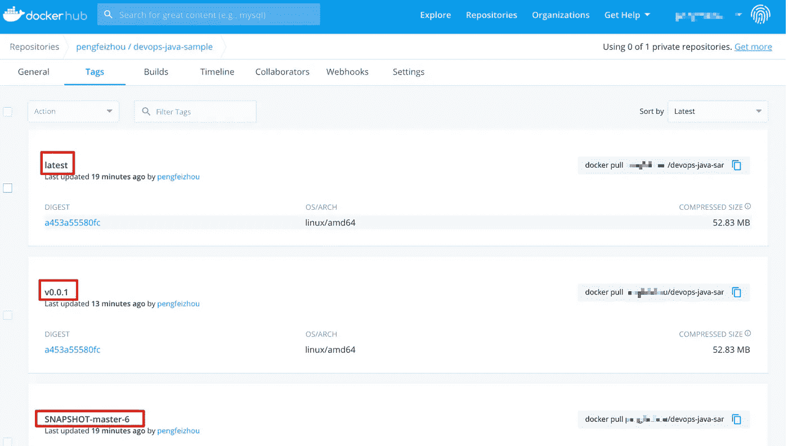

与此同时，GitHub 中已经生成了一个新标签和一个新版本。

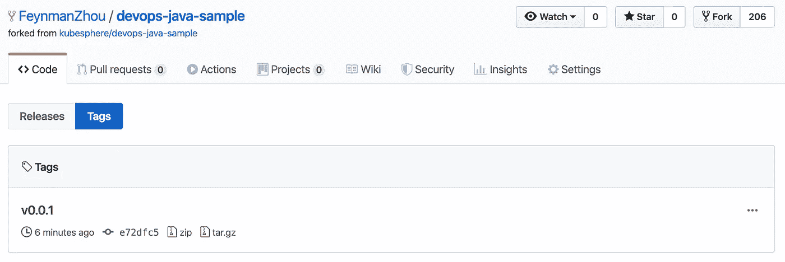

示例应用程序将作为部署和服务部署到`kubesphere-sample-dev`和`kubesphere-sample-prod`。

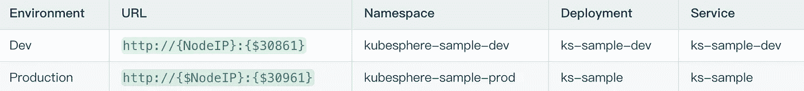

6.3.进入这两个项目，你会发现应用程序的资源已经成功地部署到 Kubernetes。例如，让我们验证项目`kubesphere-sample-dev`下的部署和服务:

## 部署

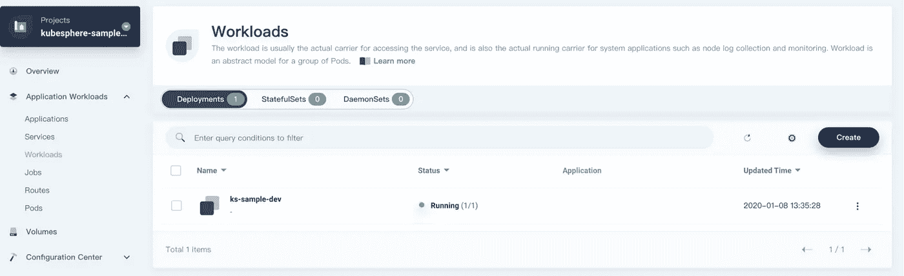

## 服务

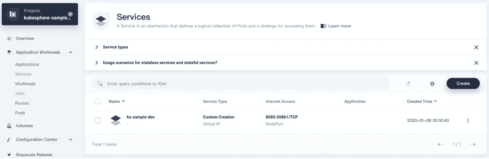

# 步骤 7:访问示例服务

7.1.可以切换使用`admin`账号从工具箱打开 web kubectl。进入项目`kubesphere-sample-dev`，选择应用工作负载→服务，点击进入`ks-sample-dev`服务。

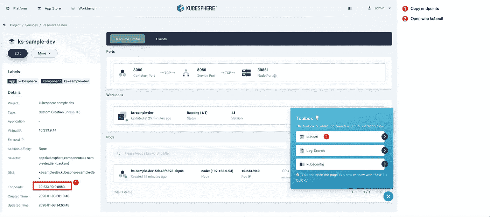

7.2.从工具箱中打开 web kubectl，尝试以如下方式访问:

> *注意:您可以请求端点或{ $虚拟 IP }:{ $端口}或{ $节点 IP }:{ $节点端口}*

```
$ curl 10.233.90.9:8080
Really appreciate your star, that's the power of our life.
```

7.3.类似地，您可以在项目`kubesphere-sample-pro`中测试服务

> *注:curl 端点或{ $虚拟 IP }:{ $端口}或{ $节点 IP }:{ $节点端口}*

```
$ curl 10.233.90.17:8080
Really appreciate your star, that's the power of our life.
```

配置！您已经熟悉 KubeSphere DevOps pipeline，您可以在下一个教程中继续学习如何使用图形面板构建 CI/CD pipeline 并可视化您的工作流。