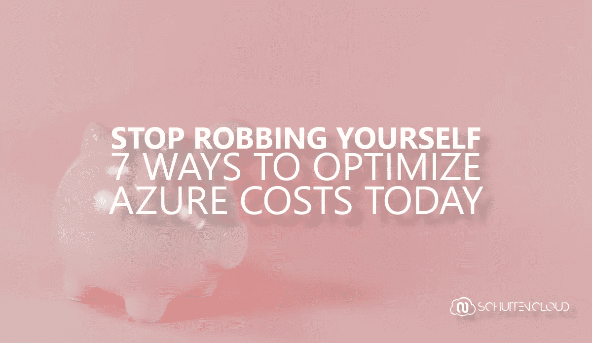
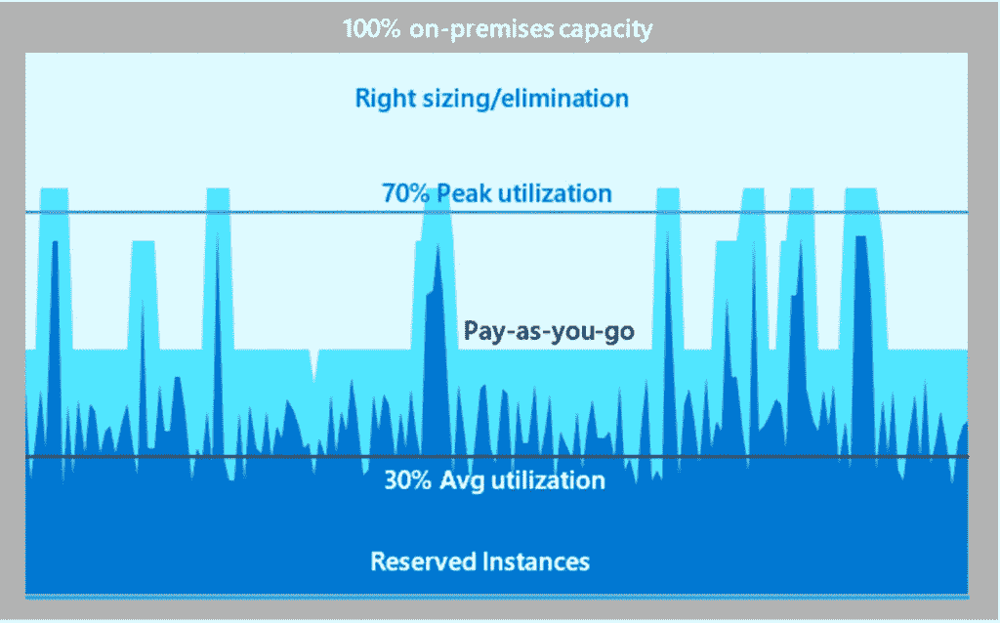
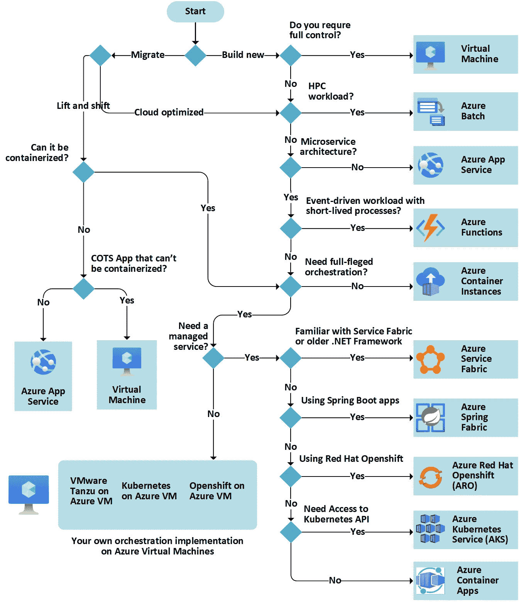
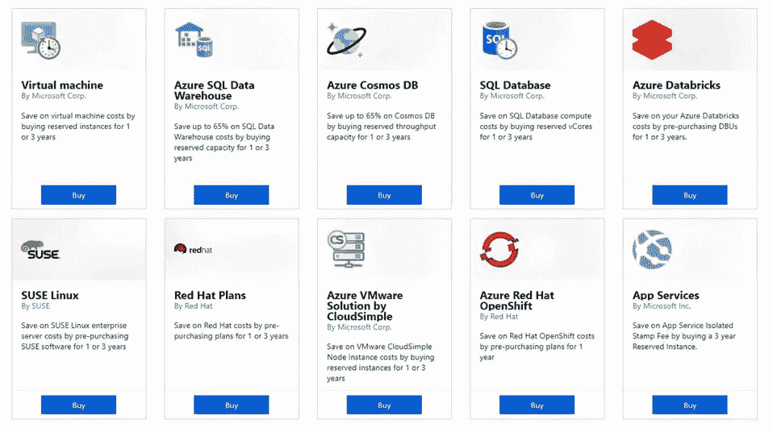

# 停止抢劫自己:今天优化 Azure 成本的 7 种方法

> 原文：<https://itnext.io/stop-robbing-yourself-7-ways-to-optimize-azure-costs-today-d53a11694d50?source=collection_archive---------2----------------------->

在这篇博客文章中，我分享了 7 种你可以从现在开始优化 Azure 成本的方法。此外，我还分享了微软提供 Azure 信用的 7 个选项，以便您可以进一步降低成本。

# 成本优化

成本优化是一个以业务为中心的持续学科，旨在推动支出和成本降低，同时实现业务价值最大化。你应该把成本优化当作一个过程，而不是一次性的活动。当利用 Azure 中的各种工具时，提供成本优化建议并不一定是一项耗时的任务。以下是优化 Azure 成本的 7 种方法:

## 1.建立预算并将成本分配给团队和项目

Azure Cost Management 有助于管理和监控支出。在这里，您可以[指定预算、设置警报](https://docs.microsoft.com/en-us/azure/cost-management-billing/costs/tutorial-acm-create-budgets)以及查看每个资源、资源组、订阅、标签等。哪些成本从哪里来。[因为成本经常被分配到不同的部门，你也可以根据标签进行区分](https://docs.microsoft.com/en-us/azure/cloud-adoption-framework/ready/azure-best-practices/resource-tagging)。通过这种方式，你可以立即告知相关预算负责人他/她的成本，并就此进行有针对性的对话。意识到与使用相关的成本，并认识到成本增加和减少的模式，是成本优化的第一步，也是最重要的一步。

## 2.关闭未使用的资源

显然，如果您在不使用资源时将其关闭，就可以节省成本。虚拟机、ExpressRoute 电路和其他资源可以由 [Azure Advisor](https://azure.microsoft.com/en-us/services/advisor/) 识别，它会建议您关闭哪些资源，以及可以节省多少资源。您还可以应用“打盹”的概念，这意味着在使用时间打开资源，但在使用时间之外关闭它们。借助 [Azure Automation](https://azure.microsoft.com/services/automation/) 或 Azure 服务中的嵌入式解决方案，例如 Azure 虚拟桌面的[扩展计划](https://docs.microsoft.com/en-us/azure/virtual-desktop/autoscale-scaling-plan)，这是[易于自动化的](https://docs.microsoft.com/en-us/azure/automation/automation-solution-vm-management)。

## 3.适当规模的未充分利用的资源

规模调整不是服务或工具，也不能从 Azure 门户访问它。规模调整是一个过程，其目标是找到工作负载的“完美匹配”或“合适的规模”，以便在不影响性能要求的情况下降低成本。或者，将性能提高到所需水平，同时将额外成本降至最低。它是关于找到与需求和要求相关的最佳规模。微软提供了各种工具来支持您的规模调整过程，如 [Azure Advisor](https://azure.microsoft.com/services/advisor/) 、 [Azure Monitor](https://azure.microsoft.com/services/monitor/) 和 Insights、[成本管理和计费](https://azure.microsoft.com/services/cost-management/)等。如果您正在考虑从您的数据中心迁移到 Azure， [Azure Migrate 基于性能的评估](https://docs.microsoft.com/en-us/azure/migrate/concepts-assessment-calculation#types-of-assessments)可以帮助您从一开始就调整规模。

Diana Gao 关于 [Rightsize 的](https://azure.microsoft.com/nl-nl/blog/rightsize-to-maximize-your-cloud-investment-with-microsoft-azure/)[节省成本的机会利用 Microsoft Azure | Azure-blog en-updates | Microsoft Azure](https://azure.microsoft.com/nl-nl/blog/author/dianagao/)

特别是在从内部数据中心到 Azure 的迁移场景中，应该应用合适的规模。在 Azure 中，真的没有理由应用过度承诺和/或过度供应，您可以在需要时供应您需要的东西，并为您使用的东西付费。另一个优势是，在硬件折旧期间，您不必承诺购买某一代硬件(CPU 系列或芯片组)。你不必花三到五年的时间使用同一代硬件，只需点击几下鼠标，就可以享受微软 Azure 提供的最新一代硬件。

此外，考虑一下 [Spot 虚拟机](https://azure.microsoft.com/en-us/services/virtual-machines/spot/)，它允许您购买未使用的计算能力，从而节省大量成本。对于可以处理中断并且不需要在特定时间框架内运行的工作负载，这是一种非常经济高效的方式。

## 4.利用 Azure 混合优势

如果你是一个通过[软件保障](https://www.microsoft.com/en-us/licensing/licensing-programs/software-assurance-getting-started)许可其当前内部工作负载的组织，微软为[提供选项](https://azure.microsoft.com/en-us/pricing/hybrid-benefit/)将这些许可带入 Azure。然后，您不再为消费模式中的许可证付费，因此您不必一次性注销购买的许可证。如果您想将本地工作负载迁移到 Azure，这将会产生重大影响。

## 5.配置自动缩放

动态升级和降级当然也是成本有效的。通过使用自动缩放，资源在您需要时变得可用，并在您不再需要时被删除。

## 6.选择合适的 Azure 计算服务

除了虚拟机，Azure 还提供了更多的计算服务。Azure 提供了许多托管代码的方式。大多数计算服务比虚拟机需要更少的管理负担，因此总拥有成本可以低得多。如果可能，您应该通过为您的应用选择合适的计算服务来提高运营的成本效益。

选择候选计算服务的流程图[微软](https://www.microsoft.com)于[选择 Azure 计算服务——Azure Architecture Center |微软文档](https://docs.microsoft.com/en-us/azure/architecture/guide/technology-choices/compute-decision-tree)

微软已经写了一篇关于寻找合适的计算服务的文章。

## 7.为一致的工作负载保留实例

如果你承诺长期使用某些实例，你可以在 Azure 服务上获得高达 72%的现收现付价格折扣。这些保留期可以是一年或三年。强烈建议在考虑上述优化选项后应用保留实例，以实现最大的成本优势。假设您一个月运行 730 个小时的工作负载，那么保留的实例将在整个合同期内购买。购买预订后，关闭这些资源将不再影响成本。因此，不进行预订并使用“打盹”或“自动伸缩”或这两者的混合来工作可能更便宜。另一方面，在某些情况下，购买保留的实例已经很有吸引力了，即使该实例只使用几个月。建议你一直自己算这个。

微软在[的](https://docs.microsoft.com/en-us/azure/cost-management-billing/reservations/save-compute-costs-reservations#charges-covered-by-reservation)[Azure Reservations 什么是 Azure Reservations？微软文档](https://www.microsoft.com)

保留的实例不仅限于虚拟机。微软在其产品组合中的各种产品和服务中提供[保留实例](https://docs.microsoft.com/en-us/azure/cost-management-billing/reservations/save-compute-costs-reservations#charges-covered-by-reservation)，包括数据库、应用服务和各种软件计划。

# 蔚蓝信用

除了优化 Azure 成本的 7 种方式之外，微软还提供了 7 种方式来帮助您通过 Azure 信用节省资金:

1.  [Visual Studio 订阅](https://azure.microsoft.com/en-us/pricing/member-offers/credit-for-visual-studio-subscribers/)，为 Visual Studio Enterprise 订阅者提供每月 150 美元的积分，或通过 MSDN 平台为订阅者提供每月 100 美元的积分。对于 Visual Studio Professional 和 Visio Studio Test Professional，您每月可以获得 50 美元的点数。
2.  [Azure for Students](https://azure.microsoft.com/en-us/free/students/) ，给予全日制学生 100 美元的积分，以帮助他们在 Azure 中进一步发展职业生涯和培养技能。这只适用于经过认证的两年制或四年制教育机构的学生，并且只在用他们学校的电子邮件地址注册时适用。
3.  Azure 免费账户，免费使用大量流行的 Azure 服务。此外，您还将从微软获得 200 美元的信用点数，可在接下来的 30 天内使用。
4.  [微软合作伙伴网络](https://azure.microsoft.com/en-us/offers/ms-azr-0025p/)，每月给予微软行动包计划成员 100 美元的 Azure 信用。
5.  [微软为初创公司](https://startups.microsoft.com/en-us/)，提供 200 美元的 Azure 信用，可以在未来 30 天内使用。此外，微软免费向所有初创公司提供技术支持功能。
6.  Azure for Education ，给予教育工作者 200 美元的 Azure 信用来使用学习资源和开发工具，以建立基于云的技能。这适用于所有学生、教育工作者和机构。
7.  [微软非营利组织](https://www.microsoft.com/en-us/nonprofits/azure)，微软为非营利组织和非政府组织提供捐赠和折扣产品。每年，被批准的组织将获得 3500 美元的 Azure 信用，可用于微软创建的所有 Azure 服务。

这些信用是支出上限，因为如果它们被用来购买不是免费提供的资源，它们就会减少，类似于零售店的礼品卡。

# 结束语

在这篇博客文章中，我描述了如何在 Azure 中开始成本优化的 7 种方法。作为锦上添花，我列出了微软提供的 7 个选项，使用 Azure credits 进一步降低您的成本。

当采用消费驱动的模式时，成本控制非常重要。云环境中的成本管理应该被视为一个持续的过程，而不是针对基础架构组件的更换和交付的定期投资和容量计划。停止抢劫自己，采用微软提供的许多工具来执行良好的成本管理。