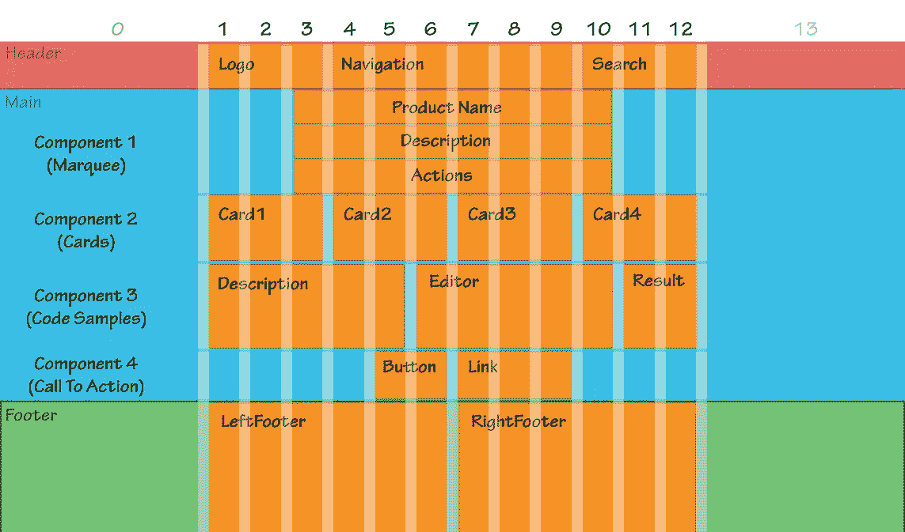
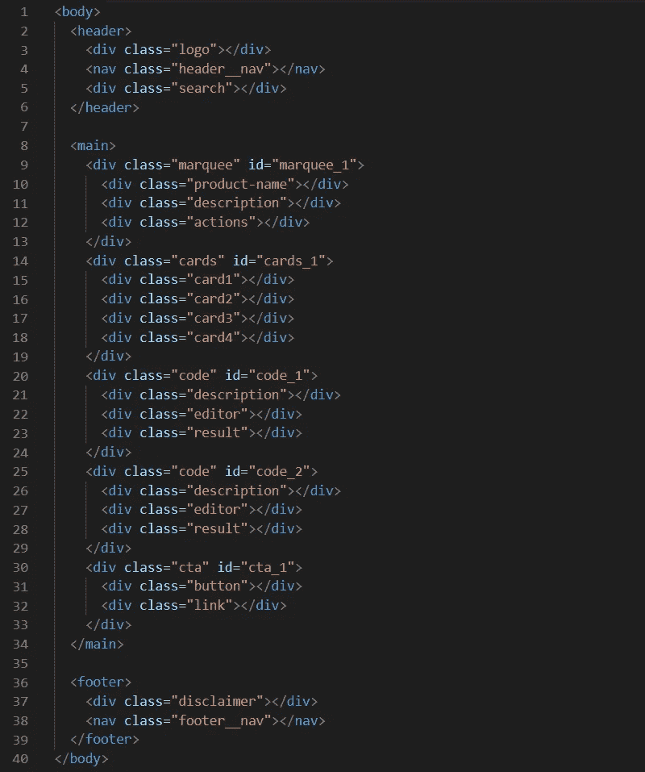
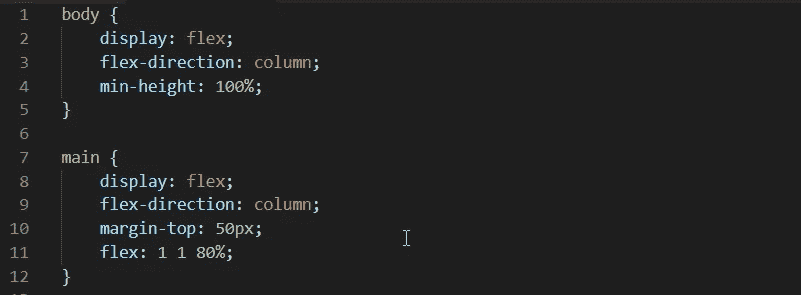
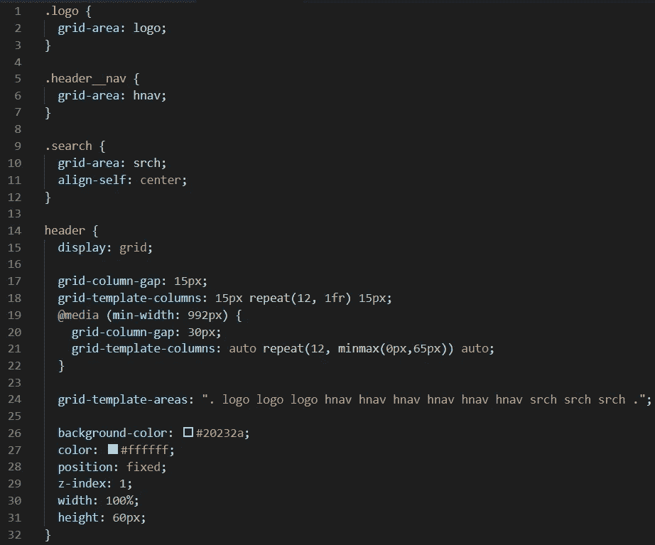
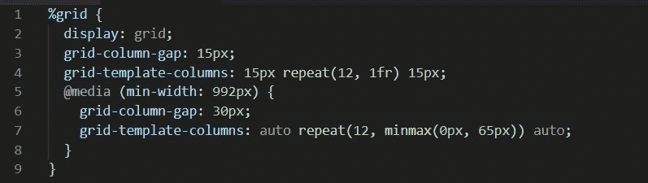
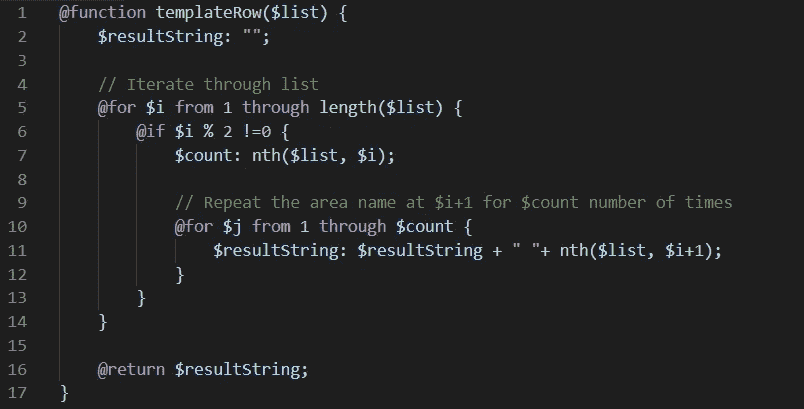
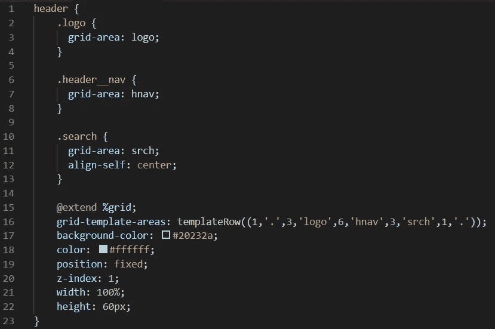
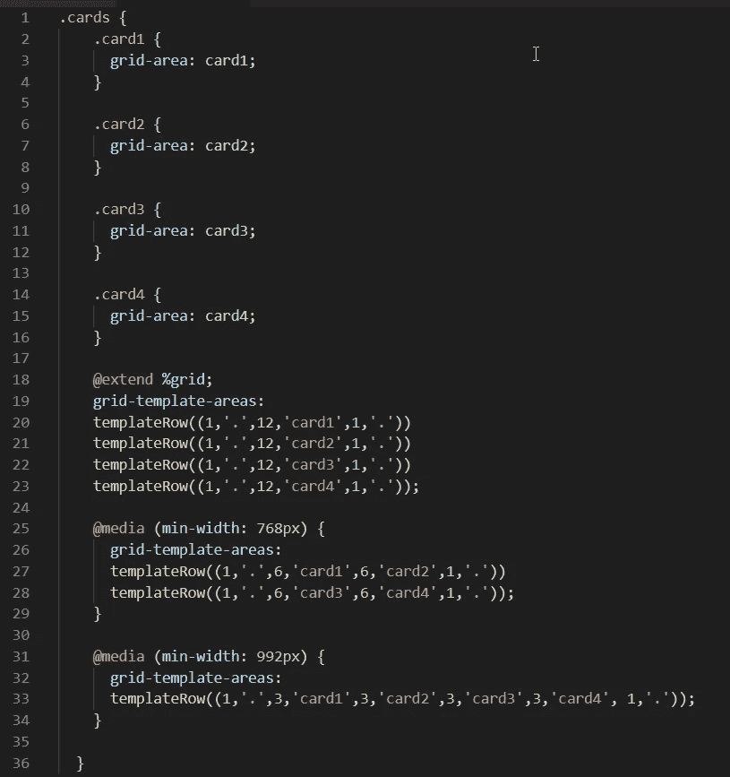

# 停止使用 Bootstrap——为基于组件的 UI 创建一个实用的 CSS 网格模板

> 原文：<https://itnext.io/stop-using-bootstrap-create-a-practical-css-grid-template-for-your-component-based-ui-da784d974cc7?source=collection_archive---------2----------------------->


无论您是 CSS Grid 的新手，还是想要更上一层楼，您都很难在网上找到深入实际用例的好资源，或者演示如何为当前的前端项目利用 Grid 的最佳特性。

在这篇文章中，我将带你为基于组件的 ui 创建一个 Bootstrap 风格的、响应性强的 12 列网格模板——只使用 CSS Grid、简单的语义 HTML 和 SASS。最后，我们将通过用它重新创建 reactjs.org 首页来测试我们的模板！

# 我们的线框

首先，让我们把目光放在目标上。我们将构建的模板是移动优先的，但我在这里展示桌面线框，因为它有助于更好地概述:



正如你所看到的，我们的模板分为 3 个非常常见的区域——页眉、主页面和页脚(红色、蓝色和绿色区域)。我们的页眉和页脚各由 14 列组成——2 列在侧边用于间距，12 列用于内容。我们的主区域(蓝色)可以包含任意数量的组件，每个组件也使用 14 列。白色条纹表示我们的列之间的间距。

现在，虽然看起来好像整个事情是一个大网格，线框中的每个“行”实际上是实现自己的网格！因此，例如，组件 2(卡片)不必遵循我们的 14 列惯例，每端都有一个液体间隔列。它可以很容易地被制作成在 2 行上具有 6 列等宽并且具有完全不同的装订线间距。

# HTML

下面是我们需要的所有标记。花一分钟来惊叹它是如此的干净和美丽。

您还会注意到，出于演示目的，我们在这里对字幕、卡片、代码和 CTA 标记进行了硬编码。大概，这就是你让框架的组件迭代器呈现任意数量的不同组件的地方。



# 将主要区域——Flexbox 和 Grid 设计在一起？

我们现在要对主要区域(见上面的 Header，main，Footer)以及组件所在的 Main 内部进行样式化。

这里是你需要得到的头，主和页脚栈，然后我们的组件在主栈:



此时我几乎能听到你从包里拿出西红柿的声音。拿着你的技术果实。我知道我在这里使用 Flexbox，这是因为 CSS Grid 不是一个万能的。 **Flexbox 对于一维扩展更快更简单**(元素连续排列在一列或一行上)**而 CSS Grid 对于更复杂的 2d 布局来说是合适的工具**。

# 网格化我们的标题部分

我们现在将样式化模板的顶层，我们的标题，我们将开始把它变成一个网格，然后给它一些样式。



这是细目分类:

*   第 2、6 和 10 行— **grid-area** 将我们的 Header 元素(logo，header__nav & search)的子元素分配给它们的父元素的命名区域。我们将进一步了解这意味着什么。
*   第 11 行——CSS Grid 附带了一些很酷的属性，用于将项目与网格的单元格对齐。这里我们使用 **align-self: center** 将这个项目垂直对齐到单元格的中心，但是还有 justify-self、place-self(两者的组合),然后分别用于父项目:align-items、justify-items 和 place-items。
*   第 15 行——这是一切的开始。**显示:grid** 将我们的 Header 元素转换成 CSS 网格容器
*   第 17 行——使用**网格-列-间隙**我们正在设置我们的列之间的间距(间距)的期望宽度
*   第 18 行—必填。我们使用**grid-template-columns***来定义表头内的列数和大小。第一个值是 15px，这意味着第一列的宽度固定为 15px。接下来是 **repeat(12，1fr)** ，这是一个本地 CSS 函数，将第二个参数(1fr)重复第一个参数的次数(12)。1fr 是一个相对较新的单位，基本上翻译为“可用空间的 1 分之一”。所以我们在这里做的是定义 12 个等宽的列。最后，最后一个值是 15px，所以最后一列的宽度固定为 15px(就像第一列一样)。*
*   *第 19 行—我们在这里使用媒体查询断点，以便我们可以为宽屏设备定义不同的装订线宽度和列大小。*
*   *第 21 行—这里的**网格-模板-列**的第一个值是**自动**，意味着我们希望第一列是流体。接下来是 **repeat(12，minmax(0px，65px))** ，这意味着接下来的 12 列的最小宽度应为 0px，最大宽度应为 65px。在那之后，我们为第 14 列准备了一辆**汽车**。*
*   *第 24 行——在第 2、6 和 10 行中，我们定义了网格区域名称；现在使用 **grid-template-areas** 我们将指定这些区域在 Header 父元素中的大小和位置。Grid-template-areas 以空格分隔的列表形式接受一个字符串，其中列表中的每个单词代表一列。例如，我们命名为“logo”的区域将从第 2 列开始，延伸到第 4 列。带句点的列(。)没有被分配任何区域名称(因此第一列和最后一列是无名的，因此将是空白的)*

# *添加一些 SASS 魔法，使一切干燥和可重复使用*

*到目前为止，你已经意识到，如果我们要像上面的标题一样“网格化”每个区域和组件，我们最终会得到很多重复的 CSS。所以是时候把萨斯拉出来，让它发光了。*

## *下面是我们将如何重构我们的 CSS:*

1.  *我们将从标题中删除网格本身(上面代码片段中的第 17–22 行),并将其包装在一个可重用的 SASS 占位符中！*

**

*现在，我们可以通过简单地在它们的主类中添加 **@extend %grid** 来网格化任何区域或组件。*

*2.根据我们使用的列和行的数量，**网格模板区域**属性可以有一个相当长的&重复值。让我们创建一个自定义的 SASS 函数，使它更加漂亮:*

**

*为了使用这个函数并创建一个网格模板行，我们所要做的就是在 grid-template-area 属性中调用它，如下所示:*

```
*grid-template-areas: **templateRow((x, "col1", y, "col2", ...));***
```

*其中 x 和 y 分别是重复“列 1”和“列 2”的次数。*

*使用上述两种 SASS 技术以及一些基本的嵌套，我们得到了这个看起来超级光滑的头代码:*

**

# *完成模板的剩余部分*

*从现在开始，我们工作的所有其他部分和组件看起来应该与 Header 的代码片段(如上)几乎完全一样——这确实是它的美妙之处。*

*即使是我们的线框中最难的组件(组件 2-卡)也非常容易理解，与标题代码的不同之处仅在于它有更多断点，并且其中一些断点(手机和平板电脑)的模板有不止一行:*

**

# *结束语*

*CSS 网格非常棒。我在这里展示了许多可能的体系结构方法中的一种，可以用来替代传统的网格系统。我也鼓励你看看幕后编译的 CSS——你会惊讶于它是多么的小和干净。*

*所以让我们来看看这篇文章的标题。我认为像这样的解决方案会让你想要彻底放弃吗？看情况。Bootstrap 做了很多非常好的事情，但是它也带来了很多开销，并且会导致一些非常复杂的标记和样式——特别是如果你使用的是基于组件的框架。*

*我确实认为这是一个非常令人兴奋的选择，浏览器对 CSS Grid 的支持可能比您想象的要好。CSS Grid 在 IE 10+上工作得很好(比如 Bootstrap 4 ),虽然一些很酷的特性比如 grid-template-areas 不起作用，但是你可以很容易地使用 Grid 属性来代替它。你也可以使用像 [Autoprefixer](https://github.com/postcss/autoprefixer#does-autoprefixer-polyfill-grid-layout-for-ie) 这样的聚合灌装机来自动完成这项工作。*

# *现场演示*

*这是乡亲们。使用我们刚刚创建的美味 CSS 网格模板重建的[reactjs.org](https://reactjs.org)首页:[https://codepen.io/mythaphel/pen/bPVjrp](https://codepen.io/mythaphel/pen/bPVjrp)*

**注意:您会注意到代码笔中一些 javascript。我向您保证，它的唯一目的是从 reactjs.org 页面(我已经缓存在 Github 存储库中)提取内容片段，并根据您将在标记中看到的“data-src”属性将它们注入 HTML。*

*顺便说一句，我喜欢称这个模板为**高层**,因为堆叠的网格行类似于地板，里面有不同大小的房间。*

*如果你从中得到什么，就按那个按钮。非常感谢！*