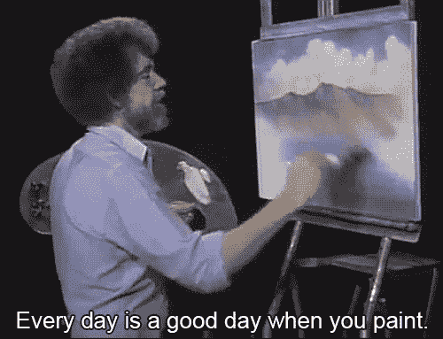

# 甜蜜而简单的 CSS-in-JS 与电子 CSS

> 原文：<https://itnext.io/stop-using-css-in-js-and-welcome-proper-styling-in-js-with-electron-css-d28536ba3e85?source=collection_archive---------3----------------------->



你可能听说过 CSS-in-JS，因为它在过去的几年里已经成为一种害羞的趋势。不计其数的库涌现出来，然而我们似乎仍然无法在流行的开发场景中扎根这个概念。我现在告诉你:感谢上帝。为什么我对 CSS-in-JS 如此不满？嗯，很简单:是 CSS。我以为我们在写 Javascript？

我对所有这些库的主要问题是工作完成了一半的感觉。我们开始将 CSS 实践转换成一些 Javascript pragma，但是中途我们变懒了，所以让我们将选择器放在 JSON 对象中，这样就可以了。

我看不像 Javascript！

框架试图解决这个问题，今天我写这篇文章来展示我自己的替代方案:电子 css。设计框架的黄金法则是:没有字符串，没有选择器。你做的任何事情要么是函数，要么是常数。下面是一个可能的例子:

多一点 Javascript-y

本文将为您提供有效使用电子 CSS 的基本工具，使其尽可能接近真实的 Javascript 代码，而不会突然将难看的 CSS 字符串注入到您的代码中！

来秀一下爱:【https://github.com/azukaar/electron-css】T2

# 入门指南

T4:你准备好开始了吗？穿上你最喜欢的编码服，弹出你最好的编辑器，打开你的终端，安装电子 css:

```
npm install electron-css
```

那很容易！现在让我们将它包含在我们的项目中。在这里您有多种选择，您可以导入它并使用 webpack/parcel 来构建您项目(如果您使用 React，您可能每天都这样做！).或者你可以给 HTML 页面添加一个

# 基本概念

让我们快速回顾一下电子 css 如何工作的一些基本概念。这个库的第一个入口点是 CSS()函数。它所做的是创建一个随机生成的类名，匹配你传入的 CSS。这个类名将存储在一个内部样式表中，一旦使用完毕，最终可能会被内部垃圾收集器删除。如果您尝试 console.log 它，它将返回一个实现 toString()函数的更复杂的对象。

```
const myClass = CSS({
  color: 'red'
});
```

一旦你这样做了，你就可以在任何你喜欢的模板/框架系统中自由地使用类名作为字符串。

```
document.body.innerHTML = `<div class="${myClass}"></div>`;
```

# 体系结构

有两种存储类的方法。首先，如果组件中只有几个类，建议将它们存储在与 JS 代码相同的文件中。如果您的样式变得太大而不适合您的文件，这可能意味着您需要将代码分成多个组件。在那些例子中，有些语法你可能不熟悉，我将在后面详细描述它们。

如果您真的觉得有必要，您也可以从另一个 JS 文件中导出这些类，这在为您的应用程序定义布局或主题时非常有用。这样做的时候，建议使用命名约定`xxx.style.js`来识别组件旁边的样式文件，或者如果它们是全局文件，将它们放在 ui/文件夹中，这样就可以用`import theme from '../ui/theme'`轻松导入它们。

```
// ui/layout.jsimport {CSS} from 'electron-css';const singleColumn = CSS({
  with: '100%'
});const doubleColumn = CSS({
  with: '50%'
});export {
  singleColumn,
  doubleColumn
};
```

对于主题文件:

```
// ui/theme.js
import {CSS, color} from 'electron-css';const mainColor = color.red;
const secondaryColor = color.darken(mainColor, 0.2);const mainBorderStyle = [secondaryColor, 'solid', '1px'];export {
  mainColor,
  secondaryColor,
  mainBorderStyle
};
```

另一件要注意的事情是对象的命名。在 CSS 中通常建议命名你的元素而不是描述它们(例如:创建一个. title 类而不是. boldAndTall 类)。因为我们现在在 JS 中，你需要重新考虑这个命名规则。拇指的一般规则是:像命名函数一样命名类对象，去掉动词(make/get/set/etc……)。例如，在 CSS 中你可能会创建一个`.highlighted`类，在 JS 中，你会想把你的对象命名为`highlight`作为一个动作动词(而不是像函数一样命名为`setHighlighted`)。

创建行动类，以便不重复自己太频繁。在 CSS 中，创建太多的类并管理它们是很麻烦的，但是在 JS 中，范围和导入使它变得很容易，所以创建尽可能多的类。

```
// bad.button {
  width: 50px;
  height: 20px;
  color: blue;
}.largeButton {
  width: 150px;
  height: 20px;
  color: blue;
}// goodconst
element = CSS({
  width: '50px',
  height: '20px'
}),
mainColor = CSS({
  color: blue
}),
large = CSS({
  width: '150px'
})
;
```

您可能希望从 layout.js 中导出“large”和“element ”,从 theme.js 中导出“mainColor ”,以便重用它们。它们不被称为 button 的事实也使得它们在语义上更容易重用。

您最不想关心的是避免选择器组合。它们应该在 CSS 中帮助确定对象的范围(例如样式。列表在里面。文章将防止所有其他列表样式相同)。但是在这里，我们不再使用选择器:你不需要组合。在电子学中，你永远不要试图去做:

```
const article = CSS({
  ...,
  '.list': { }
}
```

你需要在两个独立的对象中创建文章和列表，如果你有其他列表也没关系，因为它们会在其他范围内(谢谢 JS！).

# JS 语法，请多 JS！

在前面的例子中，我试图混合 CSS/JS 语法一点，不要太快失去每个人，但从现在开始，我们将学习如何编写纯 JS 样式，并坚持下去！

这里的经验法则是永远不要使用任何字符串。为什么？因为字符串不是 Javascript:它们迫使您使用令人讨厌的字符串连接、引号转义，并且在出现错误时会导致无法检测的问题。

```
// bad
const large = CSS({
  width: (myWidth * 2) + 'px'
});// good 
const large = CSS({
  width: px(myWidth * 2)
});
```

对于错误

```
// will not trigger any error
const highlight = CSS({
  color: 'yelow'
});// error : color is undefined, line 2
const highlight = CSS({
  color: color.yelow
});
```

下面是在代码中使用这些助手时要遵循的基本结构:

```
import {CSS, units, color, constants} from 'electron-css';
const {px, pct} = units;
const {margin, borderStyle} = constants;
```

使用 JS 解构，我们可以得到一个漂亮的语法，在你的代码中展示你需要的助手。

正如您可能已经注意到的，为了防止对像边框或背景这样的组合规则使用字符串连接，electron-css 允许您对任何规则使用数组:

```
border : [color.red, px(1), borderStyle.solid]
```

请参考这里的文档:[https://github.com/azukaar/electron-css#more-js-please-](https://github.com/azukaar/electron-css#more-js-please-)阅读框架中所有可用的助手。无论您使用关键帧、渐变还是 mediaqueries，您都不需要任何字符串！

# 测试和发布您的代码

正如你可能想到的，在你的风格中使用这么多 JS 意味着你没有权利在一个单独的文件中发布你的 CSS。除非您从*.style.js 文件中显式导出了所有样式(您可以单独捆绑这些样式),否则完全可以按原样发布这些样式。

测试时必须注意:因为类名是随机的，所以它们会扰乱您的快照测试。如果你愿意使用 Jest 快照，请参考这里的文档，以便使用可预测的类名:【https://github.com/azukaar/electron-css#snapshot-tests】T2

# 结论

我希望这篇文章让你想要接近适当的 js 风格，而不是使用 css-in-js，这不会改善你的代码，甚至在许多方面使它变得笨拙。电子 css 仍然很年轻，我很高兴收到任何反馈/想法，以推动它朝着正确的方向发展。非常感谢你的阅读。

参观:【https://github.com/azukaar/electron-css 