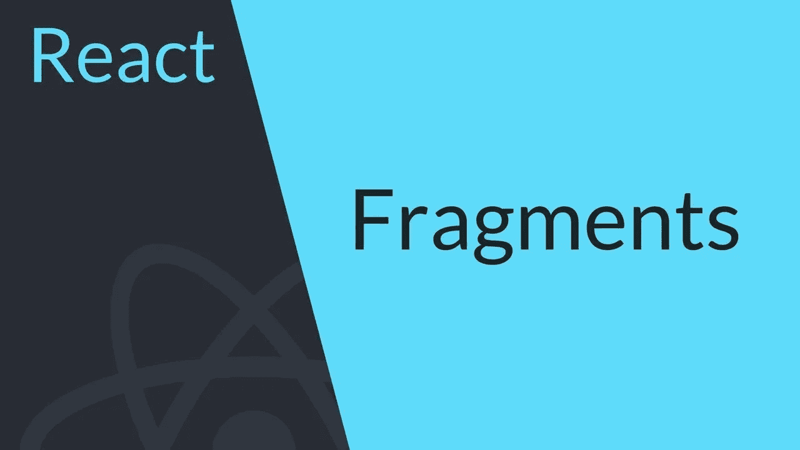

# 不要在毫无意义的地方包装你的反作用组件！

> 原文：<https://itnext.io/stop-wrapping-your-react-components-in-pointless-divs-8b5fd11b5545?source=collection_archive---------2----------------------->



鉴于图片的特色，你可能已经意识到这将是一篇关于反应 16.2 `Fragment`功能的帖子。如果你完全了解这个功能，并且对它了如指掌，那么这篇文章就不适合你了。但是如果你不认为你什么都知道，那就继续吧！掌握这个概念的所有内容很简单，并且是一个有价值的工具，可以添加到您的 React 编程库中。

我实际上在这里制作了一段关于这个话题的视频。尽管我会在这篇文章中对反应碎片做更详细的描述。

# 一个毫无意义的 div 示例:

为了说明`Fragment`的有用性，我们来看看一个简单的无状态功能组件的例子:

```
import React from 'react';const MyComponent = () => (
  <p>React is going to throw errors at</p>
  <p>this component because it's not wrapped!</p>
);
```

如果您已经使用 reactor 有一段时间了，但是还没有遇到 React Fragment 特性，那么您会知道当您尝试运行这段代码时，reactor 会向您抛出一个错误。这是由于反作用在发动机罩下的工作方式。它要求组件由一个子元素组成。就`MyComponent`而言，有两个因素会导致反作用抛出错误。

嗯，这很容易修复，对吗？我们就这样把它包起来！

```
import React from 'react';const MyComponent = () => (
  <div>
    <p>React is going to throw errors at</p>
    <p>this component because it's not wrapped!</p>
  </div>
);
```

酷，这个管用，问题解决了，对吧？嗯，是的，但是你看……这是一种把专业人员和业余人员分开的情况。我认为——如果你有选择的余地——你会选择成为一名职业运动员，而不是业余运动员。

> *专业人士把工作* ***做对*** *，业余人士把工作做好。*
> 
> –John Sonmez([软技能:软件开发人员生活手册](https://amzn.to/2oItvJj))

# 这有什么错？它的工作，所以我很高兴！

这个解决方案的问题在于，您的渲染文档对象模型(DOM)现在有一个完全无用的 div，它对您毫无用处。乍一看，这还不算太糟。然而，这可能会产生负面影响。想想这两个例子:

## 数组上的映射

我会在这里用一个小例子，但你会明白的。想象我们映射到一个数组，对于数组中的每一项，我们打印出一个组件，就像这样包装在一个 div 中:

```
import React from 'react';const myArray = ["Barry", "Michael", "Doyle"];const MyComponent = ({ name }) => (
  <div>
    <p>Here's a name:</p>
    <p>{name}</p>
  </div>
);const renderNames = () => myArray.map((name, index) =>
  <MyComponent key={index} name={name} />
);
// You shouldn't really be using index for your key
// but this isn't what I'm trying to illustrate right now.
```

所以这里我们有一个`renderNames`函数，它应该为`myArray`中的每个`name`渲染一个`MyComponent`组件。在这种情况下，它将呈现以下内容:

```
<div>
  <p>Here's a name:</p>
  <p>Barry</p>
</div>
<div>
  <p>Here's a name:</p>
  <p>Michael</p>
</div>
<div>
  <p>Here's a name:</p>
  <p>Doyle</p>
</div>
```

这对于在 DOM 中呈现的元素来说有点过了。因为没有附加样式或其他数据的`div`是完全不必要的。如果我们硬编码的话，我们可以让一些东西看起来完全一样，没有任何无用的`div`标签。除了增大我们的 DOM 和让客户端下载更多无用的 HTML 代码之外，`div`标签没有提供任何好处。我们真正想要渲染的是这个:

```
<p>Here's a name:</p>
<p>Barry</p>
<p>Here's a name:</p>
<p>Michael</p>
<p>Here's a name:</p>
<p>Doyle</p>
```

无用的`div`标签的问题是那些无意义的 div 标签越积越多。假设我们的数组由数百个值组成。如果你可以少渲染一些标签，你肯定会很高兴。这些变化最终会对您的应用程序性能产生影响。此外，有无意义的`div`标签会让你觉得恶心！

## 弄乱 HTML 语义

考虑在不应该使用的地方使用一个`div`或者其他无用的元素。这是另一个使用无用的`div`标签的好例子，这会让你觉得自己是个肮脏的混蛋。看看这个:

```
import React from 'react';const MyComponent = () => (
  <div className="my-app">
    <ul>
      <ListItems>
    </ul>
  </div>
);const ListItems = () => (
  <div>
    <li>Barry</li>
    <li>Michael</li>
    <li>Doyle</li>
  </div>
);
```

**免责声明:**这是一个来自过去的消息，但我知道 React Fire 正在开发过程中，并且`className`可能会在不太遥远的将来某个时候更改为`class`。当这种情况发生时，你会看到这个帖子。请评论提醒我把`className`改成`class`。

*回帖子……*

无论如何，以上是另一个微不足道的例子来证明一点。至少这次我们的带有`className`的`div`元素实际上是有目的的，不像我们之前提到的数组示例上的*映射。然而，如果我们在这里渲染`MyComponent`,我们将向 DOM 渲染以下不需要的结果:*

```
<div class="my-app">
  <ul>
    <div>
      <li>Barry</li>
      <li>Michael</li>
      <li>Doyle</li>
    </div>
  </ul>
</div>
```

让我们首先说，呈现我的名字没有任何问题。这不是我们要解决的问题！我的名字很棒……在这种情况下——正如我已经提到的——作为`MyComponent`的包装器的`div`很好，因为它实际上服务于一个不仅仅是包装的目的。这是假设已经为分配给包装`div`的`my-app`类定义了样式。

真正的问题是——从语义上来说——在`ul`和`li`元素之间不应该呈现一个`div`!不遵循正确的 HTML 语义可能会给你带来麻烦。现在对你来说可能不是问题，但是这种东西可能会干扰事情。例如，浏览器内置的辅助功能，如屏幕阅读器等。它也可能有其他不良后果，如负面影响您的网站搜索引擎优化(SEO)。这是由于页面没有遵循最佳实践约定造成的。

# 在我们继续我们奇妙的解决方案之前，最后一点要注意

这些例子非常简单。很容易发现，你可以通过重组你的组件来解决这些问题。编写组件的方式通常不应该导致呈现多个独立的元素。但是嘿！如果你确实有这个问题，而且不知道什么是反应片段，那么你将要学习一个漂亮的小技巧，它将帮助你在这些烦人的情况下摆脱出来。

# 起作用反应片段

2018 年初。React 开发者得到了 React 16.2 的新年礼物，它引入了 React 片段特性。它也介绍了其他很酷的东西，但这篇文章只是在这里的片段。

其实真的很简单！你几乎只是用一个`<React.Fragment>`代替了你的`<div>`。让我们使用无意义的 div 示例:

```
import React from 'react';const MyComponent = () => (
  <React.Fragment>
    <p>React is not going to throw errors at</p>
    <p>this component because it's wrapped!</p>
  </React.Fragment>
);
```

这太棒了，因为使用这种技术，React 不会抛出错误！而且它根本不在 DOM 中呈现包装器！这是输出:

```
<p>React is not going to throw errors at</p>
<p>this component because it's wrapped!</p>
```

## React 片段密钥属性

映射一个数组，却抱怨没有唯一键？没问题！`React.Fragment`标签也可以接受一个`key`属性，这样在映射数组时就不会出错。简单地这样写:

```
import React from 'react';const myArray = ['Barry', 'Michael', 'Doyle'];const MyComponent = () => (
  <React.Fragment>
    <h1>Here are some names:</h1>
    {myArray.map((name, index) => (
      <React.Fragment key={index}>
        <p>Name:</p>
        <p>{name}</p>
      </React.Fragment>
    )}
  </React.Fragment>
);
```

上面的代码将完美地呈现，没有无用的包装元素。此外，React 不会抱怨没有包装`React.Fragment`标签的唯一键。

**对于实现嵌套的三元语句真的有用**

在我谈论下一部分有多棒之前。我非常支持编写干净、可读和可维护的代码。我个人认为，如果需要写嵌套三元的话。那么您可能应该考虑将您的组件拆分成更小的组件。或者考虑添加渲染功能，让其他开发人员更容易阅读你的作品。但是如果您认为——在您的特定情况下——使用嵌套的三元语句是可读的，那么继续！

下面是一个将`React.Fragment`标签用于嵌套三元语句的例子:

```
import React from 'react';
import {
  AdminScreen,
  LoadingScreen,
  UserScreen,
} from './components';const MyApp = ({ isLoading, isAdmin }) => (
  <div className="my-app">
    {isLoading ?
      <LoadingScreen /> :
      <React.Fragment>
        {isAdmin ?
          <AdminScreen /> :
          <UserScreen />
        }
      </React.Fragment>
    }
  </div>
);
```

正如我提到的，肯定有更干净的方式来写这个，如果我看到像这样写的东西，我可能会在代码审查中抱怨。但是，嘿，它的工作和渲染没有无用的`div`标签。

平心而论，看起来没那么糟糕。说到让东西更具可读性，我们就来谈谈这个吧！

# 使用片段时提高代码可读性

`React.Fragment`当你看它的时候，它很脏。而你可能已经猜到了这一点，但这很像`React.Component`。如果你和我一样，你可能喜欢破坏和去掉那些点！让我们向你展示如何做到这一点。

## 来自 React 导入的析构片段

你可以从 React 导入中析构`Fragment`，就像你处理`Component`一样。简单地像这样做:

```
import React, { Fragment } from 'react';const MyComponent = () => (
  <Fragment>
    <p>Barry</P>
    <p>Michael</p>
    <p>Doyle</p>
  </Fragment>
);
```

这太棒了。看那比`React.Fragment`干净多少！干净的代码是好代码，当它工作和执行良好时…

无论如何，有一种更干净的方法来实现 React 片段！

## 使用新的花式公认的语法糖

实际上，在这篇文章发表前一周，巴别塔 7 问世了！这带来了以更漂亮的方式编写 React 片段的能力！看看这个:

```
import React from 'react';const MyComponent = () => (
  <>
    <p>Barry</p>
    <p>Michael</p>
    <p>Doyle</p>
  </>
);
```

这太棒了。因为它与 React `Fragment`的实际工作方式一致。它几乎是“不可见的”,只是用于包装将要渲染的组件，以满足引擎罩下的反应。注意这样做意味着你甚至不需要`import { Fragment } from 'react'`！

PS:这在最新版本的 TypeScript 中也是可用的，以防你用的是 TypeScript 而不是 Babel。所以我强烈推荐使用这种语法，因为它已经成为实现 React 片段的公认方式。

这个奇特的语法唯一不允许您做的事情是将`key`属性添加到`Fragment`中。如果你需要使用一个`Fragment`来包装一个映射的渲染，那么你应该使用我之前提到的析构方法。然而，这可能是一个很好的指示，您应该通过将映射的渲染提取到它自己的组件来编写更干净的代码。这应该消除了采用析构方法的需要，并允许您使用漂亮的语法方法。因为现在您可以将所需的惟一属性`key`分配给提取的组件，并在提取的组件中使用`<>`来代替。

# 碎片比较特殊，需要的时候用，但不是到处都用！

请不要让我写一个“停止到处使用无意义的片段！”博客帖子。我有一个同事，他认为把所有东西都包在一个`<Fragment>`里是个好主意。他这样做是因为这样他就不会抱怨他有 5%的时间没有用包装元素包装他的元素。不要那样做！

当我友好地把我在 React Fragments 上的 YouTube 视频链接给他，试图帮助他理解应该如何使用它们时，他非常生气。很公平，从技术上讲，DOM 在那里什么也不渲染，所以它不会影响最终渲染的内容。我甚至想方设法证明他是错的，但一无所获。

但请记住约翰·桑梅兹在他的书《软技能:软件开发人员的生活手册》中的一句话:专业人士得到工作，完成工作，做好工作。业余者完成工作。仅仅因为它有效，并不意味着它是正确的。在代码库中插入完全没有任何作用东西是不好的做法。

每当你想用一个`Fragment`的时候。在使用应用程序之前，花点时间想想是否可以改进它的结构。有时，但只是有时使用`Fragment`很棒，但大多数情况下，这种必要性来自于糟糕的结构代码。

最后一个提示:反应碎片唯一能带的`prop`是`key`道具。这应该仅在映射时使用。即使这样，也要考虑你的应用程序结构。你应该把你的大组件分成更小的组件吗？如果您的包装器需要样式，您应该使用一个`div`(或者其他的标签)。如果有相关的风格，它就不再是无意义的`div`。一个`Fragment`不能有一个`className`或者`data-qa`或者除了`key`之外的任何东西。所以确保你不会犯那个常见的错误！

# 结论

React 片段是史诗。它们可以用来帮助您编写非常干净、可维护的代码！但是它们不应该到处使用。只有在您清楚地了解了您的组件结构并确定没有更好的替代方案之后，才应该使用它们。

和往常一样，我的干净代码主题受到了著名书籍[代码完成:软件构造实用手册，第二版](https://amzn.to/2LxtXDo)的启发。这是一个史诗般的阅读，在帮助你用更结构化的方法思考和编写代码方面肯定是有价值的。

如果你喜欢这篇文章，请留言、鼓掌、喜欢并分享。一定要关注我在[推特](https://www.twitter.com/barrymdoyle)、 [YouTube](https://www.youtube.com/barrymichaeldoyle) 、&T6 中发布的新内容！

*原为 2018 年 9 月 4 日在*[*www.barrymichaeldoyle.com*](https://www.barrymichaeldoyle.com/fragment)*发布。*