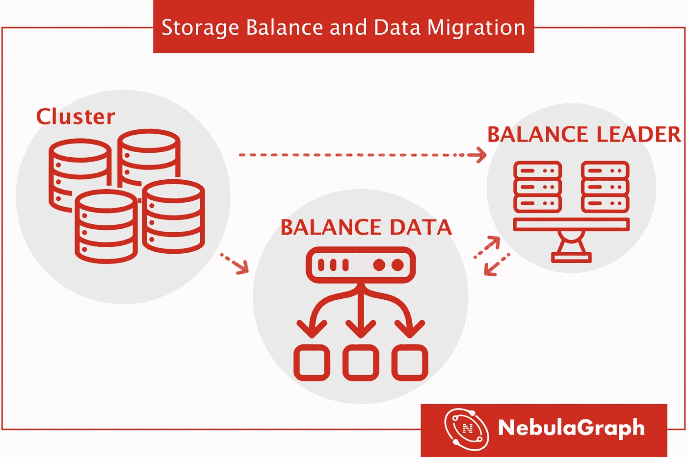
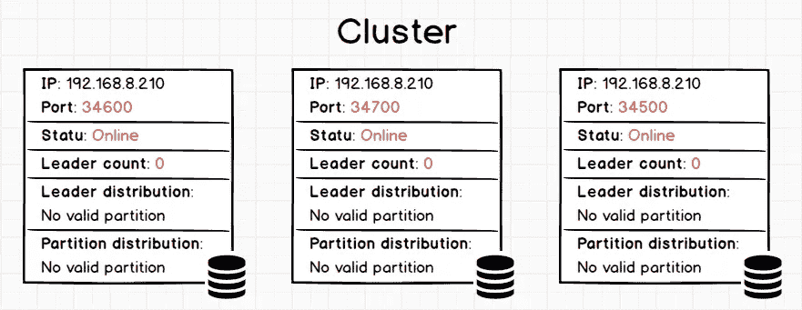
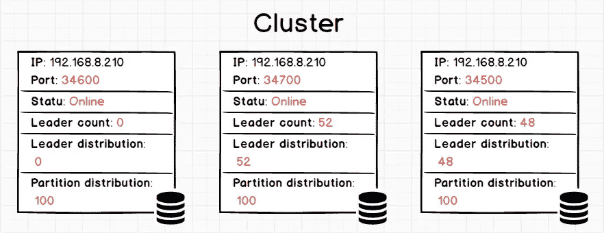
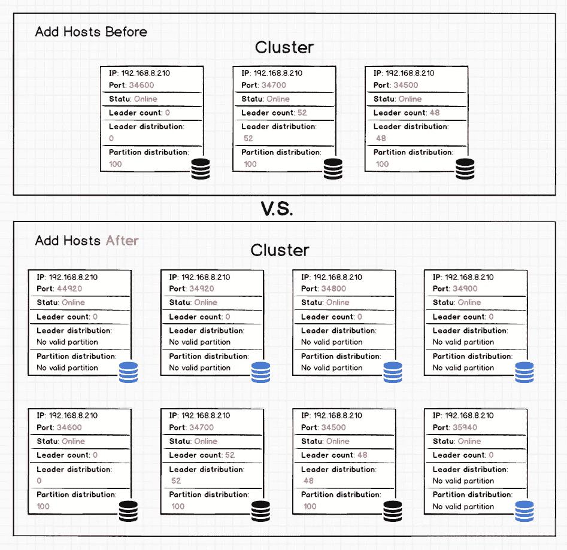
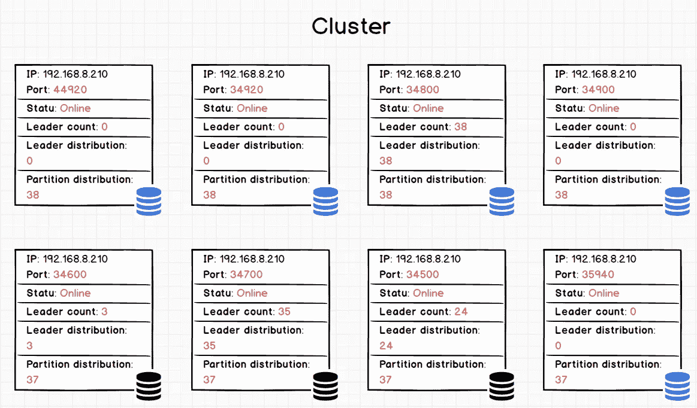
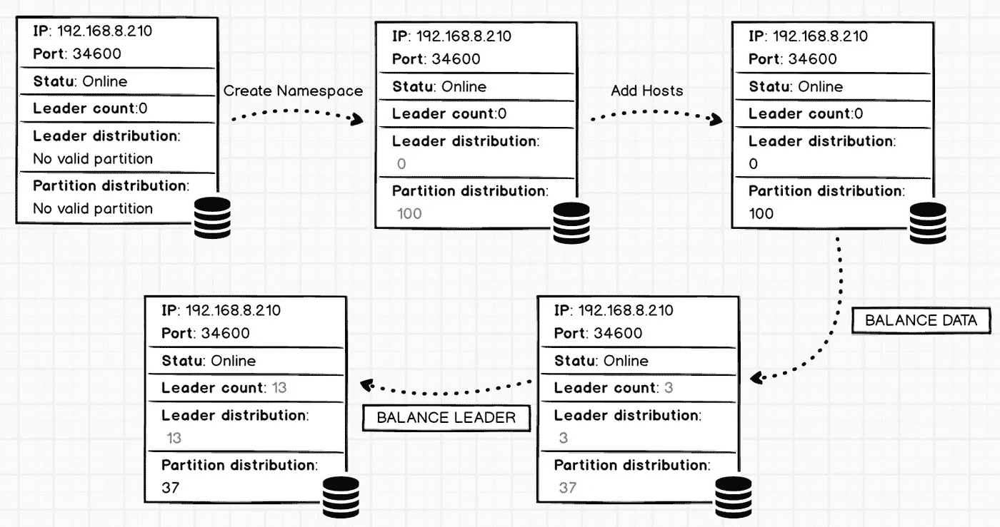

# 图形数据库中的存储平衡和数据迁移

> 原文：<https://itnext.io/storage-balance-and-data-migration-in-graph-database-2aced5447ae4?source=collection_archive---------4----------------------->



在我们的帖子 [*存储设计*](https://nebula-graph.io/posts/nebula-graph-storage-engine-overview) 中，我们提到分布式 kv 存储由元服务管理。分区分布和机器状态都可以在元服务中找到。用户可以使用控制台中的命令来添加或删除机器，以执行存储服务的平衡计划。

**NebulaGraph** 的服务由三部分组成:图形、存储和元。这篇文章将介绍如何在存储服务中实现数据(分区)和工作负载平衡。

存储服务可以通过下面的`BALANCE`命令水平缩放:

*   `BALANCE DATA`用于将数据从旧机器迁移到新机器
*   `BALANCE LEADER`只改变主分区的分布来平衡工作负载，不移动数据

# 目录

*   平衡机制介绍
*   集群数据迁移
*   步骤 1:先决条件
*   步骤 1.1 显示当前集群状态
*   步骤 1.2 创建图形空间
*   步骤 2 添加新主机
*   第三步数据迁移
*   步骤 4 如果中途停止数据平衡，…
*   步骤 5 数据迁移完成
*   接下来，平衡领导者
*   批量放大
*   结论

# 平衡机制介绍

在 [**星云图数据库**](https://nebula-graph.io) **中，**平衡是指同时平衡 raft leader 和 partition 数据。但是余额**不会改变领导者或分区的数量**。

当您使用 Nebula 服务添加新机器时,(新)存储将自动注册到元服务。Meta 计算一个相等的分区分布，然后使用**删除分区**和**添加分区**来使这些分区均匀分布。对应的命令是`BALANCE DATA`。通常，数据迁移是一个耗时的过程。

然而，`BALANCE DATA`只是改变了机器之间的副本分布。但是领导(相应的工作量)不会变。接下来，您需要使用`BALANCE LEADER`命令来实现负载平衡。这个过程也是通过元服务实现的。

# 集群数据迁移

以下示例将展示如何将集群从三个实例扩展到八个实例。

# 先决条件

假设您已经启动了一个有三个副本的集群。

## 步骤 1.1 显示当前集群状态

用命令`SHOW HOSTS:`显示当前状态

```
nebula> SHOW HOSTS
================================================================================================
| Ip            | Port  | Status | Leader count | Leader distribution | Partition distribution |
================================================================================================
| 192.168.8.210 | 34600 | online | 0            | No valid partition  | No valid partition     |
------------------------------------------------------------------------------------------------
| 192.168.8.210 | 34700 | online | 0            | No valid partition  | No valid partition     |
------------------------------------------------------------------------------------------------
| 192.168.8.210 | 34500 | online | 0            | No valid partition  | No valid partition     |
------------------------------------------------------------------------------------------------
Got 3 rows (Time spent: 5886/6835 us)
```

***返回结果说明:***

*   ***IP*** 和 ***端口*** 是存储实例。该集群有三个没有任何数据的存储实例(192.168.8.210:34600、192.168.8.210:34700、192.168.8.210:34500)。
*   ***状态*** 显示每个实例的状态。有两种状态，即在线/离线。当主机崩溃时，metad 会在其心跳超时后将其脱机。默认心跳阈值是 10 分钟(可以找到参数`expired_threshold_sec` meta 的配置文件)。
*   ***首领计数*** 显示了该实例所服务的筏首领的数量。
*   ***领导者分布*** 显示领导者在各个图形空间中的分布情况。目前，还没有创建任何空间。(你可以把空间看作一个独立的名称空间——类似于 MySQL 中的数据库。)
*   ***分区分布*** 显示不同空间的分区数量。



我们可以看到在*领导者分布*和*分区分布*中暂时没有数据。

## 步骤 1.2 创建图形空间

创建一个名为`**test` **的图空间，有 100 个分区和 3 个副本。

```
nebula> CREATE SPACE test(PARTITION_NUM=100, REPLICA_FACTOR=3)
```

几秒钟后，再次运行`SHOW HOSTS`命令:

```
nebula> SHOW HOSTS
================================================================================================
| Ip            | Port  | Status | Leader count | Leader distribution | Partition distribution |
================================================================================================
| 192.168.8.210 | 34600 | online | 0            | test: 0             | test: 100              |
------------------------------------------------------------------------------------------------
| 192.168.8.210 | 34700 | online | 52           | test: 52            | test: 100              |
------------------------------------------------------------------------------------------------
| 192.168.8.210 | 34500 | online | 48           | test: 48            | test: 100              |
------------------------------------------------------------------------------------------------
```



在我们创建了具有 100 个分区和 3 个副本的空间`test`后，主机 192.168.8.210:34600 不为任何领导者服务，而 192.168.8.210:34700 为 52 个领导者服务，192.168.8.210 为 48 个领导者服务。领导者的分布并不均匀。

# 步骤 2 添加五个新实例

现在，让我们向集群中添加五个新实例。

同样，使用语句`SHOW HOSTS`显示新的状态。您可以看到已经有八个实例在服务中。但是新实例上没有运行任何分区。

```
nebula> SHOW HOSTS
================================================================================================
| Ip            | Port  | Status | Leader count | Leader distribution | Partition distribution |
================================================================================================
| 192.168.8.210 | 34600 | online | 0            | test: 0             | test: 100              |
------------------------------------------------------------------------------------------------
| 192.168.8.210 | 34900 | online | 0            | No valid partition  | No valid partition     |
------------------------------------------------------------------------------------------------
| 192.168.8.210 | 35940 | online | 0            | No valid partition  | No valid partition     |
------------------------------------------------------------------------------------------------
| 192.168.8.210 | 34920 | online | 0            | No valid partition  | No valid partition     |
------------------------------------------------------------------------------------------------
| 192.168.8.210 | 44920 | online | 0            | No valid partition  | No valid partition     |
------------------------------------------------------------------------------------------------
| 192.168.8.210 | 34700 | online | 52           | test: 52            | test: 100              |
------------------------------------------------------------------------------------------------
| 192.168.8.210 | 34500 | online | 48           | test: 48            | test: 100              |
------------------------------------------------------------------------------------------------
| 192.168.8.210 | 34800 | online | 0            | No valid partition  | No valid partition     |
------------------------------------------------------------------------------------------------
```



上图中，五个蓝色图标是新添加的。然而，因为我们刚刚添加了它们，所以它们不服务于分区。

# 第三步数据迁移

运行命令`BALANCE DATA`:

```
nebula> BALANCE DATA
==============
| ID         |
==============
| 1570761786 |
--------------
```

如果分区分布不均，该命令将生成一个新计划并启动迁移过程。对于平衡的集群，重新运行`BALANCE DATA`不会导致任何新的操作。

您可以通过命令`BALANCE DATA $id`检查计划的运行进度。

```
nebula> BALANCE DATA 1570761786
===============================================================================
| balanceId, spaceId:partId, src->dst                           | status      |
===============================================================================
| [1570761786, 1:1, 192.168.8.210:34600->192.168.8.210:44920]   | succeeded   |
-------------------------------------------------------------------------------
| [1570761786, 1:1, 192.168.8.210:34700->192.168.8.210:34920]   | succeeded   |
-------------------------------------------------------------------------------
| [1570761786, 1:1, 192.168.8.210:34500->192.168.8.210:34800]   | succeeded   |
-------------------------------------------------------------------------------
...//We omitted some examples here.
-------------------------------------------------------------------------------
| [1570761786, 1:88, 192.168.8.210:34700->192.168.8.210:35940]  | succeeded   |
-------------------------------------------------------------------------------
| Total:189, Succeeded:170, Failed:0, In Progress:19, Invalid:0 | 89.947090%  |
-------------------------------------------------------------------------------
Got 190 rows (Time spent: 5454/11095 us)
```

***返回结果说明:***

*   第一列是具体的任务。以 1570761786，1:88，192 . 168 . 8 . 210:34700-> 192 . 168 . 8 . 210:35940 为例
*   **1570761786** 是余额 ID
*   **1:88** ，1 是 spaceId(即空间`test`)，88 是现在正在移动的分区 Id
*   **192 . 168 . 8 . 210:34700->192 . 168 . 8 . 210:3594**，将数据从源实例移动到目的实例。迁移完成后，源实例上的无用数据将被垃圾收集。
*   第二列显示任务的状态(结果)，有四种状态:
*   成功
*   不成功的
*   在发展中
*   无效的

最后一行是任务摘要。一些分区尚未迁移。

# 步骤 4 如果中途停止数据平衡

`BALANCE DATA STOP`命令将停止正在运行的计划并返回该计划 ID。如果没有运行平衡计划，则会引发错误。

> *由于一个平衡计划包含多个平衡(子)任务，* `*BALANCE DATA STOP*` *并不停止正在运行的任务，而是取消后续的任务。正在运行的任务将继续，直到执行完成。*

您可以运行`BALANCE DATA $id`来显示停止的平衡计划的状态。

所有运行(子)任务完成后，您可以再次运行`BALANCE DATA`命令，恢复之前的平衡计划(如果适用)。如果停止的计划中有失败的任务，该计划将重试。否则，如果所有任务都成功(例如，新机器被添加到集群)，将创建并执行新的平衡计划。

# 步骤 5 数据迁移完成

在某些情况下，数据迁移需要几个小时甚至几天。迁移期间， **NebulaGraph** 在线服务不受影响。一旦迁移完成，进度将显示 100%。您可以重试`BALANCE DATA`来修复那些失败的任务。如果几次尝试都无法修复，请通过 [GitHub](https://github.com/vesoft-inc/nebula/issues) 联系我们。

最后，使用`SHOW HOSTS`检查最终的分区分布。

```
nebula> SHOW HOSTS
================================================================================================
| Ip            | Port  | Status | Leader count | Leader distribution | *Partition distribution* |
================================================================================================
| 192.168.8.210 | 34600 | online | 3            | test: 3             | test: 37               |
------------------------------------------------------------------------------------------------
| 192.168.8.210 | 34900 | online | 0            | test: 0             | test: 38               |
------------------------------------------------------------------------------------------------
| 192.168.8.210 | 35940 | online | 0            | test: 0             | test: 37               |
------------------------------------------------------------------------------------------------
| 192.168.8.210 | 34920 | online | 0            | test: 0             | test: 38               |
------------------------------------------------------------------------------------------------
| 192.168.8.210 | 44920 | online | 0            | test: 0             | test: 38               |
------------------------------------------------------------------------------------------------
| 192.168.8.210 | 34700 | online | 35           | test: 35            | test: 37               |
------------------------------------------------------------------------------------------------
| 192.168.8.210 | 34500 | online | 24           | test: 24            | test: 37               |
------------------------------------------------------------------------------------------------
| 192.168.8.210 | 34800 | online | 38           | test: 38            | test: 38               |
------------------------------------------------------------------------------------------------
Got 8 rows (Time spent: 5074/6488 us)
```



从`Partition distribution`列可以看出，这些数字彼此很接近(例如 37 或 38)，总分区数是 300。但是…

# 平衡领导者

语句`BALANCE DATA`只迁移分区(和数据)。但领导者分布仍然不平衡，这意味着旧主机超负荷工作，而新主机没有得到充分利用。我们可以使用命令`BALANCE LEADER`重新分配 raft leader。

```
nebula> BALANCE LEADER
```

几秒钟后，使用语句`SHOW HOSTS`显示结果。

```
nebula> SHOW HOSTS
================================================================================================
| Ip            | Port  | Status | Leader count | *Leader distribution* | Partition distribution |
================================================================================================
| 192.168.8.210 | 34600 | online | 13           | test: 13            | test: 37               |
------------------------------------------------------------------------------------------------
| 192.168.8.210 | 34900 | online | 12           | test: 12            | test: 38               |
------------------------------------------------------------------------------------------------
| 192.168.8.210 | 35940 | online | 12           | test: 12            | test: 37               |
------------------------------------------------------------------------------------------------
| 192.168.8.210 | 34920 | online | 12           | test: 12            | test: 38               |
------------------------------------------------------------------------------------------------
| 192.168.8.210 | 44920 | online | 13           | test: 13            | test: 38               |
------------------------------------------------------------------------------------------------
| 192.168.8.210 | 34700 | online | 12           | test: 12            | test: 37               |
------------------------------------------------------------------------------------------------
| 192.168.8.210 | 34500 | online | 13           | test: 13            | test: 37               |
------------------------------------------------------------------------------------------------
| 192.168.8.210 | 34800 | online | 13           | test: 13            | test: 38               |
------------------------------------------------------------------------------------------------
```

根据`Leader distribution`列，RAFT 领导者平均分布在集群中的所有主机上。


如上图所示，当`BALANCE LEADER`运行成功时，新添加的*领袖分布*的数量(蓝色图标)与原实例(黑色图标)接近(例如 12 或 13)。此外，由于`Partition distribution`号没有变化，这表明`balance leader`只涉及实例中领导者的重新分配。

# 批量放大

**NebulaGraph** 还支持在服务期间使主机(以及集群中的规模)离线。命令是`BALANCE DATA REMOVE $host_list`。

例如，命令`BALANCE DATA REMOVE 192.168.0.1:50000,192.168.0.2:50000`从集群中删除两个主机，即 192.168.0.1:50000 和 192.168.0.2:50000。

> *如果删除后副本数量不能满足法定数量要求(例如，从三个机器集群中远程两台机器)，****nebula graph****将拒绝请求并返回错误代码。*

# 结论

在本文中，我们展示了如何在 raft 集群上平衡数据和工作负载。如有疑问，欢迎留言评论。最后，我们看一下实例 *192.168.8.210:34600* 的数据迁移过程。



红色数字表示命令执行后发生了变化。

# 附录

这是**星云图**的 [GitHub Repo](https://github.com/vesoft-inc/nebula) 。欢迎尝试星云。如果您有任何疑问或问题，请发送给我们一个[问题](https://github.com/vesoft-inc/nebula/issues)。

# 你可能也会喜欢

1.  [nebula graph 如何用 TTL 自动清理陈旧数据](https://nebula-graph.io/posts/clean-stale-data-with-ttl-in-nebula-graph/)
2.  [如何在 NebulaGraph 中建立索引](https://nebula-graph.io/posts/how-indexing-works-in-nebula-graph/)
3.  [星云图中的快照介绍](https://nebula-graph.io/posts/nebula-graph-snapshot-introduction/)