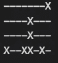
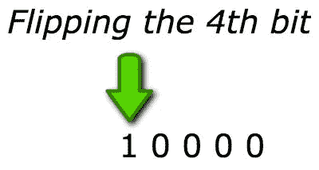

# 通过逐位编码在一个字中存储多个网格坐标

> 原文：<https://itnext.io/store-grid-coordinates-in-1-word-via-bitwise-ops-91e9c9b0d012?source=collection_archive---------3----------------------->

我应该先解释一下，我不是位运算符、有符号整数、二进制补码或网格方面的专家。但是在偶然发现这种技术(在各种“code golf”和“JS1K”解决方案中)之后，我发现它非常有趣，并且认为其他人可能会喜欢我分享它。

所以技术本质上是我们可以**通过使用逐位编码将一个 8x4 网格的值存储到一个 6 字符的字**中。一般来说，使用这种技术，值不一定是网格的值，它们可以是任何值，但我认为这是一个很好的例子。放到网格上…

# 网格

所以网格是 8x4，所以它有 32 个值，这是由于 JS max 整数值是 32 位长。这非常重要，因为我们的限制现在是 32 个值。

值得注意的是，JS 实际上可以表示高达 52 位的整数(更高的数字进入指数部分，因此开始失去准确性)，它只是位操作被限制为 32 位。

从技术上来说，如果我们使用网格，它可以是任何大小，但中间的值块必须是 8x4



我们的 8x4 网格和值(X)

左边的值是 7，12，20，24，27，28，30。它们各自对应于一个位置(索引为 0，即 7 是第 8 个项目，依此类推。)

这些特定值可以存储为单词“ ***opmfeo*** ”。让我们看看它是如何工作的。

# 术语

首先要介绍一些要点。

*   二进制与十进制系统；有不同的方法来表示同一个数字。二进制使用二进制，而十进制使用十进制。十进制的 8 是二进制的 1000。
*   按位运算符；在二进制水平上对整数进行运算的符号。对我们的一组值执行 OR 运算，在我们的上下文中，它会将两个值相加。`<<`可用于在给定位置移位，例如`1 << 3` (是 1000 个二进制或 8 个十进制)。请注意，所有按位运算符的操作数都被转换为二进制补码格式的有符号 32 位整数
*   二的补码；计算机表示整数的方法。对于一个 N 位数，它被定义为“ *N 的 2 次方*”，例如 4 的 2 次方是 2*2*2*2，即 16。利用这一点可以计算出哪个位位置产生哪个值(即翻转位 4 产生十进制值 16)。



*   口罩；用于定义要保留的位和要清除的位。通过位运算将掩码应用于给定值。

# **编码**

在我们的编码中，我们将把我们的网格值组转换成一个单词。我们将使用二进制补码作为掩码(即`1 << X`)。

步骤:

1.  翻转每个位置的位(产生新的二进制/十进制数)
2.  将它们加在一起成为一个整数(在我们的例子中，总数是`1494225024` )
3.  基数 36 编码新单词

```
const gridEncoded = 1 << 7 | 1 << 12 | 1 << 20 | 1 << 24 | 1 << 27 | 1 << 28 | 1 << 30;const slimEncode = (gridEncoded).toString(36);
```

上面产生了"***【OPM FeO】***，但是它可以用任何数字的变体来完成。

# 解码

在我们的解码过程中，我们会把我们的单词还原成一组数字。

步骤:

1.  基数 36 将该值解码成一个数
2.  迭代 32 次，每次移动一位，使用按位 AND (&)运算符确定匹配

```
const gridDecoded = parseInt(slimEncode, 36);
const MAX_JS_INT_BITS = 32;const gridPositions = [];
for(i=0; i<MAX_JS_INT_BITS; i++) { 
  if (puzzleEncoded & 1<<i) {
    gridPositions.push(i);
  }
}// gridPositions.length is 7
```

现在我们只剩下一组初始的`gridEncoded`值。

# 有什么意义？

我发现了解 JS 中关于整数的实际情况以及位操作符的实际可能性是很有趣的。

这个特殊的例子可以通过最小化所需的字节来优化数据的存储或传输，尽管这种形式不太可能节省很多。如前所述，我注意到它以类似的形式出现在所有在线 Javascript 挑战中。

将来使用新的“大整数”数据类型，我们将能够拥有比 32 位大得多的数据类型(允许这种编码技术有更多更高的值)。“大整数”实际上没有上限，这完全取决于可用内存。

如果你觉得这些有趣，我真的很感激鼓掌或评论作为反馈:)

谢谢 X