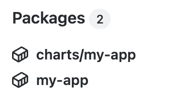
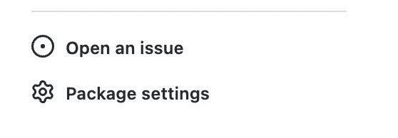

# 在一个注册表中存储应用程序舵图和 Docker 图像

> 原文：<https://itnext.io/storing-app-helm-charts-docker-images-in-one-registry-a11444886a50?source=collection_archive---------1----------------------->


[伊恩·泰勒](https://unsplash.com/es/@carrier_lost?utm_source=medium&utm_medium=referral)在 [Unsplash](https://unsplash.com?utm_source=medium&utm_medium=referral) 上拍照

由于 helm charts 提供了更好的接口来封装 docker 映像上的部署逻辑，许多开发人员选择将他们的应用程序打包成 helm charts。

# 舵库

默认情况下，helm 支持在 [helm 仓库](https://helm.sh/docs/topics/chart_repository/)中存储 helm 图表，本质上是一个 HTTP 服务器。服务器需要提供一个海图索引 YAML 文件，该文件记录了所有存储的舵图的元数据。由于 helm chart 存储库无法托管 docker 映像，因此用户必须管理对 helm chart 存储库和 docker 映像注册表的不同访问，以便进行部署。此外，由于 helm chart 存储库的单一索引文件设计，一旦索引文件变得足够大，您可能还会遇到[性能问题](https://github.com/bitnami/charts/issues/10539)。

# OCI 注册表支持

自 Helm 3.8.0 以来，开放集装箱倡议(OCI)注册支持功能已普遍可用。此功能允许用户在注册表中存储舵图作为 OCI 兼容的工件。另一方面，随着许多托管容器图像注册服务开始支持存储 OCI 兼容的工件，我们终于可以在同一个注册中心存储舵图和 docker 图像。以下是一些支持存储集装箱图像和舵图的注册服务:

*   [谷歌神器注册表](https://cloud.google.com/artifact-registry/docs/helm)
*   [AWS 弹性容器注册表](https://docs.aws.amazon.com/AmazonECR/latest/userguide/push-oci-artifact.html)
*   [Azure 容器注册中心](https://docs.microsoft.com/en-us/azure/container-registry/container-registry-helm-repos)
*   [GitHub 容器注册表](https://docs.github.com/en/packages/working-with-a-github-packages-registry/working-with-the-container-registry)

> 不幸的是，OCI 对 Docker Hub 的图像支持仍在开发中。
> 
> 更新:[Docker Hub 的 OCI 映像支持现已推出(2022 年 10 月 31 日)！](https://www.docker.com/blog/announcing-docker-hub-oci-artifacts-support/)

# 将舵图推送到 Github 容器注册表

GitHub Container Registry 可能是开源项目的一个显而易见的选择，因为它对公共存储库是免费的。

使用 GitHub Action CI，将舵图和 Docker 图像推送到 Github 容器注册表相对容易。要从 GitHub Action CI 访问注册表，可以使用自动创建的`GITHUB_TOKEN`进行身份验证。默认情况下，`GITHUB_TOKEN`对注册表有[读/写权限](https://docs.github.com/en/actions/security-guides/automatic-token-authentication#permissions-for-the-github_token)。

下面是一个使用`GITHUB_TOKEN`将 docker image & helm chart 推送到容器注册表的示例 CI 管道:

首次成功运行管道后，您将在回购主页上找到一个新的“Package”部分。“charts/my-app”包是舵图，“my-app”包是我们推送到 GitHub 容器注册表的 docker 镜像。



回购主页上的“包装”部分

单击任何软件包的链接都会将您带到软件包主页。软件包主页上的“软件包设置”链接允许您管理对软件包的访问。例如，将其更改为“公共”或“私有”包，或者允许另一个 repo 的 CI 工作流访问该包。



软件包主页上的“软件包设置”链接

# 从 Github 容器注册表中提取舵图

要从容器注册中心获取用于部署的舵图，只需:

```
helm pull ghcr.io/[REPO_OWNER]/charts/my-app:1.0.0
```

这里，`[REPO_OWNER]`是 GitHub 回购所有者/用户名。

您也可以在 helm 升级/安装命令中指定 OCI URL:

```
helm upgrade [RELEASE_NAME] oci://ghcr.io/[REPO_OWNER]/charts/catalog-manager --install --version 1.0.0
```

这里，`[RELEASE_NAME]`是你为你的部署选择的头盔发布名称。

如果您将舵图表包访问权限更改为私有，您需要在访问舵图表之前登录:

```
helm registry login -u [your Github username] ghcr.io/[REPO_OWNER]
```

除了使用您的 GitHub 帐户密码，您还可以选择使用 [GitHub 个人访问令牌(PAT)](https://docs.github.com/en/authentication/keeping-your-account-and-data-secure/creating-a-personal-access-token) 。

# 从 Github 容器注册表中提取 Docker 图像

要从容器注册表中提取 docker 映像，只需运行:

```
docker pull ghcr.io/[REPO_OWNER]/my-app:1.0.0
```

这里，`[REPO_OWNER]`是 GitHub 回购所有者/用户名。

如果您将舵图表包访问权限更改为私有，您需要在访问舵图表之前登录:

```
docker login ghcr.io -u [your Github username]
```

除了使用您的 Github 帐户密码，您还可以使用 [GitHub 个人访问令牌(PAT)](https://docs.github.com/en/authentication/keeping-your-account-and-data-secure/creating-a-personal-access-token) 。

要从 k8s 集群中提取私有 docker 映像，您可以使用 GitHub 帐户密码或 PAT 创建一个“秘密”:

```
kubectl create secret docker-registry [secret-name] --docker-server=ghcr.io --docker-username=[Github-name] --docker-password=[your-password-or-PAT] --docker-email=[your-email]
```

一旦创建了秘密，您可以将“imagePullSecrets”字段设置为秘密名称，以使 pod 使用您刚刚创建的秘密来提取图像。