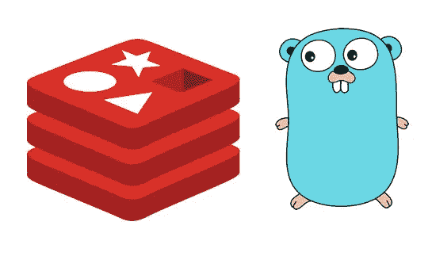

# 使用 ReJSON 在 Redis 中存储 Go 结构

> 原文：<https://itnext.io/storing-go-structs-in-redis-using-rejson-dab7f8fc0053?source=collection_archive---------1----------------------->



图片提供:[https://redis labs . com/blog/redis-go-designed-improve-performance/](https://redislabs.com/blog/redis-go-designed-improve-performance/)

你们很多人可能对 [**Redis**](https://redis.io/) 很熟悉。对于外行来说，redis 即使不是最流行的，也是最广泛采用的数据库/缓存之一。

官方文档将 [redis](https://redis.io/) 描述为，

> Redis 是一个开源的(BSD 许可的)、内存中的数据结构存储，用作数据库、缓存和消息代理。它支持数据结构，如字符串、哈希、列表、集合、带有范围查询的排序集合、位图、超级日志和带有 radius 查询的地理空间索引。Redis 具有内置的复制、Lua 脚本、LRU 驱逐、事务和不同级别的磁盘持久性，并通过 Redis Sentinel 和 Redis Cluster 的自动分区提供高可用性。

redis 与其他(传统)数据库的不同之处在于它是一个[键值](https://en.wikipedia.org/wiki/Key-value_database)存储(除此之外，它位于内存中)。这意味着在这样的数据库中，所有的值都存储在一个键中(比如字典)。

然而，我跑题了，这个帖子不是关于 redis 的，所以我们继续吧！

# 使用 Go 与 Redis 交互

作为一名使用 redis 的 Go 开发人员，有时我们需要在 redis 中缓存我们的对象。让我们看看如何使用 Redis 中的`HMSET`来实现这一点。

一个简单的 go 结构应该是这样的，

```
type SimpleObject struct {
    FieldA string
    FieldB int
}simpleObject := SimpleObject{“John Doe”,24}
```

很明显，要在 redis 中存储对象，我们需要将它转换成一个键值对。我们通过使用 Go Struct 字段名作为键和根据它存储的结构值来实现这一点。

一个**散列**将是一个完美的候选，它将属于一个对象的所有字段绑定回对象本身。从`redis-cli`开始，我们将执行以下操作:

```
127.0.0.1:6379> HMSET simple_object fieldA “John Doe” fieldB 24
OK
```

使用`HGETALL`命令获取的结果将是，

```
127.0.0.1:6379> HGETALL simple_object
fieldA
John Doe
fieldB
24
```

好了，现在我们知道了对象是如何被封送到数据库中的。让我们以编程的方式继续做这件事吧！

虽然 redis 有相当多的 go 客户，但我考虑与 Redigo 合作。它在 github 上有一个很棒的社区，并且是 redis 最受欢迎的 go-client 之一，拥有超过 100 名 4K 明星。

## Redigo 助手— AddFlat 和 ScanStruct

Redigo 配备了一组很棒的助手函数，其中一个我们将使用`AddFlat`，在将它添加到 redis 之前，展平我们的结构。

```
// Get the connection object
conn, err := redis.Dial(“tcp”, “localhost:6379”)
if err != nil {
    return
}// Invoke the command using the Do command
_, err = conn.Do(“HMSET”, redis.Args{“simple_object”}.AddFlat(simpleObject)…)
if err != nil {
    return
}
```

现在如果你想把这个对象读回你的对象，我们可以用`HGETALL`命令来完成，

```
value, err := redis.Values(conn.Do(“HGETALL”, key))
if err != nil {
    return
}object := SimpleStruct{}
err = redis.ScanStruct(value, &object)
if err != nil {
    return
}
```

> 够简单了吧？让我们看看更复杂的东西…

## Go 结构中的嵌入对象

现在让我们来看一个更复杂的结构，

```
type Student struct {
    Info *StudentDetails `json:”info,omitempty”`
    Rank int `json:”rank,omitempty”`
}type StudentDetails struct {
    FirstName string
    LastName string
    Major string
}studentJD := Student{
    Info: &StudentDetails{
        FirstName: “John”,
        LastName: “Doe”,
        Major: “CSE”,
    },
    Rank: 1,
}
```

我们现在拥有的是一个**嵌入的**结构，带有`StudentDetails`，作为`Student`对象的成员。

让我们再次尝试使用`HMSET`，

```
// Invoke the command using the Do command
_, err = conn.Do(“HMSET”, redis.Args{“JohnDoe”}.AddFlat(studentJD)…)
if err != nil {
    return
}
```

如果我们现在查看 redis，我们会看到 info 对象被存储为–

```
127.0.0.1:6379> HGETALL JohnDoe
Info
&{John Doe CSE}
Rank
1
```

这就是问题所在。当我们试图将信息检索回对象中时， **ScanStruct** 失败，并出现**错误**，

```
**redigo.ScanStruct: cannot assign field Info: cannot convert from Redis bulk string to *main.StudentDetails**
```

> 史诗失败！

发生这种情况是因为在 redis 中，所有东西都被存储为一个**字符串** *【对于较大的对象是批量字符串】。*

## 现在怎么办？

快速搜索会带你找到几个解决方案。其中一个解决方案建议使用封送拆收器(`JSON` marshal)，其他的建议使用`MessagePack`。

我将在下面展示基于`JSON`的解决方案。

```
b, err := json.Marshal(&studentJD)
if err != nil {
    return
}_, err = conn.Do(“SET”, “JohnDoe”, string(b))
if err != nil {
    return
}
```

要检索它，只需使用`GET`命令读回`JSON`字符串

```
objStr, err = redis.String(conn.Do(“GET”, “JohnDoe”))
if err != nil {
    return
}b := []byte(objStr)student := &Student{}err = json.Unmarshal(b, student)
if err != nil {
    return
}
```

如果我们想要做的是 ***完整地缓存对象*** ，这就太棒了。

如果我们只想添加、修改或读取其中一个字段，例如，如果 John Doe*将其专业从***【CSE****更改为 ***EE*** 该怎么办？？**

*我们可以做到这一点的唯一方法是读取 JSON 字符串，将它解封到对象中，修改对象并将其重新写入 redis。看起来工作量很大！*

> **如果你想知道，通过使用* `*HGET*` */* `*HSET*` *命令，用* `*Hash*` *做这件事很简单。要是那样就好了——***！***

****

**因为，没有模因，任何网络帖子都不可能存在…**

## **瑞森**

**RedisLabs 的优秀团队为我们带来了一个解决方案，让我们可以像对待传统对象一样对待我们的对象。**

**让我们直接进入主题。我直接从 rejson 文档中挑选了这个例子，**

```
**127.0.0.1:6379> JSON.SET amoreinterestingexample . ‘[ true, { “answer”: 42 }, null ]’
OK
127.0.0.1:6379> JSON.GET amoreinterestingexample
“[true,{\”answer\”:42},null]”
127.0.0.1:6379> JSON.GET amoreinterestingexample [1].answer
“42”
127.0.0.1:6379> JSON.DEL amoreinterestingexample [-1]
1
127.0.0.1:6379> JSON.GET amoreinterestingexample
“[true,{\”answer\”:42}]”**
```

**为了以编程方式做到这一点，我们肯定可以使用原始形式的`Redigo`。[这意味着支持 Redis 支持的任何命令，使用`conn.Do(…)`方法]。**

**然而，我花了一些时间将所有的`ReJSON`命令转换成一个 Go 便利包，名为 [go-rejson](https://github.com/nitishm/go-rejson) 。**

**回到我们的`Student`对象，我们可以使用下面的步骤通过编程将其添加到 Redis 中。**

```
**import "github.com/nitishm/go-rejson"_, err = rejson.JSONSet(conn, “JohnDoeJSON, “.”, studentJD, false, false)
if err != nil {
    return
}**
```

**`redis-cli`中的快速检查给了我们，**

```
**127.0.0.1:6379> JSON.GET JohnDoeJSON
{“info”:{“FirstName”:”John”,”LastName”:”Doe”,”Major”:”CSE”},”rank”:1}**
```

**如果我希望只从 redis 条目中读取信息字段，我将执行如下的`JSON.SET`,**

```
**127.0.0.1:6379> JSON.GET JohnDoeJSON .info
{“FirstName”:”John”,”LastName”:”Doe”,”Major”:”CSE”}**
```

**类似地，对于**等级**字段，我可以引用`.rank`，**

```
**127.0.0.1:6379> JSON.GET JohnDoeJSON .rank
1**
```

**为了以编程方式检索学生对象，我们将通过`JSONGet()`方法使用`JSON.GET`命令，**

```
**v, err := rejson.JSONGet(conn, “JohnDoeJSON, “”)
if err != nil {
    return
}outStudent := &Student{}
err = json.Unmarshal(outJSON.([]byte), outStudent)
if err != nil {
    return
}**
```

**为了设置**等级**字段，我们可以使用`JSONSet()`方法对`.rank`字段使用`JSON.SET`命令，**

```
**_, err = rejson.JSONSet(conn, “JohnDoeJSON, “.info.Major”, “EE”, false, false)
if err != nil {
    return
}**
```

**检查`redis-cli`中的条目，我们得到:**

```
**127.0.0.1:6379> JSON.GET JohnDoeJSON{“info”:{“FirstName”:”John”,”LastName”:”Doe”,”Major”:”EE”},”rank”:1}**
```

# **运行此示例**

## **使用 Docker 用 rejson 模块启动 redis**

```
**docker run -p 6379:6379 --name redis-rejson redislabs/rejson:latest**
```

## **从 github 克隆这个例子**

```
**# git clone [https://github.com/nitishm/rejson-struct.git](https://github.com/nitishm/rejson-struct.git)
# cd rejson-struct
# go run main.go**
```

***要了解更多关于****Go-ReJSON****包的信息，请访问*[***【https://github.com/nitishm/go-rejson】***](https://github.com/nitishm/go-rejson)*。***

***阅读更多关于* ***雷吉森*** *在他们的官方文档页面，*[***http://rejson.io/****。*](http://rejson.io/.)**

**如果你喜欢这篇文章并觉得它很有用，别忘了给它一个👏！！**

**如果能得到一些反馈，我将不胜感激！请务必留下您的评论。**

**也可以看看我之前(第一篇)的帖子——“*在 Golang 构建微服务框架”在*[https://medium . com/@ nitishmalhotra/Building-a-microservice-framework-in-Golang-dd3c 9530 dff 9](https://medium.com/@nitishmalhotra/building-a-microservice-framework-in-golang-dd3c9530dff9)**