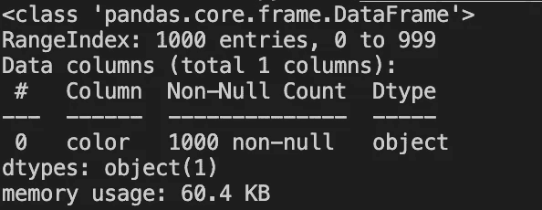
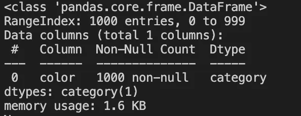
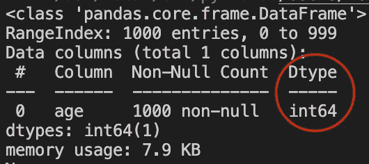
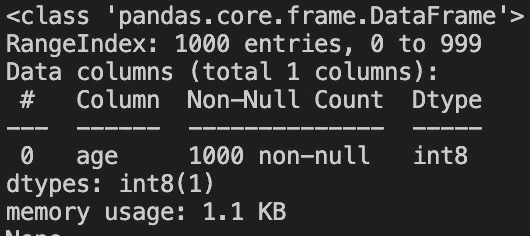

# 用 Python 高效存储熊猫数据帧

> 原文：<https://itnext.io/storing-pandas-data-frames-efficiently-in-python-cff669953485?source=collection_archive---------1----------------------->

照片由[米卡·鲍梅斯特](https://unsplash.com/@mbaumi?utm_source=medium&utm_medium=referral)在 [Unsplash](https://unsplash.com?utm_source=medium&utm_medium=referral) 上拍摄

## 介绍

如果您正在使用 Python 解决数据科学和/或机器学习问题，您可能会遇到 Pandas，这是 Python 中最常见的数据分析和操作包之一。

Pandas 以一种称为 DataFrame 的形式存储数据，data frame 是一种二维数据结构(类似于二维数组)，可以包含各种格式的数据(数字数据、分类变量等)。

因此，这里有一些以更有效的方式在数据帧中存储数据的技巧，可以提高内存和运行时性能。

## 技巧 1:强制转换分类变量

假设我们用 1000 个值填充名为`color`的 pandas 列，这些值是由包含 6 个不同值的数组随机选取的(“白”、“黑”、“红”、“黄”、“蓝”和“绿”)。

该列现在包含一个分类变量，因为它只能从一个**有限**集中获取**离散**和值。默认情况下，Pandas 会将这类列存储为 type object。

下面的代码将打印我们刚刚定义的列的数据类型以及数据帧的“内存占用”。

用分类变量定义数据帧

运行上面的代码后，我们会收到如下截图所示的结果。默认情况下，Pandas 将数据类型`object`分配给该列，该列使用大约 60.4 KB 的内存。

现在让我们试着**将**这个列转换成一个名为`category`的数据类型，并再次打印数据帧的内存占用。

将“颜色”列转换为“类别”类型

我们再次运行代码，我们看到以下结果。

怎么了？令人惊讶的是，通过这个简单的改变**,我们成功地将内存中数据帧的大小减少了 97%。**

这是因为 pandas 处理分类值比处理一般值更有效，因为通过将它们声明为分类值，它知道它们是离散的，并且只能接受某些值。

然而，**不能保证**内存占用的减少量，因为影响优化的主要因素是我们处理的变量的基数**。**

注意:基数是分类变量可以接受的不同值的数量(在我们的例子中，变量`color`只能接受 6 个不同的值，因此基数为 6)。

根据经验，您可以放心地假设**分类变量的基数越低，使用上面演示的方法内存占用的减少就越多**。

## 技巧#2:将变量转换为 bool(技巧#1 的特例)

很多时候，在一个数据集中，我们可能会发现“分类”列只有两个离散值，如“是”和“否”或“男性”和“女性”，默认情况下，这些值将被 pandas 视为`objects`。所以这个技巧是关于第一个技巧的一个特例。但是这一次，我们不会将这些值转换为`category`，而是将**将**映射为布尔值(真/假)。由于我认为对这种情况再次进行数学计算没有价值，我相信您能够理解这种移动将对具有上述特征的列的内存占用产生重大的积极影响。

因此，假设包含字符串值的列名为`coin_toss`，并且该列只包含值`HEAD`和`TAILS`，我们可以使用下面的代码将该列转换为布尔值。

将只有 2 个值的分类列转换为 bool

## 技巧 3:尽可能向下转换整数

现在假设我们想在熊猫数据帧的一列中保存 1000 个人的年龄。我们将通过随机选择[0，120]范围内的整数来填充该列(因为年龄总是非负的，并且在这种情况下观察到大于 120 的值是非常不可能的)。

下面的代码片段完成了上述所有工作，然后打印列的数据类型和数据集的内存占用。

通过随机选取[0，120]范围内的整数值来创建“年龄”列

当我们运行代码时，我们观察到默认情况下 pandas 选择了`int64`作为该列的数据类型，该列的总内存占用大约为 7.9KB。

此时，让我们记住，`int64`数据类型最多可以存储 2⁶⁴不同值**，而我们只需要存储 120 个值** ( < 2⁸)，这些值**可以安全地存储为一个 8 位整数**。这实际上意味着，每行大约 64-8 = 56 位**在我们的场景中是完全无用的。正如你可能理解的那样，这是一个巨大的内存浪费，现在我们来看看如何避免它。**

现在我们将**将**该列向下转换到`int8`并再次打印数据帧的内存占用。

Yayyy！通过将列向下转换为`int8`,我们成功地将内存占用减少到之前设置的 1/8。

## 结论

作为许多 python 应用程序的存储和数据操作层，正确有效地使用 pandas 数据帧对现代软件解决方案的性能有着重要的作用。正如本文中所展示的，能够以安全可靠的方式轻松实现的小优化可以显著提高整体性能。

 [## 通过我的推荐链接加入 Medium-Petros Demetrakopoulos

### 阅读 Petros Demetrakopoulos(以及媒体上成千上万的其他作家)的每一个故事。您的会员费直接…

petrosdemetrakopoulos.medium.com](https://petrosdemetrakopoulos.medium.com/membership)