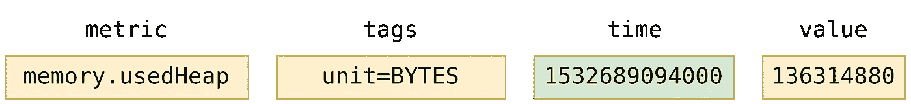
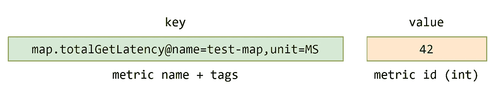
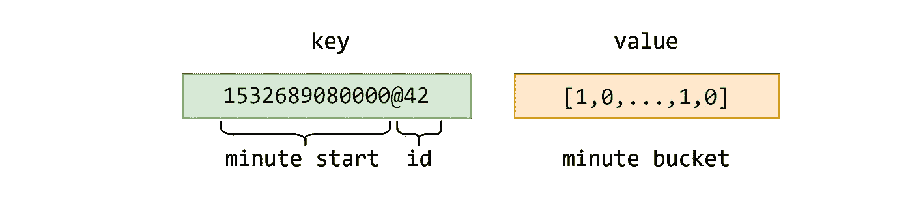
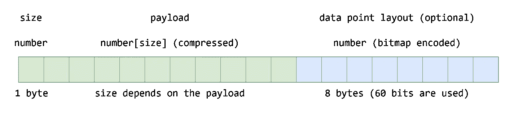
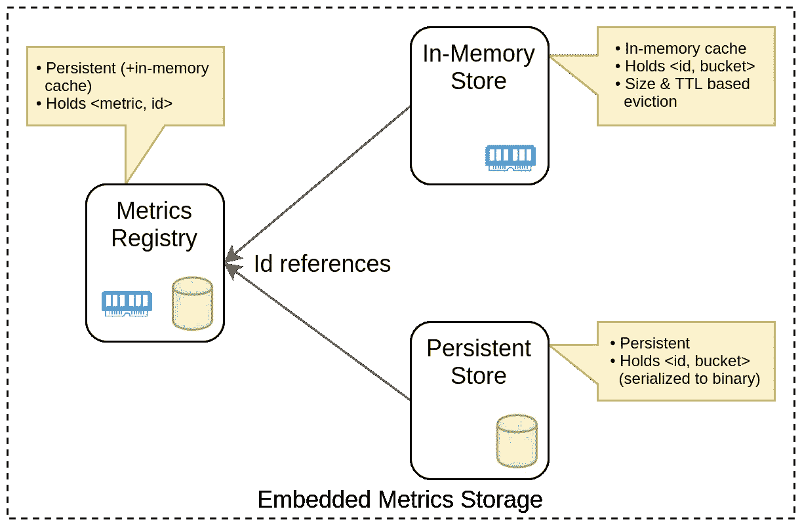
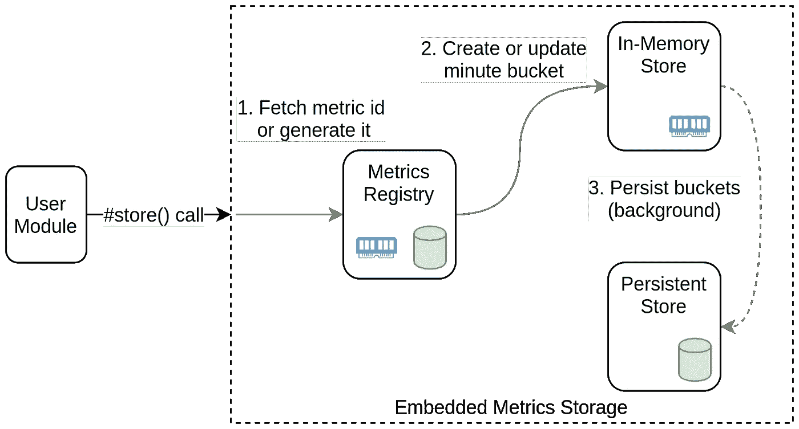
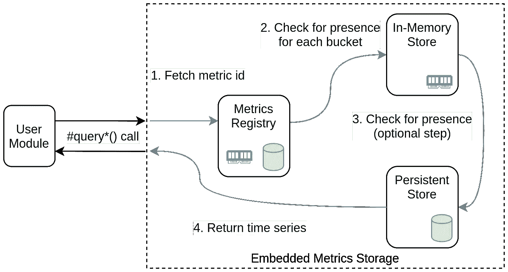

# 在 RocksDB 中存储时间序列:指南

> 原文：<https://itnext.io/storing-time-series-in-rocksdb-a-cookbook-e873fcb117e4?source=collection_archive---------1----------------------->

在 [Unsplash](https://unsplash.com?utm_source=medium&utm_medium=referral) 上由 [Aron 视觉](https://unsplash.com/@aronvisuals?utm_source=medium&utm_medium=referral)拍摄的照片

一般认为 K/V 存储不适合时间序列(TS)数据。原因是大量的写入和时间序列隐含的大量数据。但是常识有时可能是错误的。今天我们将讨论在来自脸书的嵌入式键/值(K/V)存储 [RocksDB](https://rocksdb.org/) 之上构建(相对)高效的 TS 存储的方法。RocksDB 非常适合我们的需求，因为它已经可以投入生产，维护良好，并且由于采用了 [LSM 树](https://en.wikipedia.org/wiki/Log-structured_merge-tree)数据结构，它提供了稳定的写入速度。使用该方法构建的 TS 存储应该能够显示良好的读/写吞吐量，以及适当的数据压缩率。

**免责声明**。在我们进一步讨论之前，我需要说，在可以使用现有 TS 数据库的情况下，您当然应该使用它。但有时您可能需要一个嵌入式 TS 存储，然后选项列表几乎是空的。

这篇博客文章是对这种方法的简短总结，在我不久前的这个[演讲](https://youtu.be/1fzae--iHYU)中有更详细的描述。虽然那次谈话的重点是 Hazelcast 管理中心的需求，并包括一些 Java 代码片段，但我将尽可能保持这篇文章的简短和语言无关性。

我的最终目标是充分阐明这个想法，以便任何开发人员都可以用任何流行的编程语言在 RocksDB(或任何其他 K/V 存储)之上构建嵌入式 TS 存储。

让我们从进一步解释所必需的术语和假设开始。出于可读性的考虑，我将对代码片段使用 TypeScript。

# 术语

“指标”——可以在特定时间测量的数值，具有现实意义。示例:CPU 负载、已用堆内存。由一个名称和一组标签唯一表征。

“数据点”(又名“样本”)—在给定时间测量的度量值。以度量、时间戳(Unix 时间)和值为特征。

“时间序列”——属于同一指标的一系列数据点，具有单调递增的时间戳。

数据点可以用下面的接口来描述。

这是真实世界数据点的样子。

存储本身可以用下面的接口表示。

如您所见，公共 API 非常简单，提供了存储数据点列表和查询单个时间序列(即单个指标)的方法。这就是这里使用术语“存储”的原因:它不是一个 TS 数据库，因为它缺少查询语言和由指标元数据索引支持的执行引擎、聚合 API 以及其他一些模块。另一方面，其中许多功能可以构建在存储之上，但这超出了我们今天的主题。

# 假设

所有 TS 数据库和存储器都对时间序列数据的形状做出假设，我们也是如此。

首先，我们假设时间戳具有一秒的粒度，即每个时间戳对应于一秒的开始。正如我们将在后面看到的，这种假设为基于位图的数据压缩提供了机会。

其次，数据点值必须是整数。这种假设也允许我们使用某些压缩技术，但这并不是必须的，也可以通过使用不同的压缩算法来支持浮点数。

现在，当我们更好地了解我们的需求时，我们来讨论 K/V 数据布局。

# 键值布局

这里的主要思想对于时间序列是非常自然的，并且可以在大多数(如果不是全部)TS 数据库中找到。为了减少 K/V 条目的数量并启用压缩数据的方法，我们将时间序列存储在分钟桶中。选择一分钟作为时间间隔是持久性(更小的时间间隔，更频繁的磁盘持久性)和整体存储效率(桶中更多的数据点，更好的压缩和读/写吞吐量)之间的折衷。

第二步，我们还将指标提取到一个单独的 K/V 存储(RocksDB 称之为“数据库”)中，并分配整数标识符。这样，主存储中的每个数据点记录都包含标识符，而不是冗长的指标描述。

保存分钟时段的主 K/V 商店的布局如下所示。

这里，该值包含一个字节缓冲区(一个 blob ),其中包含压缩的分时段数据。

您可能已经猜到了，下一个主题是数据压缩。

# 数据点压缩

在我们的设计中，每个分钟时段可以容纳多达 60 个数据点。实际上，它们中的一些可能会丢失，或者数据收集间隔可能会大于一秒。最直接的方法是将整个桶存储在一个包含 60 个元素的数字数组中，并且可能用一种或另一种算法压缩它。但是我们要尽量避免储存“洞”，所以我们需要更聪明的东西。

因为我们已经在键中存储了分钟开始的时间戳，所以我们只需要存储每个数据点的相应分钟开始的偏移量。接下来是位图编码，我们将使用的第一种压缩技术。使用位图，我们只需要 64 位来编码所有偏移。让我们称 blob 的这一部分为“数据点布局”。

至于值(“有效载荷”)，我们可以将它们放在一个数组中，并用一个结合了增量编码和游程编码的简单算法对它们进行压缩。我们不打算讨论精确算法的所有细节，但是如果你想了解更多，这篇[博客文章](https://blog.timescale.com/blog/time-series-compression-algorithms-explained/)将是一个很好的起点。

此图说明了每个分钟时段的布局。

是时候讨论这些构件如何作为一个整体一起工作了。

# 时序存储设计

让我们从高级设计的角度来看一下实现可能是什么样子。

**注**。下面的设计假设您正在使用 RocksDB JNI 绑定或任何类似的绑定来支持您选择的语言，并且不想同时用 Java 和 C++编写代码。您可能还希望能够禁用存储中的持久性。如果不是这样，您可以考虑使用[合并操作符](https://github.com/facebook/rocksdb/wiki/Merge-Operator)，它将接受输入的数据点，将它们与相应的分钟桶合并，压缩桶，并将结果就地存储。这样设计会变得更简单，因为你不需要内存存储和桶累加逻辑。

在这里，Metrics Registry 代表包含指标到标识符对的 K/V 存储，持久性存储保存分钟存储桶，内存存储充当写后缓存。

每次写入都要经过以下流程。

在每次`store()`调用时，数据点在存储在缓存中的分钟时段中累积，而磁盘上的持久性在后台作业中定期发生。作业的每次运行都会遍历所有缓存的存储桶，并持久保存那些至少累积了一分钟的存储桶。作为拼图的最后一块，压缩应该在持久化存储桶之前应用。

这样，我们将数据点分组到桶中，并从数据压缩和批量写入中受益。

如下所示，读取流时间序列要简单得多。

当读取数据点时，我们首先检查 Metrics Registry 以找到标识符(提示:内存缓存肯定会加快这个步骤)。然后我们检查内存中的存储，试图找到桶，只有这样我们才从磁盘(更准确地说，从 RocksDB)中读取它。通过这种方式，我们可以确保对最近数据点的查询将会很快，这对于许多用例来说是有价值的，比如在 UI 中显示最新的数据。

这基本上是整个方法。祝贺你获得了新知识！

尽管这一理论很有价值，但毫无疑问，你们中的一些人可能想知道 TS 存储的具体实现的特征。

# 潜在特征

不久前，我们为管理中心开发了一款嵌入式 TS 存储，这是一款针对 [Hazelcast IMDG](https://hazelcast.org/imdg/) 的集群管理和监控应用。存储是在 RocksDB 之上用 Java 编写的，并遵循了上述设计。

除了其他类型的测试，我们还对存储进行了基准测试，以了解其性能特征。基准测试模拟了 10 个集群节点，每 3 秒钟报告 12 万个指标。0-1，000 范围内的随机整数被用作数据点值。因此，在采用 SATA III 连接 SSD 的像样硬件上，存储显示每秒 40 万数据点写入和每秒 19 万分钟系列(物理)读取的吞吐量。这些数字可以称得上足够好了，至少满足了我们的需求。

**更新**。最近，我们在存储方面做了一些改进实验(批量写入、手动 WAL 刷新、用自定义缓存库替换第三方缓存库),并且能够实现大约每秒 2M 数据点的写入。

至于压缩效率，平均每个数据点的存储开销约为 5.25 字节。原始数据点数据占用 16 个字节，所以压缩比在 x3 左右。这个结果比独立 TS 数据库通常[显示的](https://prometheus.io/docs/prometheus/1.8/storage/#chunk-encoding)差，但并不可怕，对于许多用例来说可能已经足够了，尤其是考虑到存储是多么简单的时候。

# 摘要

我有意将额外的挑战，比如潜在的增强和技术限制，排除在这篇博文的范围之外，但是你可能会在演讲中发现它们。此外，这种设计并不是一成不变的，因此有很大的变化空间。

我的主要意图是展示一个简单但足够好的时间序列存储可以很容易地构建在 RocksDB 或任何其他合适的 K/V 存储之上。所以，如果你打算写一个，那么祝你好运，祝你编码愉快！