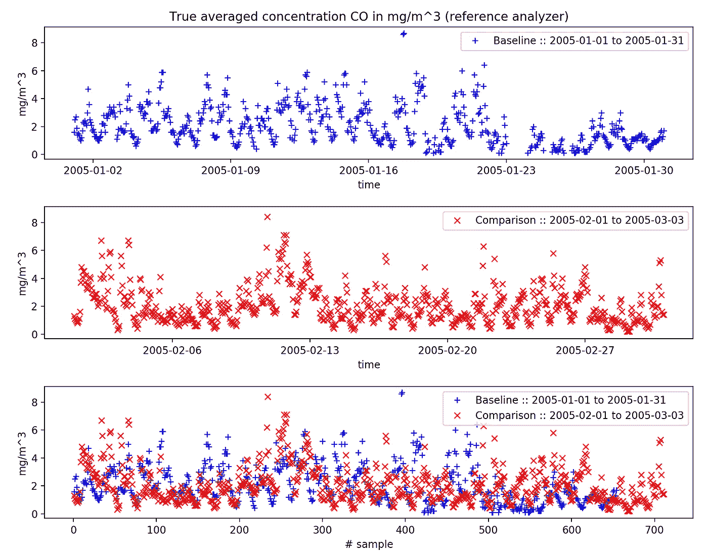
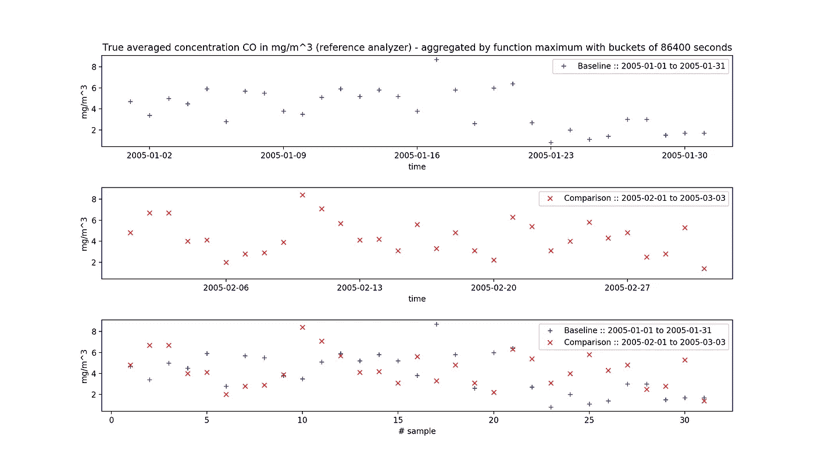
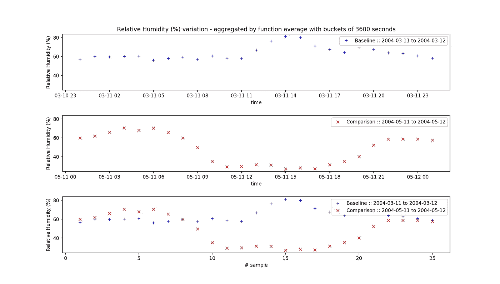
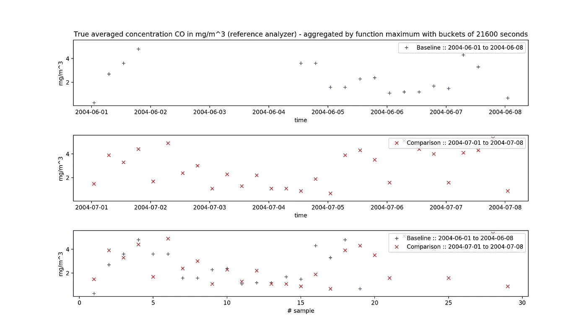
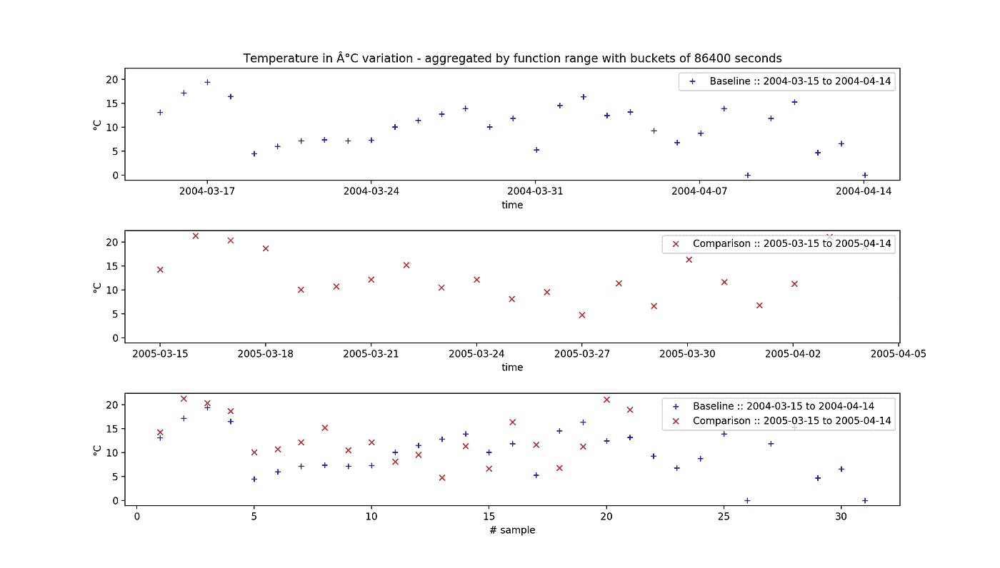
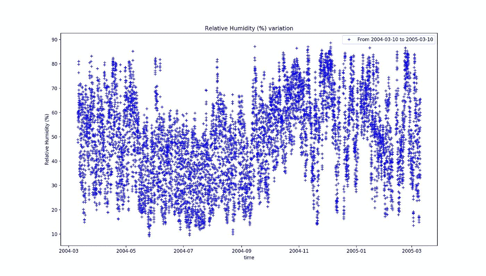
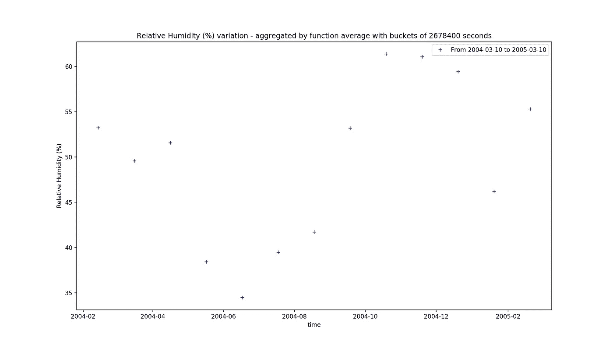

# 直观的时间序列数据库与 Redis 5。X —第 1 部分::RedisTimeSeries 模块

> 原文：<https://itnext.io/straightforward-time-series-dbs-with-redis-5-x-part-1-redistimeseries-module-79aa616159eb?source=collection_archive---------1----------------------->

当人们考虑时间序列数据时，他们会考虑我们正在收集的数据的相关性、趋势和季节变化。我们不仅对数据本身感兴趣，还对它所涉及的特定时间段或间隔感兴趣。我们期望观察模式(符合模型)并进行预测、监控甚至反馈和前馈控制。在查看工业数据、销售预测、预算分析、股票分析等等时，经常会出现这种情况。

当然，Redis(无论是独立的还是带模块的)远不是唯一一个可以处理这种数据模型的，那么是什么让它引人注目呢？

*   与时间序列模型上的任何其他东西都不同，它简单且易于运行。
*   它有一个简单但足够强大的操作集来处理这种类型的数据，并且您可能已经在您公司的技术堆栈中拥有它。您可以将这类问题集成到您已经拥有的基础架构中，并在此基础上进行构建。
*   一个 Redis 实例每分钟可以处理数百万条命令。
*   它占地面积极小，使得安装和维护快速而简单。
*   它需要更少的开发人员和维护人员，从而降低总拥有成本。
*   它并不试图解决时间序列空间内的难题，而是将这些问题留给其他更合适的工具。如果你的核心业务是基于时间序列数据和分析，你应该[跟随这个链接。](https://db-engines.com/en/ranking/time+series+dbms)

现在，我们将制作一个基本的设置，让大家体验一下 Redis 可以为时间序列数据做些什么。你应该能够绘制基线对比图、逐月对比图、逐年对比图等，如下图所示，我们比较了 2005 年 1 月和 2 月的一氧化碳浓度。



基线与对比图::一氧化碳的真实平均浓度 mg/mg(逐月)

不需要对后端的数据进行任何操作，只需要在 Redis 上进行操作，我们就可以在与上述相同的时间范围内展示如下几个示例(每天最多):



基线与对比图::一氧化碳真实平均浓度的每日最大值 mg/mg(逐月)

# 0.1 在我们深入探讨之前:

我们决定记录这个相互学习的旅程，以更好地理解核心 Redis 5 及其顶级扩展如何工作，讨论这个新版本中的新特性，因此阅读这一系列文章的人可以就它适合和不适合的不同用例做出明智的决定。

我们会认为你对 Redis 5 有一个整体的了解。x，如本系列前几篇文章所述:

— [Redis 5。引擎盖下的 x:1—Redis-Server 启动并运行](https://medium.com/@fcosta_oliveira/redis-5-x-under-the-hood-1-downloading-and-installing-redis-locally-3373fe67a154)

— [Redis 5。引擎盖下的 x:2—Redis 命令和数据结构介绍—第 1 部分](https://medium.com/@fcosta_oliveira/redis-5-x-under-the-hood-2-intro-to-redis-commands-and-data-structures-part-1-41f05501cb52)

# 1 —下载并安装 RedisTimeSeries 模块

如果可能的话，使用最新版本的 Redis 是最佳实践之一。最新的 Redis 主版本(5.0.0)于 2018 年 10 月 17 日在 GitHub 上发布。在这个系列中，我们将采用 2018 年 12 月 12 日推出的最新稳定版本(5.0.3)。如果您的计算机上已经运行了 Redis 和 RedisTimeSeries 模块，您可以跳到第 2 节。

## 1.1 —启动和运行:

我们推荐两种方法在您的机器上启动并运行 ***Redis*** 和 ***Redis 时间序列模块*** :

## 1.1.1 —选项 1 —使用 docker 运行(最简单的方式):

如果您的机器上有 docker，这是设置测试环境的最简单的方式:

```
docker run -p 6379:6379 --name redis5-redistimeseries -d redislabs/redistimeseries
sudo apt install redis-tools
redis-cli 
127.0.0.1:6379>
```

## 1 . 1 . 2——备选方案 2——建立 Redis 和 Redis 时间序列模块:

如果您想要构建 Redis 和 Redis 时间序列模块，请在您的终端上执行以下命令:

```
wget [http://download.redis.io/releases/redis-5.0.3.tar.gz](http://download.redis.io/releases/redis-5.0.3.tar.gz)
tar xvzf redis-5.0.3.tar.gz
cd redis-5.0.3
make
make test
sudo make install
cd .. && git clone [https://github.com/RedisLabsModules/RedisTimeSeries.git](https://github.com/RedisLabsModules/RedisTimeSeries.git) && cd RedisTimeSeries
git submodule init
git submodule update
cd src
make all
```

将下一行添加到`redis.conf`文件:

```
loadmodule **/path/to/****redistimeseries****.so**
```

最后:

```
redis-server **/path/to****/redis.conf &** redis-cli 
127.0.0.1:6379>
```

也可以使用以下命令在运行时加载模块:

```
MODULE LOAD **/path/to/****redistimeseries****.so**
```

要列出所有加载的模块，请使用:

```
127.0.0.1:6379> module list
1) 1) "name"
   2) "timeseries"
   3) "ver"
   4) (integer) 100
```

# 2 —挑选具有挑战性的数据集

时间序列数据的一个极好的来源是 [UCI 机器学习库](http://archive.ics.uci.edu/ml/)。在那里，你会发现高质量的标准数据集，从气象，医学和监测领域的实践。

我们已经决定选择[“空气质量”](https://archive.ics.uci.edu/ml/datasets/Air+quality)数据集用于我们的基本设置，其中包含 9358 个每小时平均响应的实例，这些响应来自嵌入空气质量化学多传感器设备中的 5 个金属氧化物化学传感器阵列。数据是从 2004 年 3 月到 2005 年 2 月(一年)记录的，这将使我们能够仅使用 Redis 对数据 进行汇总和运算，生成以下汇总 ***:***

*   每日比较—比较 1 天的集合。例如，今天与昨天、今天与一周前等等。在我们的设置中，我们将这称为 **-DoD** 。
*   周与周的比较-比较 7 天的集合。在我们的设置中，我们称之为 **-WoW** 。
*   逐月比较-比较 30 天的集合。在我们的设置中，我们将这称为 **-MoM** 。

为了加载数据并生成图表，我们将借助 Python 3.7 以及可视化模块。

## 2.1 —将数据加载到 Redis 中

从[“空气质量”](https://archive.ics.uci.edu/ml/datasets/Air+quality)数据集中，我们将提取“以 mg/m 为单位的真实小时平均 CO 浓度”、以摄氏度(°C)为单位的温度、相对湿度(%)，以及相关时间段。

我们将使用 [TS 为每次测量创建一个时间序列。创建](https://oss.redislabs.com/redistimeseries/commands/#tscreate-create-a-new-time-series)。创建后，所有测量值将使用 [TS 发送。添加](https://oss.redislabs.com/redistimeseries/commands/#tsadd-append-or-create-and-append-a-new-value-to-the-series)。

下面的示例创建一个时序并用三个条目填充它。

```
127.0.0.1:6379> TS.CREATE ts:carbon_monoxide
OK
127.0.0.1:6379> TS.ADD ts:carbon_monoxide 1112587200 2.199
OK
127.0.0.1:6379> TS.ADD ts:carbon_monoxide 1112590800 1.99
OK
127.0.0.1:6379> TS.ADD ts:carbon_monoxide 1112594400 0.4
OK
```

为了简化将数据加载到 RedisTimeseries 的过程，我们在 github 上创建了一个名为 [dataloader.py 的脚本。以下代码只是与](https://github.com/redis-porto/redistimeseries-airquality/blob/master/dataloader.py)[完整文件](https://github.com/redis-porto/redistimeseries-airquality/blob/master/dataloader.py)最相关部分的一个片段:

要正确地将数据加载到 Redis 中，请使用下一组命令:

```
$ python3 -m pip install -r requirements.txt
$ python3 dataloader.py
9471it [00:22, 416.13it/s]
```

您可以看到，脚本在我们的本地机器上运行时，我们实现了大约每秒 416 次迭代，这相当于每分钟 78K 次操作，因为我们正在执行 3 TS。每次迭代添加。有关脚本如何运行的更多详细信息，只需键入:

```
$ python3 dataloader.py -h
usage: dataloader.py [-h] [--port PORT] [--password PASSWORD] [--verbose][--host HOST] [--csv CSV] [--csv_delimiter CSV_DELIMITER]optional arguments:-h, --help            show this help message and exit--port PORT           redis instance port--password PASSWORD   redis instance password--verbose             enable verbose output--host HOST           redis instance host--csv CSV             csv file containing the dataset--csv_delimiter CSV_DELIMITER csv file field delimiter
```

## 2.2 —对数据进行聚合和运算

对于拥有数千甚至数十万个数据点的时间序列来说，在应用程序中逐个筛选每个数据点并在获得数据后进行总结是不现实的。聚合查询允许您总结数据存储本身的指标，从而减少响应、网络带宽和应用程序的后处理。Redis TimeSeries 模块具有以下聚合运算符:任何时段的 Min、Max、Avg、Sum、Range、Count、First 和 Last。它们之间的不同之处在于对分组数据的处理。

min 和 max 聚合器分别返回指定时间段内的最小值或最大值。avg 聚合器返回每个时间帧中时间序列值的平均值。sum 聚合器合计每个时段的所有值。范围聚合器返回每个时段的指定时间范围内的最大和最小观察值之差。Count、First 和 Last 聚合器都是不言自明的。

我们在 github 上创建了一个名为 [plot.py 的脚本。下面的代码只是与](https://github.com/redis-porto/redistimeseries-airquality/blob/master/plot.py)[完整文件](https://github.com/redis-porto/redistimeseries-airquality/blob/master/dataloader.py)最相关部分的一个片段，特别是 Redis 命令 [TS 的用法。范围](https://oss.redislabs.com/redistimeseries/commands/#tsrange-ranged-query)，包含和不包含聚合代码部分。

使用 plot.py 实现可视化，仅使用 Redis 对数据进行聚合和运算，我们将进行以下可视化比较:

*   每日比较—比较 1 天的集合。在我们的设置中，我们将这称为 **-dod** 。例如，比较 2004 年 3 月 11 日和 2004 年 5 月 11 日的相对湿度。我们将使用的聚合器是平均值。

```
$ python plot.py --baseline_start 11/Mar/2004 --comparison_start 11/May/2004 --wow --agg_type=avg --dataset_serie=relative_humidity --bucket_size_seconds=3600
```



*   周与周的比较-比较 7 天的集合。在我们的设置中，我们称之为 **-wow** 。作为 2004 年 6 月的第一周和 2004 年 7 月的第一周的最大一氧化碳浓度之间的比较的例子。我们将使用的聚合器将是最大的。

```
$ python plot.py --baseline_start 01/Jun/2004 --comparison_start 01/Jul/2004 --wow --agg_type=max --dataset_serie=carbon_monoxide --bucket_size_seconds=21600
```



*   逐月比较-比较 30 天的集合。在我们的设置中，我们将这称为 **-mom** 。例如，比较从 2004 年 3 月 15 日开始的一个月和从 2005 年 3 月 15 日开始的一个月期间每天的最大温度变化。我们将使用的聚合器将是范围。

```
$ python plot.py --baseline_start 15/Mar/2004 --comparison_start 15/Mar/2005 --mom --agg_type=range --dataset_serie=temperature --bucket_size_seconds=86400
```



您可以从数据中提取一些见解，而无需检索完整的数据点。如果需要更长的时间段，我们已经启用了用标志 set _ timeframe 和参数 timeframe _ size _ seconds 以秒为单位指定时间范围的选项。

以下示例显示了相对湿度时间序列的一年时间范围，没有汇总。

```
$ python plot.py --baseline_start 10/Mar/2004 --timeframe_size_seconds=31536000 — set_timeframe --agg_type=none --dataset_serie=relative_humidity
```



如果我们想知道每月的平均值，我们可以使用下面的命令:

```
$ python plot.py --baseline_start 10/Mar/2004 --timeframe_size_seconds=31536000 --set_timeframe --agg_type=avg --dataset_serie=relative_humidity --bucket_size_seconds=2678400
```



## 2.3 —我们在哪里可以看到 Redis-TimeSeries 的发展:

我们看到 Redis-Timeseries 模块正朝着支持一些基本计算的方向发展，这些计算将一个序列作为一个整体来处理，比如乘法、除法，或者将不同的时间序列组合成一个新的时间序列。

低值和高值过滤器，或者甚至具有一个时间序列过滤器的值到另一个时间序列过滤器的值，也将从整体上给解决方案带来好处。尽管如此，我们必须始终权衡要添加的新操作的复杂性及其在执行时对集群的影响。Redis 和 Redis 模块是高性能和极其可靠的工具，应该只接受符合这些目标的操作。

## 1.6 —后续步骤:

这个基本设置让您对 Redis 模块可以为时间序列数据做什么有了一点了解。我们将更深入地研究时间序列选项，包括新的 Redis 5 流(第 2 部分)，以及使用排序集进行时间序列分析的旧解决方案(第 3 部分)。这两种解决方案都有优点和缺点，具体取决于用例，我们将深入讨论这一点。