# 使用服务器端的微前端扼杀一个整体应用程序包括

> 原文：<https://itnext.io/strangling-a-monolith-to-micro-frontends-decoupling-presentation-layer-18a33ddf591b?source=collection_archive---------3----------------------->

独石湖——斯纳巴兹

敏捷思维促进了过程、产品和业务的迭代。如今，e [进化架构](https://www.thoughtworks.com/books/building-evolutionary-architectures)随着时间的推移，正在实现架构的增量变化。

迁移大型整体构件的最常见方法有:

*   **大爆炸:**包括从零开始迁移遗留系统。风险很高，因为未记录的功能可能会丢失，并且价值交付会下降，因为即将到来的功能需要同时在两个系统上实现，或者根本不实现。
*   [**扼杀者**](https://www.martinfowler.com/bliki/StranglerApplication.html) **:** 包括稳步地将遗留系统的责任转移到新的系统或服务，我喜欢称之为*遗留代码即服务*。这种方法需要更多的时间来扼杀这个庞然大物，但能让你不断地传递价值。

# 扼杀整体应用程序的旅程

如今，很容易选择诸如 [Nuxt.js](https://github.com/nuxt/nuxt.js) 和 [Next.js](https://github.com/zeit/next.js/) 之类的框架来使用 React 和 Vue.js 通用地呈现页面，这也被称为同构应用，但是对于使用自己的模板引擎的框架来说很难，对于诸如 Ruby on Rails、Laravel 或 Flask 之类的非 javascript 框架来说更难。

# Airbnb + Hypernova 案例研究

Airbnb 一直在稳步迁移他们基于 Ruby on Rails 构建的系统，将前端代码迁移到一个一致的架构，使用 [Hypernova](https://github.com/airbnb/hypernova) 作为服务器端渲染服务。

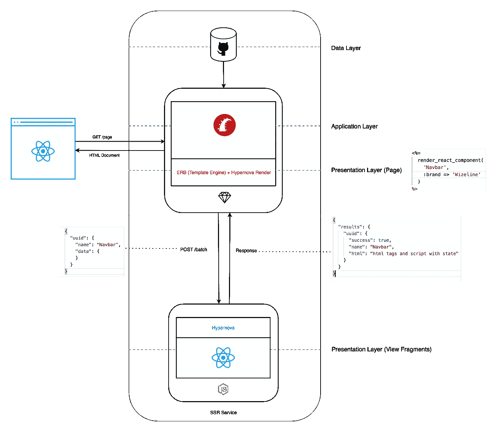

Airbnb 使用 Hypernova 作为 SSR 服务

*   用户请求 Ruby on Rails 服务器上的一个页面。
*   服务器收集必要的数据来呈现页面。
*   ERB 模板使用自定义呈现器向 Hypernova 服务器请求组件。
*   Hypernova 服务器使用 React 呈现所有请求的组件，并将它们发送回 Ruby on Rails 服务器。
*   组件由 ERB 注入到生成的页面中。
*   Ruby on Rails 将 HTML 标记和 javascript 文件发送回浏览器。
*   在浏览器上，JavaScript 用于逐步增强应用程序并使其动态化。

使用这种架构，Airbnb 可以重用他们的 React 组件进行服务器端和客户端渲染，并将他们构建在 Ruby on Rails 上的 Monolith 的呈现解耦。

这里是 Airbnb 工程团队写的一篇详细的[文章](https://medium.com/airbnb-engineering/operationalizing-node-js-for-server-side-rendering-c5ba718acfc9)。

# 在拉弗尔使用超新星

Laravel 是一个 PHP web 框架，用于构建现代 web 应用程序，类似于其他框架，如 ASP.net MVC、Ruby on Rails 和 AdonisJS。

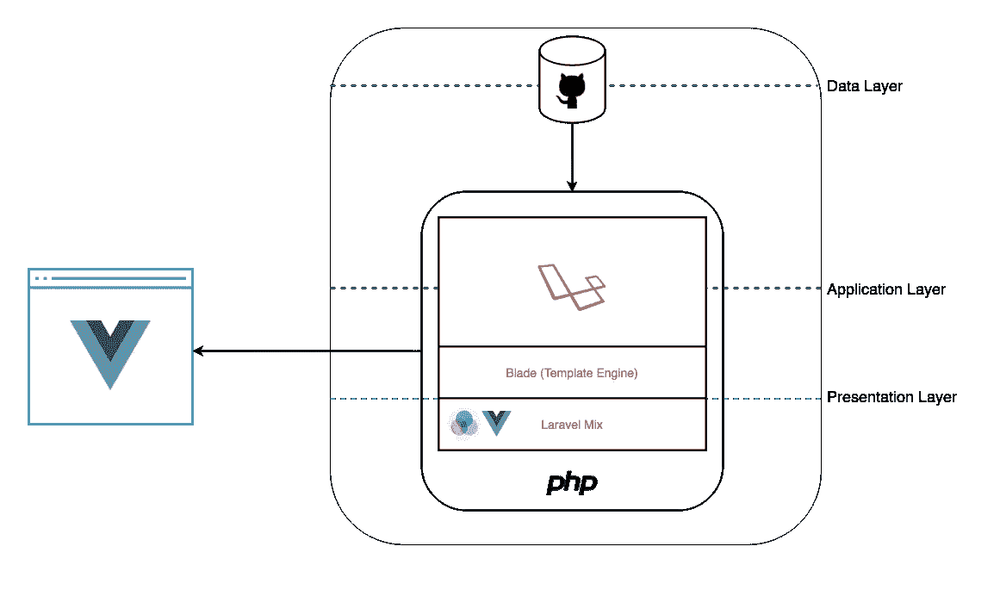

Laravel 应用程序图

Laravel**T5【使用 [Blade](https://laravel.com/docs/5.8/blade) 作为服务器端渲染的模板引擎， [Laravel Mix](https://laravel-mix.com/) 编译 Javascript、CSS、 [Vue.js](https://vuejs.org/) 组件等资产用于客户端渲染。**

## 在 Hypernova 上支持 Vue.js

Airbnb Hypernova 不支持 Vue.js 开箱即用，但它使我们能够开发自己的 Hypernova 绑定，所以我创建了 [hypernova-vue](https://github.com/ara-framework/hypernova-vue) 。

我写了这篇[文章](https://medium.com/js-dojo/using-vue-js-with-hypernova-server-ce792dcf1ac7)关于如何使用 Vue.js 和 Hypernova，你也可以使用这个[生成器](https://github.com/ara-framework/create-hypernova-vue)。

## 第一种方法— Hypernova 客户端

一旦 hypernova 服务器被配置为使用 Vue.js，我就在 Blade 中创建了一个自定义指令，以便将 Hypernova 组件放置在 Blade 视图中。

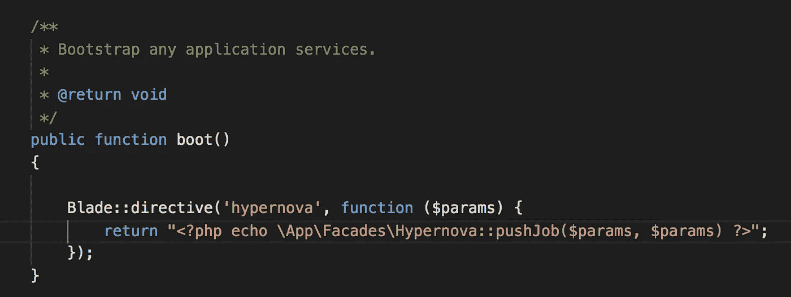

AppServiceProvider.php 的超新星刀锋指令

Hypernova 指令使用一个 facade 将请求的组件推送到 [hypernova-php](https://github.com/wayfair/hypernova-php) 客户端，并在模板视图中添加一个占位符，这是稍后放置呈现的组件所必需的。

hypernova 客户端是一个单独的客户端，所以我们可以持久化所请求的组件，以便稍后从 hypernova 服务器获取它们。

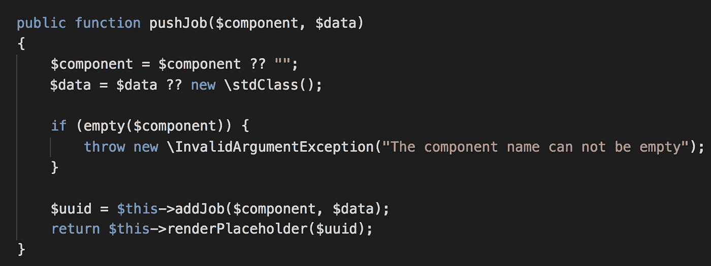

超级新星级-推工作

最后，Blade 基于模板视图呈现页面，Laravel 中间件使用 Facade 修改原始响应。幕后的门面使用 Hypernova 客户端向 Hypernova 服务器请求组件，并且仅在一个步骤中用呈现的组件替换占位符。

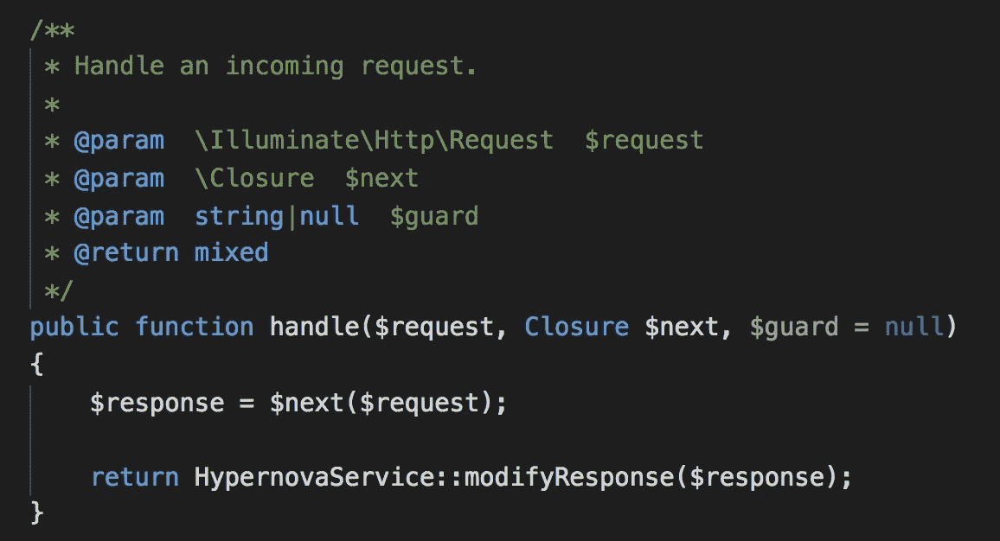

Hypernova 中间件

我采用了 laravel-hypernova 包的一些想法，但是我没有使用它，因为这个库与 Laravel 5.8 不兼容，而且我在处理 hypernova 服务器传入的错误时遇到了问题。

## 使用超新星指令

Laravel 控制器只需要使用`view`函数将视图名称和数据传递给 Blade。

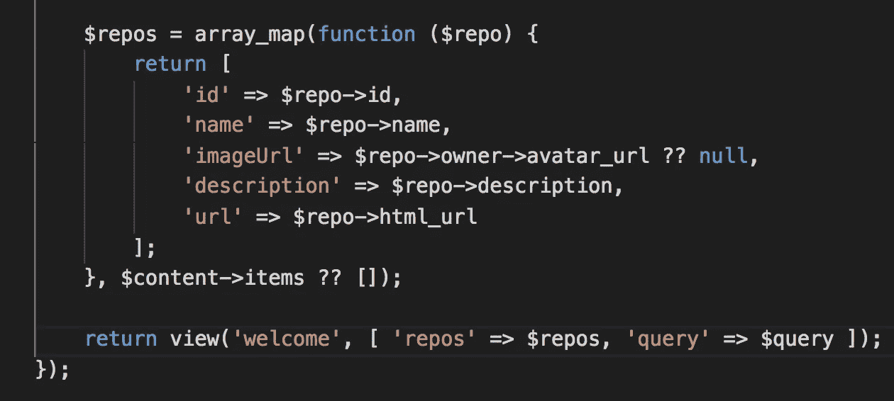

返回路由处理程序中的视图

默认布局包含 HTML 文档，并使用 hypernova 指令定义了一个*导航条*组件。

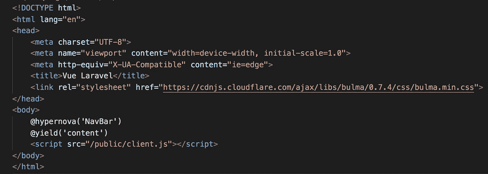

使用刀片的默认布局

*welcome* 视图使用默认布局，并使用 hypernova 指令定义了一个 *Home* 组件。

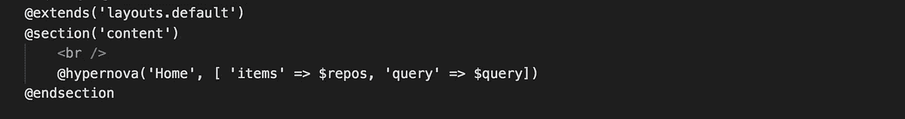

欢迎查看

HTML 呈现后，结果如下:

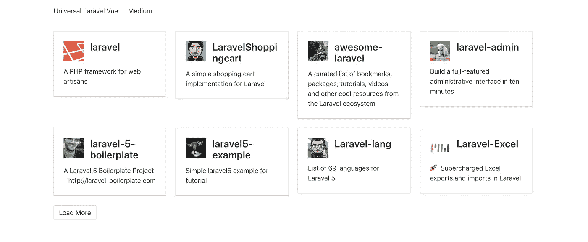

页面使用相同的 Vue.js 组件在服务器端呈现，在客户端动态呈现，这对于 SEO 来说非常酷。

我使用 Hypernova 服务器使 Laravel 能够通用渲染 Vue.js 组件，但它仍然与一些实现细节有关。Laravel 需要使用 Hypernova 客户端直接与 Hypernova 服务器交互，因此该架构需要为每种语言或 web 框架开发一个 Hypernova 客户端。

## 超新星代理方法

在深入分析该架构后，我发现了一个与微前端原理紧密相关的通用通信接口。

Blade 生成的 HTML 包含占位符，其中包含向 hypernova 服务器生成批处理请求所需的所有信息，即使 Hypernova 服务器无法呈现视图，客户端脚本也会在浏览器上呈现组件，使前端具有弹性。

基于 Laravel 中间件方法，我决定在客户端和 Laravel 应用程序之间放置一个[反向代理](https://www.cloudflare.com/learning/cdn/glossary/reverse-proxy/)，以便[服务器端包含来自 Hypernova 服务器的](https://kb.iu.edu/d/bfsa) (SSI)视图。

我尝试使用 [OpenResty](https://openresty.org/en/) 对 [Nginx](https://www.nginx.com/) 进行扩展，但是我发现使用 Lua 的 HTML 解析器和 HTTP 客户端存在一些实现限制。

最后，在研究了很多之后，我决定选择 [Go](https://golang.org/) 来开发它。Go 有一个现成的 HTTP 客户端和反向代理服务器模块，还有一个非常酷的[库](https://github.com/PuerkitoBio/goquery)，可以使用查询选择器解析和改变 DOM。

## Hypernova 代理如何工作

使用 Hypernova 代理 Laravel 只需要使用 Hypernova 指令，以便呈现 Hypernova 代理用于服务器端的占位符，包括页面中的 Hypernova 视图，就像我们之前使用 Laravel 中间件一样，但是现在我们可以重用 Hypernova 代理，以便使用其他 web 框架通用地呈现视图。

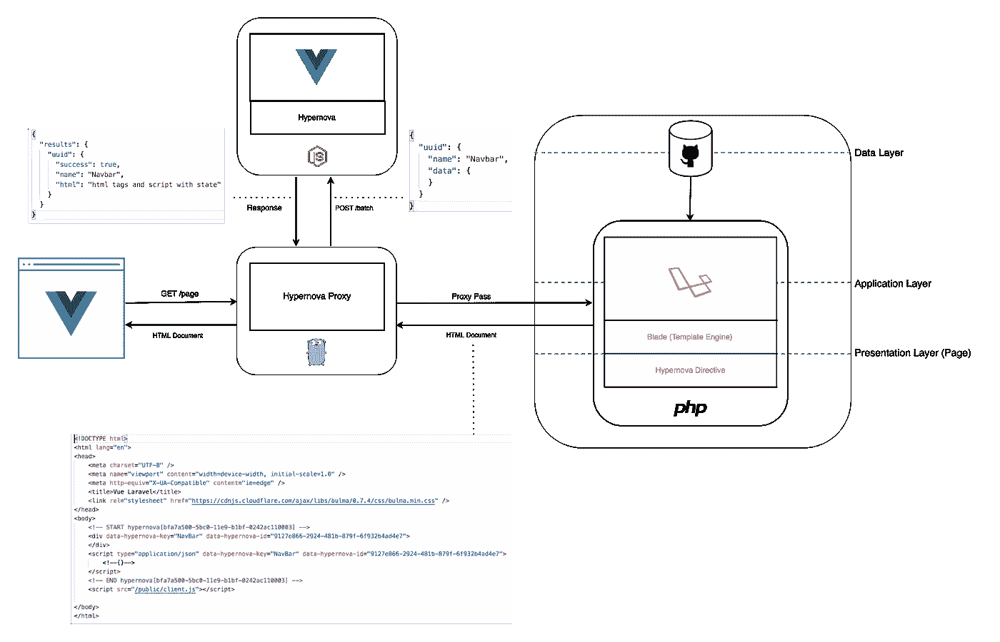

超级新星代理

*   用户请求 Hypernova 代理上的页面
*   Hypernova 代理将请求传递给 Laravel 服务器。
*   Laravel 服务器收集必要的数据来呈现页面。
*   Blade 使用模板 vue 和 [hypernova 指令](https://github.com/marconi1992/hypernova-blade-directive)呈现页面(div 标签包含组件的唯一 id 和名称，脚本标签包含组件的数据)

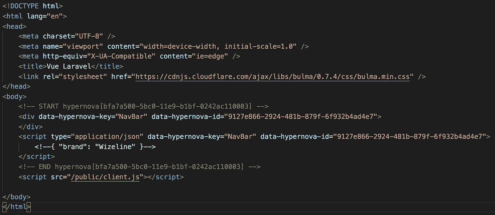

Laravel 服务器中 Blad 呈现的 HTML 页面

*   Laravel 服务器将 HTML 页面发送回 Hypernova 代理。
*   当响应`content-type`为`text/html`时，Hypernova 代理解析 HTML 以便为 Hypernova 服务器创建 JSON 请求，否则，它发回响应而不修改它。
*   Hypernova 代理向 Hypernova 服务器请求视图。

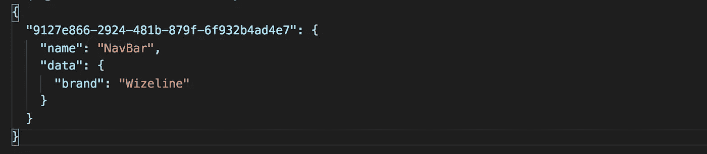

Hypernova 服务器的有效负载请求

*   Hypernova 服务器使用 Vue.js 组件呈现所有请求的视图，并将它们发送回 Hypernova 代理。

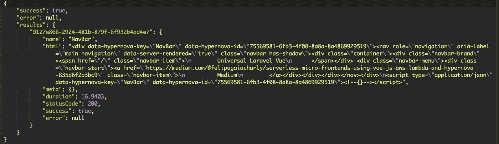

Hypernova 服务器响应

*   Hypernova 代理用成功结果的 HTML 替换占位符，并保留错误结果的占位符，以便客户端脚本在浏览器中呈现它们。
*   Hypernova 代理将修改后的响应发送回用户。
*   在浏览器上，JavaScript 用于逐步增强应用程序并使其动态化。

# 结论

这种架构使得从 monolith 到新服务的域分发变得容易，我们也可以开发新的服务，例如使用 Express.js 和 Mustache.js partials 来生成 Hypernova 代理请求 Hypernova 服务器的视图所需的预期标记。

## 资源

 [## Marconi 1992/扼制-整体到微前端

### 演示扼杀整体到微前端。促成马可尼 1992/扼杀-整体到微前端…

github.com](https://github.com/marconi1992/strangling-monolith-to-microfrontends) 

*   [建造进化建筑](https://www.thoughtworks.com/books/building-evolutionary-architectures)
*   [为服务器端渲染操作 Node.js】](https://medium.com/airbnb-engineering/operationalizing-node-js-for-server-side-rendering-c5ba718acfc9)
*   [扼杀者应用](https://www.martinfowler.com/bliki/StranglerApplication.html)
*   [在 Hypernova 服务器上使用 vue . js](https://medium.com/js-dojo/using-vue-js-with-hypernova-server-ce792dcf1ac7)
*   [使用 Vue.js、React.js 和 Hypernova 的微前端](https://medium.com/js-dojo/micro-frontends-using-vue-js-react-js-and-hypernova-af606a774602)

