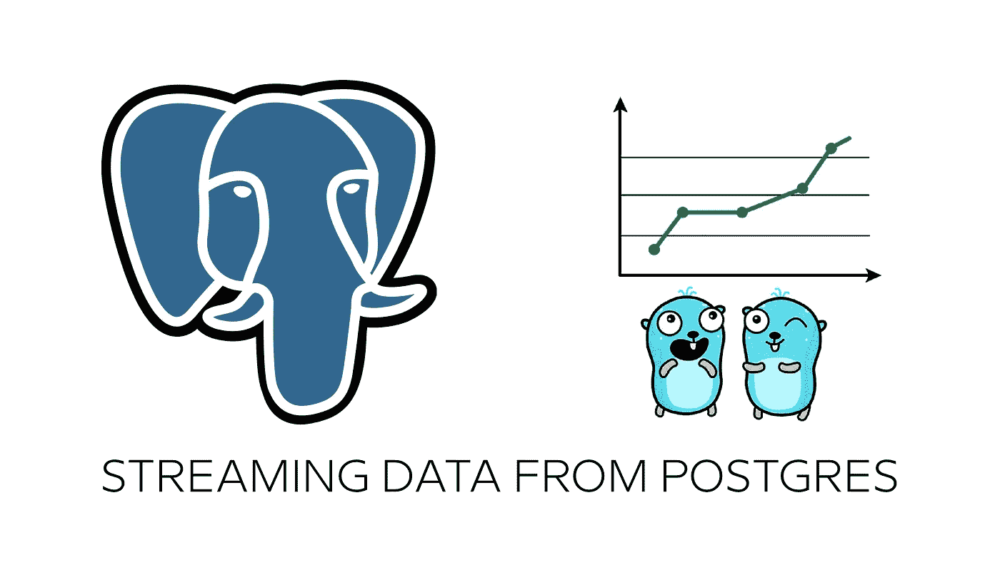
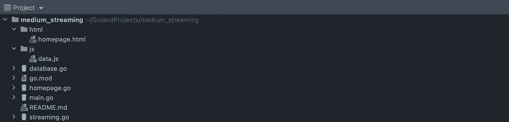
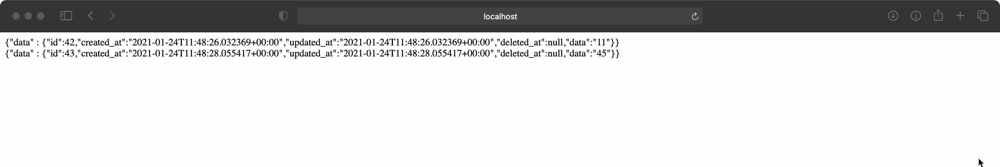

# 使用 Go 后端将数据从 Postgres 传输到 web

> 原文：<https://itnext.io/stream-data-from-postgres-to-web-using-go-backend-bd7d7527fe27?source=collection_archive---------1----------------------->

## 使用服务器发送的事件(SSE)



由 Renee French 创建的原始地鼠图像，使用由 Maria Letta 创建的地鼠图像

撰写本文的目的只有一个:**向您展示如何将数据从数据库流式传输到 web，**一旦它们被插入到表中。

**这是一个完整的教程。**我们将运行数据库并创建一个 web 服务器服务。该服务将创建一个新的数据库，直接从代码表。

这项服务有两个主要功能。第一个是将伪随机数据插入到已经创建的表中。第二个将等待这些新数据，然后将它们发送到浏览器。

**这是一个充满具体例子的教程。**你将学习如何在 docker 中运行数据库，如何从代码中创建数据库和表格。您还将学习如何设置 Postgres 以从中输出数据流。最后，您将学习如何接收数据并将它们发送到浏览器。

我们用 Docker 运行 Postgres 数据库，Go 作为主要语言。也用了一点 HTML 和 Javascript。Goland 被用作首选 IDE。

这个教程是基于其他人的工作，并且使用了已经写好的教程中的原则——链接如下。

[](https://medium.com/swlh/create-go-service-the-easy-way-de827d7f07cf) [## 以简单的方式创建 Go 服务

### 适用于 Windows、Linux、MacOS 和 Docker

medium.com](https://medium.com/swlh/create-go-service-the-easy-way-de827d7f07cf) 

Github 知识库的链接在文章的最后。

# 运行数据库

从在 Docker 中运行数据库开始，使用一个命令。

```
docker run --name postgres -e POSTGRES_PASSWORD=password -p 5433:5432 -v postgres_data:/var/lib/postgresql/data -d postgres:alpine
```

使用`docker stats`检查正在运行的数据库。如果有问题，将外部端口从`5433`更改为另一个空闲端口。

# 准备项目

在 Goland 创建新项目，使用模块，并将项目命名为 **medium_streaming** 。

创建目录和文件，就像你在截图上看到的那样。



## 更新 homepage.html

切换到**homepage.html**，用下面的代码更新文件。这里没有什么特别的，我们将只使用`<div id=”content”></div>`元素。

## 更新 main.go

切换到 **main.go** 并用下面的代码更新它。如果想要完整的解释，请使用文章开头的链接。

有三个*项目特定的*功能:

*   `checkDatabase()`:创建数据库和表格
*   `insertRandomDataToDatabase()`:将随机数据插入数据库
*   `streamDataToWebPage()`:将数据传输到浏览器

# 实现正确的功能

在 **main.go** 文件中有许多必须实现的函数。我们将在适当的文件中实现它们。

## 更新主页. go

这里我们实现了`homepage()`函数，在这里我们简单地将**homepage.html**文件提供给浏览器。仅此而已。

## 正在更新数据库。go

在这段代码中，我们实现了`checkDatabase()`函数。这个函数创建名为`medium`的数据库，然后创建表`data`。该表的结构在`type Data struct{}`中描述。

这个函数试图创建数据库和表。如果出现问题，该函数将等待一秒钟，然后再试一次。

创建数据库和表格后，有两个`productionDatabase.Exec()`命令。这些命令是 Postgres 特有的。

第一个创建了一个 Postgres 过程，其中您在`data json; notification json;`中指定了通知的类型，在`notification = json_build_object(‘data’, data);
PERFORM pg_notify(‘events’, notification::text);`中指定了从 Postgres 发送的内容。

第二个命令创建一个触发器:当表发生变化时，这个过程被触发。

# 数据流

我们几乎完成了适当的后端功能。我们需要实现最后两个功能。

切换到**流。转到**并在下面插入代码。你可以看到，剩下的两个函数在这里实现。

`insertRandomDataToDatabase()`正如其名。该函数每秒钟用伪随机数据创建新记录。

第二个函数`streamDataToWebPage()`做你所期望的。它正在等待 Postgres 通知，然后使用 SSE 将接收到的数据传输到浏览器。

# 在浏览器中捕捉数据

*大结局*来了。切换到 **homepage.js** ，插入下面的代码。这段代码等待来自`sseStreamer.SendString(“data”, “data”, n.Extra)`的事件，然后用收到的内容更新`<div id=”content”></div>`。

当您运行代码时——不要忘记在包模式下运行它——并在 [http://localhost](http://localhost) 打开浏览器，您应该会看到结果。

新记录保存到表中后，会立即从数据库通过 Go 后端传输到您的浏览器页面。

现在就看你了，用你喜欢的方式处理浏览器中的数据。



# 摘要

如果你全部阅读，全部编码，全部运行，你知道如何…

*   在 Docker 中运行 Postgres 数据库
*   将此数据库设置为在更改时传输数据
*   在 Go 后端接收数据
*   将数据从 Go 后端发送到 Javascript 前端

**奖金:**你知道，如何直接从代码创建数据库和表格。

[](https://github.com/petrjahoda/medium_streaming) [## petrjahoda/媒体流

### Permalink 无法加载最新的提交信息。从 Postgres 到 web 的流数据，在后端使用 Go…

github.com](https://github.com/petrjahoda/medium_streaming)