# 使用亚马逊 MSK 和 EMR 在 AWS 上使用 Apache Spark、Kafka、Avro 和 Apicurio Registry 进行流处理

> 原文：<https://itnext.io/stream-processing-with-apache-spark-kafka-avro-and-apicurio-registry-on-amazon-emr-and-amazon-13080defa3be?source=collection_archive---------0----------------------->

## 在事件流分析架构中使用注册表将模式与消息分离

在上一篇文章中，[使用亚马逊 MSK 和亚马逊 EMR](/getting-started-with-spark-structured-streaming-and-kafka-on-aws-using-amazon-msk-and-amazon-emr-91b1f2ef0162) 开始使用 AWS 上的 Spark 结构化流和 Kafka，我们了解了亚马逊 EMR 上的 Apache Spark 和 Spark 结构化流(*fka Amazon Elastic MapReduce*)以及针对 Apache Kafka(亚马逊 MSK)的亚马逊托管流。我们使用批处理和流式查询从 Kafka 消费消息和向 Kafka 发布消息。在那篇文章中，我们使用在每个 PySpark 脚本中定义为 [StructType](https://spark.apache.org/docs/latest/api/python/reference/api/pyspark.sql.types.StructType.html) ( `pyspark.sql.types.StructType`)的模式来序列化和反序列化来自 JSON 的消息。同样，我们为从亚马逊 S3 读取和写入的 CSV 格式的数据文件构建了类似的结构。

```
schema = StructType([
    StructField("payment_id", IntegerType(), False),
    StructField("customer_id", IntegerType(), False),
    StructField("amount", FloatType(), False),
    StructField("payment_date", TimestampType(), False),
    StructField("city", StringType(), True),
    StructField("district", StringType(), True),
    StructField("country", StringType(), False),
])
```

在这篇后续文章中，我们将以 Apache Avro 格式在亚马逊 MSK 上读写消息。我们将把 Avro 格式的 Kafka 消息的键和值模式存储在 Apicurio Registry 中，并检索模式，而不是在 PySpark 脚本中对模式进行硬编码。我们还将使用注册表来存储 CSV 格式数据文件的模式。

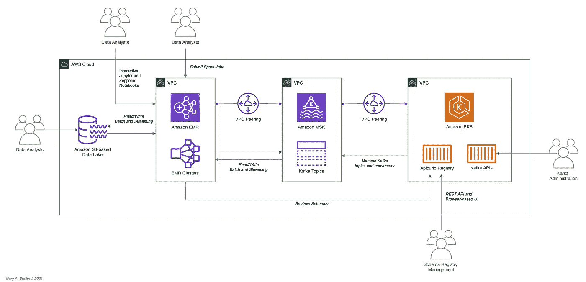

请注意本文演示的体系结构中添加了注册中心

# 视频演示

除了这篇文章，YouTube[上还有一个视频演示。](https://youtu.be/xthbYl7xC74)

为了获得最佳效果，请在 YouTube[上以 1080p 高清观看](https://youtu.be/xthbYl7xC74)

# 技术

在上一篇文章[使用亚马逊 MSK 和亚马逊 EMR 在 AWS 上开始使用 Spark 结构化流和 Kafka](/getting-started-with-spark-structured-streaming-and-kafka-on-aws-using-amazon-msk-and-amazon-emr-91b1f2ef0162)中，我们了解了 Apache Spark、Apache Kafka、亚马逊 EMR 和亚马逊 MSK。

[](/getting-started-with-spark-structured-streaming-and-kafka-on-aws-using-amazon-msk-and-amazon-emr-91b1f2ef0162) [## 使用亚马逊 MSK 和亚马逊 EMR 在 AWS 上开始使用 Spark 结构化流和 Kafka

### 使用批处理查询和 Spark 结构化流，使用 Apache Kafka 探索 Apache Spark

itnext.io](/getting-started-with-spark-structured-streaming-and-kafka-on-aws-using-amazon-msk-and-amazon-emr-91b1f2ef0162) 

在之前的一篇文章[中，我们探讨了 Apache Avro 和 Apicurio Registry。](/hydrating-a-data-lake-using-log-based-change-data-capture-cdc-with-debezium-apicurio-and-kafka-799671e0012f)

[](/hydrating-a-data-lake-using-log-based-change-data-capture-cdc-with-debezium-apicurio-and-kafka-799671e0012f) [## 通过 Debezium、Apicurio 和 Kafka 使用基于日志的变更数据捕获(CDC)来补充数据湖…

### 使用亚马逊 MSK、Apache Kafka Connect、Debezium、Apicurio Registry 和…将数据从亚马逊 RDS 导入亚马逊 S3

itnext.io](/hydrating-a-data-lake-using-log-based-change-data-capture-cdc-with-debezium-apicurio-and-kafka-799671e0012f) 

## 阿帕奇火花

根据[文档](https://spark.apache.org/docs/latest/index.html)，Apache Spark 是一个用于大规模数据处理的统一分析引擎。Spark 提供了 Java、Scala、Python (PySpark)和 r 的高级 API，Spark 提供了支持通用执行图(*又名有向无环图或 Dag*)的优化引擎。此外，Spark 支持一组丰富的高级工具，包括用于 SQL 和结构化数据处理的 Spark SQL，用于机器学习的 MLlib，用于图形处理的 GraphX，以及用于增量计算和流处理的结构化流。

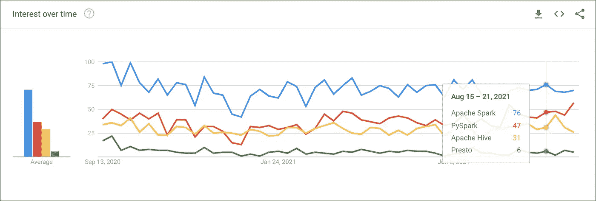

根据[谷歌趋势](https://trends.google.com/trends/explore?geo=US&q=%2Fm%2F0ndhxqz,PySpark,%2Fm%2F0g55vt5,%2Fg%2F11bywl5x_j)，随着时间的推移，人们对 Apache Spark 和 PySpark 的兴趣比 Hive 和 Presto 大

## 火花结构化流

根据[文档](https://spark.apache.org/docs/latest/structured-streaming-programming-guide.html)的说法，Spark 结构化流是一个基于 Spark SQL 引擎的可扩展和容错的流处理引擎。您可以像表达静态数据上的批处理计算一样表达您的流计算。Spark SQL 引擎将不断递增地运行它，并随着流数据的不断到达更新最终结果。简而言之，结构化流提供了快速、可伸缩、容错、端到端、恰好一次的流处理，而无需用户对流进行推理。

## 阿帕奇 Avro

Apache Avro 将自己描述为一个数据序列化系统。 [Apache Avro](https://avro.apache.org/docs/current/) 是一种紧凑、快速、[的二进制数据格式](https://en.wikipedia.org/wiki/Comparison_of_data-serialization_formats#Overview)类似于 [Apache Parquet](https://parquet.apache.org/) 、 [Apache Thrift](https://thrift.apache.org/) 、MongoDB 的 [BSON](https://docs.mongodb.com/manual/reference/bson-types/) 和 Google 的[协议缓冲区](https://en.wikipedia.org/wiki/Protocol_Buffers) ( *protobuf* )。然而，与列存储格式如 [Apache Parquet](https://parquet.apache.org/) 和 [Apache ORC](https://orc.apache.org/) 相比，Apache Avro 是一种基于行的存储格式。

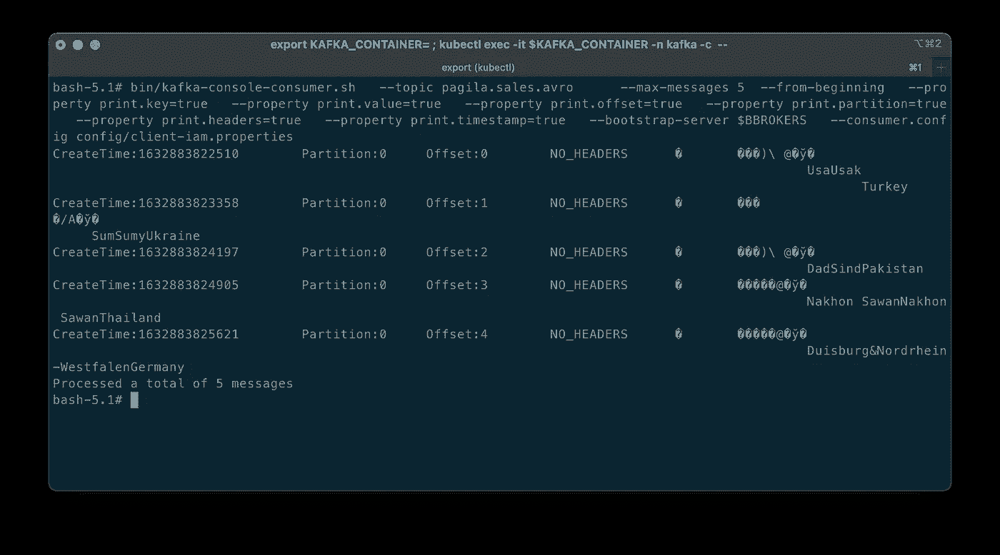

序列化的 Avro 格式消息，其键和值以[非人类可读]二进制格式显示

Avro 依赖于模式。读取 Avro 数据时，写入数据时使用的模式始终存在。根据[文档](https://avro.apache.org/docs/current/)，模式允许每个数据被写入而没有每个值的开销，使得序列化快速且小。模式还有助于使用动态脚本语言，因为数据及其模式是完全自描述的。

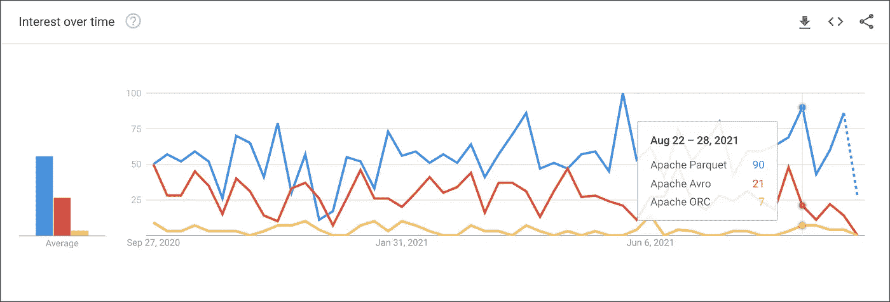

根据 [Google Trends](https://trends.google.com/trends/explore?geo=US&q=%2Fg%2F11c54dt85y,%2Fm%2F0by0k1s,%2Fg%2F11gy75t900) ，随着时间的推移，人们对 Apache Avro 的兴趣超过了 Parquet 和 ORC

## Apicurio 注册表

我们可以通过使用模式注册中心，例如[汇合模式注册中心](https://docs.confluent.io/platform/current/schema-registry/index.html)或 [Apicurio 注册中心](https://www.apicur.io/registry/)，将数据从模式中分离出来。根据 Apicurio 的说法，在消息和事件流架构中，发布到主题和队列的数据通常必须使用模式进行序列化或验证(例如， [Apache Avro](https://avro.apache.org/docs/current/) 、 [JSON 模式](https://json-schema.org/)，或 [Google 协议缓冲区](https://developers.google.com/protocol-buffers))。当然，模式可以打包在每个应用程序中。尽管如此，在外部系统[schema registry]中注册模式，然后从每个应用程序中引用它们通常是更好的架构模式。

> *在外部系统中注册模式，然后从每个应用程序中引用它们通常是更好的架构模式。*

## 亚马逊电子病历

根据 AWS [文档](https://aws.amazon.com/)，Amazon EMR(*fka Amazon Elastic MapReduce*)是一个基于云的大数据平台，使用开源工具处理海量数据，如 [Apache Spark](https://aws.amazon.com/emr/features/spark/) 、 [Hadoop](https://hadoop.apache.org/) 、 [Hive](https://aws.amazon.com/emr/features/hive/) 、 [HBase](https://aws.amazon.com/emr/features/hbase/) 、 [Flink](https://aws.amazon.com/blogs/big-data/use-apache-flink-on-amazon-emr/) 、[胡迪](https://aws.amazon.com/emr/features/hudi/)和 [Presto【等 Amazon EMR 是一项完全托管的 AWS 服务，通过自动执行配置容量和调整集群等耗时的任务，可以轻松设置、操作和扩展您的大数据环境。](https://aws.amazon.com/emr/features/presto/)

[亚马逊 EMR on EKS](https://docs.aws.amazon.com/emr/latest/EMR-on-EKS-DevelopmentGuide/emr-eks.html) ，亚马逊 EMR 自 2020 年 12 月起的部署选项，允许你在[亚马逊弹性 Kubernetes 服务](https://aws.amazon.com/eks/)(亚马逊 EKS)上运行亚马逊 EMR。借助 EKS 部署选项，您可以专注于运行分析工作负载，而 Amazon EMR on EKS 为开源应用构建、配置和管理容器。

如果你不熟悉 Amazon EMR for Spark，特别是 PySpark，我推荐最近的两部分系列文章，[在 Amazon EMR 上运行 PySpark 应用程序:在 Amazon Elastic MapReduce 上与 PySpark 交互的方法](https://medium.com/swlh/running-pyspark-applications-on-amazon-emr-e536b7a865ca)。

[](https://medium.com/swlh/running-pyspark-applications-on-amazon-emr-e536b7a865ca) [## 在 Amazon EMR 上运行 PySpark 应用程序

### Amazon Elastic MapReduce 上与 PySpark 交互的方法

medium.com](https://medium.com/swlh/running-pyspark-applications-on-amazon-emr-e536b7a865ca) 

## 阿帕奇卡夫卡

根据[文档](https://kafka.apache.org/)，Apache Kafka 是一个开源的分布式事件流平台，被数千家公司用于高性能数据管道、流分析、数据集成和关键任务应用。

## 亚马逊 MSK

Apache Kafka 集群在生产环境中的设置、扩展和管理极具挑战性。根据 AWS [文档](https://aws.amazon.com/msk/)，亚马逊 MSK 是一项完全托管的 AWS 服务，让你可以轻松构建和运行使用 [Apache Kafka](https://aws.amazon.com/streaming-data/what-is-kafka/) 处理流媒体数据的应用程序。有了亚马逊 MSK，您可以使用原生 Apache Kafka APIs 来填充数据湖，将更改传入和传出数据库，并支持机器学习和分析应用程序。

# 先决条件

与上一篇文章类似，这篇文章将主要关注在 Amazon EMR 上配置和运行 Apache Spark 作业。为了跟进，您需要在 AWS 上部署和配置以下资源:

1.  亚马逊 S3 桶(容纳所有 Spark/EMR 资源)；
2.  亚马逊 MSK 集群(使用 [IAM 访问控制](https://docs.aws.amazon.com/msk/latest/developerguide/iam-access-control.html#how-to-use-iam-access-control))；
3.  安装了 Kafka APIs 并且能够连接到亚马逊 MSK 的亚马逊 EKS 容器或 EC2 实例；
4.  安装了 Apicurio Registry 的亚马逊 EKS 容器或 EC2 实例，能够连接到亚马逊 MSK ( *如果使用 Kafka 进行后端存储*)并被亚马逊 EMR 访问；
5.  确保亚马逊 MSK 配置有`auto.create.topics.enable=true`；该设置默认为`false`；

下面的架构图显示，该演示在同一个 AWS 账户和 AWS 区域`us-east-1`内使用了三个独立的 VPC，分别用于亚马逊 EMR、亚马逊 MSK 和亚马逊 EKS。使用 [VPC 对等](https://docs.aws.amazon.com/vpc/latest/peering/what-is-vpc-peering.html)连接三个 VPC。确保您在亚马逊 EMR、亚马逊 MSK 和亚马逊 EKS 安全组中公开了正确的入口端口和相应的 CIDR 范围。为了增加安全性和节约成本，使用一个 [VPC 端点](https://docs.aws.amazon.com/vpc/latest/privatelink/vpc-endpoints-s3.html)用于亚马逊 EMR 和亚马逊 S3 之间的私人通信。


这篇文章演示的高级架构

# 源代码

这篇文章和亚马逊 MSK 系列的前三篇文章的所有源代码，包括这里演示的 Python 和 PySpark 脚本，都是开源的，位于 [GitHub](https://github.com/garystafford/kafka-connect-msk-demo) 上。

[](https://github.com/garystafford/kafka-connect-msk-demo) [## GitHub—garystaf 得起/kafka-connect-msk-demo:

### 在这篇文章中，使用变更数据捕获(CDC)、Apache Kafka 和 Kubernetes on AWS-GitHub 来补充数据湖…

github.com](https://github.com/garystafford/kafka-connect-msk-demo) 

# 目标

我们将运行一个 Spark 结构化流 PySpark 作业，以使用来自 Apache Kafka 的实时销售数据的模拟事件流。然后，我们将用销售区域来丰富( *join* )销售数据，并在一个滑动事件时间窗口内按区域合计销售额和订单量。接下来，我们将把这些聚合结果流回 Kafka。最后，我们将使用一个批处理查询来消费 Kafka 的汇总销售结果，并在控制台中显示它们。

Kafka 消息将以 Apache Avro 格式编写。Kafka 主题消息键和值的模式以及 CSV 格式的销售和销售区域数据的模式都将存储在 Apricurio Registry 中。Python 和 PySpark 脚本将使用 Apricurio Registry 的 REST API 来读写 Avro 模式工件。

我们将以 Avro 格式编写 Kafka 消息密钥，并将密钥的 Avro 模式存储在注册表中。这只是为了演示，并不是必需的。Kafka 消息密钥不是必需的，也没有必要在 Avro 中存储密钥和值。

模式演化、兼容性和验证是重要的考虑因素，但超出了本文的范围。

## PySpark 脚本

根据[文档](http://spark.apache.org/docs/latest/api/python/)，PySpark 是 Python 中 Apache Spark 的一个接口。PySpark 允许您使用 Python API 编写 Spark 应用程序。PySpark 支持 Spark 的大部分功能，如 Spark SQL、DataFrame、Streaming、MLlib(机器学习)和 Spark Core。本文涵盖了三个 PySpark 脚本和一个新的助手 Python 脚本:

1.  [10 _ create _ schemas . py](https://github.com/garystafford/kafka-connect-msk-demo/blob/main/pyspark/pyspark_scripts/10_create_schemas.py):Python 脚本使用 REST API 在 Apricurio 注册表中创建所有 Avro 模式；
2.  [11 _ incremental _ sales _ avro . py](https://github.com/garystafford/kafka-connect-msk-demo/blob/main/pyspark/pyspark_scripts/11_incremental_sales_avro.py):py spark 脚本模拟销售数据发布到 Kafka 的事件流，持续时间约 30 分钟；
3.  [12 _ streaming _ enrichment _ avro . py](https://github.com/garystafford/kafka-connect-msk-demo/blob/main/pyspark/pyspark_scripts/12_streaming_enrichment_avro.py):py spark 脚本使用流查询实时读取来自 Kafka 的消息，丰富销售数据，聚合区域销售结果，并将结果作为流写回 Kafka；
4.  [13 _ batch _ read _ results _ avro . py](https://github.com/garystafford/kafka-connect-msk-demo/blob/main/pyspark/pyspark_scripts/13_batch_read_results_avro.py):py spark 脚本使用批处理查询从 Kafka 读取汇总的区域销售结果，并在控制台显示；
5.  [13 _ batch _ read _ results _ avro . ipynb](https://github.com/garystafford/kafka-connect-msk-demo/blob/main/pyspark/pyspark_scripts/13_batch_read_results_avro.ipynb):Jupyter 笔记本扩展版[13 _ batch _ read _ results _ avro . py](https://github.com/garystafford/kafka-connect-msk-demo/blob/main/pyspark/pyspark_scripts/13_batch_read_results_avro.py)。本文未涉及的内容；

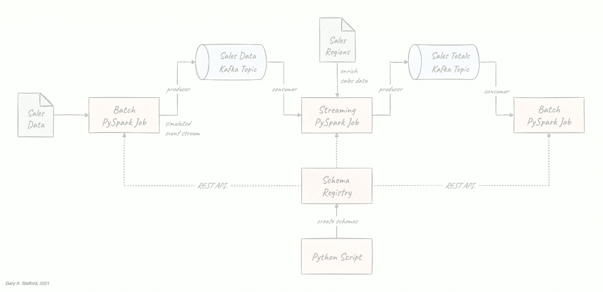

本文演示的数据管道(脚本名称显示在最后)

# 准备

为了准备您的亚马逊 EMR 资源，请查看前一篇文章中的说明，[使用亚马逊 MSK 和亚马逊 EMR 在 AWS 上开始使用 Spark 结构化流和 Kafka](/getting-started-with-spark-structured-streaming-and-kafka-on-aws-using-amazon-msk-and-amazon-emr-91b1f2ef0162)。这里是一个回顾，这个职位需要一些补充。

## 亚马逊 S3

我们将从收集和复制必要的文件到你的亚马逊 S3 桶开始。bucket 将作为 Amazon EMR 引导脚本、Spark 所需的其他 JAR 文件、PySpark 脚本和 CSV 格式数据文件的位置。

我们将要运行的 Spark 作业需要一组额外的 JAR 文件。从 [Maven Central](https://mvnrepository.com/artifact/org.apache.spark) 和 GitHub 下载 jar，并将它们放在`[emr_jars](https://github.com/garystafford/kafka-connect-msk-demo/tree/main/pyspark/emr_jars)`项目目录中。这些 jar 将包括 [AWS MSK IAM Auth](https://github.com/aws/aws-msk-iam-auth) 、 [AWS SDK](https://aws.amazon.com/blogs/developer/java-sdk-bundle/) 、 [Kafka 客户端](https://mvnrepository.com/artifact/org.apache.kafka/kafka-clients)、[用于 Kafka 的 Spark SQL](https://mvnrepository.com/artifact/org.apache.spark/spark-sql-kafka-0-10)、 [Spark 流](https://mvnrepository.com/artifact/org.apache.spark/spark-streaming)以及其他依赖项。与上一篇相比，Avro 多了一个罐子。

更新`SPARK_BUCKET`环境变量，然后使用 AWS `s3` API 将 JARs、PySpark 脚本、样本数据和 EMR 引导脚本从 GitHub 项目存储库的本地副本上传到您的亚马逊 S3 存储桶。

## 亚马逊电子病历

GitHub 项目资源库包括一个样本 AWS CloudFormation [模板](https://github.com/garystafford/kafka-connect-msk-demo/blob/main/pyspark/cloudformation/stack.yml)和一个相关联的 JSON 格式 CloudFormation [参数文件](https://github.com/garystafford/kafka-connect-msk-demo/blob/main/pyspark/cloudformation/dev.json)。云形成模板`[stack.yml](https://github.com/garystafford/kafka-connect-msk-demo/blob/main/pyspark/cloudformation/stack.yml)`，接受几个环境[参数](https://docs.aws.amazon.com/AWSCloudFormation/latest/UserGuide/parameters-section-structure.html)。为了与您的环境相匹配，您需要更新参数值，例如 SSK 密钥、子网和 S3 存储桶。该模板将构建一个最小规模的 Amazon EMR 集群，在现有的 VPC 中有一个主节点和两个核心节点。您可以轻松地修改模板和参数，以满足您的需求和预算。

```
aws cloudformation deploy \
    --stack-name spark-kafka-demo-dev \
    --template-file ./cloudformation/stack.yml \
    --parameter-overrides file://cloudformation/dev.json \
    --capabilities CAPABILITY_NAMED_IAM
```

CloudFormation 模板有两个基本的 Spark 配置项——要在 EMR 上安装的应用程序列表和引导脚本部署。

下面，我们看到了 EMR 引导 shell 脚本， [bootstrap_actions.sh](https://github.com/garystafford/kafka-connect-msk-demo/blob/main/pyspark/emr_bootstrap/bootstrap_actions.sh) 。

引导脚本执行了几项任务，包括将我们之前复制到亚马逊 S3 的额外 JAR 文件部署到 EMR 集群节点。

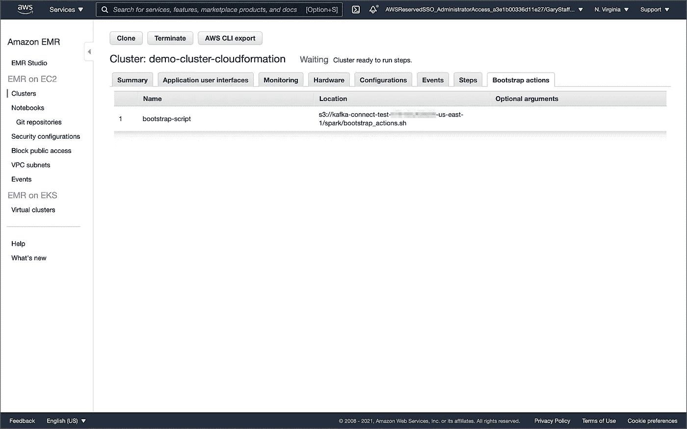

Amazon EMR 集群“引导操作”选项卡

## 参数存储

本演示中的 PySpark 脚本将从 [AWS 系统管理器(AWS SSM)参数存储](https://docs.aws.amazon.com/systems-manager/latest/userguide/systems-manager-parameter-store.html)中获取配置值。配置值包括亚马逊 MSK 引导代理列表、包含 EMR/Spark 资产的亚马逊 S3 存储桶以及 Apicurio Registry REST API 基本 URL。使用参数存储可以确保没有敏感的或特定于环境的配置被硬编码到 PySpark 脚本中。修改并执行`[ssm_params.sh](https://github.com/garystafford/kafka-connect-msk-demo/blob/main/pyspark/ssm_params.sh)`脚本来创建 AWS SSM 参数存储参数。

# 在 Apricurio 注册表中创建模式

为了创建本演示所需的模式，项目中包含了一个 Python 脚本， [10_create_schemas.py](https://github.com/garystafford/kafka-connect-msk-demo/blob/main/pyspark/pyspark_scripts/10_create_schemas.py) 。该脚本使用 Python `[requests](https://docs.python-requests.org/en/latest/)`模块与 Apricurio Registry 的 [REST API](https://access.redhat.com/webassets/avalon/d/Red_Hat_Integration-2020-Q2-Getting_Started_with_Service_Registry-en-US/files/registry-rest-api.htm#operation/getArtifactByGlobalId) 进行交互，并创建六个新的基于 Avro 的模式工件。Python 脚本使用与命令行相同的 HTTP 方法和资源端点，通过`curl`或`wget`与 Apricurio Registry 的 REST API 交互。

用于在 Apricurio 注册表中创建新 Avro 模式工件的等效 curl 命令

Apricurio Registry 支持几种常见的[工件类型](https://www.apicur.io/registry/docs/apicurio-registry/1.3.3.Final/getting-started/assembly-registry-reference.html#registry-artifact-types)，包括 AsyncAPI 规范、Apache Avro 模式、GraphQL 模式、JSON 模式、Apache Kafka Connect 模式、OpenAPI 规范、Google protocol buffers 模式、Web 服务定义语言和 XML 模式定义。我们将使用注册表来存储 Avro 模式，用于 Kafka 和 CSV 数据源和接收器。

尽管 Apricurio Registry 不支持 [CSV 模式](https://digital-preservation.github.io/csv-schema/)，但是为了与 PySpark 一起使用，我们可以将 CSV 格式的销售和销售区域数据的模式作为 JSON 格式的 Avro 模式存储在注册表中。

```
{
  "name": "Sales",
  "type": "record",
  "doc": "Schema for CSV-format sales data",
  "fields": [
    {
      "name": "payment_id",
      "type": "int"
    },
    {
      "name": "customer_id",
      "type": "int"
    },
    {
      "name": "amount",
      "type": "float"
    },
    {
      "name": "payment_date",
      "type": "string"
    },
    {
      "name": "city",
      "type": [
        "string",
        "null"
      ]
    },
    {
      "name": "district",
      "type": [
        "string",
        "null"
      ]
    },
    {
      "name": "country",
      "type": "string"
    }
  ]
}
```

然后，我们可以从注册表中检索 JSON 格式的 Avro 模式，将其转换为 PySpark StructType，并将其关联到用于持久存储 CSV 文件中的销售数据的 DataFrame。

```
root
 |-- payment_id: integer (nullable = true)
 |-- customer_id: integer (nullable = true)
 |-- amount: float (nullable = true)
 |-- payment_date: string (nullable = true)
 |-- city: string (nullable = true)
 |-- district: string (nullable = true)
 |-- country: string (nullable = true)
```

使用注册表允许我们避免预先在 PySpark 脚本中将模式硬编码为 StructType。

提交 PySpark 脚本作为 EMR 步骤。EMR 将以运行 PySpark 作业的相同方式运行 Python 脚本。

Python 脚本在 Apricurio Registry 中创建了六个模式工件，如下图 Apricurio Registry 基于浏览器的用户界面所示。模式包括两个 Kafka 主题的两个键/值对和两个 CSV 格式的销售和销售区域数据的键/值对。

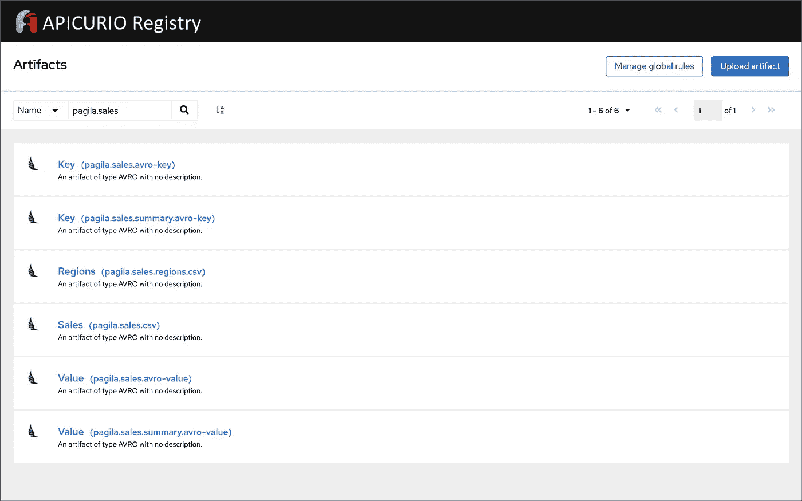

Apricurio Registry 基于浏览器的 UI 中的工件

您可以选择使用 Apricurio Registry 为每个模式启用验证和兼容性规则。

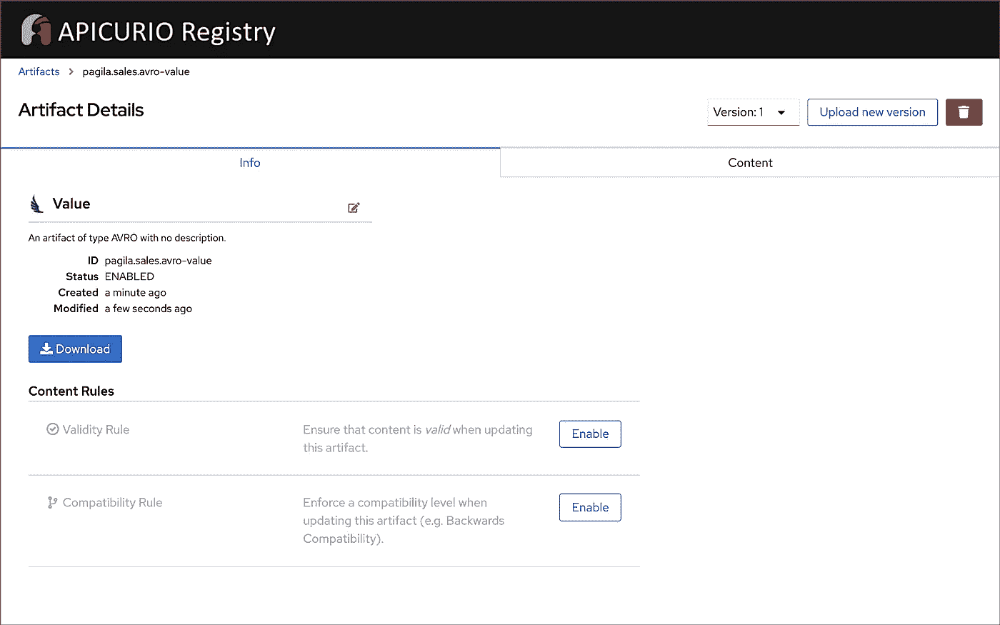

Apricurio Registry 基于浏览器的用户界面中的内容规则选项

每个 Avro 模式工件都作为 JSON 对象存储在注册表中。

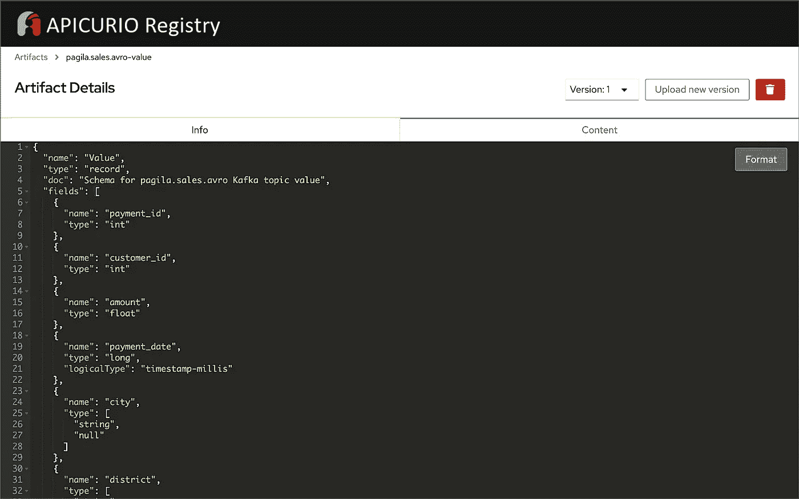

Apricurio 注册表基于浏览器的用户界面中作为 JSON 的 Avro 模式的详细视图

# 模拟销售事件流

接下来，我们将模拟大约 30 分钟内发布到 Kafka 的销售数据的事件流。PySpark 脚本[11 _ incremental _ sales _ avro . py](https://github.com/garystafford/kafka-connect-msk-demo/blob/main/pyspark/pyspark_scripts/11_incremental_sales_avro.py)从位于 S3 的 CSV 文件中读取 1，800 条销售记录到 DataFrame ( `pyspark.sql.DataFrame`)中。

PySpark 脚本首先使用 Python `[requests](https://docs.python-requests.org/en/latest/)`模块和 Apricurio Registry 的 REST API ( `get_schema()`)从 Apricurio Registry 检索 CSV 数据的 JSON 格式 Avro 模式。

```
csv_sales_schema = get_schema("pagila.sales.csv")
```

JSON 格式的模式:

```
{
  "name": "Sales",
  "type": "record",
  "doc": "Schema for CSV-format sales data",
  "fields": [
    {
      "name": "payment_id",
      "type": "int"
    },
    {
      "name": "customer_id",
      "type": "int"
    },
    {
      "name": "amount",
      "type": "float"
    },
    {
      "name": "payment_date",
      "type": "string"
    },
    {
      "name": "city",
      "type": [
        "string",
        "null"
      ]
    },
    {
      "name": "district",
      "type": [
        "string",
        "null"
      ]
    },
    {
      "name": "country",
      "type": "string"
    }
  ]
}
```

然后，该脚本使用一个空的 DataFrame 从 JSON 格式的 Avro 模式创建一个 StructType】)。Avro 列类型被转换为 Spark SQL 类型。唯一明显的问题是 Spark 如何错误地处理每一列的`nullable`值。请注意，Spark 中的列可空性是一个优化语句，而不是对象类型的强制。产生的 StructType 用于将 CSV 数据读入数据帧(`read_from_csv()`)。

```
root
 |-- payment_id: integer (nullable = true)
 |-- customer_id: integer (nullable = true)
 |-- amount: float (nullable = true)
 |-- payment_date: string (nullable = true)
 |-- city: string (nullable = true)
 |-- district: string (nullable = true)
 |-- country: string (nullable = true)
```

对于 Avro 格式的 Kafka 键和值模式，我们在所有脚本中使用相同的方法`get_schema()`。生成的 JSON 格式的模式然后被传递给`[to_avro](https://spark.apache.org/docs/latest/api/python/reference/api/pyspark.sql.avro.functions.to_avro.html)()`和`[from_avro](https://spark.apache.org/docs/latest/api/python/reference/api/pyspark.sql.avro.functions.from_avro.html)()`方法，以向 Kafka 读写 Avro 格式的消息。这两种方法都是`pyspark.sql.avro.functions`模块的一部分。Avro 列类型与 Spark SQL 类型相互转换。

PySpark 脚本[11 _ incremental _ sales _ avro . py](https://github.com/garystafford/kafka-connect-msk-demo/blob/main/pyspark/pyspark_scripts/11_incremental_sales_avro.py)使用 REST API 和`get_schema()`方法从 Apicurio 注册表中检索 Kafka 主题键和值的模式。然后，脚本获取数据帧的每一个[行](https://spark.apache.org/docs/latest/api/python/reference/api/pyspark.sql.Row.html) ( `pyspark.sql.Row`)，一次一行，并将它们写入 Kafka 主题`pagila.sales.avro`，在每次写入之间添加一点延迟。

我们必须运行 PySpark 脚本[11 _ incremental _ sales _ avro . py](https://github.com/garystafford/kafka-connect-msk-demo/blob/main/pyspark/pyspark_scripts/11_incremental_sales_avro.py)，同时运行 PySpark 脚本[12 _ streaming _ enrichment _ avro . py](https://github.com/garystafford/kafka-connect-msk-demo/blob/main/pyspark/pyspark_scripts/12_streaming_enrichment_avro.py)，以模拟事件流。我们将在文章的下一部分开始这两个脚本。

# 结构化流的流处理

PySpark 脚本[12 _ streaming _ enrichment _ avro . py](https://github.com/garystafford/kafka-connect-msk-demo/blob/main/pyspark/pyspark_scripts/12_streaming_enrichment_avro.py)使用流查询从 Kafka 主题`pagila.sales.avro`中实时读取销售数据消息，丰富销售数据，汇总区域销售结果，并每两分钟将结果以小批量写回 Kafka。

PySpark 脚本在 Kafka 主题`pagila.sales.avro`的流式销售数据和包含基于公共`country`列的销售区域的 CSV 文件之间执行流到批连接。卡夫卡的销售数据:

来自第一个 Kafka 主题的流查询的销售数据

CSV 文件中的销售区域数据:

亚马逊 S3 CSV 文件中的销售区域数据

然后，PySpark 脚本按照销售区域，在滑动的 10 分钟[事件时间窗口](https://spark.apache.org/docs/latest/structured-streaming-programming-guide.html#window-operations-on-event-time)内执行销售额和订单数量的流聚合，该窗口有 5 分钟的窗口重叠和 10 分钟的[水印](https://spark.apache.org/docs/latest/structured-streaming-programming-guide.html#handling-late-data-and-watermarking)。该脚本每两分钟向 Kafka 主题`pagila.sales.summary.avro`写入结果。下面是使用 DataStreamWriter 接口(`pyspark.sql.streaming.DataStreamWriter`)写入外部存储(在本例中是 Kafka)的结果流数据帧的示例。

返回到第二个 Kafka 主题的汇总销售结果

为了将结果写回 Kafka，脚本使用其 REST API 从 Apicurio 注册表中检索第二个 Kafka 主题的消息键和值的 Avro 格式模式。

```
sales_summary_key = get_schema("pagila.sales.summary.avro-key")
sales_summary_value = get_schema("pagila.sales.summary.avro-value")
```

密钥模式:

```
{
  "name": "Key",
  "type": "int",
  "doc": "Schema for pagila.sales.summary.avro Kafka topic key"
}
```

价值模式:

```
{
  "name": "Value",
  "type": "record",
  "doc": "Schema for pagila.sales.summary.avro Kafka topic value",
  "fields": [
    {
      "name": "region",
      "type": "string"
    },
    {
      "name": "sales",
      "type": "float"
    },
    {
      "name": "orders",
      "type": "int"
    },
    {
      "name": "window_start",
      "type": "long",
      "logicalType": "timestamp-millis"
    },
    {
      "name": "window_end",
      "type": "long",
      "logicalType": "timestamp-millis"
    }
  ]
}
```

利用`[to_avro](https://spark.apache.org/docs/latest/api/python/reference/api/pyspark.sql.avro.functions.to_avro.html)()`方法应用于流数据帧的`pagila.sales.summary.avro-value`模式。

```
root
 |-- region: string (nullable = false)
 |-- sales: float (nullable = true)
 |-- orders: integer (nullable = false)
 |-- window_start: long (nullable = true)
 |-- window_end: long (nullable = true)
```

提交此流式 PySpark 脚本，[12 _ streaming _ enrichment _ avro . py](https://github.com/garystafford/kafka-connect-msk-demo/blob/main/pyspark/pyspark_scripts/12_streaming_enrichment_avro.py)，作为 EMR 步骤。

等待大约两分钟，让第三个 PySpark 脚本有时间完全开始它的流查询。

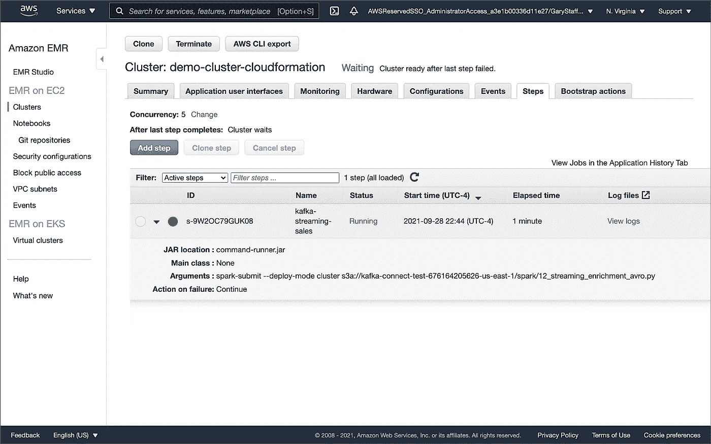

在 Amazon EMR 集群上运行的 PySpark 结构化流作业

然后，提交第二个 PySpark 脚本，[11 _ incremental _ sales _ avro . py](https://github.com/garystafford/kafka-connect-msk-demo/blob/main/pyspark/pyspark_scripts/11_incremental_sales_avro.py)，作为 EMR 步骤。这两个 PySpark 脚本将在您的 Amazon EMR 集群上并发运行，或者使用两个不同的 EMR 集群。

PySpark 脚本[11 _ incremental _ sales _ avro . py](https://github.com/garystafford/kafka-connect-msk-demo/blob/main/pyspark/pyspark_scripts/11_incremental_sales_avro.py)应该运行大约 30 分钟。

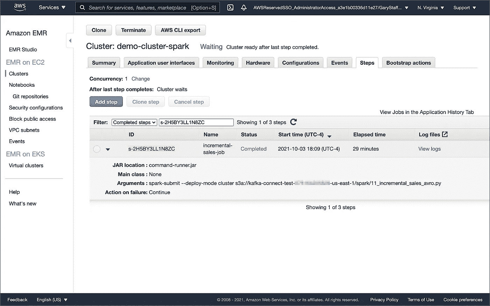

在第二个 Amazon EMR 集群上完成的销售数据模拟事件流

在此期间，脚本[12 _ streaming _ enrichment _ avro . py](https://github.com/garystafford/kafka-connect-msk-demo/blob/main/pyspark/pyspark_scripts/12_streaming_enrichment_avro.py)将以 Avro 格式向第二个 Kafka 主题`pagila.sales.summary.avro`以两分钟为间隔写入微批的汇总销售结果。PySpark 的`stdout`日志中记录的微批次示例如下所示。注意`min`和`max` `eventTime`，表示两分钟的微批次间隔。

作为 Avro 写入 Kafka 的微批处理的流式查询结果

一旦这个 PySpark 脚本[11 _ incremental _ sales _ avro . py](https://github.com/garystafford/kafka-connect-msk-demo/blob/main/pyspark/pyspark_scripts/11_incremental_sales_avro.py)完成，再等几分钟，然后停止流式 PySpark 脚本[12 _ streaming _ enrichment _ avro . py](https://github.com/garystafford/kafka-connect-msk-demo/blob/main/pyspark/pyspark_scripts/12_streaming_enrichment_avro.py)。

# 查看结果

要从 Kafka 检索并显示之前 PySpark 脚本的流计算结果，我们可以使用最终的 PySpark 脚本，[13 _ batch _ read _ results _ avro . py](https://github.com/garystafford/kafka-connect-msk-demo/blob/main/pyspark/pyspark_scripts/13_batch_read_results_avro.py)。

提交最终的 PySpark 脚本，[13 _ batch _ read _ results _ avro . py](https://github.com/garystafford/kafka-connect-msk-demo/blob/main/pyspark/pyspark_scripts/13_batch_read_results_avro.py)，作为 EMR 步骤。

这个最终的 PySpark 脚本使用存储在 Apicurio Registry 中的模式对 Kafka 主题`pagila.sales.summary.avro`中的所有 Avro 格式的聚合销售消息执行批处理查询。

```
sales_summary_key = get_schema("pagila.sales.summary.avro-key")
sales_summary_value = get_schema("pagila.sales.summary.avro-value")
```

然后，该脚本按销售区域将最终销售结果汇总到`stdout`作业日志中。下面，我们来看一个例子，在一个 10 分钟的活动时间滑动窗口内实时汇总亚太地区的销售额和订单。

PySpark 使用 Spark SQL 函数`Window.partitionBy()`和`row_number().over(window)`的组合，根据最新的时间戳，在每个滑动的 10 分钟[事件时间窗口](https://spark.apache.org/docs/latest/structured-streaming-programming-guide.html#window-operations-on-event-time)的每个 10 分钟窗口内，按地区汇总最终销售额。

按活动时间窗口列出的销售结果表(为清晰起见，添加了窗口中断)

# 结论

在这篇文章中，我们学习了如何在 Amazon EMR 上使用 PySpark、Apache Avro 格式和 Apircurio 注册表开始使用 Spark 结构化流。我们分离了 Kafka 消息的键和值模式，以及以 CSV 格式存储在 S3 的数据模式，将这些模式存储在一个注册表中。

*这篇博客代表我自己的观点，不代表我的雇主亚马逊网络服务公司。所有产品名称、徽标和品牌都是其各自所有者的财产。*