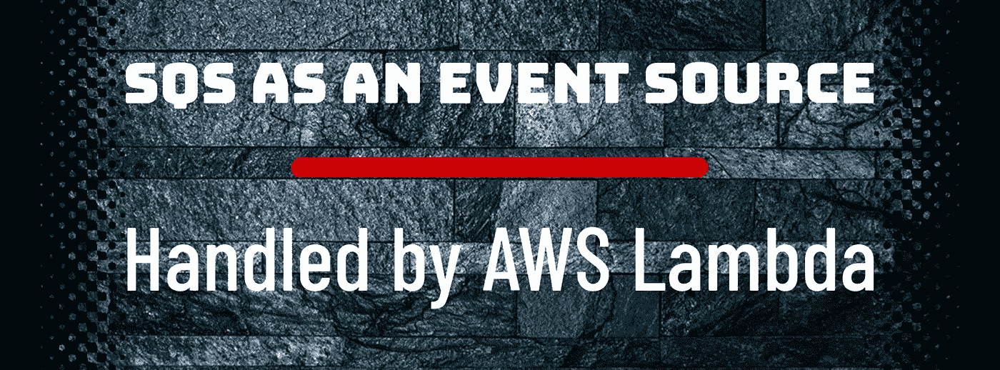

# 通过亚马逊历史最悠久的云服务传输数据

> 原文：<https://itnext.io/streaming-data-with-amazons-oldest-cloud-service-51a6be142c8e?source=collection_archive---------0----------------------->

科罗拉多州博尔德附近的某处

如果你是一名现代应用程序开发人员，计划对应用程序中的数据流进行一些近乎实时的处理——考虑跟踪地理位置、收集分析、监控遥测等。—您的基本需求之一是选择能够接收和传输这数百万位数据的云服务。有几种选择，那么你应该选择哪一种呢？

首先，我们来看看需求。

# 数据流的要求

对于流数据处理，有一个**存储**层和一个**处理**层。存储层需要支持强一致性(至少一次交付)、快速读/写、“无限”可扩展，并允许非常高的吞吐量来处理大量的流数据。处理层负责从存储层消费数据，对该数据运行分析，并通过通知存储层已处理的数据并将其从存储层删除来监督“已处理”的数据。这两层都需要高度可伸缩、持久和容错。

# 数据流服务/平台

为了满足上述需求，近年来出现了几种解决方案来处理这些类型的数据流工作负载。这些应用包括托管 AWS 服务，如[亚马逊 Kinesis 数据消防软管](https://aws.amazon.com/kinesis/data-firehose/)和[亚马逊 Kinesis 数据流](https://aws.amazon.com/kinesis/data-streams/)。其他类似的运行在 AWS 上的云流媒体数据平台已经出现，如 Apache Kafka、Apache Flume 和 Apache Storm。

每种服务或平台都有自己特定的用例、优缺点和定价结构。然而，有一种主要的云服务比所有这些选项存在的时间都长，并且满足了在存储层和处理层成功传输数据的所有要求。这是一个缺乏现代活力的不性感的野兽，但却始终如一地实现了它的承诺——经济高效，“无限”的规模，安全，保证一次交付，容错，并且对吞吐量水平没有限制。进入**亚马逊简单队列服务**。

# 处理您所有的数据流需求

亚马逊简单队列服务(SQS)早在 2004 年就作为一种消息队列服务推出，支持任何规模的消息的编程发送。它今天仍然是同样可靠的服务，可以处理大多数常见的工作负载，如亚马逊 Kinesis 和其他流数据平台，当与 AWS Lambda 配合作为事件源时，开销更少，成本更低，架构简单。

# 工作原理——亚马逊 SQS 生产商和消费者

当你创建一个队列时，这个队列成为几个亚马逊 SQS 服务器之间的[分布式系统的一部分，你发送到这个队列的每条消息都被冗余地存储在多个 SQS 服务器上。向队列发送消息的应用程序被称为**生产者—** 任何使用 AWS SDK 的客户端。从队列中检索消息的应用程序被称为**消费者。**消费者也可以是使用 AWS SDK 从队列中检索、处理和删除“已处理”消息的任何服务或客户端。](https://docs.aws.amazon.com/AWSSimpleQueueService/latest/SQSDeveloperGuide/sqs-basic-architecture.html)

# 队列的消息—持久数据存储

> 亚马逊 SQS 作为存储层

因此，我们有一个分布在几个 SQS 服务器上的队列，我们有消息存储在队列中，也是冗余的。该消息有两个主要组成部分， [**消息属性**](https://docs.aws.amazon.com/AWSSimpleQueueService/latest/SQSDeveloperGuide/sqs-message-attributes.html) **，**和一个**消息体**。消息属性是可选的，用于指定从识别发送者到为以后的处理提供消息细节的任何内容。消息体是原始文本或 JSON 格式的实际消息。每条消息最大为 256kb，一个队列可以存储无限量的消息。您的邮件在标准队列中被发送、存储并等待处理长达 14 天。所有客户每月可以免费发出 100 万次 SQS 请求，此后每 100 万次请求收费 0.40 美元，使这项服务成为简单、经济高效的数据源和流数据服务！

# 亚马逊 SQS 作为 AWS Lambda 的事件源

> AWS Lambda 服务作为处理层

我们知道将流数据作为存储层传输到 SQS 的所有好处，但是存储在队列中的流数据的处理器或消费者呢？正如我之前暗示的，AWS Lambda 是这个流数据架构的处理层。截至 2018 年年中，亚马逊 SQS 队列是 AWS Lambda 的一级事件驱动数据源。Lambda 集成是如何工作的？

AWS Lambda 服务(不是您的 Lambda 函数，而是代表您运行的 Lambda SQS 服务)不断轮询您的 SQS 队列以获取传入消息。当消息到达时，它接收消息，然后通过将消息作为参数传递来调用 Lambda 函数。看看一些 Kinesis 图表，这个 SQS 事件驱动架构(Lambda 作为消费者)看起来几乎与 Kinesis Streams 或 Firehose 提供的相同，但没有分片、分区、交付系统、管道等的复杂性..

> 如果你想更深入地了解亚马逊 SQS 作为一个事件源，请点击这里查看我的文章。

# 走吧。开始吧。流动

我创建了一个 [Github repo](https://github.com/mobilequickie/SQSSwift) 解决方案，其中包含一个一键式亚马逊 [CloudFormation 模板](https://aws.amazon.com/cloudformation/aws-cloudformation-templates/)，用于创建事件驱动的存储和处理后端层。CloudFormation 堆栈创建一个亚马逊 SQS 队列、映射到 Lamda 的事件源和一个 Lambda 函数。对于客户端(数据流生产者)，我创建了一个 iOS Swift 移动应用程序，通过一次向源 SQS 队列直接发送单个或批量(最多 10 个)消息，充当流数据的生产者。

从这里开始[。](https://github.com/mobilequickie/SQSSwift)

# 结束语

SQS 没有开销，具有成本效益，可无限扩展，并且对吞吐量、消息或队列的数量没有限制。**这是一项始终在线的托管存储层和处理层服务(借助 AWS Lambda ),几乎适用于任何应用。试一试，让我知道你的想法！**

# 向 SQS 传输数据流的典型使用案例

**地理定位**:基于设备的 GPS 数据收集
**分析**:用户活动和设备日志
**遥测日志**:连接设备状态、消息和事件日志

> 嘿，iOS 开发者们！我计划构建并记录一个本地 iOS Swift 应用程序，将数据传输到 SQS，并通过 Amazon Cognito 进行认证。你建议用什么用例？留下评论，让我知道你的选择！