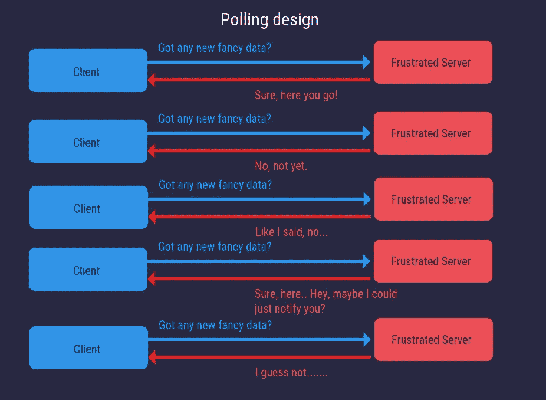
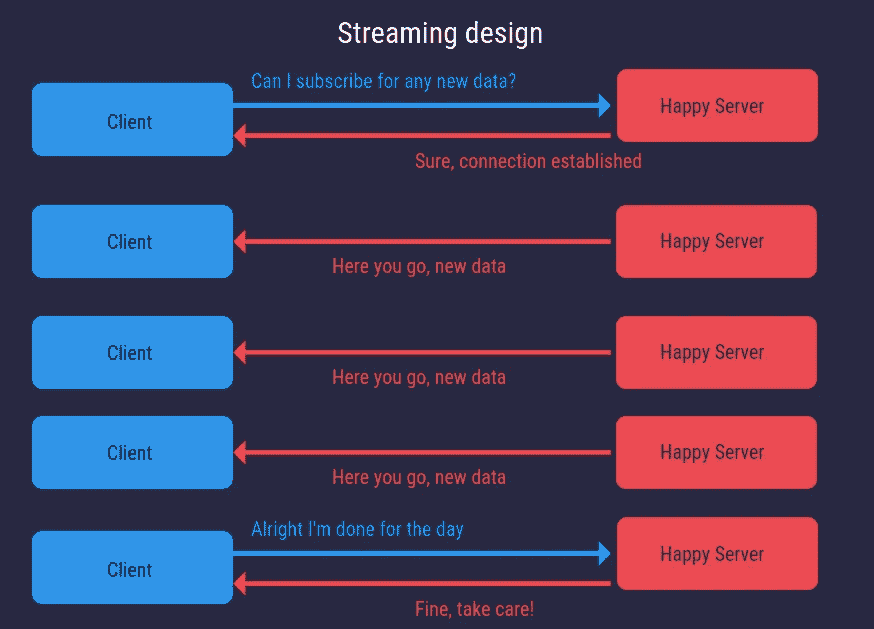
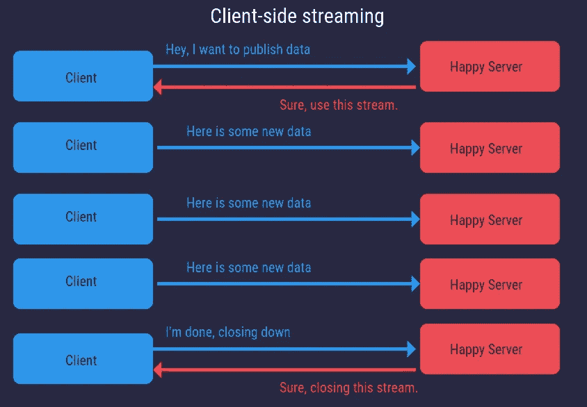
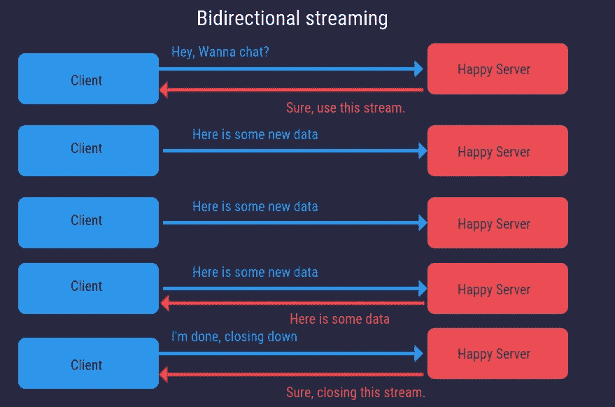
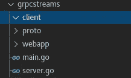
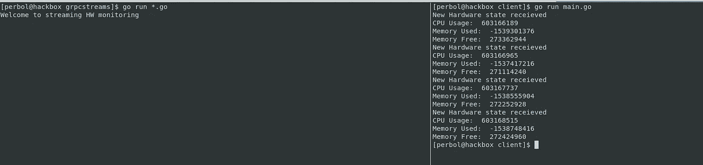
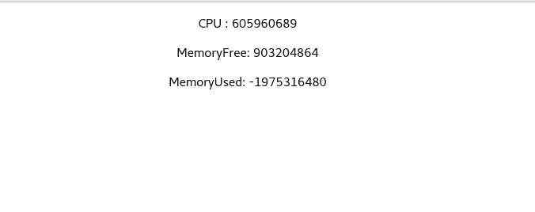

# 使用 gRPC 流式传输数据

> 原文：<https://itnext.io/streaming-data-with-grpc-2eb983fdee11?source=collection_archive---------1----------------------->

## 当沮丧的机器接管世界时，如何生存的指南


亚历杭德罗·门多萨在 [Unsplash](https://unsplash.com/s/photos/murder-robot?utm_source=unsplash&utm_medium=referral&utm_content=creditCopyText) 上拍摄的照片

你开过后座有小孩的车吗？
不断的追问。

> 我们到了吗？我们到了吗？烦人的后座小孩

这可能会让人发疯，而且很可能已经这样做了。

这很奇怪，因为即使我们知道这有多令人沮丧，**软件也倾向于这样设计**。您有一个作为客户端运行的前端或服务，它从服务器加载数据。在许多情况下，这种加载是通过频繁地**轮询**新数据来完成的。想象一下，作为一个拥有大量客户端的 HTTP API，所有客户端都问你“嘿，有没有新的闪亮数据给我？”大约每 10 秒钟。这种模式通常被称为[轮询](https://en.wikipedia.org/wiki/Polling_(computer_science))。

轮询是一种关于客户机如何从服务器检索数据的设计模式。



轮询设计模式的示例，在一段时间内重复请求

我很高兴计算机还没有形成自己的思想，因为当它们形成自己的思想时，哦，天哪，我们软件开发人员就完蛋了。所有那些服务器肯定都很沮丧。谢天谢地，你正在阅读这篇博文，当机器接管世界时，这篇博文将拯救你的生命。他们甚至会原谅你在这篇文章之后重新设计你的交流模式。

在本文中，我们将研究使用 gRPC 流的流架构。流数据的现代解决方案有很多， [WebSocket，](https://en.wikipedia.org/wiki/WebSocket) [WebRTC](https://webrtc.org/) 。我选择 gRPC 的原因是它**允许我们在微服务之间传输数据，而不仅仅是 web 应用**。(也因为我喜欢使用 Go)
在本文中，我们将创建一个用 Go 编写的 gRPC 服务器、一个用 Go 编写的客户机和一个用 React 编写的客户机。您将看到两个客户端如何使用同一个服务器。

该设计将看起来像下面的图片，而不是投票。我们将用一个请求建立一个连接，然后等待来自服务器的数据。因此，不是客户端请求新数据，而是服务器将新数据推送到客户端，这被称为**服务器端流**。



流设计利用已建立的通信通道从服务器传送数据，无需重复请求。

gRPC 还有另外两种流式传输数据的方式，称为**客户端流式传输和双向流式传输。**在本文中，我们将只使用**服务器端流。**

客户端流是指客户端将数据推送到服务器。



客户端流示例，其中客户端将更新推送到服务器

双向流是指客户端和服务器都可以在彼此之间推送数据。



双向流，客户端和服务器都可以传输数据

让我们开始在 Go 后端实现设计。我们还将在 react 应用程序中实现一个客户端。因此，阅读完本文后，您应该有一个 Go 服务器、一个 Go 客户端和一个 React 客户端，它们与同一个服务器进行对话。

## 项目设置和所需软件

让我们从建立项目结构开始。我已经开始为我们想要的每个客户端和后端代码创建一个文件夹。在我的例子中，我把这个项目命名为 **grpcstreams，**，里面有 3 个空文件夹和 2 个空文件夹。去文件。完整的代码示例可以在这里找到[。](https://github.com/percybolmer/grpcstreams)



我的项目设置。

如果你不熟悉 gRPC，我建议你先阅读我的另一篇关于它的文章。如果你想在没有先验知识的情况下继续，**你需要安装** [协议](https://grpc.io/docs/protoc-installation/)。Protoc 是一个编译器，用于将我们的 protobuf 和 gRPC 服务组装成 go 代码。

您还需要 go gRPC 插件，以便我们可以为 go 后端生成 gRPC 代码。如果你必须安装(我假设)或[获取它](https://golang.org/doc/install)，这可以通过 go get 命令获取。

```
go get -u google.golang.org/protobuf/cmd/protoc-gen-go
go install google.golang.org/protobuf/cmd/protoc-gen-go

go get -u google.golang.org/grpc/cmd/protoc-gen-go-grpc
go install google.golang.org/grpc/cmd/protoc-gen-go-grpc
```

在开始之前还有一件事，我们还需要为 web 应用程序生成一个客户机。你可以在这里找到它的安装说明[。](https://github.com/grpc/grpc-web#code-generator-plugin)

所以，为了确保你拥有一切，这里列出了你应该拥有的东西。

*   协议
*   通用协议和通用协议
*   grpc-web

## 设置 gRPC 服务

我们将首先创建一个名为 **service.proto** 的文件，它将位于 proto 文件夹中。这个文件是一个 protobuf 文件，它将定义我们的后端服务的样子。我们将创建一个硬件监控服务，向客户端发布硬件统计信息。

service.proto 将如下所示。

在 gRPC 中，创建 protobuf 文件并基于该文件生成代码。service.proto 文件是生成的代码外观的模板。

我们已经创建了一个 HardwareMonitor 服务，它将公开一个名为 Monitor 的方法。Monitor 方法将返回由(stream HardwareStats)指示的流。

让我们使用 protoc 来生成基于 service.proto 所需的代码

```
protoc service.proto --js_out=import_style=commonjs,binary:. --grpc-web_out=import_style=commonjs,mode=grpcwebtext:. --go-grpc_out=. --go_out=.
```

这个命令可能看起来很可怕，但它非常简单。我们在 service.proto 上调用 protocol，然后添加标志(js_out，grpc-web_out，go-grpc_out，go_out ),这些标志是我们安装的代码生成器。然后我们说=。这意味着输出当前目录中的代码。这意味着 protoc 将为我们生成四个文件。我们很快就会用到它们。因此，如果您想添加另一种类型的客户机，比如 Java 客户机，您可以添加 java_out 选项。

## Go gRPC 服务器

如果我们看一下 protoc 生成的 **service_grpc.pb.go** 文件，我们会发现它为我们创建了一个接口。它为我们生成了很多代码，但是它不知道 Monitor 方法会做什么，所以这取决于开发人员。生成的代码都是关于建立一个连接和使 gRPC 工作所需的一切，这是我们将保持原样的东西。

如果你对界面不是很熟悉，你可以阅读[我的关于界面的文章](/interfaces-in-go-5c6e38b81b41)。生成的界面如下所示。

生成的 gRPC 接口。

我们需要做的是打开 **server.go** 并编辑它，使它成为 HardwareMonitorServer 接口的一部分。这意味着我们需要实现 Monitor 方法。

每秒输出统计数据的服务器。

当 server.go 设置好后，我们还需要一些运行服务器的方法。这在 **main.go** 中完成。主服务器将只监听到端口 7777 的 TCP 连接，并在该端口上托管我们的 gRPC 硬件监控服务器。这将允许来自 web 客户端或 go 客户端的客户端执行 Monitor 方法。记住，这是 **RPC，**所以任何请求都只是在服务器上执行方法的指令。这就是为什么我们可以拥有多种语言的客户端。注意，这个 gRPC API 将在不安全的连接上运行。生产中要加 TLS，见我关于 [gRPC 和 TLS](/using-grpc-with-tls-golang-and-react-no-envoy-92e898bf8463) 的文章。

这是我们运行服务器的简单 Main

## Go 中的客户端

既然服务器已经启动并运行，我们需要创建一个客户机来测试它。我先从用 Go 写的客户端开始。

客户端将非常简单，它将连接到 gRPC 服务器并建立一个流，监听 7 秒钟，然后终止。

客户端设置一个流并监听 7 秒钟。

当您填写完 client.go 后，是时候进行测试了。只需在服务器上运行**，然后在客户端运行**。



显示客户端和服务器运行的示例。

## web 应用程序中的客户端

对于 web 应用程序，我将使用 react 和 [create-react-app](https://reactjs.org/docs/create-a-new-react-app.html) 。

所以创建网络应用程序需要安装更多的软件，我很抱歉！:)

我们将使用 [NPM，所以从得到那个](https://www.npmjs.com/get-npm)开始。

我们还需要一些 protobuf 和 gRPC 库，以便我们可以使用客户端。

```
npm install -g npx
npm install grpc-web
npm install google-protobuf
```

我们将创建名为 hwmonitor 的 react 应用程序。所以首先你需要进入 **webapp** 文件夹，运行以下命令生成 react 应用。

```
npx create-react-app hwmonitor
```

一旦命令运行完毕，我们将需要创建一个新的目录，并将生成的 protobuf 文件复制到其中。我将在**grpc streams/web app/HW monitor/src/proto 中创建 proto 文件夹。**

不要忘记将 **service_pb.js** 和 **service_grpc_web_pb.js** 都复制到新的 proto 文件夹中。

现在是打开 **service_pb.js 的好时机**在这个文件中，我们可以看到生成的 protobuf 对象，这在我们想要到达数据的时候很重要。

显示的 toObject 函数，用于查看哪些字段可用。

我们可以看到该对象包含 3 个字段，cpu，memoryFree，memoryUsed。所以我们的字段是小写的。知道这一点很好，因为我们需要这些字段来显示数据。

接下来，我们将在 react 应用程序中打开名为 **App.js** 的文件并对其进行修改。它将与 go 中的客户端相同，它将启动一个流并打印出数据。

要点显示了我们如何使用流来更新统计数据。

用上面的代码修改 App.js 之后，执行 **npm run build** 命令来构建应用程序。

```
npm run build
```

如果您的构建由于 PROTO 未知而失败，请访问这篇文章，我在文章的底部描述了如何**修复它。**

[](https://programmingpercy.tech/blog/using-grpc-tls-go-react-no-reverse-proxy/) [## 将 gRPC 与 TLS、Golang、React 一起使用，无需反向代理(Envoy)

### 一篇关于如何在 Go 后端服务器和 React 客户端之间实现 gRPC 而不使用反向代理的文章…

编程 percy.tech](https://programmingpercy.tech/blog/using-grpc-tls-go-react-no-reverse-proxy/) 

如果您的 NPM 构建命令有效，您应该会看到一个名为 build 的新目录。我们需要更新 main.go 来作为文件服务器托管这个目录，并更新它来托管 HTTP 上的 gRPC API。

## 更新 main.go

我们将更新 main.go 来托管 gRPC 和 React 应用程序。我们将添加一些通过 HTTP 服务于 react 应用程序的代码，并在 HTTP 连接上复用 gRPC。

main.go 现在通过 HTTP 和 TCP 托管 gRPC 服务器，

现在我们为 golang 客户端和 web 客户端托管 API。访问 [localhost:8080](http://localhost:8080/) ，你应该会看到服务器的硬件统计。



每次服务器推送更新时，统计数据都会更新

这篇文章大概就是这样。您已经了解了如何让您的服务器更满意，而不是让它将数据推送到客户端。而不是所有这些客户端频繁地向您的服务器请求更新。只希望机器统治的时候能饶你一命就够了。

如果有任何想法、问题、批评或反馈，请随时联系我。

记得去**顺流而下。**