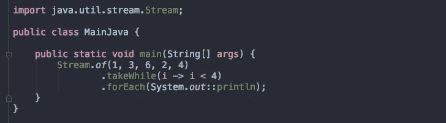
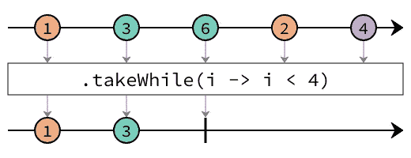
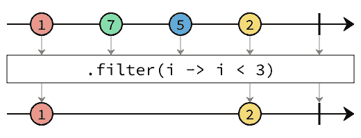
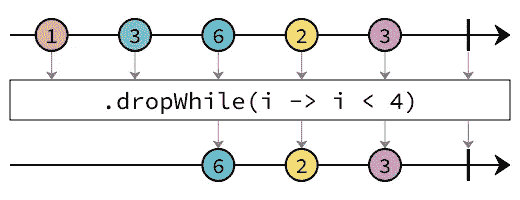

# Java 8 之后的流 API 新特性

> 原文：<https://itnext.io/streams-api-new-features-after-java-8-f2df81bed5ac?source=collection_archive---------2----------------------->

## dropWhile，takeWhile 和…



毫无疑问，Java 8 中引入的最重要的特性是`[lambda expression](https://docs.oracle.com/javase/tutorial/java/javaOO/lambdaexpressions.html)`，它最大和最重要的用途是在`[Stream API](https://docs.oracle.com/javase/8/docs/api/java/util/stream/package-summary.html#package.description)`。

`[Java 8 Stream API](https://docs.oracle.com/javase/8/docs/api/java/util/stream/package-summary.html#package.description)`允许开发人员通过将`[lambda expression](https://docs.oracle.com/javase/tutorial/java/javaOO/lambdaexpressions.html)`传递给一组高阶函数(map、filter、forEach 和……)来以函数风格的方式操作集合。

在发布 Java 8 和增加 Java 开发者之间使用`[Stream API](https://docs.oracle.com/javase/8/docs/api/java/util/stream/package-summary.html#package.description)`的流行度之后，我们正在等待 JDK 下一版本的`[Stream API](https://docs.oracle.com/javase/8/docs/api/java/util/stream/package-summary.html#package.description)`中的新特性(例如新的高阶函数)。通过发布 Java 9，我们在`[Stream API](https://docs.oracle.com/javase/8/docs/api/java/util/stream/package-summary.html#package.description)`中看到了新的改进，但是在 Java 10 和 11 中没有变化。让我们来看看 Java 8 之后引入的`[Stream API](https://docs.oracle.com/javase/8/docs/api/java/util/stream/package-summary.html#package.description)`中的新特性:

# 抓紧时间

`takeWhile`是从 Java 9 开始添加的，它获得一个`predicate`作为参数，从流中获取元素，直到第一个元素与谓词不匹配，然后处理将完成，该元素加上流的其余部分将被丢弃。它类似于`filter`方法，除了`filter`方法将`predicate`应用于流的所有元素。



图片来自 [Eclipse Foundation](http://www.eclipse.org/)



图片来自 [Eclipse Foundation](http://www.eclipse.org/)

例如，假设您想要使用`Stream API`在终端中打印以下形状:

```
*
**
***
****
*****
******
```

你可以通过`takeWhile`轻松写出来:

上述定义对有序流有意义。那么无序的会发生什么呢？根据官方[文档](https://docs.oracle.com/javase/9/docs/api/java/util/stream/Stream.html#takeWhile-java.util.function.Predicate-):

> 如果这个流是无序的，并且这个流的一些(但不是全部)元素匹配给定的谓词，那么这个操作的行为是不确定的；它可以自由选择匹配元素的任何子集(包括空集)。

这意味着对无序流的每次执行都会得到不同的结果。

输出可以是:`1`或者`3 2 1`！

# 下降时间

`dropWhile`从 Java 9 开始增加。它与`takeWhile`相反，从流中删除元素，直到第一个不匹配谓词的元素，然后返回该元素和流的其余部分。



图片来自 [Eclipse Foundation](http://www.eclipse.org/)

在无序的流中，`dropWhile`看起来像`takeWhile`并且是不确定的。

# ofNullable

这个静态工厂方法允许我们创建一个包含单个元素或空元素的流(对于空参数值)。

# 重复

Stream API 有一个`iterate`方法，该方法采用一个 T 类型的种子元素和一个函数，它用于创建一个无限流< T >，方法是从种子元素开始，迭代应用函数以获得下一个元素:

输出:

```
0
2
4
...
```

添加了一个新的`iterate`方法，因为 Java 9 是旧方法的修改版本，它通过添加一个谓词作为方法参数来确定流何时必须终止:

它相当于 for 语句的这个实现:

输出:

```
0
2
4
6
8
10
```

# 结论

我试图通过一些示例和描述来描述 Java 8 之后 Java Stream API 的主要改进。我期待在即将到来的 Java 版本中 Java Stream API 的新特性。

# **资源:**

*   [流(Java SE 11 & JDK 11 ) —甲骨文帮助中心](https://docs.oracle.com/en/java/javase/11/docs/api/java.base/java/util/stream/Stream.html)
*   [Java . util . stream(Java SE 11&JDK 11)—Oracle Docs](https://docs.oracle.com/en/java/javase/11/docs/api/java.base/java/util/stream/package-summary.html)