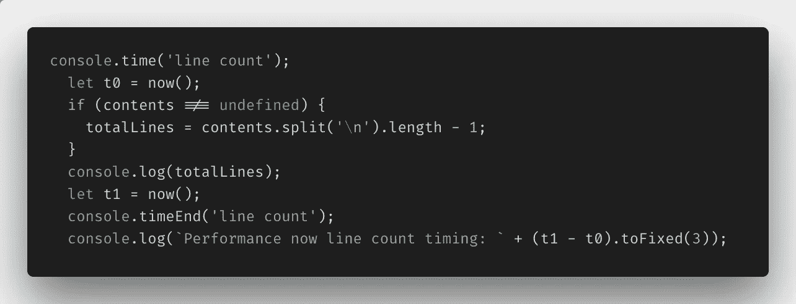
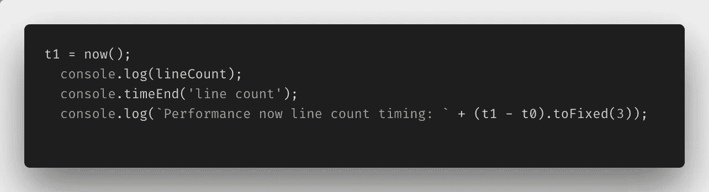
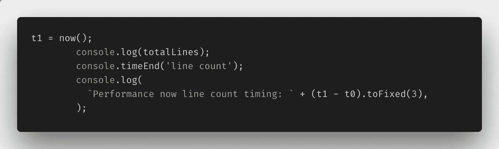
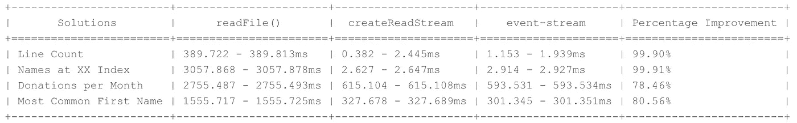
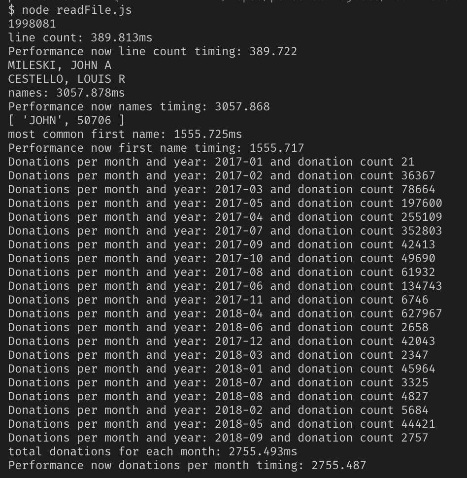
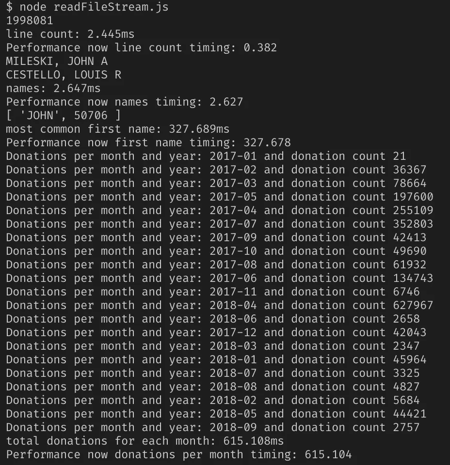
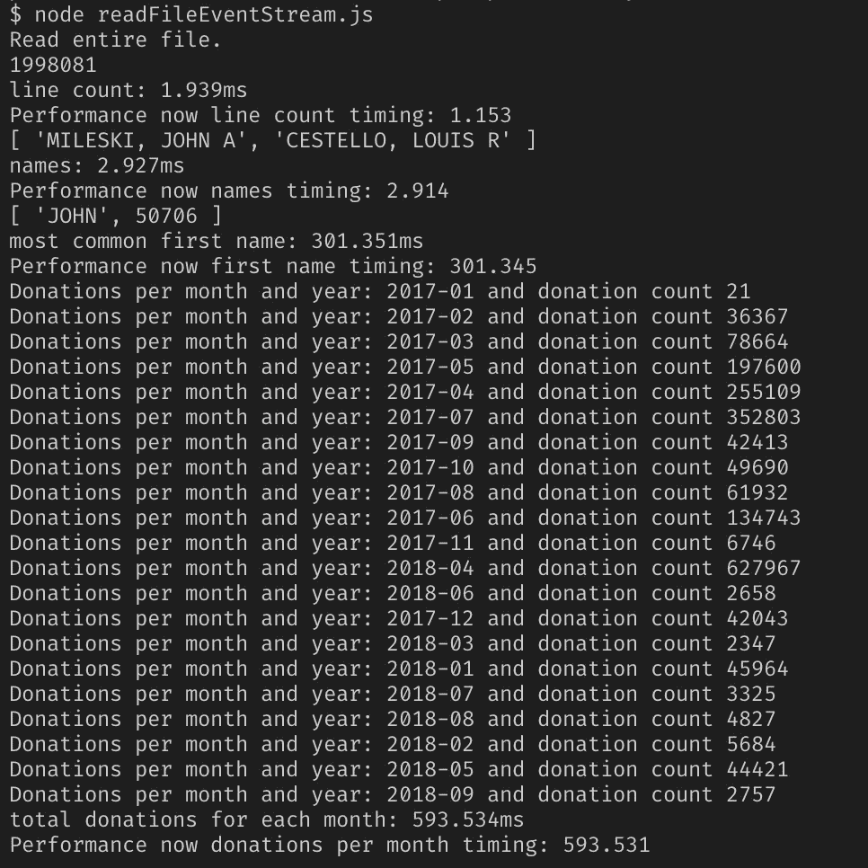
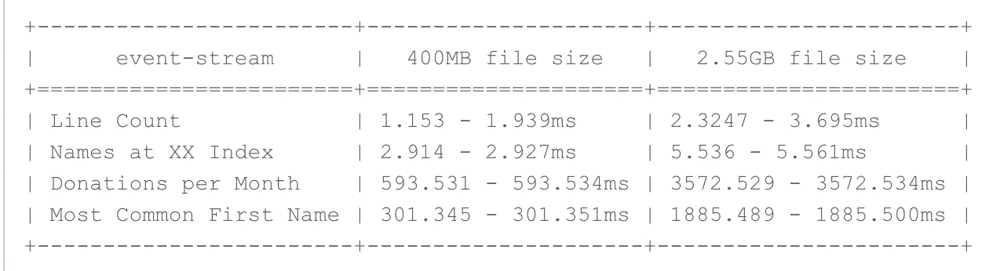
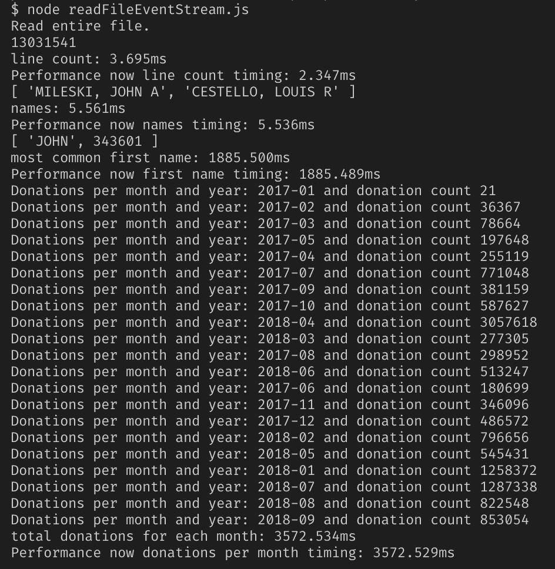

# 成功的流:读取大型数据集的 Node.js 方法的性能比较(第 2 部分)

> 原文：<https://itnext.io/streams-for-the-win-a-performance-comparison-of-nodejs-methods-for-reading-large-datasets-pt-2-bcfa732fa40e?source=collection_archive---------0----------------------->

# readFile()、createReadStream()和事件流如何相互叠加


如果你一直在关注我的写作，几周前，我发表了一篇[博客](/using-node-js-to-read-really-really-large-files-pt-1-d2057fe76b33)，谈论使用 Node.js 读取真正大型数据集的各种方法。

令我惊讶的是，它在读者中表现得非常好——这似乎(对我来说)像是一个许多人已经在帖子、博客和论坛中涉及的主题，但不管出于什么原因，它得到了许多人的关注。所以，感谢所有花时间阅读它的人！我真的很感激。

一位特别精明的读者([马丁·科克](https://medium.com/u/8405c208bb0a?source=post_page-----bcfa732fa40e--------------------------------))甚至问解析这些文件需要多长时间。他似乎已经读懂了我的心思，因为我关于使用 Node.js 读取非常非常大的文件和数据集的系列文章的第二部分就涉及到了这一点。

> 在这里，我将评估我用来读取文件的 Node.js 中的三种不同方法，以确定哪种方法的性能最好。

## 来自第 1 部分的挑战

我不会深入探讨挑战和解决方案的细节，因为你可以在这里阅读我的第一篇文章了解所有细节[，但我会给你一个高层次的概述。](/using-node-js-to-read-really-really-large-files-pt-1-d2057fe76b33)

我所在的 Slack 频道的一个人发布了他收到的一个编码挑战，其中涉及读取一个非常大的数据集(总共超过 2.5GB)，解析数据并提取各种信息。

它要求程序员打印:

*   文件中的总行数，
*   第 432 号和第 43243 号索引中的名称，
*   统计每月捐赠总数，
*   以及文件中最常见的名字和它出现的频率。

数据链接:[https://www.fec.gov/files/bulk-downloads/2018/indiv18.zip](https://www.fec.gov/files/bulk-downloads/2018/indiv18.zip)

## 适用于较小数据集的三种不同解决方案

当我朝着处理大型数据集的最终目标努力时，我在 Node.js 中提出了三个解决方案。

**方案一:** `[**fs.readFile()**](https://nodejs.org/api/fs.html#fs_fs_readfile_path_options_callback)`

第一个涉及 Node.js 的本地方法`fs.readFile()`，包括读入整个文件，将其保存在内存中，对整个文件执行操作，然后返回结果。至少对于较小的文件来说，它是有效的，但是当我达到最大文件大小时，我的服务器崩溃了，出现了一个 JavaScript `heap out of memory`错误。

**方案二:** `[**fs.createReadStream()**](https://nodejs.org/api/fs.html#fs_fs_createreadstream_path_options) **&** [**rl.readLine()**](https://nodejs.org/api/readline.html#readline_event_line)`

我的第二个解决方案还涉及 Node.js 固有的另外两个方法:`fs.createReadStream()`和`rl.readLine()`。在这个迭代中，文件通过 Node.js 以一个`input`流传输，我能够在每一行上执行单独的操作，然后将所有这些结果汇集在`output`流中。同样，这在较小的文件上工作得很好，但是当我到达最大的文件时，同样的错误发生了。尽管 Node.js 对输入和输出进行了流式处理，但在执行操作时，它仍然试图将整个文件保存在内存中(并且无法处理整个文件)。

**方案三:** `[**event-stream**](https://www.npmjs.com/package/event-stream)`

最终，我在 Node.js 中找到了唯一一个能够一次性处理我想要解析的 2.55GB 文件的解决方案。

> 有趣的事实:Node.js 在任何时候都只能容纳 1.67GB 的内存，在此之后，它会抛出 JavaScript `heap out of memory`错误。

我的解决方案涉及一个流行的 NPM 包，名为 [event-stream](https://www.npmjs.com/package/event-stream) ，它实际上让我对数据的*吞吐量流*执行操作，而不仅仅是输入和输出流，这是 Node.js 的本机功能所允许的。

你可以在 Github 的这里看到我所有的三个解决方案[。](https://github.com/paigen11/file-read-challenge)

我解决了这个问题，这是我最初的目标，但它让我思考:我的解决方案真的是三个选项中最有效的吗？

## 比较它们以找到最佳解决方案

现在，我有了一个新的目标:确定我的解决方案中哪一个是最好的。

由于我无法在 Node.js 本地解决方案中使用完整的 2.55GB 文件，所以我选择使用一个较小的文件，大约 400MB 的数据，这是我在开发解决方案时用于测试的。

对于性能测试 Node.js，我遇到了两种跟踪文件和单个函数处理时间的方法，我决定将这两种方法结合起来，看看这两种方法之间的差异有多大(并确保我没有完全偏离我的计时)。

`[**console.time()**](https://nodejs.org/api/console.html#console_console_time_label)`T13)T12)T1)

Node.js 有一些方便的内置方法可用于计时和性能测试，分别称为`console.time()`和`console.timeEnd()`。要使用这些方法，我只需为`time()`和`timeEnd()`传递相同的标签参数，就像这样，Node 足够聪明，可以在函数完成后输出它们之间的时间。

```
// timer start
console.time('label1');// run function doing something in the code
doSomething();// timer end, where the difference between the timer start and timer end is printed out
console.timeEnd('label1');// output in console looks like: label1 0.002ms
```

这是我用来计算处理数据集所需时间的一种方法。

`[**performance-now**](https://www.npmjs.com/package/performance-now)`

另一个，我遇到的 Node.js 的经过测试的、很受欢迎的性能测试模块是作为`[performance-now](https://www.npmjs.com/package/performance-now)`托管在 NPM 上的。

每周从 NPM 下载 700 多万次，不会太离谱吧？？

将`performance-now`模块实现到我的文件中也几乎和原生 Node.js 方法一样简单。导入模块，为方法实例化的开始和结束设置一个变量，计算两者之间的时间差。

```
// import the performance-now module at the top of the file
const now = require('performance-now');// set the start of the timer as a variable
const start = now();// run function doing something in the code
doSomething();// set the end of the timer as a variable
const end = now();// Compute the duration between the start and end
console.log('Performance for timing for label:' + (end — start).toFixed(3) + 'ms';// console output looks like: Performance for timing label: 0.002ms
```

我认为，通过同时使用节点的`console.time()`和`performance-now`，我可以拆分差异，并获得关于我的文件解析函数实际花费了多长时间的非常准确的读数。

下面是在我的每个脚本中实现`console.time()`和`performance-now`的代码片段。这些只是每个函数的片段——完整的代码，你可以在这里看到我的报告。

**Fs.readFile()代码实现示例**



因为这个脚本使用了`fs.readFile()`实现，在执行任何函数之前，整个文件都被读入内存，所以这是看起来最同步的代码。它实际上不是同步的，那是一个完全独立的叫做`fs.readFileSync()`的节点方法，它只是类似于它。

但是很容易看到文件的总行数和两个计时方法来确定执行行数需要多长时间。

**Fs.createReadStream()代码实现示例**

**输入流(逐行):**


**输出流(在输入期间读取完整文件后):**



由于使用`fs.createReadStream()`的第二个解决方案涉及为文件创建输入和输出流，我将代码片段分成两个单独的截图，第一个来自输入流(逐行运行代码)，第二个来自输出流(编译所有结果数据)。

**事件流代码实现示例**

**直通流(也是逐行的):**


**在流末端:**



`event-stream`解决方案看起来与`fs.createReadStream()`非常相似，除了代替*输入流*，数据在*吞吐流*中处理。然后，一旦整个文件被读取，并且文件上的所有功能都已完成，流就结束了，所需的信息被打印出来。

## 结果

现在到了我们期待已久的时刻:结果！

我在同一个 400MB 的数据集上运行了我的三个解决方案，该数据集包含了近 200 万条要解析的记录。



为胜利而战！

从表中可以看出，`fs.createReadStream()`和`event-stream`都表现不错，但总的来说，`event-stream`在我看来是最大的赢家，因为它可以处理比`fs.readFile()`或`fs.createReadStream()`大得多的文件。

上表末尾也列出了改进的百分比，以供参考。

刚刚被竞争对手打得落花流水。通过流式传输数据，文件的处理时间缩短了至少 78% —有时接近 100%，这是相当惊人的。

以下是我的每个解决方案在终端上的原始截图。

**方案一:** `[**fs.readFile()**](https://nodejs.org/api/fs.html#fs_fs_readfile_path_options_callback)`



仅使用 fs.readFile()的解决方案

**方案二:** `[**fs.createReadStream()**](https://nodejs.org/api/fs.html#fs_fs_createreadstream_path_options) **&** [**rl.readLine()**](https://nodejs.org/api/readline.html#readline_event_line)`



使用 fs.createReadStream()和 rl.readLine()的解决方案

**方案三:**



使用事件流的解决方案

**奖金**

这是我的`event-stream`解决方案在 2.55GB 的怪物文件中翻腾的截图。这是 400MB 文件和 2.55GB 文件之间的时差。



看看这些超快的速度，尽管文件大小增加了近 6 倍。

**方案三:** `[**event-stream**](https://www.npmjs.com/package/event-stream)` **(在 2.55GB 文件上)**



## 结论

最后，无论是 Node.js 本地的流还是非本地的流，在处理大型数据集时都要高效得多。

感谢回到我的使用 Node.js 读取非常非常大的文件系列的第 2 部分。如果你想再次阅读第一篇博客，你可以在这里得到它。

几周后我会带着一个新的 JavaScript 主题回来——可能是在 Node 中调试，或者是用 Puppeteer 和 headless Chrome 进行端到端测试，所以请关注我以获取更多内容。

感谢您的阅读，我希望这能让您了解如何使用 Node.js 高效地处理大量数据，并对您的解决方案进行性能测试。非常感谢鼓掌和分享！

如果你喜欢读这篇文章，你可能也会喜欢我的其他博客:

*   [使用 Node.js 读取非常非常大的数据集&文件(Pt 1)](/using-node-js-to-read-really-really-large-files-pt-1-d2057fe76b33)
*   [Sequelize:用 Node.js 实现 Sequel 数据库的 ORM](https://medium.com/@paigen11/sequelize-the-orm-for-sql-databases-with-nodejs-daa7c6d5aca3)
*   [为什么 Spring Cloud 配置服务器对一个好的 CI/CD 管道至关重要，以及如何设置它(第 1 部分)](https://medium.com/@paigen11/why-a-cloud-config-server-is-crucial-to-a-good-ci-cd-pipeline-and-how-to-set-it-up-pt-1-fa628a125776)

**参考资料和更多资源:**

*   Github，读取文件回购:[https://github.com/paigen11/file-read-challenge](https://github.com/paigen11/file-read-challenge)
*   Node.js 文档，文件系统:[https://nodejs.org/api/fs.html](https://nodejs.org/api/fs.html)
*   Node.js 文档，控制台。时间:[https://nodejs . org/API/console . html # console _ console _ time _ label](https://nodejs.org/api/console.html#console_console_time_label)
*   现在的表现:[https://www.npmjs.com/package/performance-now](https://www.npmjs.com/package/performance-now)
*   https://www.npmjs.com/package/event-stream
*   外汇券数据链接:[https://www.fec.gov/files/bulk-downloads/2018/indiv18.zip](https://www.fec.gov/files/bulk-downloads/2018/indiv18.zip)