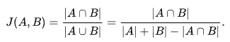
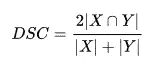

# 字符串相似性——了解算法的基本指南！

> 原文：<https://itnext.io/string-similarity-the-basic-know-your-algorithms-guide-3de3d7346227?source=collection_archive---------0----------------------->

最著名、最广泛使用、但仍最不为人所知的字符串相似性算法的基本介绍。


# 介绍

最好的字符串相似度算法是什么？嗯，这个问题很难回答，至少在不知道其他事情的情况下，比如你需要它做什么。即使有了一个基本的想法，如果不首先在不同的数据集上进行尝试，也很难找到一个好的算法。这是一个反复试验的过程。为了使这一旅程更简单，我试图列出并解释最基本的字符串相似性算法的工作原理。给他们一个尝试，这可能是你一直需要的。

# 算法的类型

基于操作的性质，字符串相似性算法可以分为多个领域。让我们讨论其中的几个，

**编辑基于距离:**这类算法试图计算将一个字符串转换成另一个字符串所需的运算次数。运算次数越多，两个字符串之间的相似性就越小。需要注意的一点是，在这种情况下，字符串的每个索引字符都被赋予同等的重要性。

**基于标记:**在这个类别中，期望的输入是一组标记，而不是完整的字符串。想法是在两个集合中找到相似的记号。公共记号的数量越多，集合之间的相似性就越大。通过使用分隔符进行分割，可以将字符串转换为集合。通过这种方式，我们可以将一个句子转换成单词或 n 元字符的记号。注意，这里不同长度的记号具有相同的重要性。

**基于序列:**这里，相似度是两个字符串之间的公共子字符串的一个因子。这些算法试图找到两个字符串中都存在的最长序列，找到的这些序列越多，相似性得分就越高。注意，这里相同长度的字符组合具有同等的重要性。

# 编辑基于距离的算法

让我们试着理解这种类型中最广泛使用的算法，

**汉明距离**
这个距离是通过将一个字符串叠加在另一个字符串上并找到字符串变化的地方来计算的。注意，经典实现意味着处理相同长度的字符串。一些实现可以通过在前缀或后缀添加填充来绕过这一点。然而，逻辑是找出一个字符串与另一个字符串不同的地方的总数。为了展示一个例子，

```
>> import textdistance
>> textdistance.hamming('text', 'test')
1
>> textdistance.hamming.normalized_similarity('text', 'test')
0.75
>> textdistance.hamming('arrow', 'arow')
3
>> textdistance.hamming.normalized_similarity('arrow', 'arow')
0.4
```

显然，在第一个例子中，两个字符串仅在第三个位置不同，因此编辑距离是 1。在第二个示例中，尽管我们只缺少一个“r”，但“行”部分偏移了 1，使得编辑距离为 3(第 3、第 4 和第 5 位置不相似)。需要注意的一点是归一化的相似度，这只是一个将编辑距离限制在 0 和 1 之间的函数。这意味着，如果分数为 0-两个字符串不可能更不相似，另一方面，分数为 1 表示完全匹配。因此，第一个示例中的字符串有 75%的相似度(预期)，但第二个示例中的字符串只有 40%的相似度(我们能做得更好吗？).

**Levenshtein 距离** 这个距离是通过找出将一个字符串转换成另一个字符串的编辑次数来计算的。允许的转换包括插入—添加新字符、删除—删除字符和替换—用一个字符替换另一个字符。通过执行这三个操作，该算法尝试修改第一个字符串以匹配第二个字符串。最后我们得到一个编辑距离。例子，

```
>> textdistance.levenshtein('arrow', 'arow')
1
>> textdistance.levenshtein.normalized_similarity('arrow', 'arow')
0.8
```

显而易见，如果我们在字符串 2 中插入一个“r”，即“arow”，它将与字符串 1 相同。因此，编辑距离为 1。类似于汉明距离，我们可以生成介于 0 和 1 之间的有界相似性得分。相似性分数是 80%，比上一个算法有了巨大的提高。

**Jaro-Winkler** 这种算法给两个字符串高分，如果(1)它们包含相同的字符，但是彼此在一定的距离内，以及(2)匹配字符的顺序相同。准确地说，寻找相似字符的距离是 1 小于最长字符串长度的一半。因此，如果最长字符串的长度为 5，则必须在字符串 2 中的((5/2)-1)~第二个位置之前或之上找到字符串 1 开头的字符，才能视为有效匹配。因此，该算法是有方向性的，如果匹配是从字符串的开头开始，则给出高分。一些例子，

```
>> textdistance.jaro_winkler("mes", "messi")
0.86
>> textdistance.jaro_winkler("crate", "crat")
0.96
>> textdistance.jaro_winkler("crate", "atcr")
0.0
```

在第一种情况下，由于字符串从一开始就匹配，所以提供了高分。类似地，在第二种情况下，只有一个字符丢失，并且也在字符串 2 的末尾，因此给出了非常高的分数。想象一下之前的算法，相似度会更小，准确的说是 80%。在第三种情况下，我们重新排列了字符串 2 的最后两个字符，将它们放在前面，这导致了 0%的相似性。

# 基于令牌的算法

属于这一类别的算法或多或少是集合相似性算法，被修改以适用于字符串标记的情况。有些是，

**Jaccard index** 属于设定的相似性域，公式是找出共同记号的数量，并除以独特记号的总数。它用数学术语来表达，



Jaccard 索引

其中，分子是交集(通用标记)，分母是并集(唯一标记)。第二种情况是当有一些重叠时，我们必须通过组合两个字符串的所有标记来删除公共项，因为它们会叠加两次。由于所需的输入是令牌而不是完整的字符串，因此根据用例，用户需要高效、智能地对其字符串进行令牌化。例子，

```
>> tokens_1 = "hello world".split()
>> tokens_2 = "world hello".split()
>> textdistance.jaccard(tokens_1 , tokens_2)
1.0
>> tokens_1 = "hello new world".split()
>> tokens_2 = "hello world".split()
>> textdistance.jaccard(tokens_1 , tokens_2)
0.666
```

我们首先通过默认的空格分隔符对字符串进行标记，使字符串中的单词成为标记。然后我们计算相似性得分。在第一个示例中，由于两个单词都出现在两个字符串中，所以得分为 1。想象一下，在这种情况下运行一个基于编辑的算法，如果不是 0，分数将会非常低。

**Sorensen-Dice** 落在集合相似度下，逻辑是找到共同的记号，用它除以两个集合组合出现的记号总数。公式是，



索伦森-戴斯公式

其中，分子是两个集合/字符串交集的两倍。这背后的想法是，如果一个令牌同时出现在两个字符串中，那么它的总计数显然是交集的两倍(这消除了重复)。分母是两个字符串中所有标记的简单组合。注意，它与 jaccard 的分母完全不同，它是两个字符串的联合。与交集的情况一样，并集也会删除重复项，这在 dice 算法中是可以避免的。正因为如此，dice 总是会高估两个字符串的相似度。一些例子，

```
>> tokens_1 = "hello world".split()
>> tokens_2 = "world hello".split()
>> textdistance.sorensen(tokens_1 , tokens_2)
1.0
>> tokens_1 = "hello new world".split()
>> tokens_2 = "hello world".split()
>> textdistance.sorensen(tokens_1 , tokens_2)
0.8
```

# 基于序列的算法

让我们理解一种基于序列的算法，

**Ratcliff-Obershelp 相似度** 这个想法很简单却很直观。从两个字符串中找出最长的公共子字符串。从两根弦上取下该部分，并在同一位置分开。这会将字符串分成两部分，一部分在找到的公共子字符串的左边，另一部分在右边。现在取两个字符串的左边部分，再次调用函数来查找最长的公共子串。对正确的部分也这样做。这个过程被递归地重复，直到任何断裂部分的尺寸小于默认值。最后，遵循类似于上述骰子的公式来计算相似性得分。分数是两个字符串中找到的共同字符数除以总字符数的两倍。一些例子，

```
>> string1, string2 = "i am going home", "gone home"
>> textdistance.ratcliff_obershelp(string1, string2)
0.66
>> string1, string2 = "helloworld", "worldhello"
>> textdistance.ratcliff_obershelp(string1, string2)
0.5
>> string1, string2 = "test", "text"
>> textdistance.ratcliff_obershelp(string1, string2)
0.75
>> string1, string2 = "mes", "simes"
>> textdistance.ratcliff_obershelp(string1, string2)
0.75
>> string1, string2 = "mes", "simes"
>> textdistance.ratcliff_obershelp(string1, string2)
0.75
>> string1, string2 = "arrow", "arow"
>> textdistance.ratcliff_obershelp(string1, string2)
0.88
```

在第一个示例中，它发现“home”是最长的子串，然后考虑“I ' going”和“gone”以进行进一步处理(公共子串的左侧)，其中它再次发现“go”是最长的子串。后来在“go”的右边，它也发现“n”是唯一常见的和最长的子串。总体得分为 2 * (5 + 2 + 1) / 24 ~ 0.66。在第二种情况下，它发现“hello”是最长的子串，并且在左右两边没有公共的，因此得分是 0.5。其余示例展示了对基于编辑距离的算法遗漏的案例使用序列算法的优势。

# 结论

字符串相似性算法的选择取决于用例。上面提到的所有算法，以一种或另一种方式，试图找到字符串的公共和非公共部分，并将它们分解以生成相似性得分。在不使过程复杂化的情况下，大多数用例可以通过使用这些算法之一来解决。稍微复杂一点的领域包括向量表示和压缩类型，它们也考虑单词或 n 元语法的语义。稍后将详细介绍。

# 参考

[1] [Levenshtein Distance，in Three Flavors](https://people.cs.pitt.edu/~kirk/cs1501/Pruhs/Spring2006/assignments/editdistance/Levenshtein%20Distance.htm) —作者:[迈克尔·吉兰](http://www.merriampark.com/mgresume.htm)，[梅里亚姆公园软件](http://www.merriampark.com/index.htm)
【2】[汉明距离](https://en.wikipedia.org/wiki/Hamming_distance)
【3】[Jaro-Winkler](https://en.wikipedia.org/wiki/Jaro%E2%80%93Winkler_distance)
【4】[雅克卡指数](https://en.wikipedia.org/wiki/Jaccard_index)
[骰子系数](https://en.wikipedia.org/wiki/S%C3%B8rensen%E2%80%93Dice_coefficient)
【6】[模式匹配—格式塔方法](https://collaboration.cmc.ec.gc.ca/science/rpn/biblio/ddj/Website/articles/DDJ/1988/8807/8807c/8807c.htm)

更多类似的文章，请访问我的个人博客。

干杯。