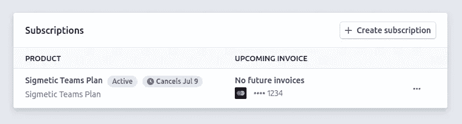

# 条带化、反应式和无服务器—第 1 部分

> 原文：<https://itnext.io/stripe-react-and-serverless-part-1-3482e9332b4c?source=collection_archive---------5----------------------->


在本系列文章中，我们将讨论如何使用 React 和无服务器将 [Sigmetic](https://sigmetic.io) 与 Stripe 集成。

在第 1 部分中，我们将使用[无服务器](https://www.serverless.com/)实现后端。
在[第二部](https://sigmetic.io/blog/stripe-react-serverless-part2)中，我们将使用[条纹元素](https://stripe.com/en-dk/payments/elements)在 React 中集成前端。

请记住，这可以通过多种方式实现，并且取决于特定的目的。

对于 [Sigmetic](https://sigmetic.io) ，我们使用的设置包括:

*   经常性支付(即订阅模式)。
*   AWS Lambda 使用[无服务器](https://www.serverless.com/)代理条带化请求
*   使用[条带元素](https://stripe.com/en-dk/payments/elements)在 React 中收集支付信息
*   我们在前端和后端都使用 TypeScript。

如果你正在寻找一个与上面类似的设置，你可能想继续阅读😎

# 先决条件

**在条带上创建账户**

您需要做的第一件事是在 [Stripe](https://stripe.com/) 上创建一个帐户。
您需要通过验证过程才能获得您的 API 密钥。这可能需要一两天的时间。

**用无服务器设置云功能**

您需要使用无服务器为您的云功能创建一个设置。
[Sigmetic](https://sigmetic.io) 托管在 AWS 上，使用的是 Lambdas。但是你可以自由使用任何你喜欢的兼容无服务器的云提供商。

[看这里如何入门](https://www.serverless.com/framework/docs/getting-started/)。

# 概观

我们需要处理一系列案例，对于每一个案例，我们都需要一个云功能。

*   创建客户
*   创建订阅
*   处理订阅(例如取消或继续)
*   检索订阅
*   检索付款方式
*   更新付款方式
*   重试发票付款
*   条纹网钩

听起来很多，对吧？😩一旦你投入进去，它实际上没那么糟糕。

我们将解释每一种情况，并提供设置它的代码💪所以，请和我们多呆一会儿，你很快就会有一个全新的 Stripe！

# 云函数

让我们开始创建我们的无服务器后端。我们将首先检查所有的云功能，然后我们将整个事情与前端集成。

**安装来自 NPM 的条纹**

假设您已经建立了一个无服务器项目；从安装来自 NPM 的`stripe`开始。

```
npm install stripe
```

如何构建文件夹并不重要，但是我们在`src/lambdas/stripe/`中为所有的 Stripe 函数创建了一个文件夹。
因为我们使用了 TypeScript，所以我们可以在`dist/lambdas/stripe/`中引用传输的 js 文件。

**创建 API 密钥**

您还需要转到您的 Stripe *仪表板- >开发人员- > API 密钥*并创建一组新的 API 密钥。

> *ℹ️* 在开发过程中，轻触 Stripe 仪表盘中的“查看测试数据”开关

对于云函数，我们将使用*密钥*。

# **创建客户**

> 客户对象允许您执行重复性收费，并跟踪与同一客户关联的多项收费。API 允许您创建、删除和更新您的客户。您可以检索单个客户以及所有客户的列表。— [条纹文档](https://stripe.com/docs/api/customers)

创建一个新文件`src/lambda/stripe/createCustomer.ts`

在`serverless.yml`文件中添加函数:

在文件`src/lambda/stripe/createCustomer.ts`中，让我们从实例化 Stripe 开始:

现在，这个函数将在 POST 请求中被调用，所以让我们为我们的主体定义一个接口。我们希望正文包含电子邮件和用户名:

然后，让我们定义我们的处理程序:

好了💪
部署您的新云功能，尝试对指定的端点执行 POST 请求，并验证它是否创建了新的 Stripe 客户。

您将能够在您的条带*仪表盘- >客户中看到新客户。*

```
curl --header "Content-Type: application/json" \
  --request POST \
  --data '{"email": "[test@test.com](mailto:test@test.com)", "username":"Test McTest"}' \
  [https://your-endpoint/stripe/create-customer](https://your-endpoint/stripe/create-customer)
```

# **创建订阅**

接下来，您将定义一个用于创建新订阅的函数。为此，你需要一个条纹产品。
转到您的条带*仪表板- >产品- >添加产品*
一旦您创建了一个产品，转到并获取该产品的*价格 ID* 。我们将在这个功能中使用它。

创建一个新文件`src/lambda/stripe/createSubscription.ts`

在文件`serverless.yml`中添加函数:

在文件`src/lambda/stripe/createSubscription.ts`中，我们再次实例化 Stripe:

指定几何体的接口:

然后，定义处理程序:

这一个，我们不能简单地用 POST 请求来测试，但是我们稍后集成前端时会回到这个问题。

# **处理订阅**

通常，您希望为客户提供取消订阅的能力。
订阅将在当前计费周期结束后终止。
与此同时，客户可以继续订购，一切都会恢复原样。

使用 Stripe，我们可以简单地标记订阅是否将在当前计费期后结束。

创建一个新文件`src/lambda/stripe/handleSubscription.ts`

在文件`serverless.yml`中添加函数:

在文件`src/lambda/stripe/handleSubscription.ts`中，我们再次实例化 Stripe:

指定几何体的接口:

然后，定义处理程序:

这个我们可以测试。
去你的条纹*仪表盘- >客户*。
点击客户，向下滚动至“订阅”部分。
点击订阅，获取 ID。

现在部署您的新云功能，并向您定义的端点发出 POST 请求:

```
curl --header "Content-Type: application/json" \
  --request POST \
  --data '{"subscriptionID": "THE-ID-YOU-JUST-FOUND", "end": true}' \
  [https://your-endpoint/stripe/handle-subscription](https://your-endpoint/stripe/handle-subscription)
```

回到您的客户，向下滚动到“订阅”部分。
您应该会看到这样的内容:

> 请注意“取消 7 月 9 日”徽章



# 检索订阅

最后，我们希望能够检索与给定订阅相关联的完整订阅对象。

创建一个新文件`src/lambda/stripe/retrieveSubscription.ts`

在`serverless.yml`文件中添加函数:

在文件`src/lambda/stripe/retrieveSubscription.ts`中，我们再次实例化 Stripe:

指定几何体的接口:

然后，定义处理程序:

我们也可以像之前一样，通过使用订阅 ID 来轻松测试这一点。
部署云功能后，向您定义的端点发送 POST 请求:

```
curl --header "Content-Type: application/json" \
  --request POST \
  --data '{"subscriptionID": "THE-ID-YOU-JUST-FOUND"}' \
  [https://your-endpoint/stripe/retrieve-subscription](https://your-endpoint/stripe/retrieve-subscription)
```

您应该从 Stripe 获得详细的订阅对象。

# 检索付款方式

同样，对于订阅，我们也希望能够从 Stripe 中检索支付方法对象。特别是，这对于向顾客显示当前使用的信用卡非常有用。例如显示卡的类型和最后 4 位数字。

创建一个新文件`src/lambda/stripe/retrievePaymentMethod.ts`

在文件`serverless.yml`中添加函数:

[https://gist . github . com/Silind/484d 9 f 466607 b 83 ea 9 a 0 c 9 cecb 3c 662 e](https://gist.github.com/Silind/484d9f466607b83ea9a0c9cecb3c662e)

在文件`src/lambda/stripe/retrievePaymentMethod.ts`中，实例化 Stripe:

指定几何体的接口:

然后，定义处理程序:

同样，使用订阅 ID，在 Stripe 仪表盘中找到您的客户，并从付款方式中获取付款方式 ID。

部署云功能，并向定义的端点发出 POST 请求:

```
curl --header "Content-Type: application/json" \
  --request POST \
  --data '{"paymentMethodID": "THE-ID-YOU-JUST-FOUND"}' \
  [https://your-endpoint/stripe/retrieve-payment-method](https://your-endpoint/stripe/retrieve-payment-method)
```

您应该从 Stripe 获得详细的支付方式对象。

# 更新付款方式

你的产品的客户应该能够更新他们的付款方式。

创建一个新文件`src/lambda/stripe/updatePaymentMethod.ts`

在文件`serverless.yml`中添加函数:

在`src/lambda/stripe/updatePaymentMethod.ts`文件中，实例化 Stripe:

指定几何体的接口:

然后，定义处理程序:

用一个简单的 POST 请求来测试这个问题有点困难，所以我们稍后再来讨论这个问题。

# 重试发票付款

这个案例比较特殊。
有时会发生这样的情况，最初接受了一种支付方式(即信用卡有效)，但当该支付方式附加到客户时，就出现了问题。
这可能是因为银行拒绝该流程，或者是因为资金不足。

结果将是一张失败的发票。
具体来说，订阅对象上有一个字段:`latest_invoice.payment_intent.status`，其值为`requires_payment_method`。

当这种情况发生时，在 Stripe 中成功创建了一个客户和一个订阅，因此我们只是希望让客户用另一张卡重试支付。

创建一个新文件`src/lambda/stripe/retryInvoice.ts`

在文件`serverless.yml`中添加函数:

在文件`src/lambda/stripe/retryInvoice.ts`中，实例化 Stripe:

指定几何体的接口:

[https://gist . github . com/si Lind/b5 b 5230 AC 08 c 06 c 04 b 36 e 183 a 14 a 59 f 8](https://gist.github.com/Silind/b5b5230ac08c06c04b36e183a14a59f8)

然后，定义处理程序:

# 条纹网钩

我们最后需要集成的是 Stripe 的 webhooks。
Stripe 的支付生命周期非常全面，Stripe 允许您参与各种活动。

对于 [Sigmetic](https://sigmetic.io) ，我们只使用三个:

*   `invoice.payment_succeeded`
*   `invoice.payment_failed`
*   `customer.subscription.deleted`

让我们去为 Stripe 设置这些 webhooks。
Go your Stripe*dashboard->Developers->web hooks->添加端点。*
添加您的端点:`https://your-endpoint/stripe/webhooks`。添加上面列表中的三个事件。

创建时，您可以创建签名密码。我们将在下面使用它。

创建一个新文件`src/lambda/stripe/webhooks.ts`

在文件`serverless.yml`中添加函数:

在`src/lambda/stripe/webhooks.ts`文件中，实例化 Stripe:

现在让我们创建三个函数，每个 webhook 事件一个。
我们从`invoice.payment_succeeded`开始。

成功处理付款后，将触发此事件。
在 [Sigmetic](https://sigmetic.io) ，我们要向客户发送一份带有发票链接的确认。

我们还想启用他们的付费功能。

当一个支付失败时，触发`invoice.payment_failed`。
在这种情况下，我们希望向客户发送电子邮件通知他们。

最后，当订阅结束时，触发`customer.subscription.deleted`事件。

然后，我们定义一个小的`handlerMapping`对象，这样我们就可以快速查找使用上面的哪个函数:

最后，我们创建处理程序:

在 Webhooks 下的 Stripe 仪表板中，您可以发送测试事件来验证它是否正常工作。
尝试一下😎

# 舍入

这基本上是我们后端所需要的。

确保将所有这些云功能部署到云中，并测试每个端点以验证它们都正常工作。

您可能还注意到了一点冗余:我们在本文中给出了函数的完整示例，但是您可能会从编写一些包装器功能中受益匪浅。

下一步是将它与前端集成。

在[第 2 部分](https://sigmetic.io/blog/stripe-react-serverless-part2)中了解更多信息。