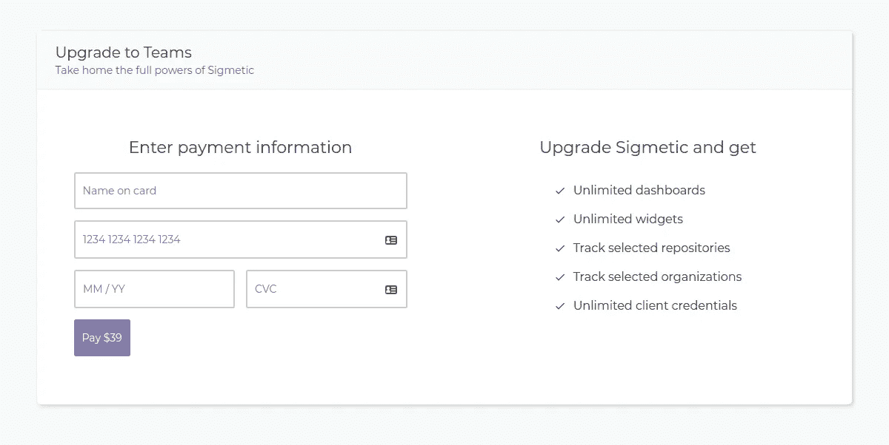
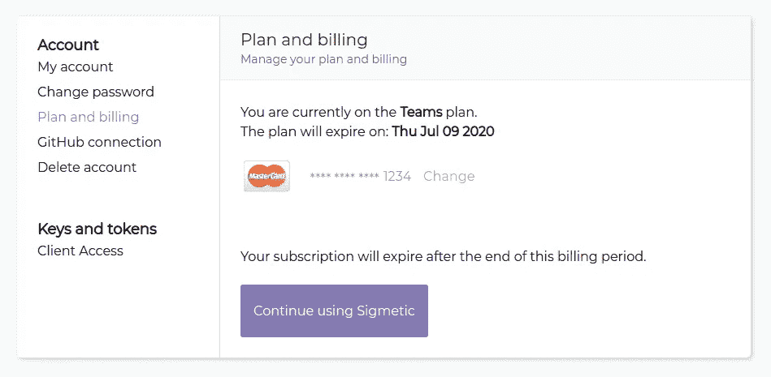

# 条带化、反应式和无服务器—第 2 部分

> 原文：<https://itnext.io/stripe-react-and-serverless-part-2-9d14ec122f10?source=collection_archive---------7----------------------->


在本系列文章中，我们将讨论如何使用 React 和无服务器将 [Sigmetic](https://sigmetic.io) 与 Stripe 集成。

在[第 1 部分](https://sigmetic.io/blog/stripe-react-serverless-part1)中，我们使用[无服务器](https://www.serverless.com/)实现了后端。
在第 2 部分中，我们将使用[条带元素](https://stripe.com/en-dk/payments/elements)在 React 中集成前端。

# 先决条件

**React 应用**

我们假设您在 React 中有一个前端，这是您让客户订阅您的服务的地方。
Stripe 最酷的一点是，我们可以在应用程序中本地收集支付信息，而不是重定向到第三方或嵌入 iframe 表单，这些表单看起来与 UI 的其余部分完全不同。

为此我们将使用[条纹元素](https://stripe.com/en-dk/payments/elements)。对于 [Sigmetic](https://sigmetic.io) ，我们有一个如下所示的升级页面



有了这三样东西，让我们开始吧🔥

# 条带管理器

为了让您的生活更轻松，我们建议您编写一组实用函数，您可以使用它们向我们在第 1 部分中实现的云函数发出请求。

对于 [Sigmetic](https://sigmetic.io) ，我们用一组*静态*方法创建了一个类`StripeManager`。
通过这种方式，你可以在整个应用程序中访问类似`StripeManager.createSubscription();`的方法。

如果你更喜欢那个模式，你也可以导出单个函数，然后像这样导入:
`import * as StripeManager from '../services/StripeManager'`
。

在这篇文章中，我们将跟随班级。

因此，在适当的地方创建一个新文件，比如`src/services/StripeManager.ts`，并创建一个新的类定义。

# 数据库ˌ资料库

我们假设您有一个包含用户的数据库。
现在是时候扩展您的用户模型，加入 3 个新领域了:

*   `customerID`
*   `paymentMethodID`
*   `subscriptionID`
*   `hasPaidPlan`

对于 [Sigmetic](https://sigmetic.io) ，我们使用 GraphQL 和 DynamoDB。

> 阅读更多关于[毕业生的信息:Sigmetic](https://sigmetic.io/blog/sigmetic-grads-stack) 的技术堆栈

我们将提到何时对数据库进行写/读操作，但是我们不会在本文中进一步讨论实现细节。

# 创建新客户

首先，让我们创建一个表示 Stripe 客户的接口。创建一个新文件`src/interfaces/IStripeCustomer`:

> *💡*提示:使用 [json2ts](http://json2ts.com/) 从 json 快速创建 TypeScript 接口。

现在，让我们创建一个创建新客户的方法

现在，让我们创建一个检索 customerID 的方法，如果不存在，使用上面的方法创建一个新的方法。

# 创建订阅

同样，让我们为条带订阅创建一个新接口:创建一个新文件`src/interfaces/IStripeSubscription`:

然后，让我们创建一个创建新订阅的方法:

现在，让我们添加一个更新订阅的方法。

最后，一个用于检索订阅

# 更新付款方式

好了，现在我们只需要多一些方法。

让我们添加一个用于更新支付方式的:

我们还希望能够检索支付信息，所以让我们为此也添加一个方法:

# 重试发票

好吧！剩下的就是重试发票支付的方法。

就是这样！💪
stripe manager 完成了！

# 付款表格

现在，让我们进入有趣的部分:付款形式。
在 React 代码方面，我们将在这里做一些简化。但我们会确保这一点是明确的。

首先，你需要去你的 Stripe *仪表盘- >开发者- > API 密匙*并抓取 *public* 密匙。让我们将它存储在一个`.env`文件中:

```
REACT_APP_STRIPE_KEY=<PUT-YOUR-KEY-HERE>
```

接下来，让我们安装几个条带依赖项:

```
npm install @stripe/react-stripe-js @stripe/stripe-js
```

让我们为付款表单创建一个新组件:`src/component/upgrade.tsx`

现在，我们开始导入所需的依赖项:

> *ℹ️* 您还可以为整张信用卡导入单个元素:`import { CardElement } from '@stripe/react-stripe-js'`在本例中，我们将为卡号、到期日和 cvc *使用单个元素。*

让我们开始创建 React 组件:

组件将成为支付表单的容器。
表单被包装在由`react-stripe-react`提供的`Elements`组件中。
我们需要将 Stripe 上的“promisified”实例传递给该组件。

现在，让我们创建`CheckoutForm`组件:

您应该能够看到您的付款表单呈现😎

现在，让我们实现那个`handleSubmitPayment`函数:

最后，让我们实现`handleRetryPayment`函数:

就是这样！😎
付款表单现在应该可以工作了！
现在你只需要添加一些样式，也许是一些额外的卡片名称输入的错误处理，等等。

# 管理当前订阅

我们需要创建的最后一件事是让用户管理他们的订阅。
至少，他们应该能够取消他们的订阅，看到和改变他们的支付方式。

让我们在一个新的组件中实现它。
对于 [Sigmetic](https://sigmetic.io) ，我们有这样的东西:



让我们创建一个新组件:`src/components/Plan.tsx`

我们在这里跳过了许多标记和样式——这将完全取决于您😉

让我们实现`handleCancelSubscription`方法:

很直接，对吧！
最后，让我们实现`UpdateForm`组件。

最后是`handleUpdatePaymentMethod`功能:

# 舍入

好了🎉🎉
我们完成了集成！

当然，我们忽略了相当多的样式、数据库连接等。这些是特定于您的应用程序的，与本文没有太大关系。

正如开头提到的——有很多不同的方法来处理这个问题，这篇文章简单地解释了我们在 [Sigmetic](https://sigmetic.io) 是如何处理的！

你有没有看到什么不寻常、奇怪或不安全的事情？请不要犹豫伸出手来！！我们想知道。

有什么问题或困惑吗？也请联系我们——我们很乐意回答任何可能出现的问题🔥