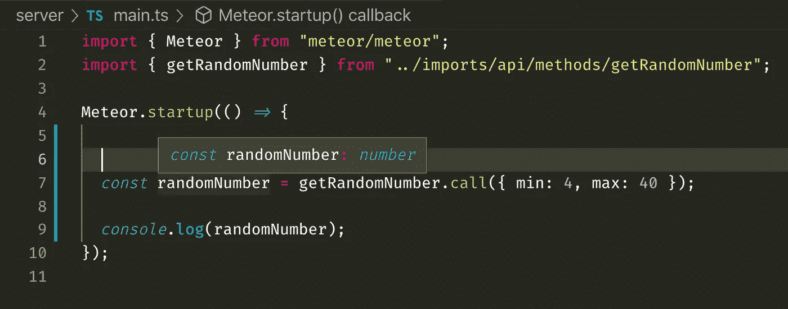
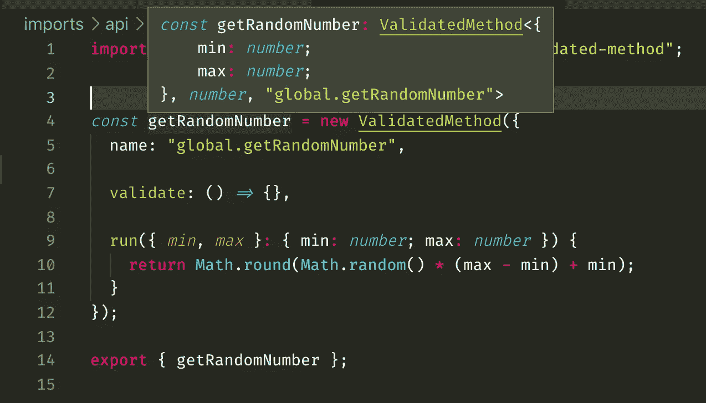
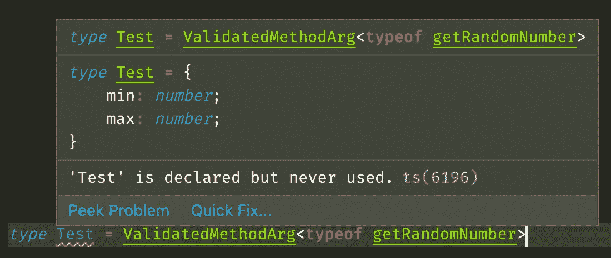
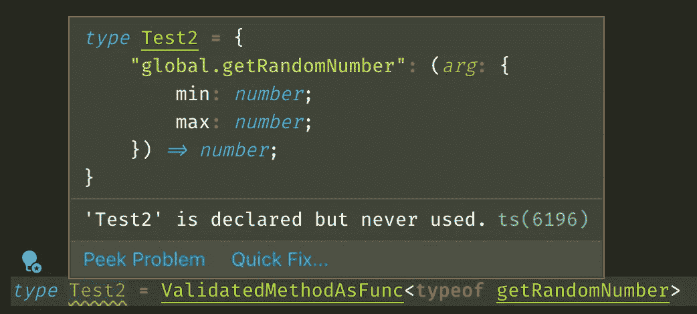
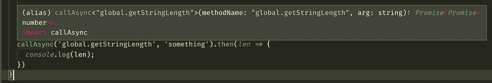
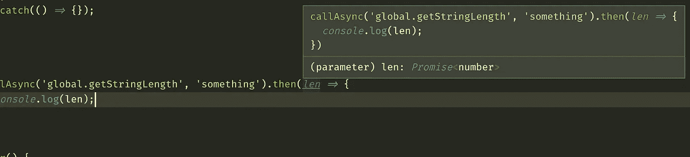
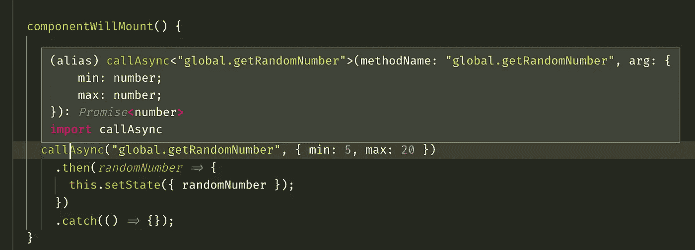
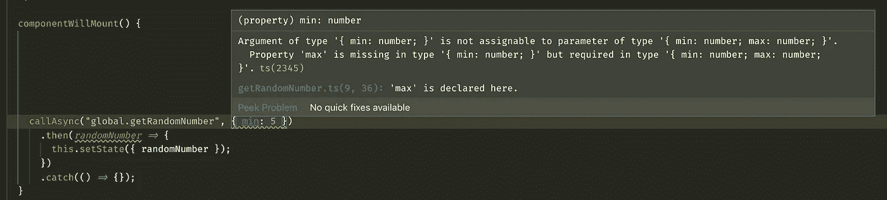
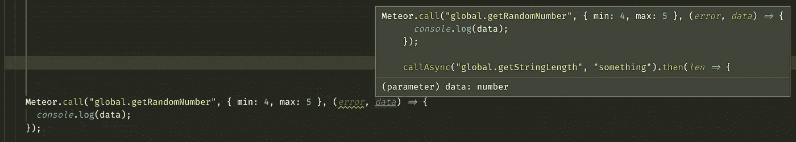

# 使用条件类型的强类型流星方法

> 原文：<https://itnext.io/strong-typed-meteor-methods-8acafb36c494?source=collection_archive---------6----------------------->

照片由 [averie woodard](https://unsplash.com/@averieclaire?utm_source=unsplash&utm_medium=referral&utm_content=creditCopyText) 在 [Unsplash](https://unsplash.com/s/photos/meteor?utm_source=unsplash&utm_medium=referral&utm_content=creditCopyText) 上拍摄

本文的目的是介绍一种类型化 meteor 方法的模式，以使 Typescript 知道哪些方法是可用的，以及哪些参数可以传递给特定的 Meteor 方法或从特定的 Meteor 方法接收。

这种模式不仅仅适用于流星项目。我认为这更像是一次尝试，看看 Typescript 的类型系统可以扩展到什么程度。这里的大部分想法可以应用到与 Meteor 没有任何共同之处的其他项目中。

即使您的项目还没有使用 Typescript，您仍然可以通过`@ts-check`指令使用这种模式。这在文末有所论述。

ValidatedMethod 包是创建 meteor 方法的默认包装器，所以我们将使用它来创建方法，而不是依赖原始的 meteor 选项。

第一部分“设置”解释了如何设置一个项目，以便您可以跟进。可以浏览一下，这样你就可以知道文件是如何构成的(尽管文件不会很多)。

你也可以检查[NICU-chic iuc/typed-meteor-methods](https://github.com/nicu-chiciuc/typed-meteor-methods)库来查看最终版本。

# 设置

我已经创建了一个新的流星项目，使用:

`meteor create --release 1.8.2-rc.0 --typescript typed-meteor-methods`

特定的发布版本用于访问`--typescript`选项。虽然这取决于你什么时候读这篇文章，但这可能是不必要的。

安装 ValidatedMethod 包:`meteor add mdg:validated-method`

添加文件`/imports/api/methods/getRandomNumber.js`:

我们可以对`validate`方法使用 SimpleSchema，但是本文的重点不在此，所以它可以被定义为`null`。在生产中，不应该这样做。

样板项目包含的文件比我们需要的多。出于测试目的，我们需要一个在后端运行的文件和一个在前端运行的文件。

对于前面我有`/imports/ui/App.tsx`:

对于服务器，我有`/server/main.ts`:

# 键入验证的方法

我在这里找到了最初的类型:[https://github . com/meteor-typing s/validated-method/blob/master/main . d . ts](https://github.com/meteor-typings/validated-method/blob/master/main.d.ts)。它们是由戴夫·艾伦创造的。

我在一个名为`/@types/meteor-validated-method.d.ts`的文件中添加了这些类型。

类型定义已经足够好了，但是有可能使它们通用化，所以让我们试试。

下面是上面链接的一个的修改版本。

`Meteor.call`方法可以通过多个参数传递，但是对于`ValidatedMethod`，标准是传递具有多个属性的单个对象。这使得输入变得更加容易，因为我们有一个输入参数类型变量(`TRunArg`)和一个返回参数类型变量(`TRunReturn`)。

注意`ValidatedMethod`也可以被传递 mixin，以及属于那些 mixin 的选项，这些选项也应该被输入，但是这超出了本文的范围。

Typescript 现在知道了`getRandomNumber.call`的返回值。如果传递了不正确的参数，它也会出错。

在我们继续之前，让我们在`Meteor.call`上添加一个小包装。

# `callAsync`包装器

根据文档，`Meteor.call`应该接收一个字符串作为第一个参数，后面跟着一些参数传递给方法，最后还可以传递一个回调。可以创建一个简单的承诺包装器，而不是试图解决这些需求:

这是我在 [Planable](https://planable.io/) 的一个同事介绍的，事实证明非常有用。可以使用承诺来代替调用`App.tsx`中的`Meteor.call`并传递回调:

`callAsync`知道它应该接收一个字符串，然后是一个`any`类型的参数，它将返回一个无类型的承诺。对于大多数人来说，这种强有力的打字水平可能已经足够了，在一段时间内，我们也是如此。但是，`callAsync`知道声明了什么方法名以及什么类型可以传递给特定的方法不是很好吗？

在许多方面，meteor 方法类似于 REST API 调用。因为我并不期望有很多尝试来键入 meteor 方法，因为 meteor 并没有考虑使用 typescript，所以我开始寻找使用 Typescript 来键入 REST APIs 的方法。

我发现的大多数文章和 github 库都依赖于一个全局接口的存在，这个接口包含了所有 REST 端点的名称、参数和返回值的所有数据。

这将是一个聪明的方法。但是强迫手工编目所有的方法，然后保持实现同步似乎太麻烦了。更好的方法是让实现保持原样，提取所需的类型以备将来使用。

# 键入函数的名称

现在最酷的部分来了。必须扩充类型定义，以便它知道函数名是字符串，而不是字符串。与大多数其他类型化语言相比，Typescript 具有字符串文字的概念，例如，它允许像这样键入信号量颜色:

一个额外的泛型类型变量似乎可以做到这一点:

Typescript 正确地将名称的类型推断为字符串文字而不是字符串:

唯一需要输入的是 run 函数的参数，如果必须执行的话，可能还需要输入它的返回类型。

# 关于 TName 的注释

当我开始写这篇文章时，我错误地认为 Typescript 将名称的类型推断为一个简单的字符串。为了克服这个问题，我必须做一些技巧来加强它。

我们使用了以下代码:

然后按如下方式键入`name`:

你可以在[这篇 StackOverflow 回答](https://stackoverflow.com/a/56375136/2659549)中了解更多。

幸运的是，我错了，Typescript 正确地将方法的名称推断为字符串文字。

即使每个特定的方法都是完全类型化的，我们还是需要收集所有的实例并创建一个统一的类型，以便`callAsync`知道发生了什么。

这个解决方案受到了 Brian Terlson 的文章[“具有条件类型的强类型事件发射器”的启发，在这篇文章中，他提出了一个针对事件发射器的类似问题的解决方案。](https://medium.com/@bterlson/strongly-typed-event-emitters-2c2345801de8)

以下是文章节选:

`Events`接口中的键表示事件的名称，值表示应该从该特定名称的事件传递和接收的值的类型。

最重要的部分发生在`on`方法定义中，它必须被传递一个类型为`K`的参数，该参数应该是`Events`接口中的一个键。之后，对`on`方法进行类型化，以便它知道侦听器的类型。同样的方法也适用于`emit`方法和所有其他方法。

将这个逻辑应用到`ValidatedMethods`中，我们可以想象一个类似这样的界面:

在我们的例子中，我们有 2 个值要处理，参数类型和返回类型。一个自然的选择是将值存储为函数类型。

# 关于标记联合的注释

另一种方法是使用联合类型，如下所示:

我们在项目中广泛使用了联合类型，但是对于这个特殊的问题，它们似乎更难处理。

# 提取 ValidatedMethod 类型

现在的问题归结为以某种方式转换一个如下所示的类型:

转换成类似这样的类型:

条件类型似乎是唯一的方法。我们可以使用以下实用程序类型提取每个特定类型:

因此，例如，下面的测试类型

会有以下类型:

其他两个泛型类型以同样的方式工作。如果你想知道更多关于`infer`关键字如何工作的信息，请查阅官方文档中条件类型中的[类型推断。](https://www.typescriptlang.org/docs/handbook/advanced-types.html#type-inference-in-conditional-types)

# 组装新型号

因为我们可以提取泛型类型变量，所以我们可以将它们组装回我们想要的类型，如下所示:

我们可以对此进行测试，看看它是否工作正常:

# 构建最终的 API

既然我们可以将`ValidatedMethod`泛型转换成我们需要的类型，剩下的工作就是组装所有的类型。

我们可以在`imports`文件夹的根目录下定义一个`methodTypes.d.ts`。因为它不包含任何实际运行的代码，所以它可以使用`.d.ts`扩展。

我们使用`&`(交集操作符)来扩充类型。基本上是这样:

将“等于”这个:

# 打字`callAsync`

必须更新前面定义的`callAsync`包装器，以便它知道这个`KnownMethods`类型:

这可能更难消化，但让我们试一试。`TName`应该是`KnownMethods`中的一个键，也就是应该是一个已定义的`ValidatedMethods`的名称。这是`methodName`参数的类型。

`FirstArgument`实用程序类型定义如下:

它与之前定义的`ValidatedMethodArg`非常相似。它尝试提取第一个参数的类型，如果不能，则返回`never`类型。

`ReturnType`带有 Typescript，但也可以类似地定义:

`KnownMethods[TName]`从我们定义的`KnownMethods`类型中返回特定函数名的值。例如，如果`TName`是`"global.getRandomNumber"`，那么`KnownMethods[TName]`就是`(arg: {min: number; max: number}) => number`。

因为我们只需要参数的类型，所以我们使用`FirstArgument<KnownMethods[TName]>`，在我们的具体例子中它将变成`{min: number; max: number}`。

因为我们使用`ReturnType<KnownMethods[TName]>`键入了`Promise`构造函数，所以`callAsync`的返回值是隐含的。逻辑和之前一样。

函数的代码保持不变。一个不幸的事情是`Promise`只接受一个泛型类型，所以我们不能输入错误值。`Meteor.call`回调返回的不是简单的`Error`而是`Meteor.Error`。不幸的是，我们无法捕捉到这一点。你可以在接下来的 GitHub 问题中找到更多相关信息。

# `Promise<Promise<T>>`抓到你了

不是所有的`ValidatedMethods`都是同步的，有些可能会返回一个承诺，Typescript 可能会混淆。假设`getStringLength`方法(之前简要提及)定义如下:

Typescript 将报告以下类型:

这是不正确的，因为被另一个承诺包围的承诺仍然是一个承诺。

我们可以使用另一种实用程序类型来解决这个问题:

如果`T`是`Promise`，返回其装箱类型，否则返回`T`。将其插入将导致以下`callAsync`的最终版本:

虽然有点乱，但它完成了任务。

# 测试`callAsync`

现在一切似乎都已就绪，我们可以检查它是否真的像预期的那样工作了。

它知道应该传递的参数的类型，甚至在事情不正确时出错。看起来是个不错的组合。

# 打字注意事项`Meteor.call`

我们可以尝试将相同的模式应用于`Meteor.call`方法:

这里可以看到这种工作方式:

然而，其中一个问题是，如果其中一个参数不正确，它将不会显示任何错误，因为它将默认为`@types/meteor`中定义的重载:

这可以通过使用后安装脚本(我们没有采用它，因为它对我们来说太麻烦了)删除该行、创建另一个包装器并键入它，或者使用另一种创造性的方法来解决。

# 关于`@ts-check`的笔记

即使你的 meteor 项目还没有使用 typescript，你仍然可以通过使用`@ts-check`注释来使用这个模式。它与 VsCode 配合使用效果最佳。例如，下面的方法也是完全类型化的。你可以在这里阅读更多关于`@ts-check`。

# 整理笔记

这种模式最薄弱的地方是必须手动将`ValidatedMethods`的类型添加到`KnownMethods`中。我尽了最大努力来寻找某种方法，让 Typescript 在创建新方法时自动聚合定义，但不幸的是，我没有找到任何方法来解决这个问题。一个选择是使用自动创建`typedMethods.d.ts`文件的 codemod，尽管找到一个更简单的解决方案会更好。

如果您对如何改进有任何想法和/或建议，请留言或通过邮件或其他方式联系我。