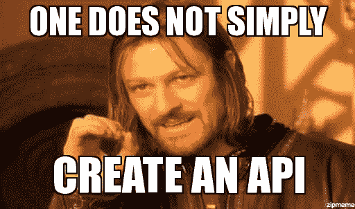
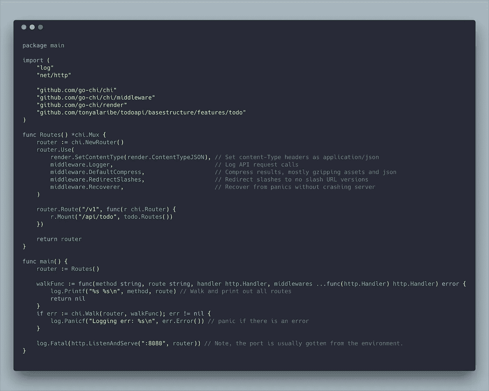
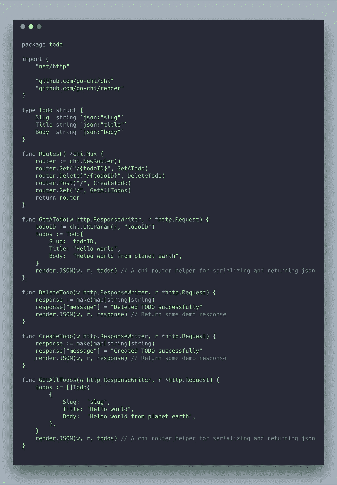

# 我如何在 Golang 中构建生产级 REST API？

> 原文：<https://itnext.io/structuring-a-production-grade-rest-api-in-golang-c0229b3feedc?source=collection_archive---------0----------------------->



人们不会简单地在 golang 中创建一个 api 或者他们会吗？

有一种误解认为用 golang 编写的 API 不能像其他语言一样简单和地道。实际上，我遇到过许多 REST API 代码库，它们被如此多的抽象弄得一团糟，最终损害了可读性和可维护性。

在这个系列中，我们将介绍如何构建一个生产级的 todo list rest api，它将有机地增长，从代码结构和路由等必需品开始，然后继续添加一个 mongo db 和一个 badger 数据存储层，然后是一个身份验证层。

在这个系列中，我们将使用 chi 路由器。


chi 路由器

# 为什么是池？为什么不是标准库，或者 Gin，或者 router-x？

嗯，没那么重要。无论您使用哪种路由器，本系列中将要讨论的概念都适用。但是有一个清单让我认为 Chi-router 是比大多数替代品更好的选择:

*   100%兼容 net/http——在生态系统中使用与`net/http`兼容的任何 http 或中间件 pkg
*   专为模块化/可组合 API 设计——中间件、内嵌中间件、路由组和子路由安装
*   无外部依赖性—普通 ol' Go 1.7+ stdlib + net/http
*   稳健——在 Pressly、CloudFlare、Heroku、99Designs 和许多其他公司投入生产
*   轻量级—为 chi 路由器提供约 1000 LOC 的时钟
*   是的，真的很快。

我最喜欢的是，您为其他 net/http 兼容路由器编写的相同的旧 http 处理程序和中间件在这里也可以工作。

# 我们开始吧

首先，我们创建我们的主。去。角石(或中心部分🙂)我们节目的。



# 上面代码中一些最佳实践的亮点

1.  将路由分组到各个程序包中的逻辑组中，然后装载这些路由:

```
r.Mount("/api/todo", todo.Routes())
```

2.版本 api，因此您可以在不破坏旧客户端的情况下进行 API 更新:

```
router.Route("/v1", ....)
```

3.广泛使用中间件。大多数被多个路由大量使用的代码可以被转化成可链接的中间件。例如认证、设置响应头、压缩、请求记录、速率限制等。

**编辑(我将根据评论中** [**阿金克亚**](https://medium.com/u/4b8f17fbf02f?source=post_page-----c0229b3feedc--------------------------------) **的一个问题，进一步说明步行功能。):**

chi 路由器有一个叫 walk 的方法。该方法接收:

*   路由器
*   回调。

为路由器上定义的每个路由调用回调，并接收 4 个参数:

1.  为路线定义的方法
2.  实际路线字符串
3.  处理给定路由请求的处理器(函数)
4.  为给定路由定义的中间件列表(中间件只是在调用处理程序之前被调用的函数，因此它们用于预处理请求、验证等)

在我的例子中，我简单地遍历路由器并打印所有定义的路由。这有助于我一目了然地看到所有可用的路线。

# 接下来我们构建 todo 包，它实际上保存了我们的 todo 逻辑。



# 注意事项

1.  todo 包有一个函数返回它的所有路线。的路由安装在 main.go 中。实际上，我通常会将这些路由添加到名为 *routes.go、*的文件中，这样很容易在包*中找到。*
2.  处理程序有函数签名`func (w http.ResponseWriter,r *http.Request)` ,这意味着如果您在标准库中使用 net/http，您将编写的处理程序没有什么不同。
3.  渲染的使用。json 只是编码/json 的包装器，它自动转义 JSON 响应中的所有 html，并将内容类型设置为 application/json

你对它的简单程度感到震惊吗？在 github 上的[https://github . com/tonyalaribe/todo API/tree/master/base structure](https://github.com/tonyalaribe/todoapi/tree/master/basestructure)查看这个项目。

在本系列的下一篇文章中，我们将继续添加对配置和共享状态的支持。大多数项目通常需要外部配置，如数据库连接细节等。我们将在下一篇文章中讨论这个问题。

# 别忘了打个招呼，甚至让我知道你想学什么。我可能会有灵感去写它🙂。

# 不要忘记鼓掌，如果这对你有用的话。