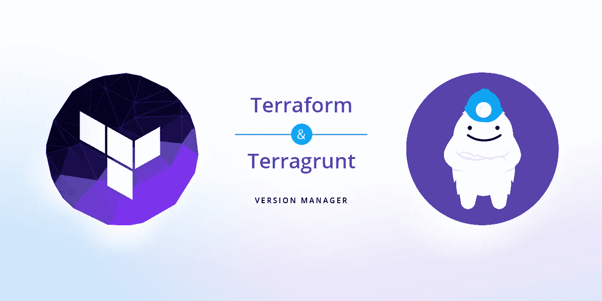

# 使用 terragrunt 构建 terraform 项目—第一部分

> 原文：<https://itnext.io/structuring-terraform-project-using-terragrunt-part-i-4c6e936c4858?source=collection_archive---------1----------------------->

图片来源: [terraenv](https://github.com/aaratn/terraenv)

我已经注意到关于如何配置 terraform 项目的智慧有一个合理的差距。我决定写一个关于如何配置 terraform 项目的两部分系列文章；从小型和中型项目，一直到大型项目。我将讨论使用 terragrunt 的利与弊，以及如何让它为您的项目服务的一些技巧。

我最近读了一篇非常好的文章，作者是 Gruntwork 的创始人 Yevgeniy Brikman，他在文章中比较了使用 terraform 工作区、多个分支和 terragrunt 来配置不同的环境。这是一个由 4 部分组成的系列，尽管它看起来像是来自创始人本人的偏见，但作者在他的帖子中提到了许多比较方面。

 [## 如何使用 Terraform 管理多个环境

### 使用工作空间、分支和 Terragrunt 的比较

博客. gruntwork.io](https://blog.gruntwork.io/how-to-manage-multiple-environments-with-terraform-32c7bc5d692) 

我强烈建议你花点时间浏览这些系列，并理解为什么仅仅依靠不同的分支结构或使用`.tfvars`文件中的变量是不够的。然而，Yevgeniy 在他的文章中没有提到 terraspace，它实际上是 terragrunt 的直接竞争对手，对如何配置 terraform 项目有更多的意见。这个领域的另一个新兴工具是 pulumi，它消除了学习`.hcl`语言的需要，并将基础设施和云配置带给每个开发人员。Pulumi 允许用户用他们选择的语言编写代码，为多种云环境生成基础设施。

 [## Terraspace |地形框架

### 地形框架

Terraform 框架 terraspace.cloud](https://terraspace.cloud/)  [## Pulumi -通用基础设施代码

### 欢迎从 60 多家云提供商中选择所有体系结构，包括公共、私有和混合体系结构…

www.pulumi.com](https://www.pulumi.com/) 

对于中小型地形项目，构建过程非常简单。我会以我最近发表的一篇文章为例；使用 terraform 和 terragrunt 为 AWS 上的容器化应用程序创建 AWS ECS Fargate 集群。

 [## 使用 terraform 和 terragrunt 为容器应用程序创建 ECS Fargate 服务

### 如何使用 terraform 和 terragrunt 在 ECS Fargate 上部署容器的分步过程

itnext.io](/creating-an-ecs-fargate-service-for-container-applications-using-terraform-and-terragrunt-2af5db3b35c0) 

根据我的经验，Terraform 项目需要从一开始就构建正确。随着项目的发展，采用剧烈的变化变得相对困难，因为你不能在不搞乱大量基础设施的情况下进行细微的改变。考虑您将在云中创建的不同环境也很重要，以便 terragrunt 配置能够很好地反映这一点。这里需要注意的一点是，这需要从一开始就考虑周全，这样随着项目的成熟，您就可以无缝地前进。

有效构建的第一要素是理解基础设施的分层，以及所有结构如何在彼此之上构建。当我为 ECS 项目设置一个干净的环境时，我发现有几个组件，如 [AWS VPC](https://aws.amazon.com/vpc/) 、 [AWS ECS 集群](https://aws.amazon.com/ecs/)和 [AWS 应用程序负载平衡器](https://aws.amazon.com/elasticloadbalancing/application-load-balancer/)，它们将在开始时设置，其他一切都将构建在它们之上。我为这些组件创建了 terraform 代码，并开始配置 terragrunt 配置，我希望我的基础架构能够层层叠加。基础层组件，在本例中是`VPC`、`ECS`集群和`ALB`，是最初要建立的`base_infrastructure`的一部分，然后容器化的应用程序将在`base_infrastructure`之上分层。在`base_infrastructure`中识别和配置组件时应格外小心；基础层必须从一开始就稳定且配置良好，这样我们就不会在以后引入大量的更改，这些更改可能会导致这些组件的重新创建，如果分层组件依赖于这些组件，这在大多数情况下是不可能的。

一旦需求被分解到`base_infrastructure`和`applications`组件中，你就可以开始写代码了。首先创建两个基本文件夹；`terraform`和`terragrunt`。所有的`.tf`代码放在`terraform`文件夹中，而所有的`.hcl`配置放在`terragrunt`文件夹中。在`terraform`文件夹中的模块可以有一个扁平的层次结构，所有的组件都在同一个层次上，最好是在它们自己的文件夹中。`terragrunt`配置存在于`terragrunt`文件夹的层次结构中，该文件夹又分为`base_infrastructure`和`applications`子层次结构。另一件要迎合的事情是你要为其创建基础设施的不同环境；即`development`、`staging`或`production`环境。您需要在`terragrunt`下的文件夹中引入进一步的子层次，以适应`dev`、`staging`和`prod`环境。一旦这些环境文件夹就位，就创建属于该基础结构层次结构的模块。

这方面没有官方指导，但是在过去几年的多个基础设施项目中，我根据经验意识到，到目前为止，这是分发基础设施组件的一种非常合理的方式，因此对架构中其他组件的更改影响较小。这个设置肯定有它自己的优点和缺点；如果您的项目不是很大，这将是一个理想的设置，并且不需要花费 15 分钟来遍历整个文件夹结构来找到您需要配置或编辑的`terragrunt`文件。模块配置的分离允许您定义[依赖关系](https://terragrunt.gruntwork.io/docs/reference/config-blocks-and-attributes/#dependency),以便在依赖模块之前配置基本模块。项目结构是扩展性友好的；如果你需要添加一个新的模块到你的基础设施中，你只需要创建一个新的`terraform`模块并在各自的文件夹中添加`terragrunt`配置。

 [## 配置块和属性

### Terragrunt 配置文件使用与 terragrunt.hcl 中的 Terraform 本身相同的 HCL 语法。terragrunt 还…

terragrunt.gruntwork.io](https://terragrunt.gruntwork.io/docs/reference/config-blocks-and-attributes) 

这可能看起来很多，但基本上是相当直截了当的。

如果您对此设置有任何意见、建议或改进，请告诉我。此外，如果你正在为你的 terraform 项目使用替代设置，请在评论中让我知道。听听其他人是如何解决这个问题的会很有趣。

*你可以在这里找到这些系列的第二部分*:

 [## 使用 terragrunt 构建 terraform 项目—第二部分

### 这是我关于使用 terragrunt 构建 terraform 项目的系列文章的第二部分。

itnext.io](/structuring-terraform-project-using-terragrunt-part-ii-ab0dc08b2bc6)