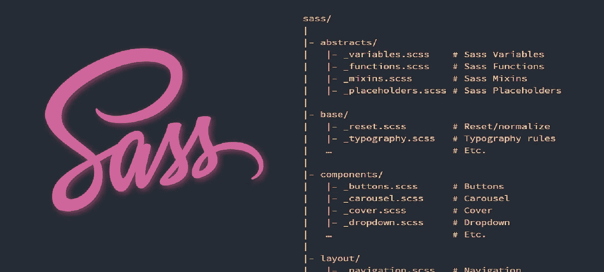
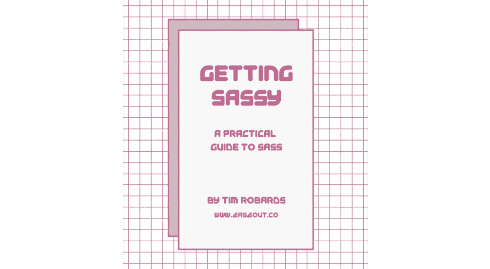

# 构建您的 Sass 项目

> 原文：<https://itnext.io/structuring-your-sass-projects-c8d41fa55ed4?source=collection_archive---------0----------------------->



让我们看看如何构建我们的 Sass 项目。随着项目的增长和扩展，模块化目录和文件结构的需求急剧增加。因此，保持我们的文件和文件夹有组织是至关重要的。我们还有一个额外的好处，那就是创建可以跨多个项目重用的组件。没有一个“正确”的结构——完全取决于你自己！

本文从[开始，从 Sass](https://medium.com/@timothyrobards/starting-with-sass-116f4ecb682d) 开始，我们了解了使 Sass 成为如此强大的工具的所有特性，以及如何设置本地 Sass 开发环境。

🤓*想与 web dev 保持同步吗？*
🚀*想要将最新消息直接发送到您的收件箱？
🎉加入一个不断壮大的设计师&开发者社区！*

**在这里订阅我的简讯→**[**https://ease out . EO . page**](https://easeout.eo.page/)

我们如何构建我们的 Sass 项目？

我们通过使用 *Partials* 将样式表分成单独的文件来实现这一点。单独的文件将代表不同的组件。然后*使用`@import`指令将部分内容导入到一个主样式表中——通常是`main.scss`文件。例如:*

```
// File: main.scss@import 'layout/header';
```

然后，我们可以为布局特定文件创建一个布局文件夹，例如:

```
// File: _header.scss// This file contains all styles related to the header of the site/application./* STYLES GO HERE */
```

注意:部分文件的名字总是以下划线`_`开头。

让我们来看看如何构建你的项目..

# 简单结构

例如，如果你在一个小项目中使用 Sass 一个单独的网页。一个非常简单的结构如下:

```
_base.scss
_layout.scss
_components.scssmain.scss
```

这里我们有 3 个分音连接到我们的`main.scss`。

这个文件包含了你所有的重置，变量，混合，以及任何实用类。

**布局:**包含所有处理布局的 CSS，比如容器和任何网格系统。

**组件:**任何可重复使用的东西，如按钮、导航条、卡片等。

**Main:** 它应该只包含上述文件的导入。

如果任何文件变得过于混乱或无序，是时候扩展我们的结构了。例如，考虑为你的组件添加一个文件夹，并把它分解成单独的文件，如`_button.scss` & `_carousel.scss`。

然而，当我们在处理一个更大的项目时，我们将需要一个更严格的架构，这将在下一节中讨论。

# 7–1 模式

被称为*7–1 模式* (7 个文件夹，1 个文件)的架构是一种被广泛采用的结构，是大型项目的基础。您将所有的片段组织到 7 个不同的文件夹中，一个文件位于根级别(通常命名为`main.scss`)来处理导入——这是您编译到 CSS 中的文件。

这里是一个 7–1 目录结构示例，我已经包括了一些文件示例，这些文件将位于每个文件夹中:

```
sass/
|
|– abstracts/ (or utilities/)
|   |– _variables.scss    // Sass Variables
|   |– _functions.scss    // Sass Functions
|   |– _mixins.scss       // Sass Mixins
|
|– base/
|   |– _reset.scss        // Reset/normalize
|   |– _typography.scss   // Typography rules
|
|– components/ (or modules/)
|   |– _buttons.scss      // Buttons
|   |– _carousel.scss     // Carousel
|   |– _slider.scss       // Slider
|
|– layout/
|   |– _navigation.scss   // Navigation
|   |– _grid.scss         // Grid system
|   |– _header.scss       // Header
|   |– _footer.scss       // Footer
|   |– _sidebar.scss      // Sidebar
|   |– _forms.scss        // Forms
|
|– pages/
|   |– _home.scss         // Home specific styles
|   |– _about.scss        // About specific styles
|   |– _contact.scss      // Contact specific styles
|
|– themes/
|   |– _theme.scss        // Default theme
|   |– _admin.scss        // Admin theme
|
|– vendors/
|   |– _bootstrap.scss    // Bootstrap
|   |– _jquery-ui.scss    // jQuery UI
|
`– main.scss              // Main Sass file
```

**抽象(或实用程序):**保存 Sass 工具、助手文件、变量、函数、mixins 和其他配置文件。这些文件只是助手，编译时不输出任何 CSS。

**Base:** 保存项目的样板代码。包括在整个项目中经常使用的标准样式，如重设和印刷规则。

**组件(或模块):**保存按钮、传送带、滑块和类似页面组件的所有样式(比如小部件)。你的项目通常会包含许多组件文件——因为整个网站/应用程序应该主要由小模块组成。

**布局:**包含项目布局中涉及的所有样式。例如页眉、页脚、导航和网格系统的样式。

**页面:**任何特定于单个页面的样式都会放在这里。例如，网站的主页需要页面特定的样式，而其他页面却没有，这种情况并不少见。

主题:这在很多项目中可能不会用到。它将保存创建项目特定主题的文件。例如，如果您的站点的某些部分包含可选的配色方案。

**供应商:**包含所有来自外部库和框架的第三方代码，如 Normalize、Bootstrap、jQueryUI 等。但是，通常需要覆盖供应商代码。如果需要这样做，最好创建一个名为`vendors-extensions/`的新文件夹，然后用他们覆盖的供应商的名字命名所有文件。文件`vendors-extensions/_bootstrap.scss`将包含你所有的引导覆盖——因为编辑供应商文件本身，通常不是一个好主意。

这个文件应该只包含你的导入！例如..

```
@import 'abstracts/variables';
@import 'abstracts/functions';
@import 'abstracts/mixins';

@import 'vendors/bootstrap';
@import 'vendors/jquery-ui';

@import 'base/reset';
@import 'base/typography';

@import 'layout/navigation';
@import 'layout/grid';
@import 'layout/header';
@import 'layout/footer';
@import 'layout/sidebar';
@import 'layout/forms';

@import 'components/buttons';
@import 'components/carousel';
@import 'components/slider';

@import 'pages/home';
@import 'pages/about';
@import 'pages/contact';

@import 'themes/theme';
@import 'themes/admin';
```

*注意:*导入时不需要包含`_`或`.scss`文件扩展名。

## 利用 7–1 开始运行:

官方样板文件在 github 上发布。您可以使用以下终端命令下载或克隆它:

```
git clone [https://github.com/HugoGiraudel/sass-boilerplate.git](https://github.com/HugoGiraudel/sass-boilerplate.git)
```

如果您准备好提高您的前端技能并构建更快、更有组织和可维护的代码。查看[变得时髦:时髦实用指南](https://gum.co/getting-sassy)。

我的交互式初学者友好指南将带您了解 SASS 的所有重要信息，包括:

*   从变量、嵌套、混合到 for/each 循环等所有基础知识！
*   深入了解如何构建您的 SASS 项目
*   如何创建生产就绪的构建过程

最后，您将能够迁移现有的 CSS 代码库，并从头开始建立整个项目！



*现已上市！👉gum.co/getting-sassy*

# 结论

就是这样！您已经了解了如何构建您的 Sass 项目。需要记住的是，这里没有明确的规则。你应该以一种对你(和你的团队)有意义的方式组织你的项目。).帮助您快速、轻松地找到并隔离您的风格的方法—就是要走的路！

请务必阅读本系列的下一篇文章:[设置 Sass 构建过程](https://medium.com/@timothyrobards/setting-up-a-sass-build-process-aa9fd92fa585)。在那里，我们将使用 npm 脚本来设置项目构建过程，这将极大地促进我们的开发工作流程。

我希望这篇文章对你有用！你可以[跟着我](https://medium.com/@timothyrobards)上媒。我也在[推特](https://twitter.com/easeoutco)上。欢迎在下面的评论中留下任何问题。我很乐意帮忙！

# 关于我的一点点..

嘿，我是提姆！👋我是一名开发人员、技术作家和作家。如果你想看我所有的教程，可以在我的个人博客上找到。

我目前正在构建我的[自由职业者完整指南](http://www.easeout.co/freelance)。坏消息是它还不可用！但是如果这是你可能感兴趣的东西，你可以[注册，当它可用时会通知你](https://easeout.eo.page/news)👍

感谢阅读🎉