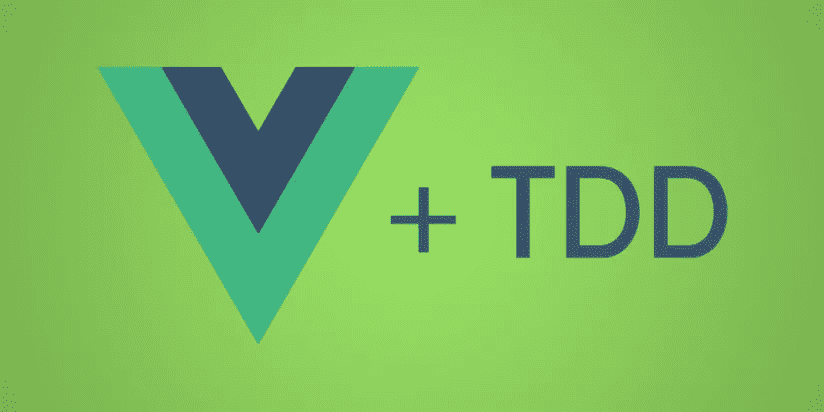

# 清除 vue-test-utils 中的 Vue.js 组件

> 原文：<https://itnext.io/stubbing-vue-components-in-vue-test-utils-6e9442e094c3?source=collection_archive---------4----------------------->

图片来自 [Syndicode](https://syndicode.com/2017/12/27/start-using-tdd-with-vue-js/) 。

*为什么是存根？在编写单元测试时，我们经常想把我们不感兴趣的代码部分删除掉。存根就是代表另一段代码的一段代码。假设您正在为一个`<UserContainer>`组件编写一个测试。看起来是这样的:*

`<UsersDisplay>`有一个这样的`created`生命周期方法:

我们想写一个断言`<UsersDisplay>`被渲染的测试。

`axios`在`created`钩子中向外部服务发出 ajax 请求。这意味着当您执行`mount(UserContainer)`时，`<UsersDisplay>`也被挂载，`created`发起一个 ajax 请求。由于这是一个单元测试，我们只对`<UserContainer>`是否正确呈现`<UsersDisplay>`感兴趣——验证 ajax 请求是否由正确的端点触发等，是`<UsersDisplay>`的责任，应该在`<UsersDisplay>`测试文件中测试。

防止`<UsersDisplay>`发起 ajax 请求的一种方法是通过*清除*组件。让我们编写自己的组件并进行测试，以便更好地理解使用存根的不同方式和好处。

# 创建组件

这个例子将使用两个组件。第一个是`ParentWithAPICallChild`，它简单地呈现了另一个组件:

`<ParentWithAPICallChild>`是简单组件。它唯一的责任就是渲染`<ComponentWithAsyncCall>`。`<ComponentWithAsyncCall>`顾名思义，使用`axios` http 客户端进行 ajax 调用:

`<ComponentWithAsyncCall>`调用`created`生命周期钩子中的`makeApiCall`。

# 使用`mount`编写测试

让我们首先编写一个测试来验证`<ComponentWithAsyncCall>`是否被渲染:

运行`yarn test:unit`产量:

测试通过了——太好了！然而，我们可以做得更好。注意测试输出中的`console.log`——这来自于`makeApiCall`方法。理想情况下，我们不希望在单元测试中调用外部服务，尤其是当它来自一个不是当前测试的主要焦点的组件时。我们可以使用`stubs`安装选项，如`vue-test-utils`文档[此处](https://vue-test-utils.vuejs.org/api/options.html#stubs)所述。

# 使用`stubs`来短接`<ComponentWithAsyncCall>`

让我们更新一下测试，这次是 stubbing `<ComponentWithAsyncCall>`:

当`yarn test:unit`运行时，测试仍然通过，但是`console.log`不见了。这是因为将`[component]: true`传递给`stubs`用一个*存根*替换了原来的组件。外部接口仍然相同(我们仍然可以选择使用`find`，因为`find`内部使用的`name`属性仍然相同)。内部方法，比如`makeApiCall`，被不做任何事情的虚拟方法所取代——它们被“剔除”。

如果愿意，您还可以指定用于存根的标记:

# 用`shallowMount`自动打茬

我们可以简单地使用`shallowMount`，而不是使用`mount`和手动存根`<ComponentWithAsyncCall>`，默认情况下，它会自动存根任何其他组件。用`shallowMount`进行的测试如下所示:

运行`yarn test:unit`不显示任何`console.log`，测试通过。`shallowMount`自动存根`<ComponentWithAsyncCall>`。`shallowMount`对于测试有很多子组件的组件很有用，这些子组件可能在生命周期钩子中触发行为，比如`created`或`mounted`等等。我倾向于默认使用`shallowMount`，除非我有充分的理由使用`mount`。这取决于您的用例，以及您正在测试的内容。

# 结论

*   `stubs`对于剔除与当前单元测试无关的孩子的行为是有用的
*   `shallowMount`默认情况下清除子组件
*   你可以通过`true`来创建一个默认的存根，或者通过你自己的定制实现

你可以在找到本页[中描述的测试。](https://github.com/lmiller1990/vue-testing-handbook/tree/master/demo-app/tests/unit/ParentWithAPICallChild.spec.js)

来看看我的 [Vue.js 3 课程](https://vuejs-course.com/)！我们涵盖了组合 API、类型脚本、单元测试、Vuex 和 Vue 路由器。