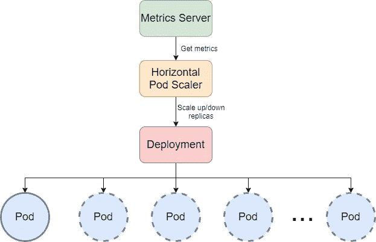
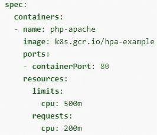
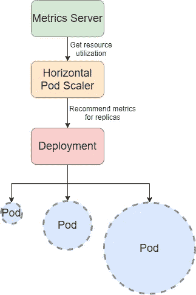
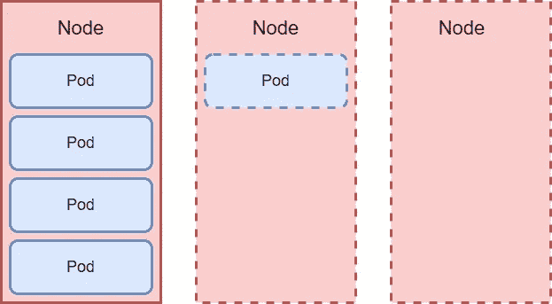

# 愚蠢的简单可伸缩性

> 原文：<https://itnext.io/stupid-simple-scalability-dc4a7fbe67d6?source=collection_archive---------2----------------------->

Elena Mozhvilo 在 [Unsplash](https://unsplash.com/s/photos/balance?utm_source=unsplash&utm_medium=referral&utm_content=creditCopyText) 上的照片

这篇文章将定义和解释 Kubernetes 中的**软件可伸缩性，并看看不同的可伸缩性类型。然后我们将在 Kubernetes 中介绍三种自动缩放方法: **HPA** (水平 Pod 自动缩放器) **VPA** (垂直 Pod 自动缩放器) **CA** (集群自动缩放器)。**

# 解释了可扩展性

为了理解软件可伸缩性中的不同概念，让我们举一个真实的例子。

假设你刚刚开了一家咖啡店，你买了一台简单的咖啡机，每分钟可以煮三杯咖啡，你雇了一名员工为客户服务。

起初，你有几个客户:一切都很顺利，所有的人都对咖啡和服务很满意，因为他们不用等太久就能喝到美味的咖啡。随着时间的推移，你的咖啡店在镇上变得很有名，越来越多的人从你这里购买他们的咖啡。但是有一个问题。你只有一名员工，却有太多的客户，所以等待时间变得相当长，人们开始抱怨你的服务。咖啡机每分钟可以煮三杯咖啡，但是员工每分钟只能处理一个客户。你决定再雇佣两名员工。有了这个，你暂时解决了问题。

一段时间后，在咖啡店附近，城市开放了一个有趣的公园，所以越来越多的游客来到你著名的咖啡店，喝他们的咖啡。所以你决定雇佣更多的人，但是即使有更多的员工，等待的时间也是差不多的。问题是你的咖啡机每分钟能煮三杯咖啡，所以现在你的员工都在等咖啡机。解决办法是买一台新的咖啡机。另一个问题是，客户倾向于从他们已经认识的员工那里购买咖啡。结果就是有的员工工作很多，有的员工很闲。这是当你决定你需要雇用另一名员工，他将迎接客户，并把他们重定向到有空或有较少订单要准备的员工。

分析你的收入和支出，你意识到你在夏天比冬天有更多的客户，所以你决定雇佣季节性工人。现在你有三名员工全职工作，其他员工只在夏天为你工作。这样，你可以增加收入，减少开支。此外，你可以在夏天租一些咖啡机，然后在冬天归还，以最大限度地降低成本。这样，你就不会有闲置的咖啡机。

为了将这个小故事转化为 Kubernetes 中的软件可伸缩性，我们可以将**咖啡机**替换为**节点**，将**员工**替换为**pod**，将**咖啡店**替换为**集群**，将与客户打招呼并重定向到客户的**员工是**负载平衡器**。增加**更多员工**意味着**水平 Pod 缩放**；增加**更多的咖啡机**意味着**集群扩展**。**季节性工人和仅在夏季租赁咖啡机**意味着**自动缩放**因为当负载较高时，我们有更多的 pod 服务于客户，也有更多的节点供 pod 使用。当负荷下降时(在冬季)，我们的开支就会减少。在这个类比中，**垂直 Pod 扩展**将是**雇佣一个更有经验的员工**，他可以在相同的时间内服务更多的客户(高绩效员工)。**自动缩放**的**触发器**将是**季节**；我们在夏季扩大规模，在冬季缩小规模。**

如果您想**了解更多关于节点、单元、集群**等的信息。，请阅读我的文章 [**愚蠢简单的 Kubernetes**](https://czakozoltan08.medium.com/stupid-simple-kubernetes-e509355fba3d) 。

# 水平 Pod 自动缩放(HPA)

水平 Pod 自动缩放

**水平扩展**或**向外扩展**意味着运行单元的数量会随着应用程序使用情况的变化而动态增加或减少。为了准确地知道何时增加或减少副本的数量，Kubernetes 使用基于观察到的指标(平均 CPU 利用率、平均内存利用率或用户定义的自定义指标)的触发器。[**HPA**](https://kubernetes.io/docs/tasks/run-application/horizontal-pod-autoscale/)(Kubernetes 资源)循环运行(循环持续时间可以配置，默认设置为 15 秒)，并从 [**资源指标 API**](https://kubernetes.io/docs/tasks/debug-application-cluster/resource-metrics-pipeline/) 中获取每个 pod 的资源指标。使用这些指标，它根据所有 pod 的平均值计算实际资源利用率值，并将它们与 HPA 定义中定义的指标进行比较。为了计算所需的复制副本数量，HPA 使用以下公式:

为了理解这个公式，让我们采用以下配置:

单元后缀 **m** 代表“千分之一的核心”，因此这个资源对象指定容器进程需要 200/1000 个核心(20%)，并且最多允许使用 500/1000 个核心(50%)。

使用以下命令，我们可以创建一个维护 1 到 10 个复制副本的 HPA。它将增加或减少副本的数量，以保持 50%的平均 CPU 使用率，或者在这个具体示例中，保持 100 毫核。

假设 CPU 使用率增加到了 210 %;这意味着我们将有**个 NR replicas = ceil[1 *(210/50)]= ceil[4.2]= 5 个副本**。

现在，当有 5 个副本时，CPU 使用率下降到 25%，因此 HPA 会将副本数量减少到**NR replicas = ceil[5 *(25/50)]= ceil[2.5]= 3 个副本**。

有关更多示例，请阅读 Kubernetes 中使用 HPA 的 [**自动缩放和 VPA**](https://www.velotio.com/engineering-blog/autoscaling-in-kubernetes-using-hpa-vpa) 或 [**HPA 预排**](https://kubernetes.io/docs/tasks/run-application/horizontal-pod-autoscale-walkthrough/) 。

配置 HPA 时，请确保:

1.  **所有 pod 都配置了资源请求和限制** —这将在 HPA 做出扩展决策时予以考虑
2.  **使用自定义指标或观察指标** —外部指标可能会带来安全风险，因为它们可以提供对大量指标的访问
3.  **尽可能将 HPA 与 CA 一起使用**

# 垂直窗格自动缩放(VPA)

垂直 Pod 自动缩放

**VPA 推荐优化的 CPU 和内存请求/限制值**(并自动为您更新它们，以便高效地使用集群资源)。 **VPA 不会添加更多的 Pod 副本，但它增加了内存或 CPU 的限制**。当添加更多副本对您的解决方案没有帮助时，这很有用。例如，有时你不能仅仅通过添加更多的 pod 来扩展一个数据库。不过，您可以通过增加内存或 CPU 来让数据库处理更多的连接。当应用程序处理重量级请求时，可以使用 VPA，这需要更多的资源。

例如，当您的应用程序为大量轻量级(即低资源消耗)请求提供服务时，HPA 会非常有用。在这种情况下，扩展副本的数量可以将工作负载分布在每个单元上。另一方面，当您的应用程序服务于需要更多资源的重量级请求时，VPA 会非常有用。

**HPA 和 VPA 不兼容**。不要将两者一起用于同一组 pod。HPA 使用资源请求和限制来触发扩展，与此同时，VPA 会修改这些限制，因此除非您将 HPA 配置为使用自定义或外部指标，否则将会一片混乱。点击 了解更多关于 VPA 和 HPA [**的信息。**](https://www.velotio.com/engineering-blog/autoscaling-in-kubernetes-using-hpa-vpa)

# 聚类自动缩放(CA)

聚类自动缩放

HPA 扩展 pod 的数量，而 **CA 改变节点的数量**。当集群资源不足时，CA 会提供一个新的计算单元(物理或虚拟机)并将其添加到集群中。如果有太多的空节点，CA 将删除它们以降低成本。

在 [**了解更多关于集群自动扩展的信息构建 Kubernetes 集群—选择最佳自动扩展策略**](https://learnk8s.io/kubernetes-autoscaling-strategies) 。

# 结论

在本文的第一部分，我们提供了一个真实的例子来解释在 T2 软件可伸缩性中使用的不同概念。然后我们定义并提出了 Kubernetes 、 **HPA** (水平 Pod 自动缩放器)、 **VPA** (垂直 Pod 自动缩放器)、以及 **CA** (集群自动缩放器)提供的三种**可伸缩性方法。**

如果你想要更多**【愚蠢简单】**的解释，请**跟我上媒**！

还有一个正在进行的**《愚蠢的简单 AI》**系列。前两篇可以在这里找到: [**SVM 和内核 SVM**](https://towardsdatascience.com/svm-and-kernel-svm-fed02bef1200)T22[**KNN 在 Python**](https://towardsdatascience.com/knn-in-python-835643e2fb53) 。

感谢您阅读本文！

我真的很喜欢咖啡，因为它给了我写更多文章的能量。如果你喜欢这篇文章，那么你可以给我买杯咖啡来表达你的欣赏和支持！

**成为媒介上的作家:**[https://czakozoltan08.medium.com/membership](https://czakozoltan08.medium.com/membership)