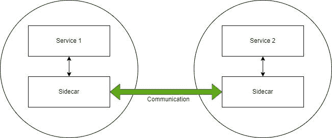
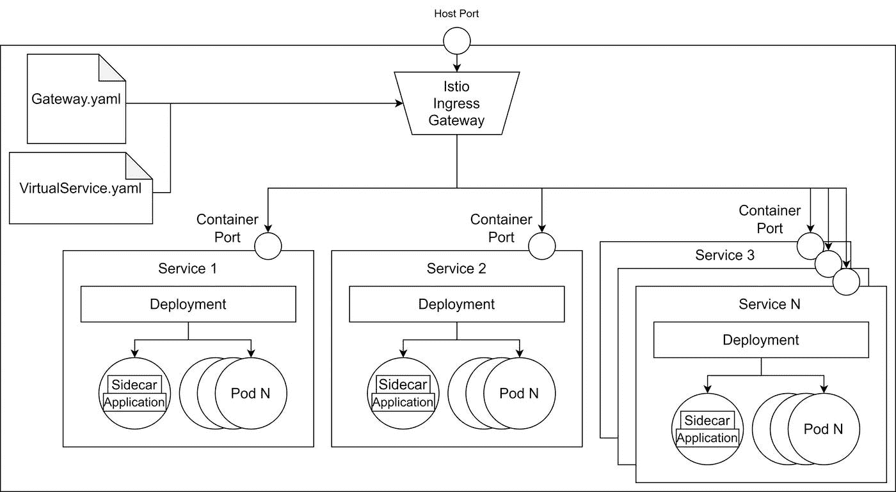
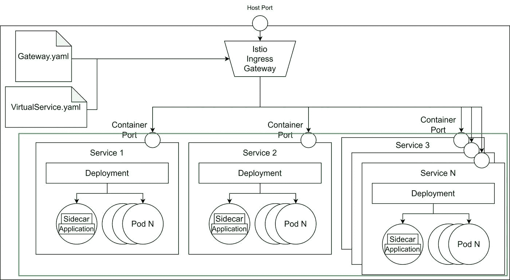

# Kubernetes 中愚蠢的简单服务网格

> 原文：<https://itnext.io/stupid-simple-service-mesh-in-kubernetes-9acc9576e1a7?source=collection_archive---------5----------------------->


图片由[皮克斯拜](https://pixabay.com/?utm_source=link-attribution&utm_medium=referral&utm_campaign=image&utm_content=2660914)的 Gerd Altmann 提供

我们在上一篇[](/stupid-simple-service-mesh-what-when-why-e9be9e5f4d41)**中讲述了**什么**，什么时候**，以及**为什么**服务网**的**。现在我想谈谈为什么他们在 Kubernetes 是至关重要的。****

****为了理解在处理基于微服务的应用程序时使用服务网格的重要性，让我们从一个故事开始。****

****假设您正在开发一个大型的基于微服务的银行应用程序，其中任何错误都会产生严重的影响。有一天，开发团队收到一个特性请求，要求在应用程序中添加一个评级功能。解决方案很明显:创建一个新的微服务，可以处理用户评级。现在是困难的部分。团队必须提出一个合理的时间估计来添加这个新服务。****

****该团队估计评级系统可以在 4 次冲刺中完成。经理生气了。他不明白为什么给应用程序添加一个简单的评分功能如此困难。****

****为了理解估算，让我们来理解为了有一个功能评级微服务我们需要做什么。CRUD(创建、读取、更新、删除)部分很简单——只是简单的编码。但是将这个新项目添加到我们基于微服务的应用程序中并不容易。首先，我们必须实现身份验证和授权，然后我们需要某种跟踪来了解我们的应用程序中发生了什么。因为网络不可靠(不稳定的连接会导致数据丢失)，我们必须考虑重试、断路器、超时等解决方案。****

****我们还需要考虑部署策略。也许我们想使用影子部署在生产中测试我们的代码，而不影响用户。也许我们想增加 A/B 测试功能或金丝雀部署。因此，即使我们只创建一个简单的微服务，我们也必须牢记许多跨领域的问题。****

****有时，向现有服务添加新功能比创建新服务并将其添加到我们的基础架构中要容易得多。部署新服务、添加身份验证和授权、配置跟踪、创建 CI/CD 管道、实现重试机制等等，都需要花费大量时间。但是将新功能添加到现有服务中会使服务变得太大。它还将打破单一责任的规则，像许多现有的微服务项目一样，它将转变为一组相互连接的“宏服务”或单片。****

****我们称之为**横切关注点负担**——在每个微服务中，你必须重新实现横切关注点，比如认证、授权、重试机制和速率限制。****

****这种负担的解决方法是什么？有没有办法一次实现所有这些关注点，注入到每一个微服务中，让开发团队专注于产生商业价值？答案是[**Istio**T5。](https://istio.io/latest/)****

# ****使用 Istio 在 Kubernetes 中建立服务网格****

****Istio 使用**边车**解决了这些问题，它会自动注入你的豆荚。您的服务不会直接相互通信，而是通过边车进行通信。边车会处理所有交叉的问题。您只需定义一次规则，这些规则就会自动注入到您的所有 pod 中。****

********

# ****示例应用程序****

****让我们把这个想法付诸实践。我们将构建一个示例应用程序来解释 Istio 的基本功能和结构。****

****在[之前的文章](/stupid-simple-service-mesh-what-when-why-e9be9e5f4d41)中，我们使用 envoy 代理手工创建了一个服务网格。在本教程中，我们将使用相同的服务，但是我们将使用 **Istio** 和 **Kubernetes** 来配置我们的服务网格。****

****下图描述了该应用程序架构。****

********

# ****要求****

****要学习本教程，您需要安装以下工具:****

1.  ****[**Kubernetes**](https://kubernetes.io/docs/setup/)**(本教程中我们用的是 1.21.3 版本)******
2.  ******[**掌舵**](https://helm.sh/docs/intro/install/) (我们用的是 v2)******
3.  ****[**Istio**](https://istio.io/latest/news/releases/1.1.x/announcing-1.1.17/) (我们用的是 1 . 1 . 17)——[设置教程](https://istio.io/latest/docs/setup/getting-started/)****
4.  ****[**Minikube**](https://minikube.sigs.k8s.io/docs/start/) ， [**k3s** ，](https://k3s.io/)或者在 Docker 中启用 Kubernetes 集群****

# ****Git 储存库****

****我在 Kubernetes 资源库中的 [**愚蠢的简单服务网格包含了本教程的所有脚本。基于这些脚本，您可以配置任何项目。**](https://github.com/CzakoZoltan08/StupidSimpleServiceMeshWithIstioAndKubernetes)****

# ****使用 Istio 和 Kubernetes 运行我们基于微服务的项目****

****正如我上面提到的，第一步是配置 Istio，将 sidecars 从一个名称空间注入到每个 pod 中。我们将使用默认的名称空间。这可以使用以下命令来完成:****

```
**kubectl label namespace default istio-injection=enabled**
```

****在第二步中，我们从下载的存储库中导航到 */kubernetes* 文件夹，并为我们的服务应用配置文件:****

```
**kubectl apply -f service1.yaml
kubectl apply -f service2.yaml
kubectl apply -f service3.yaml**
```

****完成这些步骤后，我们将启动并运行绿色部分:****

********

****目前，我们无法从浏览器访问我们的服务。下一步，我们将配置 **Istio 入口和网关**，这样**允许来自外部的流量**。****

******网关配置**如下所示:****

```
**apiVersion: networking.istio.io/v1alpha3
kind: Gateway
metadata:  
    name: http-gateway
spec:
    selector: 
        istio: ingressgateway
    servers:
        - port:
            number: 80
            name: http
            protocol: HTTP
        hosts:    - "*"**
```

****使用选择器*istio:Ingres gateway*我们指定使用默认的入口网关控制器，它是在我们安装 Istio 时自动添加的。如您所见，网关允许端口 80 上的流量，但是它不知道将请求**路由到哪里**。为了定义路由，我们**需要一个所谓的 VirtualService** ，这是由 Istio 定义的另一个定制 Kubernetes 资源。****

```
**apiVersion: networking.istio.io/v1b
kind: VirtualService
metadata:
    name: sssm-virtual-services
spec:
    hosts:  - "*"
    gateways:  - http-gateway
    http:  
        - match:
            - uri:
                prefix: /service1
            route:
                - destination:
                    host: service1
                    port:
                        number: 80
        - match:
            - uri:
                prefix: /service2
            route:
                - destination:
                    host: service2
                    port:
                        number: 80**
```

****上面的代码显示了 VirtualService 的配置示例。在第 7 行中，我们指定虚拟服务应用于来自名为 http-gateway 的网关的**请求，从第 8 行开始，我们定义了**规则来匹配请求应该发送到的服务**。每个带有/service1 的请求将被路由到 service1 容器，而每个带有/service2 的请求将被路由到 service2 容器。******

**在这一步，我们有一个工作的应用程序，直到现在 Istio 没有什么特别的，相同的架构可以通过使用一个简单的 Kubernetes 入口控制器来获得，没有边车和网关配置的负担。**

**现在让我们看看使用 Istion 规则可以做些什么。**

## **Istio 的安全性**

**如果没有 Istio，每个微服务都必须实现某种身份验证和授权。Istio **将添加**认证**和**授权**的职责**从主容器中移除(这样开发者可以专注于提供商业价值),而**将这些职责转移到它的副容器**中。sidecars 可以配置为在每次调用时请求访问令牌，这样可以确保只有经过身份验证的请求才能到达我们的服务。**

```
apiVersion: authentication.istio.io/v1beta1
kind: Policy
metadata:
    name: auth-policy
spec:  
    targets:  
        - name: service1  
        - name: service2  
        - name: service3 
        - name: service4  
        - name: service5  
    origins: 
    - jwt:      
        issuer: "{YOUR_DOMAIN}"     
        jwksUri: "{YOUR_JWT_URI}"  
    principalBinding: USE_ORIGIN
```

**作为身份和访问管理服务器，您可以使用例如 [**Auth0**](https://auth0.com/) 、 [**Okta**](https://www.okta.com/) 或其他 **OAuth** 提供者。你可以在 [**这篇文章**](https://medium.com/google-cloud/back-to-microservices-with-istio-part-2-authentication-authorization-b079f77358ac) 中了解更多关于使用 Auth0 with Istion 进行认证和授权的信息。**

## **使用目的地规则的流量管理**

**Istio 的 [**官方文档**](https://istio.io/latest/docs/reference/config/networking/destination-rule/) 称 **DestinationRule** *“定义了在路由发生后应用于某项服务的流量的策略”。*这意味着 DestionationRule 资源**位于**入口控制器和我们的服务之间的某处**。使用 DestinationRules，我们可以为*负载平衡*、*速率限制、*甚至*异常值检测*定义策略，以检测不健康的主机。****

****遮蔽****

**当您希望在不影响最终用户的情况下静默测试生产中的更改时，隐藏(也称为镜像)非常有用。发送到主服务的所有请求都被镜像(请求的副本)到您想要测试的辅助服务。**

**通过使用子集和定义镜像路由的虚拟服务来定义目的地规则，可以容易地实现隐藏。**

**目标规则将定义如下:**

```
apiVersion: networking.istio.io/v1beta1
kind: DestinationRule
metadata:  
    name: service2
spec:  
    host: service2
    subsets:  
    - name: v1     
      labels:      
          version: v1
    - name: v2    
      labels:      
          version: v2
```

**正如我们在上面看到的，我们为两个版本定义了两个子集。**

**现在，我们用镜像配置来定义虚拟服务，如下面的脚本所示:**

```
apiVersion: networking.istio.io/v1alpha3
kind: VirtualService
metadata:  
    name: service2
spec:  
    hosts:    
    - service2  
    http:  
    - route:    
        - destination:        
          host: service2
          subset: v1           
        mirror:      
            host: service2
            subset: v2
```

**在此虚拟服务中，我们为 service2 版本 v1 定义了主要目的地路由，镜像服务将是相同的服务，但带有 v2 版本标记。这样，最终用户将与 v1 服务进行交互，同时请求也将被发送到 v2 服务进行测试。**

****流量分流****

**流量分流是一种用来测试你的新服务版本的技术，通过**让一小部分(一个子集)用户与新服务互动**。通过这种方式，如果新服务出现问题，只有一小部分最终用户会受到影响。**

**这可以通过如下修改我们的虚拟服务来实现:**

```
apiVersion: networking.istio.io/v1alpha3
kind: VirtualService
metadata:  
    name: service2
spec:  
    hosts:    
    - service2 
    http:  
    - route:    
        - destination:        
              host: service2        
              subset: v1      
         weight: 90           
         - destination:        
               host: service2
               subset: v2      
         weight: 10
```

**该脚本最重要的部分是**权重**标记，它定义了将到达特定服务实例的请求的百分比。在我们的例子中，90%的请求会发送到 v1 服务，而只有 10%的请求会发送到 v2 服务。**

****金丝雀部署****

**在 canary 部署中，较新版本的服务以增量方式向用户推出，以最小化较新版本引入的任何错误的风险和影响。**

**这可以通过**逐渐减少旧版本**的重量，同时**增加新版本**的重量来实现。**

****A/B 测试****

**当我们有两个或更多不同的用户界面，并且我们想测试哪一个提供更好的用户体验时，就使用这种技术。我们部署所有不同的版本，并收集有关用户交互的指标。A/B 测试可以使用基于一致散列的负载平衡器或通过使用子集来配置。**

**在第一种方法中，我们定义了负载平衡器，如下所示:**

```
apiVersion: networking.istio.io/v1alpha3
kind: DestinationRule
metadata:  
    name: service2
spec:  
    host: service2
    trafficPolicy:    
        loadBalancer:      
            consistentHash:        
                httpHeaderName: version
```

**如您所见，一致性哈希基于版本标签，因此必须将该标签添加到我们名为“service2”的服务中，就像这样(在存储库中，您将找到两个文件，分别名为 service2_v1 和 service2_v2，用于我们使用的两个不同版本):**

```
apiVersion: apps/v1
kind: Deployment
metadata:  
    name: service2-v2  
    labels:    
        app: service2
spec:  
    selector:    
        matchLabels:      
            app: service2  
    strategy:    
        type: Recreate  
    template:    
        metadata:     
            labels:        
                app: service2        
                version: v2    
        spec:      
            containers:      
            - image: zoliczako/sssm-service2:1.0.0        
              imagePullPolicy: Always        
              name: service2        
              ports:          
              - containerPort: 5002        
              resources:          
                  limits:            
                      memory: "256Mi"            
                      cpu: "500m"
```

**需要注意的最重要的部分是规范->模板->元数据->版本:v2。另一个服务具有版本:v1 标记。**

**另一种方案是基于 [**子集**](https://istio.io/latest/docs/reference/config/networking/destination-rule/) 。**

****重试管理****

**使用 Istio，我们可以很容易地定义如果初始尝试失败(例如，在服务过载或网络错误的情况下)连接到服务的最大尝试次数。**

**可以通过在我们的虚拟服务末尾添加以下行来定义重试策略:**

```
retries:  
    attempts: 5
    perTryTimeout: 10s
```

**使用这种配置，我们的 service2 在失败的情况下将有五次重试尝试，它将等待 10 秒钟，然后返回超时。**

**在 [**本文**](https://medium.com/google-cloud/back-to-microservices-with-istio-p1-827c872daa53) 了解更多交通管理知识。在这里 你会发现一个使用 Istio [**配置端到端服务网格的好地方。**](https://www.istioworkshop.io/01-workshop-overview/)**

# **结论**

**在本文中，我们学习了如何使用 Istio 在 Kubernetes 中**设置**和**配置**一个**服务网格。首先，我们配置了一个**入口控制器**和**网关**，并使用**目的地规则**和**虚拟服务**了解了**流量管理**。****

**还有一个正在进行的**《愚蠢的简单 AI》**系列。前两篇可以在这里找到: [**SVM 和内核 SVM**](https://towardsdatascience.com/svm-and-kernel-svm-fed02bef1200) 和 [**KNN 在 Python**](https://towardsdatascience.com/knn-in-python-835643e2fb53) 。**

****感谢您阅读本文！****

****成为媒介上的作家:**[https://czakozoltan08.medium.com/membership](https://czakozoltan08.medium.com/membership)**

**我真的很喜欢咖啡，因为它给了我写更多文章的能量。如果你喜欢这篇文章，那么你可以给我买杯咖啡来表达你的欣赏和支持！**

**[](https://ko-fi.com/zozoczako)**