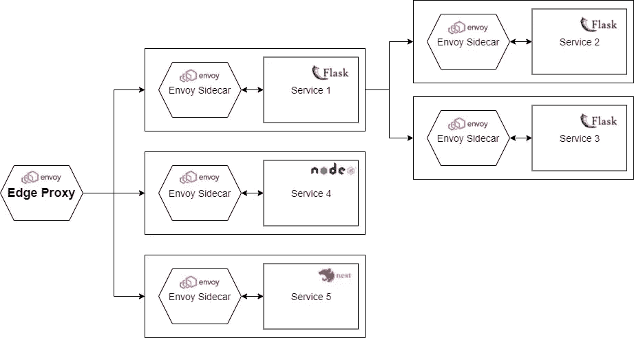
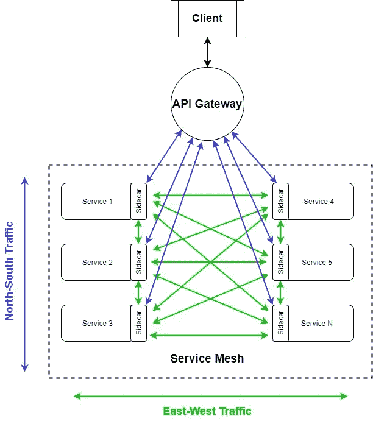
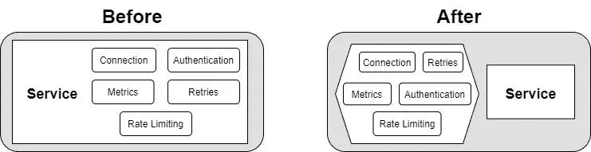
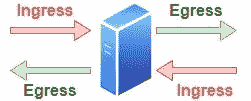
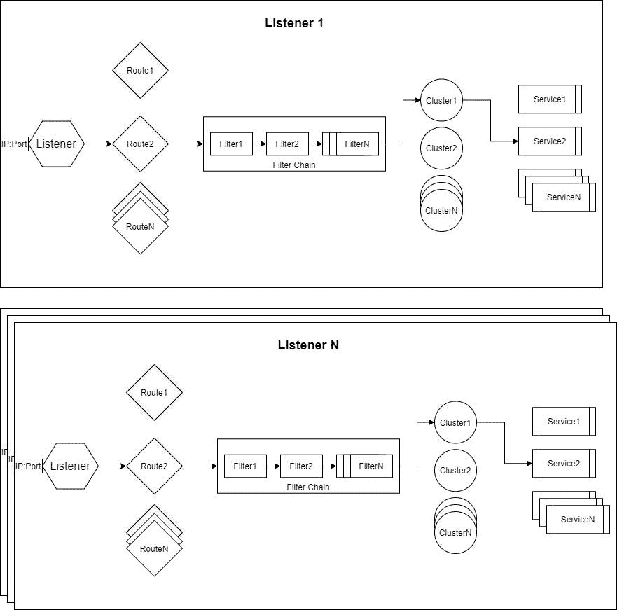
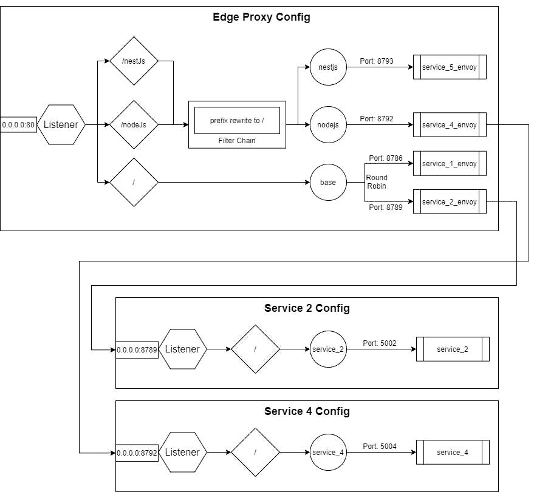

# 愚蠢的简单服务网格—什么，什么时候，为什么

> 原文：<https://itnext.io/stupid-simple-service-mesh-what-when-why-e9be9e5f4d41?source=collection_archive---------0----------------------->

艾莉娜·格鲁布尼亚克在 [Unsplash](https://unsplash.com/s/photos/network?utm_source=unsplash&utm_medium=referral&utm_content=creditCopyText) 上的照片

最近基于微服务的应用变得非常流行，随着微服务的兴起，**服务网格**的概念也成为一个非常热门的话题。不幸的是，关于这个概念的文章很少，而且大部分都很难理解。

在这篇博客中，我们将尝试**使用“愚蠢简单”的解释**、图表和例子来揭开服务网格概念的神秘面纱，使这个概念对每个人来说更加透明和容易理解。在**的第一篇文章**中，我们将讨论**服务网格的基本构建模块**，并且我们将实现一个**示例应用**来获得每个理论概念的实际示例。在**接下来的文章**中，基于这个示例应用程序，我们将触及更高级的主题，如 Kubernetes 中的**服务网格，我们将讨论更多的**高级服务网格实现，如**[**Istio**](https://istio.io/)**、** [**Linkerd**](https://linkerd.io/) 等。**

要理解 [**服务网格**](https://en.wikipedia.org/wiki/Service_mesh) 的概念，第一步就是要理解**它解决**什么问题**它如何解决这些问题**。

软件架构在短时间内发展了很多，从经典的单片架构到微服务。尽管许多人称赞微服务架构是软件开发的圣杯，但它也带来了一些严峻的挑战。

示例应用程序概述

首先，基于微服务的架构意味着我们有一个**分布式系统。**每个分布式系统都有挑战，比如*透明*、*安全*、*可扩展性*、*故障排除、*和*确定问题的根本原因*。在单块系统中，我们可以通过跟踪找到失败的根本原因。但是在基于微服务的系统中，每个服务都可以用不同的语言编写，因此跟踪不是一项简单的任务。另一个挑战是*服务对服务的通信。*开发人员需要关注*服务发现*、*处理连接错误*、*检测延迟*、*重试逻辑*等，而不是关注业务逻辑。将 [**坚实的**](https://medium.com/backticks-tildes/the-s-o-l-i-d-principles-in-pictures-b34ce2f1e898) 原则应用在**架构层面**上，意味着这类网络问题**要抽象掉，不要和业务逻辑**混在一起。这就是为什么我们需要服务网格。

# 入口控制器与 API 网关和服务网格

正如我上面提到的，我们需要在一个架构层次上应用****坚实的原则。为此，设定入口控制器、API 网关和服务网格之间的界限并理解每一个的角色和责任是很重要的。****

**在一个愚蠢简单和过于简单的层面上，这些是每个概念的责任:**

1.  **[**入口控制器**](https://www.nginx.com/resources/glossary/kubernetes-ingress-controller/) :允许**单个 IP 端口访问集群**的所有服务，因此其主要职责是路径映射、路由和简单的负载均衡，*作为反向代理***
2.  **[**API 网关**](https://www.redhat.com/en/topics/api/what-does-an-api-gateway-do) : **聚合并抽象掉 API**；其他职责包括速率限制、身份验证、安全性、跟踪等。在基于微服务的应用程序中，您需要一种方法来将请求分发到不同的服务，收集来自多个/所有微服务的响应，然后准备发送给调用者的最终响应。这就是 API 网关应该做的事情。它负责**客户端到服务的通信、** [**南北交通**](https://en.wikipedia.org/wiki/North-south_traffic) 。**
3.  **[**服务网**](https://www.nginx.com/blog/what-is-a-service-mesh/) : 负责**服务对服务通信，** [**东西向流量**](https://en.wikipedia.org/wiki/East-west_traffic) 。我们将在下一节深入探讨服务网格的概念。**

****服务网格**和 **API 网关**具有重叠的功能，如速率限制、安全、服务发现、追踪等。但是他们在不同的层面上工作，解决不同的问题。**服务网格**负责服务之间的**请求流。** **API 网关**负责客户端和服务之间的**请求流，聚合多个服务，创建并向客户端发送最终响应。****

****

**API 网关的主要职责是接受来自网络外部的流量，并在网络内部进行分发，而服务网格的主要职责是路由和管理网络内部的流量。它们是互补的概念，一个定义良好的基于微服务的系统应该将它们结合起来，以确保应用程序正常运行和弹性，同时确保您的应用程序易于使用。**

# **服务网格解决什么问题？**

****

**作为一个过于简化和愚蠢的简单定义，服务网格是一个 ***抽象层，隐藏并分离网络相关逻辑和业务逻辑*** 。这样，开发人员可以只专注于实现业务逻辑。我们使用位于服务前端的**代理**来实现这个抽象。它会处理所有与网络相关的问题。这允许服务关注真正重要的东西:业务逻辑。在基于微服务的架构中，我们有多个服务，每个服务都有一个代理。**合起来，** **这些*代理被称为服务网格*** 。**

**正如最佳实践所建议的，*代理和服务应该在不同的容器中*，因此每个容器都有一个**单一职责**。在 Kubernetes 的世界里，代理的容器被实现为一个 [**sidecar**](https://www.magalix.com/blog/the-sidecar-pattern) 。这意味着每个服务都有一个包含代理的 sidecar。一个单元将包含两个容器:服务和边车。另一种实现是对多个 pod 使用一个代理。在这种情况下，代理可以实现为一个默认设置。最常见的解决方案是使用边车。就个人而言，我更喜欢 sidecars 而不是 Deamonsets，因为它们尽可能地保持代理的逻辑简单。**

**有多种服务网状解决方案，包括****[**Linkerd**](https://linkerd.io/)**[**领事**](https://www.consul.io/)**[**孔**](https://konghq.com/kong-mesh/)**[**纤毛**](https://cilium.io/) 。(我们将在后面的文章中讨论这些解决方案。)让我们把重点放在基础知识上，从 [**特使**](https://www.envoyproxy.io/docs/envoy/latest/intro/what_is_envoy#) 开始理解服务网格的概念。这是一个高性能的代理，并不是服务网格的完整框架或解决方案(在本教程中，**我们将构建自己的服务网格解决方案**)。一些服务网格解决方案在后台使用 Envoy(如 Istio)，因此在开始使用这些高级解决方案之前，最好先了解底层功能。************

# ****理解特使****

## ****入口和出口****

********

******简单定义:******

*   ****任何发送到服务器(服务)的流量都被称为**入口**。****
*   ****从服务器(服务)发送的任何流量都被称为**出口**。****

******入口**和**出口**规则应该添加到特使代理的**配置中，所以边车会处理这些。这意味着*到服务*的任何流量*将首先到达特使边车。*然后*特使代理将流量重定向到真实服务*。反之亦然，来自该服务的任何流量将首先到达特使代理，特使使用[服务发现](https://avinetworks.com/glossary/service-discovery/#:~:text=Microservices%20service%20discovery%20is%20a,microservices%20architecture%20discovery%20includes%20both%3A&text=a%20central%20server%20(or%20servers,a%20global%20view%20of%20addresses.)解析目标服务。通过拦截入站和出站流量，Envoy 可以实现服务发现、断路器、速率限制等。******

## ****特使代理配置文件的结构****

********

****每个特使配置文件都有以下组件:****

1.  ******监听器:**我们在这里配置特使代理监听的 IP 和端口号****
2.  ******路由:**接收到的请求将根据规则被路由到一个集群。例如，我们可以使用路径匹配规则和前缀重写规则来选择应该处理特定路径/子域请求的服务。实际上，**路线只是另一种类型的过滤器**，是强制性的。否则，代理不知道将我们的请求路由到哪里。****
3.  ******过滤器:**过滤器可以被链接起来，用于执行不同的规则，例如速率限制、路由突变、请求操作等。****
4.  ******集群:**充当一组逻辑相似的服务的管理器(集群的职责与 Kubernetes 中的服务相似；它定义了访问服务的方式)，并充当服务之间的负载平衡器。****
5.  ******服务/主机:**处理和响应请求的具体服务****

****以下是特使配置文件的示例:****

****上面的配置文件转换成下图:****

********

****该图没有包括所有服务的所有配置文件，但足以理解基本内容。你可以在我的 [**愚蠢简单服务网格库**](https://github.com/CzakoZoltan08/Stupid-Simple-Service-Mesh) 里找到这段代码。****

****正如你所看到的，在第 10–15 行之间，我们为我们的特使代理定义了监听器。因为我们在 Docker 工作，所以主机是 0.0.0.0。****

****配置完监听器后，在第 15–52 行之间，我们定义了**过滤器**。为简单起见，我们仅使用基本过滤器**来匹配路线并重写目标路线**。在这种情况下，如果子域是“host:port/nodeJs”，路由器将选择 *nodejs* 集群，URL 将被重写为“host:port/”(这样，对具体服务的请求将不包含/nodesJs 部分)。在“host:port/nestJs”的情况下，逻辑也是相同的。如果请求中没有子域，那么请求将被路由到名为 *base* 的集群，而不使用前缀重写过滤器。****

****在第 53–89 行之间，我们定义了**簇**。*基地*集群将有两个服务，选择的负载均衡策略是*循环*。其他可用策略可以在 这里找到 [**。另外两个集群( *nodejs* 和 *nestjs* )很简单，只有一个服务。**](https://www.envoyproxy.io/docs/envoy/latest/intro/arch_overview/upstream/load_balancing/load_balancers)****

****本教程的**完整代码**可以在我的 [**愚蠢简单服务网格 git 资源库**](https://github.com/CzakoZoltan08/Stupid-Simple-Service-Mesh) 中找到。****

# ****结论****

****在本文中，我们了解了**服务网格的基本概念**。在第一部分中，我们了解了入口控制器、API 网关和服务网格之间的**职责和区别。**然后我们讲了什么是**服务网**和**它解决什么问题**。在第二部分中，我们介绍了 [**特使**](https://www.envoyproxy.io/docs/envoy/latest/intro/what_is_envoy#) ，这是一个高性能且流行的代理，我们用它来构建我们的服务网格示例。我们了解了**特使配置文件的不同部分**和**创建了一个包含五个示例服务**和**前端边缘代理**的服务网格。****

****在下一篇文章的**中，我们将看看如何将**服务网格与 Kubernetes** 一起使用，并将创建一个示例项目，该项目可以作为任何使用微服务**的项目的**起点。******

**要了解更多关于 Kubernetes 有一个正在进行的**[**愚蠢简单的 Kubernetes**](https://czakozoltan08.medium.com/stupid-simple-kubernetes-e509355fba3d)**系列。******

******另一个有趣的正在进行的系列是**《愚蠢简单的 AI》**系列。前两篇可以在这里找到:Python 中的 [**SVM 和内核 SVM**](https://towardsdatascience.com/svm-and-kernel-svm-fed02bef1200) 和[**KNN**](https://towardsdatascience.com/knn-in-python-835643e2fb53)。******

******感谢您阅读本文！******

******成为媒介上的作家:**【https://czakozoltan08.medium.com/membership】T2****

******我真的很喜欢咖啡，因为它给我精力去写更多的文章。如果你喜欢这篇文章，那么你可以给我买杯咖啡来表达你的欣赏和支持！******

********