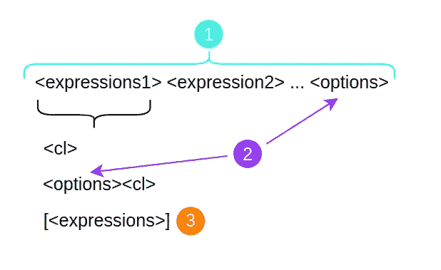
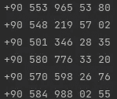

# 随机风格:带有简单语法和许多复杂选项的随机字符串生成器

> 原文：<https://itnext.io/style-random-random-string-generator-with-easy-syntax-and-many-complex-options-9e5878807b54?source=collection_archive---------2----------------------->


带有简单语法和许多复杂选项的随机字符串生成器。按字符类别指定随机模板，定义长度，按类别排序，添加开头、结尾或重复等条件。

# 特征

可以用于多种需求的随机代码生成器是用单个模板创建的。该模板在开始时被解析，并生成适用于所有条件的随机代码。

[style_random](https://pub.dev/packages/style_random) 基本上是用来在 [style_dart](https://pub.dev/packages/style_dart) 后端框架中定制数据标识符、OTP、2FA、短链接等随机代码。

此外，当我们在 web socket 实现中创建定制协议时，一个额外的小安全措施旨在验证由客户端创建的或从服务器接收的随机消息标识符是用相同的秘密模板创建的。

# 入门指南

# 添加依赖关系

执行命令:

`dart pub add style_random`

导入它

```
**import** 'package:style_random/style_random.dart';
```

# 定义模板

```
void main() {
  final generator = RandomGenerator(
     "/l(5)A{-}/l(10)[#a]/e(#)/s({AEIOU})"
  );
}
```

# 这是什么意思？

按顺序；

*   5 个大写字母。
*   1 `-`
*   10 个小写字母或数字。(无序)

有条件；

*   必须以大写元音开头
*   必须以数字结尾

# 产生

```
void main() {
  final generator = RandomGenerator("/l(5)A{-}/l(10)[#a]/e(#)/s({AEIOU})");
  gen.generateString(); // x6
}
```

# 获取结果:

```
URTYU-o92j72h484
AKOFK-37nj239564
EXMNO-73r2621302
UFKTJ-578u2lpo83
OFKIG-54o75p7730
EKXTQ-2lydl02b39
```

# 句法



我们可以从解释数字开始；

1.  组成模板的是表达式和选项。
    表达式是字符类、字符组或静态字符。这些将在下面解释。

> `*a [A#] {-}*`
> 
> `*a*` *小写字母* `*[A#]*` *大写字母或数字* `*{-}*` *正好* `*-*`

2.模板末尾的选项会影响整个模板。所以我们可以称之为全局期权。

> `*<option><class>*` *这个选项只作用于类。* `*<class1><class2><option>*` *和此选项影响所有模板。*

所有选项都以`/<option-name>`开头。
另外，选项可以带`/<option-name>(<param1>,<param2>)`等参数。

> `*/l(10) a*` *例如* `*l*` *是长度选项，当给定一个字符类时，它决定该类将产生多少个实例。* `*a # /l(15)*` *同样，它决定了作为全局选项给出时产生的随机值的长度。*

3.我们可以将角色类分组，而不是一个角色类。分组和常规打字的区别在于顺序。虽然它在正常写入时是顺序的，但它会从组中随机选择。

> `*a [A#] {-}*` *该语句产生一个字符串，其顺序为*`*a*`*`*[A#]*`*`*-*`*。
> 但是表达式* `*[A#]*` *本身就选择错了。***

**在下面的例子中，我们可以看到这一点**

```
**void main() {
  var gen = RandomGenerator("/l(5)a /l(5)[A#] {-}");
  print(gen.generateString()); // x6
}**
```

**所有输出按`a`(小写字母)> `[A#]`(分组)> `-`(静态)
排序，但`A`(大写字母)和`#`(数字)内部是混合排序。**

```
**jrloh68GXB-
kycmrZVR28-
hxeqaV24XO-
qefqmM16WK-
odpbuB7O7I-
yonidUBXUC-**
```

# **使用**

# **字符类别**

**`.`任何字符。 *(ASCII 33-126)***

**`#`0 到 9 之间的任意数字。 *9 包括***

**`*`任何字母。 *(ASCII 65-90 和 97-122)***

**`l`情人格书信。 *(ASCII 65-90)***

**`L`大写字母。 *(ASCII 97-122)***

**`s`任意特定字符 *(ASCII 33-47，58-64，91-96，123-126)***

**`w`任何特定字符不包括 url 特定字符**

# **组**

**`[<cl><cl>]`性格类群体。组内不进行排序。**

**`[a #]`小写字母或数字**

# **静态表达式**

**静态字符用`{}`表示。静态表达式按原样实例化内容。**

**例如`{-}`、`{42}`、`{xyz}`**

# **选择**

# **`/l()`长度**

**长度选项可以添加到任何地方。它决定了该表达式添加到表达式时的长度，以及整个表达式添加到全局选项时的长度。
长度选项可以取一个固定的数字或一个范围。**

## **固定的；不变的**

**当给定类似于`/l(<n>)`的常数时，正好产生`n`次。**

## **范围**

**长度可以在一定范围内定义。**

**如果范围以长度形式给出，生成器将检查父子长度。如果不可能，那么在定义`RandomGenerator`时会抛出一个错误。**

**当子节点的最大值小于父节点为该子节点设置的最小值(例如，global `/l()`)时，这种不可能性就会出现。**

**范围定义有 3 种方式:**

**`/l(<min>-<max>)`定义了最小值和最大值。
`/l(-<max>)`定义最大值。如果父项没有为此表达式设置最小值，则最小值可以是 0。所以从这个表达式来看，它可能根本就没有被创造出来。
`/l(<min>-)`定义了最小值，最大值是无穷大。使用该表达式时，长度必须由父项限制。否则，它将抛出一个错误消息“max unbounded”。**

**如果范围用作长度，生成器在构建时会随机确定这些区间中的长度。**

**静态表达式的长度总是内部字符串的长度。**

```
**{-}      : auto add /l(1)
{mehmet} : auto add /l(6)**
```

**Length 选项通过查看子/父关系自动确定没有指定长度的表达式的长度。**

**以下示例中的所有结果都符合相同的模板**

```
**1\. exp |      2.exp      | 3\. exp | global opts a     /l(5)   [A#]     {-}       /l(11)
/l(5)a     /l(5)   [A#]     {-}
/l(5)a     /l(1-10)[A#]     {-}       /l(11)
/l(5)a             [A#]     {-}       /l(11)
a        [/l(3)A/l(2)#]     {-}       /l(11)**
```

# **结束选项**

**End options 指定表达式开始或结束(最后一个索引)的条件。**

**这些结束表达式被定义为`/option-name(classes or characters)`。**

**它可以接受多个参数。字符类名必须是直接的，并且特定字符必须在`{}`内。参数用逗号分隔。**

**例如:**

**`/s(a,{-},{@5c}) .`任何字符(ASCII 33-126)但必须以；**

*   **`a`小写字母
    或**
*   **`{-}``-`或
    的人物**
*   **`{@5c}`字符“@”或“5”或“c”**

**有 4 种类型的结束选项。**

**`/s(<cl>|<char>)`开始于`/e(<cl>|<char>)`结束于`/<(<cl>|<char>)`不是开始于`/>(<cl>|<char>)`不是结束于**

> ***如果您出于安全目的使用它(例如，生成密钥)，防止(或减少)重复或随机值彼此相似的模板不会使您的密钥更安全。这让它更没有安全感。***

## **不可能**

**在构建模板时，会检查在大多数情况下是否可能出现这种情况。**

**如`/s(a) #`在表达式中，用条件生成是不可能的。因为条件是从类`#`创建一个实例，从类`a`开始。但是任何`#`都不包含任何`a`。**

**审查许多可能性，如果不可能，则在构建期间抛出一个错误。循环被限制为长度的平方，以避免因错过调试而导致无限循环。**

**当这些条件冲突时，将引发错误。如果父代有相同的条件，子代不被接受并给出错误。**

## **结束选项示例**

**`/s(#)/e(#)./l(20)` 20 任意字符。它必须以数字开头，以数字结尾。**

**`/s(#)/>(s)./l(20)` 20 任意字符。它必须以数字开头，不能以特定字符结尾。**

# **论生成长度**

**如果范围用作长度，生成器在构建时会随机确定这些区间中的长度。**

**这意味着所有结果的长度都相同。但是如果希望为每个实例重新选择长度(性能会有所下降)，那么 onGenerateLength: true 应该是。**

```
**void main() {
  var gen = RandomGenerator(
      "/l(1-9)# /l(1-9)a /l(10)",
      onGenerateLength: true
  );
}**
```

**在此示例中，长度为 1–9(此范围内的随机长度)的数字和长度为 1–9 的小写字母按顺序产生。**

**如果我们希望这些长度随着每次选举而改变，结果可能是这样的:**

```
 **#  a1402joprny    4  6
149375894j    9  1
1951222jid    7  3
045325921b    9  1
62275783mz    8  2
883267zryq    6  4**
```

**如果`onGenerateLength: false`:**

```
 **#  a0050lpzaeb   4  6  // in the 1\. instance the lengths determined
3540ozjutp   4  6
4886zraewb   4  6
5013hcuovm   4  6
6461wcwdkd   4  6
2639wjysim   4  6**
```

# **自定义随机委托**

**定义自定义随机**

```
**class CustomRandom extends RandomDelegate {
  CustomRandom() : super(); @override
  int nextInt(int max) {
    return 10;
  }
}**
```

**使用**

```
**void main() {
  var gen = RandomGenerator(
      "a[/l(3)A/l(2)#]{-}/l(11)",
      randomDelegate: CustomRandom()
  );
}**
```

# **样本模板**

## **验证码:“`/l(3)# {-} /l(3)#"`**

```
**880-282
208-235
239-205
956-849
206-311
745-154**
```

## **短链接**

**同网址可用的具体字符:`[*#w]/l(30)`**

```
**))T(s-U8IfA6J4((b699l((c8cR34t
4w49!_1R3i'-.((*tvs!-Q7IdG1VtC
l61Y27.20_7*37'3if9Rnsn85g0wAu
!L1X!x4-1')!c8G(_U0__6R738qxhI
4g'X'6uUT-L..49T_*n_U'17y*60Vv
5-Q7LEA__6-6O25r36)1giH(4(.u78**
```

**对于无特定字符:`[*#]/l(30)`**

## **建议密码:"`./l(16)"`**

```
**j+kKM]DDM"ne/2<>
(I+WHx7k@^kd^Xg^
Bd49/`>VM:jTr"yS
iyOQHVv]yinU7`%A
XQyS$o&-_62;0`2_
^[@/A#(X`If5+((M**
```

## **Firebase 文档 ID : " `[*#]/l(20)"`**

```
**gQ9gaPh4e2J31U1CxedB
t09R5h053T19NG0bh2uK
W65r2UP099IDux645l8A
Pw601wg6Tq7kb63BN36O
f9n50Y4504B93D6LNjNV
C65Gn41MMLX59Wl326p9**
```

## **酷码:)`{S} ## {-} /l(4)A {-} /l(4)#`**

**在诸如预约码、订单码(即使它没有实际意义)之类的代码中，可能需要假装该代码具有某种意义。**

```
**S45-FGJJ-5453
S77-IRTY-5725
S21-SLGB-9247
S56-NBKN-3393
S88-DAEB-6465
S31-QNJO-1611**
```

## **电话号码:"`{+90 5}##{ }###{ }##{ }##"`**

**这些数字是随机生成的！**

****

# **要添加的功能**

*   **包括-排除字符类的选项**
*   **复制选项:限制复制、连续复制。**
*   **`#`的范围选项。**
*   **模板匹配。检查给定样本与模板的兼容性。对于秘密模板。**
*   **用 JSON 编译码。(托吉森，弗罗杰森)**
*   **随机模板生成。它可以用来随机生成一个模板。**
*   **教程—演示 web 应用程序，如[https://regexr.com/](https://regexr.com/)**