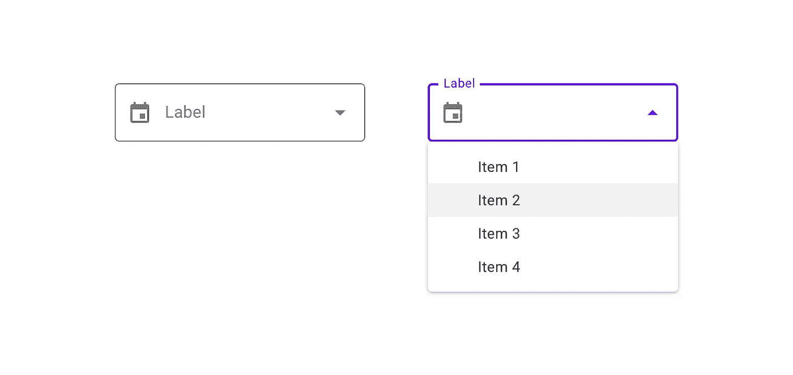
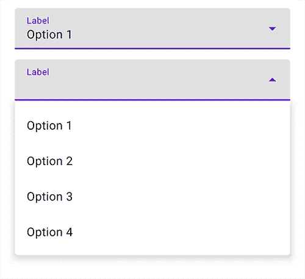
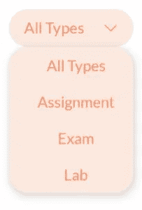

# 在 Android 上创建和设计下拉菜单

> 原文：<https://itnext.io/styling-material-exposed-dropdown-menus-on-android-19c7d21a9fcc?source=collection_archive---------2----------------------->



> 你现在可以在我的子页面[https://thatgreekengineer.substack.com/](https://thatgreekengineer.substack.com/)找到这篇文章和其他文章！

我最近不得不为我的应用程序实现一个定制的下拉菜单，这花了我很长时间来弄清楚该设计什么样式以及如何正确地完成它，以达到我想要的外观和感觉。因此，在本文中，我将介绍如何使用 TextInputLayout 和 AutoCompleteTextView 定制一个公开的下拉菜单。我们将从这里开始:



稍微定制的暴露下拉菜单

对此:



最终显示的下拉菜单

# 什么是暴露的下拉菜单？

暴露的下拉菜单在选项列表上方显示当前选定的菜单项。一些变体可以接受用户输入的输入。在 Android 上，这个功能可以使用一个`TextInputLayout`和一个嵌套的`AutocompleteTextView`来实现，它们都是 Android 素材库的组件。让我们将这个库导入到我们的项目中:

```
implementation ‘com.google.android.material:material:1.4.0’
```

在本教程中，我还将使用 V**view binding**，所以请确保通过添加以下内容在您的模块的 build.gradle 中启用它:

```
android {
   ...
   buildFeatures {
       viewBinding *true* }
}
```

# 设计基本布局

让我们从声明一个材料暴露下拉菜单的基本布局开始。

```
<com.google.android.material.textfield.TextInputLayout
    *android:id*="@+id/dateFilterContainer" *style*="@style/Widget.MaterialComponents.TextInputLayout.FilledBox.ExposedDropdownMenu"
    *android:layout_width*="wrap_content"
    *android:layout_height*="wrap_content"
    android:hint="[@string/label](http://twitter.com/string/label)">

    <AutoCompleteTextView
        *android:id*="@+id/datesFilterSpinner"
        *android:layout_width*="match_parent"
        *android:layout_height*="match_parent"
        *android:inputType*="none"
        *tools:text*="All Time"" />
</com.google.android.material.textfield.TextInputLayout>
```

这里我们只是添加了一个包含一个`AutoCompleteTextView`的`TextInputLayout`，它将作为我们的下拉列表。注意`inputType="none"`行，因为它告诉 AutoCompleteTextView 我们不打算手工输入任何文本细节。这与我们分配给 TextInputLayout 的自定义样式相结合，将允许 AutoCompleteTextView 在被单击时像一个微调器一样工作。

要了解更多关于各种可用风格和定制选项的信息，请看一下谷歌的[菜单——材料设计](https://material.io/components/menus/android#dropdown-menus)文档。

# 给我们的下拉菜单一个更加定制的外观

让我们从下拉菜单的背景颜色开始。

```
<color *name*="pastel_orange_light">#FBE8DF</color>
```

接下来，我们将创建一个新的`filter_spinner_dropdown_bg.xml` drawable，并使用下面的代码来塑造它:

```
<?*xml version*="1.0" *encoding*="utf-8"?>
<shape *xmlns:android*="http://schemas.android.com/apk/res/android">
    <solid *android:color*="@color/pastel_orange_light" />
    <corners *android:radius*="20dp" />
</shape>
```

我们需要的最后一件事是一个下拉图标，它将被放置在 TextInputLayout 的末尾。我使用了[自由羽毛图标包](https://feathericons.com/)中的向下箭头。好了，现在我们有了所有的资源，让我们进一步设计下拉菜单的样式。

首先，我们要将 TextInputLayout 的`background`设置为我们之前创建的 drawable。

接下来，我们将通过改变各个角的`radius`来圆化放置在 TextInputLayout(由于我们选择的样式)周围的框的角，并且还将`boxStrokeWidth`和`boxStrokeWidthFocused`设置为`0dp`，因为我们不希望我们的下拉菜单上有任何轮廓。

此外，让我们使用`endIconDrawable`属性添加自定义下拉箭头图标，并使用`endIconTint`将其着色以匹配我们的风格。

我们现在已经完成了对 TextInputLayout 的样式化，所以让我们转到 AutoCompleteTextView。这里我们设置了`background="@null"`,这样它就不会与 TextInputLayout 的背景重叠。

接下来，我们指定一个`dropDownSelector` drawable，在这种情况下，它将与我们之前创建的 drawable 相同。

> dropDownSelector 是一个 drawable，当你点击它的时候用来高亮显示一个项目。

对于我的应用程序，我不希望这样的东西是可见的，所以我只是把它设置成和我们的背景一样可绘制。

继续，添加下面几行将简单地将文本限制为一行，这样所有内容看起来都是一致的，当文本太长时，将在文本末尾添加省略号(`...`)。

```
*android:ellipsize*="end"
*android:maxLines*="1"
*android:singleLine*="true"
```

我们还将在顶部和底部添加一些填充，因为出于某种原因，TextInputLayout 中 AutoCompleteTextView 的嵌套会导致它在 TextInputLayout 的边界上裁剪一点。

最后，我们将我们的文本居中和样式一点，就这样。下面是最后的代码。

```
<com.google.android.material.textfield.TextInputLayout
    *android:id*="@+id/typesFilterContainer" *style*="@style/Widget.MaterialComponents.TextInputLayout.FilledBox.ExposedDropdownMenu"
    *android:layout_width*="wrap_content"
    *android:layout_height*="40dp"
    *android:background*="@drawable/filter_spinner_dropdown_bg"
    *app:boxBackgroundColor*="@color/pastel_orange_light"
    *app:boxCornerRadiusBottomEnd*="20dp"
    *app:boxCornerRadiusBottomStart*="20dp"
    *app:boxCornerRadiusTopEnd*="20dp"
    *app:boxCornerRadiusTopStart*="20dp"
    *app:boxStrokeWidth*="0dp"
    *app:boxStrokeWidthFocused*="0dp"
    *app:endIconDrawable*="@drawable/ic_arrow_down"
    *app:endIconTint*="@color/pastel_orange_txt_highlight">

    <AutoCompleteTextView
        *android:id*="@+id/typesFilter"
        *android:layout_width*="match_parent"
        *android:layout_height*="match_parent"
        *android:background*="@null"
        *android:fontFamily*="@font/lato"       *android:dropDownSelector*="@drawable/filter_spinner_dropdown_bg"
        *android:ellipsize*="end"
        *android:inputType*="none"
        *android:maxLines*="1"
        *android:paddingTop*="10dp"
        *android:paddingBottom*="10dp"
        *android:singleLine*="true"
        *android:text*="All Types"
        *android:textAlignment*="center"
        *android:textColor*="@color/pastel_orange_txt_highlight"
        *tools:ignore*="LabelFor" />
</com.google.android.material.textfield.TextInputLayout>
```

您现在应该有了类似如下的东西:


输出

接下来，让我们看看如何用项目填充下拉列表！

# 指定下拉项目

为了给我们的菜单设置下拉菜单，我们需要使用一个`ArrayAdapter<>()`并传入上下文、项目布局和项目列表。在这种情况下，我们将使用预定义的`android.R.layout.simple_spinner_dropdown_item`布局，因为它将满足我们现在的需求，但您也可以使用自定义布局，并在自定义 ArrayAdapter 子类中进一步自定义它。让我们看看目前为止的代码:

```
val adapter = ArrayAdapter(
    requireContext(), android.R.layout.simple_spinner_dropdown_item, *arraylistOf("All Types", "Assignments", "Exam", "Lab")*
)
binding?.typesFilterSpinner?.setAdapter(adapter)
binding?.typesFilterSpinner?.setText("*All Types"*)
```

很好，现在我们的下拉菜单中已经填充了项目，我们需要定义一个自定义的 drawable 作为下拉背景，因为现在将使用默认的白色背景。

# 使用自定义下拉背景可绘制

我们将再次使用我们的`filter_spinner_dropdown_bg.xml` drawable。简单地调用 AutoCompleteTextView 上的`setDropDownBackgroundDrawable()`,这将是它的背景。

```
binding?.typesFilterSpinner.setDropDownBackgroundDrawable(
    ResourcesCompat.getDrawable(
        *resources*,
        R.drawable.*filter_spinner_dropdown_bg*,
        *null* )
)
```

好了，我们终于完成了下拉菜单的样式。它现在应该看起来像这样:


决赛成绩

在我们的最后一部分，我们将看到如何处理项目点击事件！

# 处理项目点击事件

为了在下拉项目被点击时得到通知，我们将简单地定义我们自己的`AdapterView.OnItemClickListener`并在我们的 AutoCompleteTextView 中使用它。

```
binding?.typesFilterSpinner.*onItemClickListener* =
    AdapterView.OnItemClickListener **{** parent, view, position, id**->
        *// do something with the available information***
    **}**
```

本教程到此结束，你现在应该有一个功能齐全，外观漂亮的下拉菜单/微调。如果您有任何建议、改进或评论，请在评论中告诉我，我会尽最大努力采纳它们。编码快乐！

