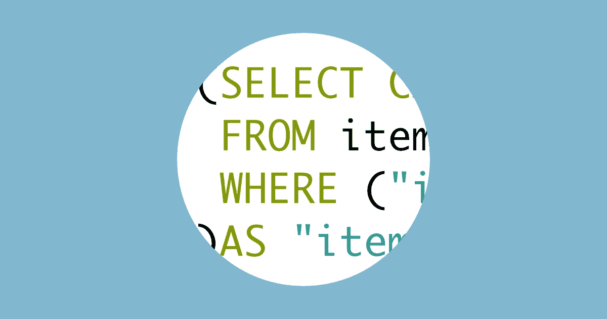

# Squel 序列中子查询

> 原文：<https://itnext.io/sub-queries-in-sequelize-with-squel-edad3bdb64f9?source=collection_archive---------2----------------------->

如果你想在[节点](https://nodejs.org/en/)中处理一个 SQL 数据库，你可能想使用[序列](http://docs.sequelizejs.com/)。

这是一个很好的 ORM，它有一个基于 promise 的 API，可以很容易地:

*   定义模型
*   定义这些模型之间的关系
*   在访问实例时检索这些关系。

但是我发现很难处理实例内部的`COUNT`和`SUM`函数，甚至在[读取问题之后的
，试图找到顺序化方法](https://github.com/sequelize/sequelize/issues/222)却没有成功。没有一样东西对我有用😭

这就是我如何用 SQL 查询生成器 [squel](https://hiddentao.com/squel/) 解决这个问题的故事

*   sequelize API 的一些知识将真正有助于理解本文🤓
*   服务器使用的框架是 [Koa](https://koajs.com/)
*   我已经整理了一个包含工作示例的小知识库

# 数据库

## 模型

我们将有两种型号:

*   篮子
*   项目

**一个篮子会有很多物品**

所以让我们用序列定义我们的模型:

## 例子

我们将需要[来定义我们的实例](https://github.com/Hiswe/sequelize-example/blob/master/index.js#L125-L165):

# 预期结果

*   篮子里的物品数量
*   篮子的总价格

大概是这样的:

# 做这个服务器端

这应该很简单:

*   用他的物品询问篮子
*   处理一切以获得正确的信息

你可以在演示中找到[的等价代码。](https://github.com/Hiswe/sequelize-example/blob/master/router.js#L20-L36)

但这是一项可以在数据库上完成的工作，对吗？所以最好在那里做。

# SQL 子查询

为了在我们的数据库中做到这一点，我们需要 Sequelize 在查询中生成如下内容:

我们可以手动编写，但是我们身边没有 NodeJS，也没有完整的生态系统。

所以让我们使用 squel 来做这件事:用一种更 JS 的方式写 SQL。

# Squel 与 Sequelize 的接口

根据 [Sequelize 文档](http://docs.sequelizejs.com/manual/tutorial/querying.html#attributes)这是我们定义自定义属性的方式:

这里的主要目标是为计算的属性生成正确的查询

# Squel 配置和注意事项

*   我们必须配置 squel 来支持 postgres 数据库
*   即使有很多的[转义选项](https://hiddentao.com/squel/api.html#cls_defaultquerybuilderoptions) **我也没有找到一个涵盖所有用例的**
    Postgres 会因`WHERE (item.basketId = basket.id)`
    而失败→我们应该这样格式化`WHERE ("item"."basketId" = "basket"."id")`
*   用括号将我们的结果括起来，因为 Sequelize 不会为我们这样做
    → `(…our query) AS "itemsCount"`

只要有几个帮手，所有这些都可以很容易地完成:

稍微有些不同的是，这是演示中的[等价代码。](https://github.com/Hiswe/sequelize-example/blob/master/router.js#L42-L52)

我用的是 [Sequelize.static()](http://docs.sequelizejs.com/class/lib/sequelize.js~Sequelize.html#static-method-literal) 但是我不确定有没有必要。它只是防止 Sequelize 对查询字符串进行转义。

# 把东西放在一起

这将是我们的最终代码:

以及演示中的[相关部分](https://github.com/Hiswe/sequelize-example/blob/master/router.js#L54-L85)

# 进一步说明

## 查找我们的 WHERE 查询

我不是 SQL 专家，那么如何编写我们的`WHERE`查询？

*   配置 Sequelize 以在控制台中输出 SQL 查询
*   让 Sequelize 和他的关系取一个模型
*   看看你的日志
*   复制/粘贴有趣的部分

## 构建子查询生成器

编写所有 Squel 代码可能很麻烦。但是我们可以创建一个函数来完成这个任务:

演示中的[相关代码](https://github.com/Hiswe/sequelize-example/blob/master/router.js#L87-L119)

# 结论

Sequelize 是一段非常好的代码。在 95%的时间里，它都会像预期的那样工作。对于另外的 5 %,你可以编写原始的 SQL 查询🤓或者用 squel 来帮你做🤪

通过这样做，我们消除了服务器中处理 Sequelize 结果的负担，这是一个胜利😎

*原载于*[*hiswe . github . io*](https://hiswe.github.io/2018/09-sequelize-subqueries-with-squel/)*。*