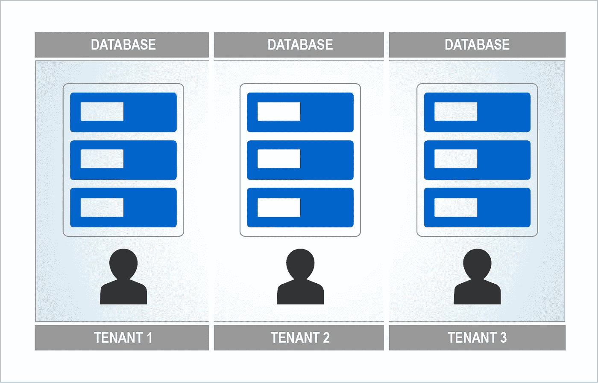

# Ruby On Rails 中的子域或多租户(多租户 SaaS 应用程序)

> 原文：<https://itnext.io/subdomain-or-multi-tenant-in-ruby-on-rails-multi-tenant-saas-app-881d989c8d98?source=collection_archive---------0----------------------->



子域在许多不同的场景中非常有用。例如，假设您正在构建一个多用户应用程序。每个用户都有自己的空间。能够给每个用户一个唯一的子域允许你给用户他们自己的个人空间。

从安全角度来看，这也是非常有益的，因为所有子域都有自己的 DB 模式。所以，如果你没有访问权限，那么你就不能到达其他域。

[*点击这里在 LinkedIn* 上分享这篇文章](https://www.linkedin.com/cws/share?url=https%3A%2F%2Fitnext.io%2Fsubdomain-or-multi-tenant-in-ruby-on-rails-multi-tenant-saas-app-881d989c8d98)

现在让我们实现子域功能。我用 PostgreSQL 做数据库。

以下是以下步骤:

**第一步:在你的 gem 文件中添加下面一行。**

为了实现子域功能，我将使用“公寓”宝石。更多详情，你可以查看下面的网址。

[https://github.com/influitive/apartment](https://github.com/influitive/apartment)

```
gem 'apartment' gem 'devise', '~> 4.2' gem 'devise_invitable', '~> 1.7.1'
```

为设计 gem 实施，请参考下面的文章。
[http://qiita.com/alokrawat050/items/5267e6ab0e274ad1188a](http://qiita.com/alokrawat050/items/5267e6ab0e274ad1188a)

**第二步:**创建一些有用的控制器、模型，比如说账户。

```
rails g controller account new rails g controller welcome index rails g model account new
```

在控制器中写一些代码，
**→accounts _ controller . Rb**

```
class AccountsController < ApplicationController
  skip_before_filter :authenticate_user!, only: [:new, :create]
  def new
    @account = Account.new
    @account.build_owner    
    #store plan id in session
    session[:plan_id] = params[:plan_id]
  end

  def create
    @account = Account.new(accounts_params)
    @account.assign_attributes(:plan_id => session[:plan_id])
    if @account.valid?
      Apartment::Tenant.create(@account.subdomain_name)
      Apartment::Tenant.switch!(@account.subdomain_name)
      if @account.save
        session[:plan_id] = nil
        redirect_to new_user_session_url(subdomain: "#{@account.subdomain_name}.demo-alokrawat050")
      else
        render action: 'new'
      end
    else
      render action: 'new'
    end
  end

  private
    def accounts_params
      params.require(:account).permit(:subdomain_name, owner_attributes: [:username, :is_admin, :email, :password, :password_confirmation, :password_updated_at])
    end 
end
```

**→welcome_controller.rb**

```
class WelcomeController < ApplicationController
  skip_before_filter :authenticate_user!, only: [:index, :find_team, :find_team_index]
  def index
  end

  def find_team
    if params[:team_name].present? && !params[:team_name].nil? && !params[:team_name].blank?
      Apartment::Tenant.switch!('public')
      if search_team(params[:team_name])
        Apartment::Tenant.switch!(params[:team_name])
        redirect_to new_user_session_url(subdomain: "#{params[:team_name]}.demo-alokrawat050")
      else
        flash[:alert] = "Team Not Found."
        redirect_to root_path
      end
    else
      flash[:alert] = "Please Enter the Team Name."
      redirect_to root_path
    end
  end

  def find_team_index
  end

  protected
  def search_team(team_name)
    @account ||= Account.find_by(subdomain_name: team_name)
  end
end
```

**application _ controller . Rb**文件看起来很像，

```
class ApplicationController < ActionController::Base
  # Prevent CSRF attacks by raising an exception.
  # For APIs, you may want to use :null_session instead.
  protect_from_forgery with: :exception

  before_filter :load_schema, :authenticate_user!, :set_mailer_host
  before_filter :configure_permitted_parameters, if: :devise_controller?

  protected
  def configure_permitted_parameters
    devise_parameter_sanitizer.permit(:accept_invitation){|u|
      u.permit(:username, :password, :password_confirmation, :invitation_token, :password_updated_at)
    }
  end

  private
    def load_schema
      Apartment::Tenant.switch!('public')
      return unless get_subdomain_acc.present?

      if current_account
        Apartment::Tenant.switch!(current_account.subdomain_name)
      else
        redirect_to root_url(subdomain: false)
      end
    end

    def current_account
      @current_account ||= Account.find_by(subdomain_name: get_subdomain_acc)
    end

    helper_method :current_account

    def set_mailer_host
      subdomain = current_account ? "#{current_account.subdomain_name}." : ""
      if Rails.env == "production"
        ActionMailer::Base.default_url_options[:host] = "#{subdomain}<your production name>.com"
      elsif Rails.env == "staging"
        ActionMailer::Base.default_url_options[:host] = "#{subdomain}<your staging name>.com"
      else
        ActionMailer::Base.default_url_options[:host] = "#{subdomain}demo-alokrawat050.c9users.io"
      end
    end

    def get_subdomain_acc
      if Rails.env == "production"
        return request.subdomain
      elsif Rails.env == "staging"
        return request.subdomain
      else
        return request.subdomain.gsub!(".demo-alokrawat050","")
      end
    end

    def after_sign_out_path_for(resource_or_scope)
      new_user_session_path
    end

    def after_invite_path_for(resource)
      #invite_users_path
      root_path
    end
end
```

第三步:用助手方法做一些工作。
在 **application_helper.rb 中，**

```
module ApplicationHelper
    def get_subdomain
        return request.subdomain.gsub!(".demo-alokrawat050","")
    end

    def link_to_add_fields(name, f, association)
        new_object = f.object.send(association).klass.new
        id= new_object.object_id
        fields=f.fields_for(association, new_object, child_index: id) do | builder |
            render(association.to_s.singularize + "_fields", f: builder)
        end
        link_to(name, '#', class: "add_fields", data: {id: id, fields: fields.gsub("\n", "")})
    end

    def check_is_admin_rights?
        if current_user.is_admin
          true
        else 
          false
        end
    end
end
```

创建一个新的助手， **form_helper.rb** 和 **layout_helper.rb**

```
module FormHelper
    def errors_for(form, field)
        content_tag(:p, form.object.errors[field].try(:first), class: 'help-block')
    end

    def form_group_for(form, field, opts={}, &block)
        label = opts.fetch(:label) { true }
        has_errors = form.object.errors[field].present?

        content_tag :div, class: "form-group #{'has-error' if has_errors}" do
            concat form.label(field, class: 'control-label') if label
            concat capture(&block)
            concat errors_for(form, field)
        end
    end
endmodule LayoutHelper
    def flash_messages(opts={})
        @layout_flash = opts.fetch(:layout_flash) { true }

        capture do
           flash.each do | name, msg|
              concat content_tag(:div, msg, id: "flash_#{name}") 
           end
        end
    end

    def show_layout_flash?
        @layout_flash.nil? ? true : @layout_flash
    end
end
```

现在是时候做一些验证了。
**account.rb** 型号设置、

```
class Account < ActiveRecord::Base

    RESTRICTED_SUBDOMAIN = %w(www)
    belongs_to :owner, class_name: 'User'
    #validates :owner, presence: true
    accepts_nested_attributes_for :owner, allow_destroy: true

    validates :subdomain_name, presence: true,
                            uniqueness: { case_sensitive: false},
                            format: { with: /\A[\w\-]+\Z/i, message: 'contains invalid characters' },
                            exclusion: {in: RESTRICTED_SUBDOMAIN, message: 'restricted'}

    before_validation :downcase_account

    private
        def downcase_account
            self.subdomain_name = subdomain_name.try(:downcase) 
        end 
end
```

在这里做一些数据库的工作。下面是我的迁移文件:

```
def change
  create_table :accounts do |t|
      t.string :subdomain_name
      t.integer :owner_id
      t.integer :plan_id
      t.string :updated_by
      t.boolean :del_flag, default: false
      t.timestamps null: false
  end
 end
```

现在这里的设计部分，就看你的了。但是我在这里做了一些工作。在视图中，

**/视图/账户/new.html.erb**

```
<% def msg(status) return "#{status}" end %>
<section id="download">
    <div class="container">
        <div class="row">
            <div class="col-md-7 col-md-offset-3 panel panel-default">
                <div class="panel-body">
                    <h2>Create an Acccount</h2>
                    <%= form_for @account do |f| %>
                        <%= f.fields_for :owner do |o| %>
                            <%= form_group_for o, :username, label: false  do %>
                                <div class="input-group">
                                    <span class="input-group-addon"><span class="fa fa-user fa-lg fa-fw"></span></span>
                                    <%= o.text_field :username, class: 'form-control', placeholder: 'UserName' %>
                                </div>
                            <% end %>  
                            <%= form_group_for o, :email, label: false  do %>
                                <div class="input-group">
                                    <span class="input-group-addon"><span class="fa fa-envelope fa-lg fa-fw"></span></span>
                                    <%= o.email_field :email, class: 'form-control', placeholder: 'Email' %>
                                </div>
                            <% end %>  
                            <%= form_group_for o, :password, label: false  do %>
                                <div class="input-group">
                                    <span class="input-group-addon"><span class="fa fa-key fa-lg fa-fw"></span></span>
                                    <%= o.password_field :password, class: 'form-control', placeholder: 'Password' %>
                                </div>
                            <% end %>  
                            <%= form_group_for o, :password_confirmation, label: false  do %>
                                <div class="input-group">
                                    <span class="input-group-addon"><span class="fa fa-key fa-lg fa-fw"></span></span>
                                    <%= o.password_field :password_confirmation, class: 'form-control', placeholder: 'Confirm Password' %>
                                </div>
                            <% end %>

                            <%= o.hidden_field :password_updated_at, :value => Time.zone.now %>
                        <% end %>
                        <%= form_group_for f, :subdomain_name, label: false  do %>
                            <div class="input-group">
                                <%= f.text_field :subdomain_name, class: 'form-control', placeholder: 'Company Name' %>
                                <span class="input-group-addon">
                                    <% if Rails.env == "production" %>
                                        .<your production name>
                                    <% elsif Rails.env == "staging" %>
                                        .<your staging name>
                                    <% else %>
                                        .demo-alokrawat050.c9users.io       
                                    <% end %>
                                </span>
                            </div>
                        <% end %>
                        <%= f.submit("Create Account", class:"btn btn-primary", data: {:confirm => msg('Do you want to create account?'), :disable_with => 'Creating'}) %>
                    <% end %>
                </div>    
            </div>
        </div>
    </div>  
</section>
```

还有**/views/welcome/index . html . erb**

```
<div class="container">
        <div class="row">
            <div class="col-xs-6 col-sm-12 col-lg-6 wow fadeInUp" data-wow-delay="0.6s">
                
            </div>
            <div class="col-xs-12 col-sm-12 col-lg-6 wow fadeInUp templatemo-box" data-wow-delay="0.3s">
                <p>If already joined with us, then please provide the your team name.</p>
                <div class="form-inline">
                    <div class="form-group">
                        <%= form_tag(:action => 'find_team') do |f| %>
                            <%= text_field_tag 'team_name', @team_name, class: "form-control btn-lg", placeholder: "Team Name", style: "height:50px" %>
                            <%= button_tag(type: "submit", class: "btn btn-default") do %>
                                <i class="fa fa-search" aria-hidden="true"></i> Find Team
                            <% end %>
                            <%#= flash_messages layout_flash: false %>
                        <% end %>
                    </div>    
                </div>
            </div>          
        </div>
    </div>
```

现在是时候为你的系统设置路线了。
在 **routes.rb** 文件中，

```
class SubdomainPresent
  def self.matches?(request)
    if Rails.env == "production"
        request.subdomain.present?
    elsif Rails.env == "staging"
      request.subdomain.present?
    else
      request.subdomain.gsub!(".demo-alokrawat050","").present?
      end
  end
end

class SubdomainBlank
  def self.matches?(request)
    if Rails.env == "production"
        request.subdomain.blank?
    elsif Rails.env == "staging"
      request.subdomain.blank?
    else
      request.subdomain.gsub!(".demo-alokrawat050","").blank?
      end
  end
end

Rails.application.routes.draw do
  constraints(SubdomainPresent) do 
    root 'home#index', as: :subdomain_root
    devise_for :users,
    controllers: { invitations: 'users/invitations' }
    resources :invite_users
    resources :users#, only: :index
  end  

  constraints(SubdomainBlank) do 
    root 'welcome#index'
    resources :accounts, only: [:new, :create]
    resources :welcome do
      collection { post :find_team
      get :find_team_index}
    end
  end  
end
```

最后，为公寓宝石做一些设置。
打开 **/config/application.rb** 文件，在下面添加一行。

```
config.middleware.use 'Apartment::Elevators::Subdomain'
```

和**/config/initializer/apartment . Rb**

```
Apartment.configure do |config|
   config.tenant_names = -> { Account.pluck(:subdomain_name) }
   config.excluded_models = ['Account']  
# these models will not be multi-tenanted, but remain in the global (public) namespace
   Apartment::Elevators::Subdomain.excluded_subdomains = ['www', 'demo-alokrawat050', 'admin', 'public']
end
```

我希望这篇文章能帮助你理解，如何实现子域功能或 SAAS 概念。

如果你有任何疑问，请与我分享。

享受编码


**谢谢&最诚挚的问候，
Alok Rawat**

*最初发表于*[](https://qiita.com/alokrawat050/items/ee8aba55a9cccb82368f)**。**