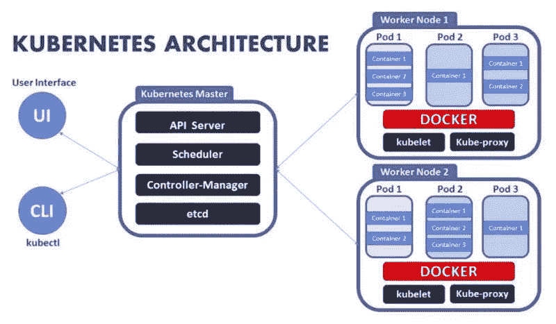
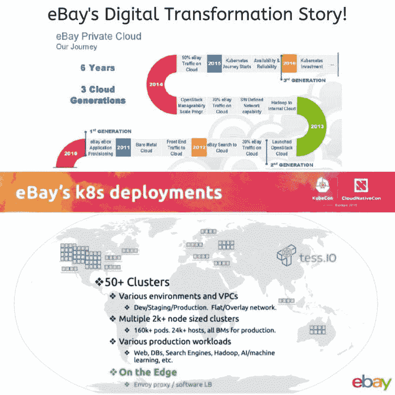

# DevOps 建筑师的成功和简短的 Kubernetes 故事

> 原文：<https://itnext.io/successful-short-kubernetes-stories-for-devops-architects-677f8bfed803?source=collection_archive---------3----------------------->

# Kubernetes 是如何工作的？

在 Kubernetes 中，有一个主节点和多个工作节点，每个工作节点可以处理多个 pod。pod 只是作为一个工作单元聚集在一起的一堆容器。您可以使用 pods 开始设计您的应用程序。一旦您的 pod 准备就绪，您就可以为主节点指定 pod 定义，以及您想要部署多少个。从这一点来说，Kubernetes 是在控制中。它拿起豆荚，把它们部署到工人的节点上。

如果一个工作节点出现故障，Kubernetes 会在一个正常工作的节点上启动新的 pods。这使得管理容器的过程变得容易和简单。它使得构建和添加更多功能以及改进应用程序以获得更高的客户满意度变得容易。最后，无论你投资于什么技术，Kubernetes 都可以帮助你。

图片来源:Knoldus 公司

现在让我们看看一些成功的故事:)

## 一个银行应用程序在生产中运行 Kubernetes 的必读故事

一次肯定你不必太大就能使用 Kubernetes 的旅程。他们通过将庞大的 monolith 应用程序拆分成更小的微服务开始了他们的 CloudNative 之旅。为了提升这些微服务，他们使用了 Ansible、Terraform 和 Jenkins，并将这些微服务作为一个整体进行部署(如图所示)。

然后，他们突然开始遇到一些微服务的扩展问题。所以，他们没有得到任何微服务的好处。因此，他们开始寻找摆脱这种复杂性的方法，将注意力从面向机器的架构转移到面向应用的架构。他们选择 Kubernetes 和 AWS 作为抽象层，而不担心容器在哪里运行，这就是他们能够管理微服务并释放微服务速度的方式。他们还从安全角度选择了 Kubernetes，并指定应用程序应该如何运行。现在，在 Kubernetes 的帮助下，他们正在运行大约 80 多项微服务:)

观看并学习他们是如何做到这一点的视频“以月球的方式运行 Kubernetes”

## Airbnb 的 Kubernetes 故事

Airbnb 从整体架构到微服务架构的转变相当惊人。他们需要横向扩展连续交付，目标是让公司的 1000 名左右的工程师可以使用连续交付，以便他们可以添加新的服务。Airbnb 支持 1000 多名工程师同时为 Kubernetes 配置和部署 250 多项关键服务(平均每天约 500 次部署)。我想让你看看来自 Airbnb 基础设施工程师 Melanie Cebula 的精彩演示

## 为什么易贝选择了库伯内特斯？

每天，易贝处理 3000 亿次数据查询&超过 500 的海量数据。易贝必须移动大量数据并管理流量，在确保用户体验流畅的同时，还要确保一个安全、稳定、足够灵活的环境来鼓励创新。2018 年秋天，该公司宣布他们正在进行一项为期三年的计划，他们称之为“重新平台化”。易贝 90%的云技术依赖于 OpenStack，他们正打算完全抛弃 OpenStack。易贝正在“利用 Kubernetes、Docker 和 Apache Kafka 重新构建平台，这是一个流处理平台，可以提高数据处理能力并减少延迟。

目标是改善用户体验，提高工程师和程序员的工作效率&彻底改造其数据中心基础设施。这种平台再造的其他活动包括设计他们自己的定制服务器，并为他们的数据中心推出一种新的分散策略。像脸书和微软一样，易贝也依靠开源来设计他们的定制服务器。如此鼓舞人心的案例研究。你怎么想呢?

## Amadeus 的电梯和转移到 Kubernetes。一个鼓舞人心的 CloudNative 故事。阅读…..

Amadeus 有两个选择:要么浇筑更多混凝土并扩展数据中心，要么将工作负载转移到云&这使他们选择了谷歌云。因此，在 18 个月内，Amadeus 将他们最关键的应用程序之一“主定价器”升级并转移到了谷歌云平台上。

现在你知道，他们的下一步是转移到 Kubernetes，因为它对谷歌云平台更有意义。目标是，他们想让 Kubernetes 走得更快，挑战是在整个团队中增加学习 Kubernetes 的纪律政策。因此，Amadeus 的团队开始学习如何操作 Kubernetes 以及如何监控它，发出警报。在迁移过程中，Amadeus 有来自 Google 和 Red Hat 的工程师在现场帮助他们掌握 OpenShift 和容器编排技术 Kubernetes。Amadeus 的总体目标是将所有生产工作负载转移到 Kubernetes 的单一运营模式上运行。该公司现在觉得自己做了正确的选择。

下面的学分，

 [## Kubernetes 遇到了现实世界

### 自从五年前出现在谷歌的大厅里以来，Kubernetes 已经迅速成为热门的…

www.infoworld.com](https://www.infoworld.com/article/3455244/kubernetes-meets-the-real-world.html)  [## Amadeus 为何将其核心 Master Pricer 应用程序迁移到 Google Cloud

### 西班牙旅游科技巨头 Amadeus 已经移动了其核心的 Pricer 旅游搜索应用程序——该应用程序支持…

www.computerworld.com](https://www.computerworld.com/article/3428058/why-amadeus-moved-its-core-master-pricer-application-to-google-cloud.html) 

## 彭博是首批采用 Kubernetes 的公司之一

他们在 2017 年将 Kubernetes 投入生产。其目的是尽可能快地向用户提供新的应用程序和服务，并将开发人员从操作任务中解放出来。在评估了来自不同公司的许多产品后，他们选择了 Kubernetes，因为他们认为这与他们试图解决的问题完全一致。彭博的主要目标之一是利用 Kubernetes 的不同功能更好地利用现有的硬件投资。结果，他们能够非常高效地使用硬件，达到接近 90%到 95%的利用率(据彭博计算基础架构团队负责人安德烈·雷布卡所说)。Kubernetes 让许多事情变得更简单，只要你知道如何使用它。由于开发人员最初发现使用起来很有挑战性，团队在彭博有许多围绕 Kubernetes 的培训项目。

## 了解英国新闻如何利用 Kubernetes 的力量在云原生世界中拯救自己

News UK 的关键目标是更好地围绕突发新闻事件&不可预测的读者量来扩展其环境。他们认为虚拟机可以帮助他们，但很快他们意识到虚拟机需要很长时间才能启动，当流量激增时，为自动扩展组带来新容量的速度不够快(这是英国新闻的前云开发工程师 Marcin Cuber 所说的)，他们采用了 Docker 和 Kubernetes。在 Kubernetes 中运行的 Docker 容器更小、更轻量级，它们可以根据需要轻松地扩展或缩小。

Cuber 还对任何希望采用 Docker 和 Kubernetes 的组织提出了一些建议。

*   让你的 Docker 镜像尽可能的小，并且专注于用 Kubernetes 运行无状态应用。
*   为您的应用程序运行健康检查，并使用 YAML 来部署任何东西。英国新闻还希望削减云成本，因此他们将 EKS 集群与 AWS spot 实例配对，他们还使用 AWS Lambda 来高效地工作。

## 奖励— Kubernetes 资源

这份名单应该涵盖整个该死的事情在地球上关于 Kubernetes。

*1。豆荚游戏是在 Kubernetes* 上进行的一系列免费的有趣和富有挑战性的游戏

 [## 豆荚游戏- Kubernetes

### 你好。我叫 Vijin Palazhi，是 KodeKloud 的一名培训建筑师。我在…方面有超过 12 年的经验

bit.ly](http://bit.ly/2QPPixZ) 

*2。深入了解这个用于管理容器化应用程序的强大系统*

 [## Kubernetes (LFS158)简介- Linux 基础-培训

### 想学 Kubernetes？深入了解这个用于管理容器化应用程序的强大系统。是…

bit.ly](http://bit.ly/34ipRt4) 

*3。获得容器编排的实践经验*

 [## IBM 认知课程的无云 Kubernetes 课程上的 Kubernetes 和容器

### 如果您已经使用过 Docker 容器，并且希望获得容器编排的实践经验…

bit.ly](http://bit.ly/33dm4f7) 

*4。OpenShift 团队对 Kubernetes 的实际介绍*

 [## Kubernetes 举例

### 这是对 Kubernetes 的实际介绍。浏览示例:pod 标签部署服务服务发现…

bit.ly](http://bit.ly/34fMuhC) 

*5。熟悉 Kubernetes 的概念—完整课程*

*6。采用 Kubernetes 的可扩展微服务*

 [## Kubernetes | Udacity 的可扩展微服务

### 本课程旨在教你如何使用 Kubernetes 管理应用程序容器。我们建立了这个课程…

bit.ly](http://bit.ly/2KS2kr0) 

*7。贾纳基拉姆·MSV 的 Kubernetes 网络研讨会*

*8。Google Kubernetes 引擎入门*

 [## Google Kubernetes 引擎入门| Coursera

### 本服务条款协议(“协议”)以及位于 qwiklab.com/privacy_policy…的隐私政策

bit.ly](http://bit.ly/2XNcVZB) 

*9。优秀 Kubernetes 资源的精选列表*

 [## 太棒了-库伯内特斯

### 由@sindresorhus 的“天才赢得游戏，但团队合作和……”激发的令人敬畏的 kubernetes 资源的策划列表

bit.ly](http://bit.ly/2XL5ZMt) 

此外，请下载这份白皮书，它可以帮助您了解 Kubernetes 将容器投入生产的最佳实践。

 [## 将容器化应用程序带到 K8S 的技巧、诀窍和教训

### Kubernetes 与 JFrog Artifactory 一起允许您可靠地、可预测地部署您的应用程序，扩展它们…

jfrog.com](https://jfrog.com/blog/white-paper-the-jfrog-journey-to-kubernetes-best-practices-for-taking-your-containers-all-the-way-to-production/) 

好吧，这篇文章也可以帮助你提高你的 DevOps 学习，看看下面，

 [## 2019 年我的 DevOps 学习。分享你的:)

### DevOps 不是一个个人的角色，它是一个团队的努力。您的基础架构应该能够处理失败的部署…

开发到](https://dev.to/pavanbelagatti/my-devops-learnings-in-2019-share-yours-55k7) 

我每天在我的 LinkedIn feed 上分享一个故事，让我们在 [LinkedIn](http://www.linkedin.com/in/pavan-belagatti-growthmarketer) 上联系。

谢谢大家！