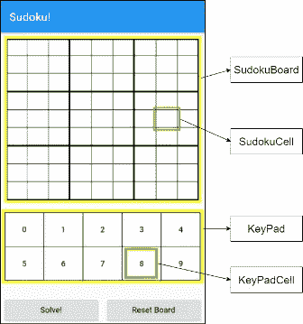
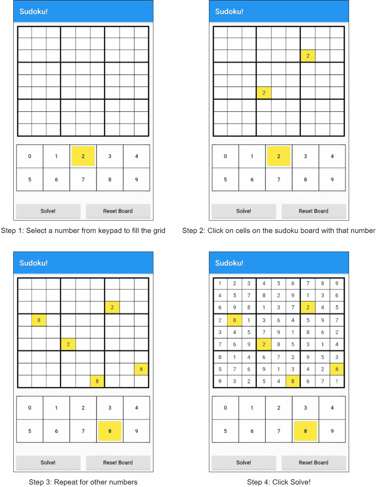
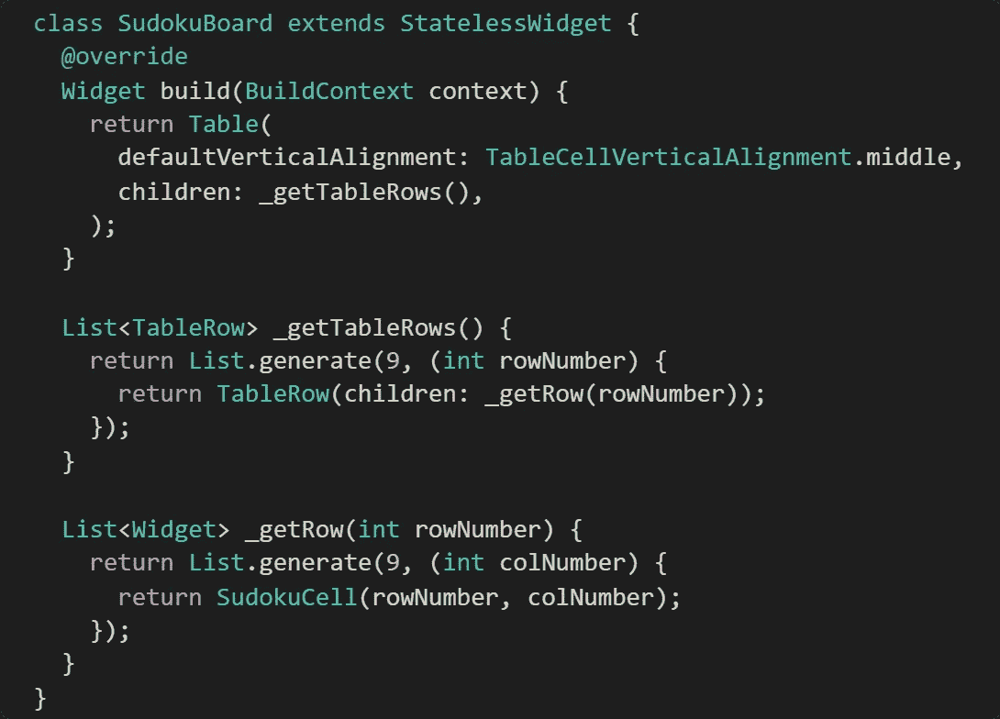
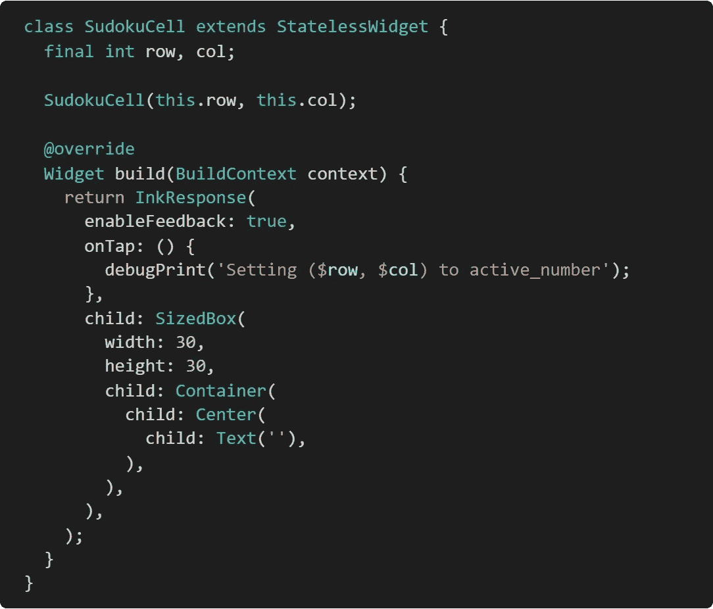
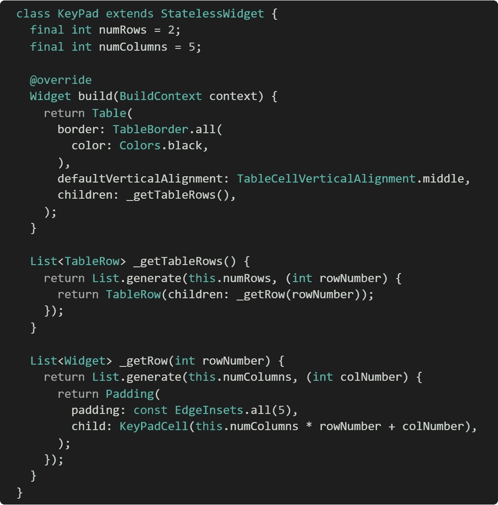
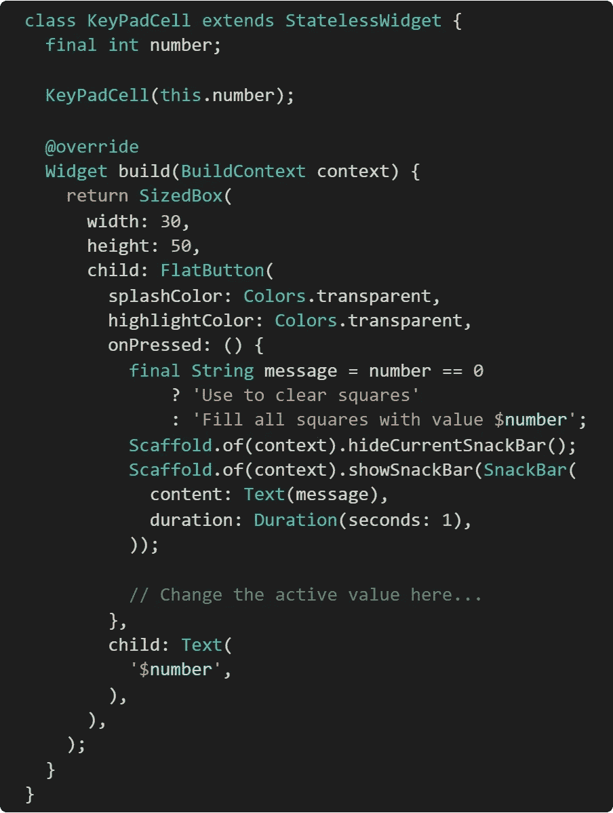
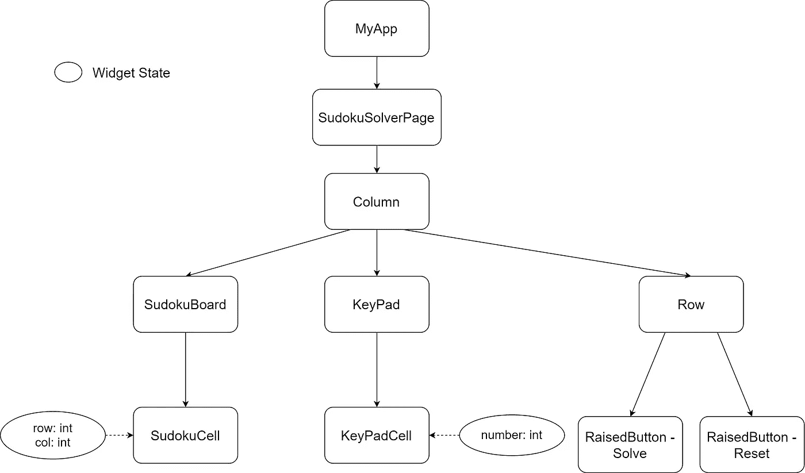
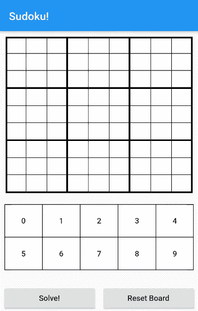

# 颤振中的数独解算器——通过实例理解颤振状态管理——第一部分

> 原文：<https://itnext.io/sudoku-solver-in-flutter-understanding-flutter-state-management-by-example-part-1-6977c4f4e48f?source=collection_archive---------4----------------------->

> **警告:**这些“系列”文章假设对 flutter 有一个基本的了解，而不是一个教程(flutter [文档](http://www.flutter.dev)对此很有用)，这更多的是我作为初学者对 Flutter 的探索——小部件、布局、一些设计概念，以及主要是关于状态管理的东西。
> 
> PS:这篇文章比我想象的要长！—所以拆分多篇文章！

嘿伙计们！

我遇到了 flutter，它所提供的东西给我留下了深刻的印象——在多个平台上构建应用程序的单一框架！所以思想会探索它。

浏览了一些教程，阅读了 Dart(非常简单)，在 flutter 上构建了一个示例应用程序，并且对 flutter 概念有了基本的了解——flutter CLI、小部件(有状态和无状态)、小部件树、基本布局等。

在熟悉了 flutter 之后，我开始构建一个实际的应用程序——这难道不是重点吗！

花了一个周末在 Flutter 中构建了一个基本的应用程序，遇到了很多概念，只是不得不分享一下。

这篇文章分为 4 篇，如果你对某个特定的概念感兴趣——向前跳！—

**第一部分**:简介——讨论布局、部件、功能和共享状态。

[**第 2 部分**](https://medium.com/@nikhilheda96/sudoku-solver-in-flutter-understanding-flutter-state-management-by-example-part-2-4ef78fe5d815) :使用基本的有状态部件进行状态管理。

[**第 3 部分**](https://medium.com/@nikhilheda96/sudoku-solver-in-flutter-understanding-flutter-state-management-by-example-part-3-d9486e94f8c5) :使用继承的小部件管理状态

[**第四部分**](https://medium.com/@nikhilheda96/sudoku-solver-in-flutter-understanding-flutter-state-management-by-example-part-4-53b01bc1f924) :提供商！

# 应用程序

我们将建立一个数独解算器(我已经在 Android 中建立了这个——Java/XML/自定义 drawables/adapters 和所有那些“棒极了”的东西🙂).很高兴地说，flutter 非常神奇，我花了大约一周时间在 Android 上开发的应用程序，在 Flutter 上只花了几天时间。

# 它是做什么的？

它做到了它所说的——它解决了数独难题！首先，我们的数独求解器有以下组件:

1.  数独板——数独单元的网格
2.  数独单元格-带有数字/空白的单元格
3.  键盘—选择要填入纸板的数字。

# 基本用户交互

> 我使用了我的最终应用程序的快照，其中包括更多的布局调整，不在本文中讨论。

很简单。我们开始吧。

# 布局和部件！

我们需要做的第一件事是建立一个基本的布局——外观和感觉。一个虚拟的应用程序，没有功能，但侧重于布局设计。

数独板小工具

## 数独板

最明显的小部件是 GridView 小部件。它看起来不错，网格视图唯一的特点是它是可滚动的，这几乎不是你在数独网格中想要的功能。输入…表格！

表格相当不错，没有滚动，可以控制边框，数值，单元格布局等。所以赢家！

SudokuCell 部件

## 数独细胞

这不需要特定的布局，只需继续使用容器小部件。

需要一个单击处理程序(因为单元格将被单击以将值设置为从键盘中选择的某个数字)，所以只需将此小部件包装在 InkResponse 小部件周围。

另外，捕获行号和列号可能会有所帮助。

键盘部件

## 键座

很简单，需要一个由 10 个数字组成的网格(0 到 9，用 0 做橡皮擦)。

网格视图没有帮助，再次使用表格部件。

KeyPadCell 小部件

## 键盘单元

单元格作为平面按钮，因为我想注册点击处理程序。

此外，获取与该单元格相关联的数字。

布局差不多就是这样。

## 小部件树

让我们看看部件树，这会让我们更好地理解部件之间的关系。

## 最终屏幕

我玩了更多的布局

1.  添加了行、列和填充，以获得更好的对齐和间距。
2.  添加了表格边框和单元格边框——这需要一点逻辑来处理细边框和粗边框。不是火箭科学。
3.  增加了求解和重置按钮。

不涉及细节——这里没有什么令人兴奋的，只是与“不那么方便”的原始 android xml 布局相比，它非常容易。如果你们想让我详细说明布局设计，请告诉我！

# 功能性！

这是在 Flutter 中测试基本状态管理的一个非常好的候选，因为在这个应用程序中到处都有状态—

1.  处理小部件中的状态(数独单元/数独板)
2.  状态影响其他部件的状态(键盘数字影响数独单元的状态)
3.  由于与业务逻辑(解决难题的逻辑)的交互而导致的状态变化。

有效地处理状态在这里是必不可少的，所以让我们开始吧。

# 处理共享状态！

> 我将详细说明这一部分，因为这是令人兴奋的东西！

所以我经历了很多令人沮丧的方法来让它工作，学习了很多关于应用程序设计的知识(可悲的是，框架不能为你做这些！)

在处理共享状态时，两个问题非常重要—

1.  什么是共享状态？
2.  哪里/谁应该负责它，以实现简单的交互？

## 什么是共享状态？

在我们的应用程序中有两件事是共享的:

1.  **数独棋盘**:一个二维数组，用来记录棋盘状态。这将被*数独单元*小工具读取和修改。
2.  **有效数字**:记录要写入板上的数字。该值由 *KeyPadCell* 写入，由 *SudokuCell* 读取。

这是所有方法的共同点。这就是**共享状态**。

这是谁的责任？—我将回顾我在这个系列中尝试的设计，并以不同的方式回答这个问题。

# 应用程序中的其他内容，不包括在这篇文章中

## 布局调整

1.  添加边框/表格边框，使网格看起来像数独板。
2.  突出显示颜色—突出显示键盘上的选定数字和数独单元格上的填充数字。
3.  验证-验证部分填充的板是否是有效的数独游戏。

## 数独求解逻辑！

用于解决部分填充的数独难题的逻辑！

如果你想让我详细说明这个应用程序的这些方面，请告诉我！很乐意在另一篇文章上分享！

# 该系列！

1.  [简介](https://medium.com/@nikhilheda96/sudoku-solver-in-flutter-understanding-flutter-state-management-by-example-part-1-6977c4f4e48f)
2.  [设计 1——为什么有状态窗口小部件不是一个好主意](https://medium.com/@nikhilheda96/sudoku-solver-in-flutter-understanding-flutter-state-management-by-example-part-2-4ef78fe5d815)
3.  [设计 2 —使用继承的宽度](https://medium.com/@nikhilheda96/sudoku-solver-in-flutter-understanding-flutter-state-management-by-example-part-3-d9486e94f8c5)
4.  [设计 3——使用供应商！](https://medium.com/@nikhilheda96/sudoku-solver-in-flutter-understanding-flutter-state-management-by-example-part-4-53b01bc1f924)

**最终代码**:[https://github.com/NikhilHeda/SudokuSolver](https://github.com/NikhilHeda/SudokuSolver)