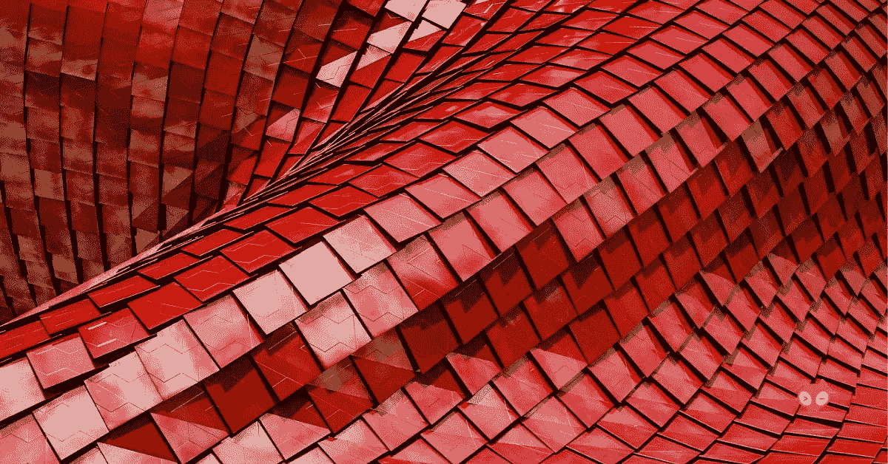
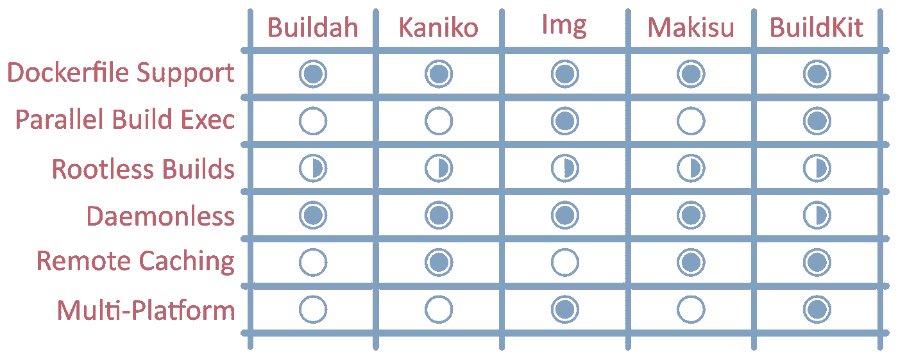

# 总结:容器形象塑造

> 原文：<https://itnext.io/summing-up-container-image-building-7287472d61c4?source=collection_archive---------9----------------------->

当我们在这个系列下为容器图像构建的艺术状态划上一条线时，值得花点时间来思考我们的发现。

与早期因 Docker 而流行的集装箱化趋势相比，在集装箱形象建设游戏中有更多的玩家。我们当然没有全部看过！

然而，每个工具的存在都是由于 Docker 提供的原始容器构建经验的不足。每一个都有独特的角度，无论是商业的还是技术的。

**你知道吗？我们上** [**中**](https://medium.com/@GiantSwarm) **也是！** [**关注我们**](https://medium.com/@GiantSwarm) **千万不要错过这样的资讯文章。**

# Dockerfile 文件支持

特别有趣的是，每个工具仍然支持(如果不支持的话，提升)Dockerfile 作为描述容器图像的声明性方式。

这证明了“docker build”体验所提供的简单性、官方 docker 图像的流行性，以及以这种方式构建的容器图像的普遍性。当然，还有其他不使用 Dockerfile 的方法，但是 Dockerfile 似乎还会存在一段时间。

# 无根建筑

越来越多的人将 Kubernetes 作为容器工作负载的家，这对构建映像的方向有很大的影响。

在 pod 中安装 Docker 插座，或者运行特权构建容器( [DinD](https://jpetazzo.github.io/2015/09/03/do-not-use-docker-in-docker-for-ci/) )提供了不太理想的体验。尤其是对于那些需要强大安全姿态的人。今天，无根和无特权的构建是可能的，但是需要在宿主环境中进行一些次优的配置或调整。为了达到当前的状态，需要坚持不懈地将更改合并到 Linux 内核、Docker 引擎和 Kubernetes 中。然而，要使这一进程真正安全，不需要不必要的特权，还有更多的工作要做。

# 无梦的

Kubernetes 中的容器映像构建也推动了无后台构建的进步，对 Docker 后台程序的依赖慢慢成为过去。

本系列中考虑的所有工具都是无守护进程的，尽管 BuildKit 必须作为一个[短暂的](https://github.com/moby/buildkit/blob/master/examples/buildctl-daemonless/buildctl-daemonless.sh)守护进程运行才能达到同样的效果。

# 减少构建时间

开发人员在应用程序开发过程中不断寻找加速容器映像构建的方法。

BuildKit 凭借其并发依赖性解决方案轻而易举地胜出，与竞争对手相比，其性能令人印象深刻。然而，最佳的构建缓存使用也是构建持续时间的一个关键因素。远程和分布式构建缓存技术正变得越来越重要，尤其是当不清楚构建任务将在哪个主机上结束时。在大多数新的映像构建工具中，这是一个备受关注的领域。

# 结构

最后，虽然大多数应用面向 x86_64 架构，但随着边缘计算等范例的采用增加(由物联网推动)，映像构建需要适应不同的 CPU 架构。BuildKit(和隐含的 Img)为跨平台图像提供了一些支持，但是其他工具还有一些工作要做。

# 结论

自从 Docker 引擎提供早期构建体验以来，容器映像构建已经走过了漫长的道路。

虽然在集装箱化的显著增长期间，进步停滞了一段时间，但是云原生社区已经加快步伐并开始创新，以修复许多缺陷。它带来了多种解决方案，源自云环境的不同角落。在某个时候，我们可能会担心工作和方法的分散。但是，不同的解决方案将适合不同的组织和不同的使用情形。而且，作为容器图像的消费者，使用哪种工具来构建特定的图像并不重要。只要构建的映像符合 [OCI 映像规范](https://github.com/opencontainers/image-spec/blob/master/spec.md#image-format-specification)，派生的容器总是会以我们期望的方式运行。

几年后回到这个话题，看看事情是如何变化的，将会很有趣。但是，与此同时，享受构建您的容器图像，并且不要忘记回馈社区！给我们发推特 [@giantswarm](https://twitter.com/giantswarm) ，让我们知道你的想法。

由[Puja Abbas si](https://twitter.com/puja108)——开发者倡导者@ [巨型群体](https://giantswarm.io/)撰写

 [## Puja Abbassi

### Puja Abbassi 的最新推文(@puja108)。开发者关系&产品@ GiantSwarm 研究员；主题…

twitter.com](https://twitter.com/puja108)