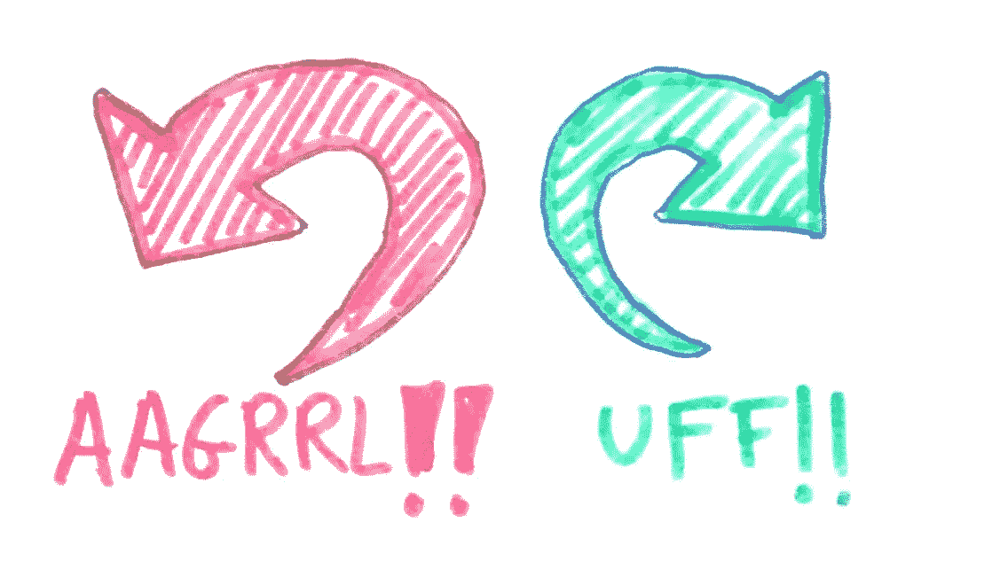

# 增压舵

> 原文：<https://itnext.io/supercharging-helm-e0c69737a2d1?source=collection_archive---------4----------------------->

## 调整你的舵练习


如果你认真对待 Kubernetes，我打赌你用的是 Helm。这是显而易见的。一致性，额外的功能和一个伟大的 CLI，都包装在一个非常有用的软件包。开箱即用，头盔是非常注重功能，你会看到几乎立即受益。

然而，还是有一些问题。与许多 Kubernetes 工具一样，Helm 在默认情况下是不安全的。它将安装其服务器端组件 Tiller，拥有几乎无限的权力。这对恶意参与者来说是一个相当严重的攻击媒介。

在本文中，我将首先讨论降低 Tiller 给集群带来的风险的方法。其次，我将提供一些 helm 提供的技巧和鲜为人知的功能。让我们开始吧。

# 舵柄


蒂勒有现成的神力

舵柄是舵的问题。如果它坏了，被泄露了或者被删除了，你就有麻烦了。这就是头盔 3 中的[被移除的原因。然而，当我们被头盔 2 困住时，我们并不是完全无助的。](https://helm.sh/blog/helm-3-preview-pt2/)

## 名称空间特定的 Tiller

我们的第一个缓解措施是为一个名称空间安装一个 Tiller。这极大地限制了缺口的爆炸半径。你是怎么做到的？首先，蒂勒需要一个服务账户。如果你不熟悉 Kubernetes 中的`ServiceAccount`资源，你可以在这里[阅读。](https://kubernetes.io/docs/tasks/configure-pod-container/configure-service-account/)

## **配置 RBAC**

Tiller 将需要您的名称空间中的大量权限。要向服务帐户添加权限，您首先需要一个`Role`。

```
kind: Role
apiVersion: rbac.authorization.k8s.io/v1
metadata:  
  name: tiller-role 
  namespace: my-namespace
      rules:
      - apiGroups: ["", "extensions", "apps"]  
        resources: ["*"]  
        verbs: ["*"]
```

正如你所看到的，这个`Role`被允许做它想做的任何事情，但是*只允许在`my-namespace` *命名空间中做*。所以现在我们有了自己的角色，我们需要自己的`ServiceAccount`。这个很简单。*

```
apiVersion: v1
kind: ServiceAccount
metadata:
  name: tiller-service-account
  namespace: my-namespace
```

最后，你需要一点胶水。此刻你的`Role`和你的`ServiceAccount`是断开的。你需要一些东西把两者结合在一起。这是以`RoleBinding`的形式出现的。

```
kind: RoleBinding
apiVersion: rbac.authorization.k8s.io/v1
metadata:
  name: tiller-role-binding
  namespace: my-namespace
subjects:
- kind: ServiceAccount  
  name: tiller-service-account
  namespace: my-namespace
  roleRef:  
    kind: Role  
    name: tiller-role 
    apiGroup: rbac.authorization.k8s.io
```

所以我们创建了一个服务帐户，它可以做任何它想做的事情，但是只能在名称空间`my-namespace`中。我们如何告诉赫尔姆使用这个？好了，CLI 已经为您准备好了。

```
helm init --service-account tiller-service-account --tiller-namespace my-namespace
```

就是这样！您的 tiller 将非常适合部署到该名称空间中。如果遭到破坏，它会对您的名称空间造成严重破坏，但这不是集群范围的破坏(假设 RBAC 安全性没有漏洞……)。

## 没有舵柄

凯尔西·海塔尔[说得很漂亮。](https://github.com/kelseyhightower/nocode)

```
No code is the best way to write secure and reliable applications. Write nothing; deploy nowhere.
```

只是不要使用舵柄。这很容易做到，并且需要尽可能少的配置。

```
helm init --client-only
```

然而，在《头盔 2》中，这意味着你将无法使用一些我们将在本文后面介绍的更棒的功能。你需要使用`helm template`来安装你的 yaml，但是你仍然可以得到 Helm 提供的 [DRY](https://dzone.com/articles/software-design-principles-dry-and-kiss) 的好处。

## 等待 3 号舵

很多人选择在头盔 3 发布之前不使用头盔。正如我前面提到的，Helm 3 没有任何舵柄，只是直接与 k8s 资源如`ConfigMap`和`Secret`接口，以跟踪你的发布。

头盔 3 被大大简化了，但是[保留了很多你在头盔 2 中可能已经习惯的功能。测试版最近已经发布，所以生产版即将发布。如果你能等待，这可能是明智的。](https://medium.com/better-programming/helm-3-fun-with-the-new-beta-8f91c70891ff)

# 舵尖

Helm CLI 附带了一系列出色的小功能和陷阱。这些都有很好的证明，但是我很少在同一个地方发现它们。在这一节中，我的目的是给你一些好的提示，以避免我陷入的同样的陷阱。

## 支持头盔升级胜过头盔安装

通常，我们可能会运行这样的东西…

```
helm install -f my-values.yaml ./path/to/my/chart --name something
```

这是在您的 Kubernetes 集群中安装某些东西的好方法，但是如果您再次尝试运行它会发生什么呢？一个错误，就是这样！那是因为`helm install`也不会运行升级。为此，我们有了`helm upgrade`。唉，什么都没装就跑不了`helm upgrade`！或者……可以吗？

```
helm upgrade something ./path/to/my/chart -f my-values.yaml --install
```

当您运行这个命令时，如果不存在任何东西，它会自动为您安装。这对于 CI/CD 管道非常有用，因为您不需要在第一次安装时一直手动安装。只需运行并重新运行，次数不限！

## 通过原子升级实现自动回滚



我在使用舵命令时发出的声音。

几个月前，helm 在他们的 cli 中添加了一个新标志:`--atomic`。如果你的升级失败，这个标志将自动运行一个舵回滚。这很棒，有几个原因。

*   如果你的首次展示失败了，你想尽快回到 100%工作状态。
*   如果你让你的部署处于`FAILED`状态，赫尔姆的行为可能[不可预测](https://github.com/helm/helm/issues/1193)。`--atomic`将确保您的应用程序始终处于`DEPLOYED`状态。

所以我们的命令看起来有点像这样:

```
helm upgrade something ./path/to/my/chart -f my-values.yaml --install --atomic
```

## 舵试验

头盔中的测试没有被充分利用。此功能允许您确保应用程序正确运行。它可以是任何东西，从简单的冒烟测试到一套全面的端到端测试。

一些人认为这是一种混合的担忧。我们的包装经理也应该是我们的烟雾测试员吗？如果你是粉丝，这个功能是有的，如果你不感兴趣，它是可选的。使用它很简单，为了不重复我自己，我将简单地[提供一个链接](https://github.com/helm/helm/blob/master/docs/chart_tests.md)到 github 上优秀的 helm 文档。

# 掌舵离开！

Helm 提供了一些很棒的功能，如果使用得当，它是任何成功的 kubernetes 操作的基石。

我经常在 twitter 上谈论 Kubernetes、DevOps 和良好的工程实践。