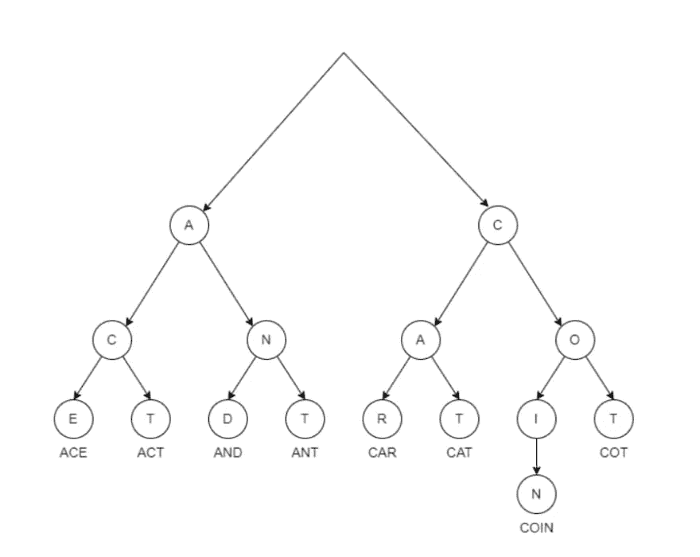
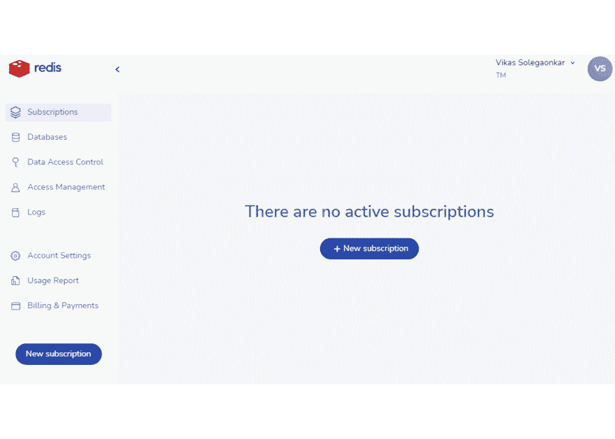
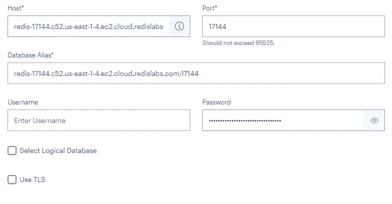

# 带重复搜索的超快速搜索

> 原文：<https://itnext.io/superfast-search-with-redisearch-b80be3672070?source=collection_archive---------0----------------------->


再研究

搜索对所有应用程序来说都是越来越必要的。随着数据以高容量和高速度积累，我们数据管道的其余部分必须能够从这些数据中提取正确的信息和见解。搜索是实现这一目标的主要工具之一。

尽管有了多媒体革命，我们收集的许多数据都是文本形式的。这可以由社交媒体源、网络爬虫摘录、消费者评论、医疗报告、流地理位置更新等等产生。基于区分大小写的精确字符串匹配进行搜索的时代已经一去不复返了。我们需要一个能够大规模管理文本的系统来处理这些数据。我们需要对文本进行超高速模糊查询。

RediSearch 为这样的需求提供了一个极好的解决方案。通过重新搜索，我们可以处理流数据以及静态数据。模糊文本搜索是一个基本功能。除此之外，RediSearch 支持对数字和地理位置数据进行复杂的搜索。当然，我们可以认为基本的标签搜索是理所当然的。

这个博客涵盖了再搜索的核心概念，以及演示这个概念的代码片段。

# 核心概念

仅有语法是不够的。为了充分利用任何工具，如果我们了解它是如何工作的，会有所帮助。有了这样的认识，我们就能很快掌握语法，并有效地运用它。记住这一点，让我们从支持再研究的一些核心概念和技术开始。

# 倒排索引

再研究是基于倒排索引的概念。以防我们忘记，Redis 是一家 NoSQL 的关键/价值商店。我们没有任何模式约束。因此，所有的关系概念都可以放在一边。

Redis 需要一种不同的方法来加速搜索。它为数据中出现的所有内容维护一个“倒排索引”。这意味着，对于我们添加到 RedisDB 的每个索引实体，RediSearch 提取所有单个值，并将条目添加到索引结构中。这些条目包含将可搜索值映射到原始键的反向映射(因此，它被称为反向索引)。因此，我们可以将数据中的任何实体映射到 Redis DB 中该对象的键。

高效搜索有两个步骤。第一步是识别用户试图搜索的值。识别了值之后，第二步是获取引用包含我们识别的值的对象的键。倒排索引帮助我们完成第二步。一旦我们确定了用户想要搜索的值，我们就可以毫无延迟地跳到关键点。现在让我们检查第一步。

# 速度背后的秘密

Trie(数字搜索树/前缀树)是一种能够在大型数据集上实现快速检索的数据结构。术语“trie”来自短语“Information Re* *trie* *val”。简而言之，trie 将文本数据组织成由前缀构建的树。那是什么意思？



单词查找树

顾名思义，前缀树构建了一个前缀树。这是什么意思？任何字符串都可以被视为前缀序列。如果我们使用这样的前缀树来索引文本语料库，我们可以通过直接遍历树来定位任何节点——而不是通过计数或扫描。因此，定位任何单词的时间复杂度与数据量无关。同时，吸收新数据的复杂性也很低。

这使得对大量数据进行可扩展的超高速搜索成为可能。

“再研究”更进了一步。该树不需要用直接从原始文本中提取的单个字符来实现。我们在构建前缀树的时候可以更聪明。它可以使用从文本中提取的引理来构建。当我们创建这样的索引时，我们可以在海量数据上实现超高速模糊搜索。这就是重新搜索文本查询效率背后的秘密。有关实现模糊搜索的更多信息，请参考这篇维基百科文章。

# 标签索引

标签搜索意味着比全功能文本搜索更快。当我们知道字段包含我们直接查询的特定文本时，我们使用标签索引。我们在不需要模糊搜索的领域使用它。标签搜索可以提供更简单的索引。

# 数字索引

RediSearch 为数字数据定义了一个唯一的索引结构。数值查询通常基于计算范围。基于不同值的索引对此类查询没有帮助。我们需要更好的东西。我们不应该将每个数字视为一个独立的实体，而应该以一种识别数字与其值的关系的方式来索引它们。

RediSearch 通过创建基于二进制范围树的数字索引来实现这一点。这种指数将相互接近的数字组合在一起。因此，在数字索引树中，这样的组存储在“范围节点”上，而不是每个节点一个数字。这说起来容易做起来难。我们如何确定一个节点的大小？对于可以装进一个节点的数字，我们如何定义接近度的阈值？RediSearch 有一个自适应算法，可以实现这种分组和将数字分类到组中。

# 地理索引

多年来，移动电话/物联网设备及其地理位置已经成为流入我们数据库的数据的重要组成部分。它是数据分析的重要组成部分。随着地理空间数据负载的增加，地理空间查询的性能是数据库性能的重要组成部分。自然，再研究尽最大努力解决这个领域。

RediSearch 基于点与点之间的接近程度进行地理索引。这种接近度是基于地理空间查询计算的距离来识别的。然后将这些点收集到范围树中，以便进行快速搜索和分组。

# 得分

一个搜索查询可能会返回几个结果。我们不想用大量的数据淹没客户。根据分数对数据进行排序是有意义的，这样客户机就可以选择比结果集的其余部分更相关的内容。

评分不同于排序。排序基于字段内容的绝对值。分数衡量搜索结果的每个值的相关性。这种评分的准确性和灵活性是提高搜索效率的重要因素。

通过重新搜索，可以使用重新搜索中的预定义函数或提高部分结果分数的自定义函数来计算这些分数。

# 设置

你的手指是否渴望键入一些代码？我们快到了！现在让我们着手建立 Redis 所需的数据库和工具。

# 安装 Redis

不要安装！

我们用安装在笔记本电脑上的数据库开发和测试代码的日子已经一去不复返了。欢迎来到云端。有了 Redis 云账户，你只需要点击几下，免费的数据库实例就准备好了。为什么要把你的笔记本电脑弄得乱七八糟？



1.  跳转到 [Redis 云](https://redis.info/3NBGJRT)。如果您没有帐户，请在一分钟内创建一个。
2.  如果你不想记住太多密码，注册 Google/GitHub。
3.  登录后，单击创建订阅。然后接受所有默认设置，创建一个新的免费订阅。你可以选择你喜欢的云和地区。我更喜欢使用 AWS，托管在 us-east-1 地区。
4.  订阅后，单击“新建数据库”创建一个新的数据库实例。
5.  再次接受所有默认设置，并单击“Activate database”来激活数据库实例。
6.  给它几分钟来设置。而在那里，数据库正等着你开始学习。只需记下数据库 URL。
7.  另外，请注意数据库密码。复制到记事本。然后注销 web 控制台。

# Redis 洞察

这是使用 Redis 的必备工具。你可以从[这个链接](https://redis.info/3wMR7PR)下载。安装和设置很简单。单击 ADD REDIS DATABASE 配置新的连接，并提供您在上述步骤中选择的数据库详细信息。



# 给我看代码

你是不是理论过量了？现在让我们尝试一些可以帮助我们应用一些概念的代码。我们将浏览一些代码片段，并构建一个使用 RediSearch 的 API。这个例子着重于文本搜索。Redis 为我们提供了一个简单的命令行界面，以及用大多数通用语言编写的有用的 SDK 模块。

我们将构建一个 JavaScript 应用程序，它使用[节点 Redis](https://redis.js.org/) 模块与 Redis 服务器通信。除了 JavaScript 代码，我们还可以看到相应的 CLI 命令。

我们需要一个文本丰富的数据集保存在我们的数据库中，并展示搜索功能。为此，我们将使用从 Kaggle 获得的大量诗歌。JSON 块可以在这个[链接](https://share.krazyminds.com/kagglerenaissancepoems.json)上找到。

# 密码

数据库准备好了，让我们详细检查代码。您可以在这个 [GitHub 资源库](https://github.com/solegaonkar/redisearch-blog)中找到完整的源代码。在本地克隆存储库。您将需要 [NodeJS](https://nodejs.org/en/download/) 来运行这段代码。代码准备好之后，打开文件`config/default.json`。

更新该文件，以包含创建数据库时获得的 Redis URL 和密码。

现在，快速浏览一下 JavaScript 代码。查看 app.js

# 进口

像任何其他 JavaScript 代码一样，我们从导入开始。我们需要 ExpressJs 来创建 API。此外，对于详细的应用程序，我们使用 Axios、md5 和 config 等辅助库。

最重要的是 redis 模块，它帮助我们与 Redis 数据库进行通信，而不必担心底层细节。

```
const express = require("express");
const redis = require("redis");
const axios = require("axios");
const md5 = require("md5");
const config = require("config");
```

# Redis 客户端

所有导入就绪后，我们实例化客户机以连接 Redis 数据库。连接细节来自我们在`config/default.json`中提供的配置。

```
const client = redis.createClient(config.redis);
client.on("error", (err) => console.log("Redis Client Error", err));
await client.connect().then((e) => console.log("Connected"))
    .catch((e) => console.log("Not connected"));
```

# 加载数据

接下来，我们从互联网上获取诗歌数据，并将其加载到数据库中。这是原始数据设置步骤。在幕后，Redis 客户机调用`HSET`命令来填充所需的数据。

```
var promiseList = list.map((poem, i) =>
  Promise.all(Object.keys(poem).map((key) => client.hSet(`poem:${md5(i)}`, key, poem[key])))
);
await Promise.all(promiseList);
```

# 创建索引

有了数据库中的数据，我们开始创建索引。这就完成了数据库的设置。注意这里我们有一些文本索引和一些标签索引。诗歌的年代和类型有一个标签索引，因为我们不希望围绕它们有复杂的查询。

```
await client.ft.create(
  "idx:poems",
  {
    content: redis.SchemaFieldTypes.TEXT,
    author: redis.SchemaFieldTypes.TEXT,
    title: { type: redis.SchemaFieldTypes.TEXT, sortable: true },
    age: redis.SchemaFieldTypes.TAG,
    type: redis.SchemaFieldTypes.TAG,
  },
  {
    ON: "HASH",
    PREFIX: "poem:",
  }
);
```

可以在 Redis CLI 中使用以下命令完成同样的操作

```
FT.CREATE idx:poems ON HASH PREFIX 1 poem: SCHEMA content TEXT author TEXT title TEXT SORTABLE age TAG type TAG
```

# 作者 API

对于数据库设置，我们从 express 服务器开始。实例化 express 应用程序后，我们可以创建第一个 API 来基于作者搜索诗歌。注意，它是一个正则表达式。因此，它将获取任何与表达式匹配的作者姓名。此外，搜索不区分大小写。

```
app.get("/author/:author", function (req, res) {
  client.ft.search("idx:poems", `@author: /${req.params.author}/`)
    .then((result) => res.send(result.documents));
});
```

尝试用[http://127 . 0 . 0 . 1:3000/author/William](http://127.0.0.1:3000/author/william)调用 API。

它将获取所有以威廉为名的作者所写的诗歌。

CLI 也可以达到同样的效果

```
FT.SEARCH idx:poems "@author:/william/"
```

# 模糊搜索 API

该示例显示了另一种搜索功能，即模糊搜索。请注意搜索表达式中的%符号。这意味着模糊搜索。现在，搜索也将匹配相似的词。

```
app.get("/fuzzy/:text", function (req, res) {
  client.ft.search("idx:poems", `%${req.params.text}%`)
     .then((result) => res.send(result.documents));
});
```

尝试用[http://127 . 0 . 0 . 1:3000/fuzzy/speak](http://127.0.0.1:3000/fuzzy/speak)调用 API

它将获取包含与口语相似的单词的诗歌。CLI 也可以达到同样的效果

```
FT.SEARCH idx:poems "%speak%"
```

# 更多信息

这只是再研究潜力的一瞥。要了解更多详情，请查看:

1.  [企业 Redis](https://developer.redis.com/?utm_campaign=write_for_redis)
2.  [面向开发者的 Redis】](https://www.youtube.com/watch?v=vyxdC1qK4NE)

这篇文章是与 Redis 合作的